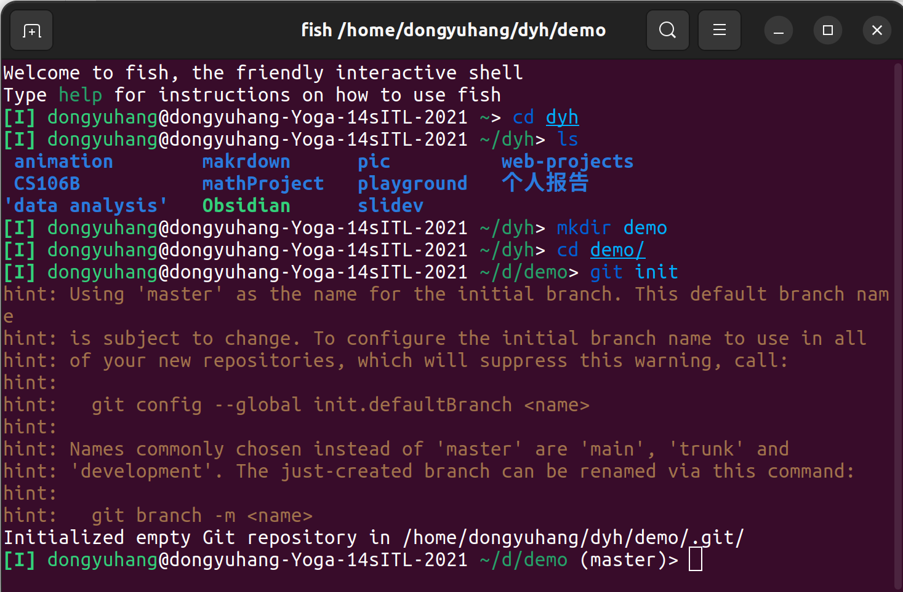
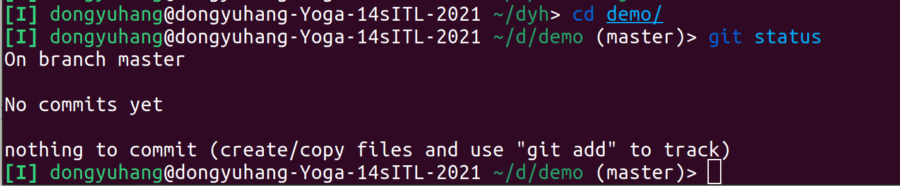

# Git的本地仓库管理

:::info
由于本教程仅带大家入门，只详细介绍一些具有代表性的命令,如果你对其他命令感兴趣，参考[pro git](https://git-scm.com/book/en/v2)
:::

## 获取Git仓库

通常有两种获取 Git 项目仓库的方式：

1. 将尚未进行版本控制的本地目录转换为 Git 仓库；
> 如果你有一个尚未进行版本控制的项目目录，想要用 Git 来控制它，那么首先需要进入该项目目录中。 

我们用cd来导向需要的目录，如：

```
$ cd /home/user/my_project
```
 
然后执行：

```
$ git init
```

2. 从其它服务器 克隆 一个已存在的 Git 仓库。

如果你想获得一份已经存在了的 Git 仓库的拷贝，比如说，你想为某个开源项目贡献自己的一份力，这时就要用到`git clone`命令。同样需要先导向一个目录。
克隆仓库的命令是：`git clone <url>`。如：

```
$ git clone https://github.com/libgit2/libgit2 mylibgit
```


Figure 1.创建一个Git仓库

由上图，我们先用`mkdir`创建了一个目录demo，然后用`cd`进入此目录。接着用`git init`来初始化仓库。我们可以看到Git给出的提示信息。倒数第二行：在此目录已经初始化一个空的Git仓库(repository)。黄字部分是关于Git分支和配置的问题，暂且不用管。

## 记录每次更新到仓库

现在我们的机器上有了一个 **真实项目** 的 Git 仓库，并从这个仓库中检出了所有文件的 **工作副本**。 通常，你会对这些文件做些修改，每当完成了一个阶段的目标，想要将记录下它时，就将它提交到仓库。

请记住，你工作目录下的每一个文件都不外乎这两种状态：**已跟踪** 或 **未跟踪**。 已跟踪的文件是指那些被纳入了版本控制的文件，在上一次快照中有它们的记录，在工作一段时间后， 它们的状态可能是未修改，已修改或已放入暂存区。简而言之，已跟踪的文件就是 Git 已经知道的文件。

工作目录中除已跟踪文件外的其它所有文件都属于未跟踪文件，它们既不存在于上次快照的记录中，也没有被放入暂存区。 初次克隆某个仓库的时候，工作目录中的所有文件都属于已跟踪文件，并处于未修改状态，因为 Git 刚刚检出了它们， 而你尚未编辑过它们。

编辑过某些文件之后，由于自上次提交后你对它们做了修改，Git 将它们标记为已修改文件。 在工作时，你可以选择性地将这些修改过的文件放入暂存区，然后提交所有已暂存的修改，如此反复。


Figure 2.文件的状态变化周期

## 检查当前文件状态

可以用`git status` 命令查看哪些文件处于什么状态。 



Figure 3. 当前仓库状态

说明你的工作目录很干净，还没有任何修改国的文件。

现在让我们在项目下创建一个新的`README`文件。如果之前不存在这个文件，使用`git status` 命令，你将会看到一个未跟踪文件：

```
$ echo 'My Project' > README
$ git status
On branch master
Your branch is up-to-date with 'origin/master'.
Untracked files:
  (use "git add <file>..." to include in what will be committed)

    README

nothing added to commit but untracked files present (use "git add" to track)
```
上图`echo`命令就是写入"My Project"到README文件。

在状态报告中可以看到新建的 README 文件出现在 Untracked files 下面。 未跟踪的文件意味着 Git 在之前的快照（提交）中没有这些文件；Git 不会自动将之纳入跟踪范围，除非你明明白白地告诉它“我需要跟踪该文件”。 这样的处理让你不必担心将生成的二进制文件或其它不想被跟踪的文件包含进来。 不过现在的例子中，我们确实想要跟踪管理 README 这个文件。

## 跟踪新文件

使用命令 git add 开始跟踪一个文件。 所以，要跟踪 README 文件，运行：

```
$ git add README
```

此时再运行`git status`命令，会看到`README`文件已被跟踪，并处于暂存状态：

```
$ git status
On branch master
Your branch is up-to-date with 'origin/master'.
Changes to be committed:
  (use "git restore --staged <file>..." to unstage)

    new file:   README
```

只要在`Changes to be committed`这行下面的，就说明是已暂存状态。 如果此时提交，那么该文件在你运行`git add`时的版本将被留存在后续的历史记录中。 你可能会想起之前我们使用`git init`后就运行了`git add <files>`命令，开始跟踪当前目录下的文件。`git add`命令使用文件或目录的路径作为参数；如果参数是目录的路径，该命令将递归地跟踪该目录下的所有文件。

:::caution
如果你修改一个已被跟踪的文件。你需要再次运行`git add`暂存这次更新，否则Git会提示你文件已被修改，不会进入下次提交。
:::

## 提交更新

现在的暂存区已经准备就绪，可以提交了。 在此之前，请务必确认还有什么已修改或新建的文件还没有`git add`过， 否则提交的时候不会记录这些尚未暂存的变化。 这些已修改但未暂存的文件只会保留在本地磁盘。 所以，每次准备提交前，先用`git status`看下，你所需要的文件是不是都已暂存起来了， 然后再运行提交命令`git commit`：

```
$ git commit
```
编辑器会显示类似下面的文本信息（本例选用 Vim 的屏显方式展示）：

:::danger
以下文本编辑，我们都以Vim为例，你也可以使用其他编辑器！
:::

```
# Please enter the commit message for your changes. Lines starting
# with '#' will be ignored, and an empty message aborts the commit.
# On branch master
# Your branch is up-to-date with 'origin/master'.
#
# Changes to be committed:
#	new file:   README
#	modified:   CONTRIBUTING.md
#
~
~
~
".git/COMMIT_EDITMSG" 9L, 283C
```

可以看到，默认的提交消息包含最后一次运行`git status` 的输出，放在注释行里，另外开头还有一个空行，供你输入提交说明。 你完全可以去掉这些注释行，不过留着也没关系，多少能帮你回想起这次更新的内容有哪些。
退出编辑器时，Git 会丢弃注释行，用你输入的提交说明生成一次提交。


好，现在你已经创建了第一个提交！ 可以看到，提交后它会告诉你，当前是在哪个分支（`master`）提交的，本次提交的完整 SHA-1 校验和是什么（`463dc4f`），以及在本次提交中，有多少文件修订过，多少行添加和删改过。

请记住，提交时记录的是放在暂存区域的快照。 任何还未暂存文件的仍然保持已修改状态，可以在下次提交时纳入版本管理。 每一次运行提交操作，都是对你项目作一次快照，以后可以回到这个状态，或者进行比较。


