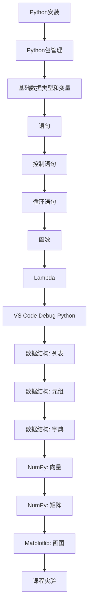

# 实验0: 必读材料

## 读后感
课程必读材料，需提交不少于500字的读后感（占最终成绩一定比例）。

1. 提问的智慧：https://github.com/ryanhanwu/How-To-Ask-Questions-The-Smart-Way/blob/main/README-zh_CN.md
2. 别像弱智一样提问：https://github.com/tangx/Stop-Ask-Questions-The-Stupid-Ways/blob/master/README.md
3. 学术诚信准则：http://integrity.mit.edu/
4. 关于写代码的学术诚信：http://integrity.mit.edu/handbook/writing-code
5. 南京大学ICS PA 常见问题：https://nju-projectn.github.io/ics-pa-gitbook/ics2022/FAQ.html
6. 如何科学提问：https://ysyx.oscc.cc/docs/prestudy/0.1.html
7. 什么样的问题我不想回答：https://zhuanlan.zhihu.com/p/381820481
8. 提问模版：https://ysyx.oscc.cc/docs/misc/ask.html

:::caution
课程所有实验需严格准守学术诚信原则，如果不能遵守学术诚信原则，作为一个成年人你应该感到Shame（[什么是Shame?](https://en.wikipedia.org/wiki/Shame)）。
:::

## 实训课Python学习路线图

想要顺利完整本门实训课，所需要学习的最少Python知识:

本课程网站提供详细的Python文档，在学有余力的情况下你可以自行深入学习Python的其他部分内容。

如果你想深入学习计算机科学(CS: Computer Science)，我们提供了[自学CS Roadmap](../notes/cs_roadmap.md)。

## 实验报告
本课程提供LaTeX（[什么是$\LaTeX$?](../latex/index.md)）版本的实验报告模板，我们希望你提交的是LaTeX版本的实验报告，而不是Word版本的实验报告（很明确的告诉你LaTeX版本的报告是有**加分**的）。

[Math201_report_latex.zip](https://suepaper.github.io/math201/)

:::info
本课程不会详细教授LaTeX的使用，只提供LaTeX的入门文档以及授课过程中的简单介绍。因为我们相信作为一个成年人的你是有足够的自学能力去掌握LaTeX这个非常优美的工具。尤其是你已经读了必读材料，并且完成了500字以上的读后感任务了，所以现在开始请自觉接受LaTeX自学过程的毒打。

> 我们不认为学习LaTeX是一件非常难的事情，反而这是一件可以提升自己能力的事情。一旦你学会了LaTeX，我们保证你会喜欢上LaTeX这款优美的工具，并且热衷于LaTeX的哲学———**只关心内容，不必关心排版格式**。尤其作为数学系学生的你会深刻体会到LaTeX是在节约你的生命，你不再为了Word中数学公式的排版而头疼。
> 我们为了提供更舒适的课程网页浏览体验，本网站的所有数学公式均使用LaTeX编写，相信你可以为了提供更舒适的报告浏览体验，也为我们提供LaTeX版本报告。
:::

## 课程实验代码管理
本课程推荐使用git([什么是git?](../git/index.md))工具管理你的代码版本，你可以将你的代码存放在Github上([什么是Github?](../git/index.md))。请遵守学术诚信原则，不要公开你的代码，你可以使用Github的私有仓库来达到不公开代码的目的。(本课程网站的源代码也是保存在GitHub的仓库里面, 感兴趣的同学可以去浏览我们的源代码: https://github.com/SUEPaper/math201)

## 关于遇到问题的搜索

我们想通过必读材料的阅读，你应该知道搜索的重要性了。你会发现你不太容易搜索到相关的中文资料，所以你需要适应查阅英文资料。

如何适应查阅英文资料? 方法是尝试并坚持查阅**英文资料**。

|  | 搜索引擎 | 百科 | 问答网站 |
| :-----| ----: | :----: | :----: |
| 推荐使用 | [这里](https://dir.scmor.com/)有Google搜索镜像 | http://en.wikipedia.org | http://stackoverflow.com |
| 不推荐使用 |~~http://www.baidu.com~~ | ~~http://baike.baidu.com~~ | ~~https://www.csdn.net~~ |

一些说明:

1. 一般来说, 百度对英文关键词的处理能力比不上Google。同时百度的广告太多，关键词检索首页命中率太低，我们认为用百度搜索技术问题纯属在浪费生命，而且是大大的浪费生命。强烈推荐Google搜索，至于如何访问Google搜索，请自行了解相关知识，或者使用我们表格中提供的Google搜索镜像。
2. 通常来说, 英文维基百科比中文维基百科和百度百科包含更丰富的内容. 为了说明为什么要使用英文维基百科, 请你对比词条前束范式分别在[百度百科](https://baike.baidu.com/item/%E5%89%8D%E6%9D%9F%E8%8C%83%E5%BC%8F), [中文维基百科](http://zh.wikipedia.org/wiki/%E5%89%8D%E6%9D%9F%E8%8C%83%E5%BC%8F)和[英文维基百科](https://en.wikipedia.org/wiki/Prenex_normal_form)中的内容。
3. [stackoverflow](https://stackoverflow.com/)是一个程序设计领域的问答网站, 里面除了技术性的问题([What is ":-!!" in C code?](https://stackoverflow.com/questions/9229601/what-is-in-c-code/9229793))之外, 也有一些学术性([Is there a regular expression to detect a valid regular expression?](https://stackoverflow.com/questions/172303/is-there-a-regular-expression-to-detect-a-valid-regular-expression)) 和一些有趣的问题([What is the “-->” operator in C++?](https://stackoverflow.com/questions/1642028/what-is-the-operator-in-c))。

### Google搜索技巧

内容正在补充中。。。。。。
