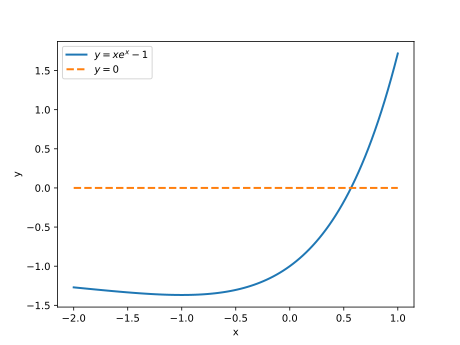

# 实验2: 非线性方程求根实验

## **问题**1：二分法求根

**实验题目**：给定精度要求$\varepsilon$，利用二分法求方程$xe^x=1$的根。

**实验原理**：设有单变量方程$f(x) = 0$，其中，$f(x)$为$[a, b]$上的连续函数且$f(a)f(b)<0$，于是由连续函数的性质知$f(x)$在$[a, b]$上至少有一实根$x^*$。

下面用二分法求出根。二分法的思想是逐步将有根区间二等分，得到两个子区间，通过判别函数值的符号确定这两个子区间中的一个作为新的有根区间，直至有根区间足够小，除非在这个过程中恰好得到精确解。

二分法的具体思路如下：

记$a_1=a, b_1 =b$，令 $x_1 =\dfrac{a_1+b_1}{2}$ ，若$f(x_1)$=0，则$x_1$为所求的方程的根，否则它必会与$f(a_1)$和$f(b_1)$中的一个异号，不妨设为$f(b_1)$，这样就有一个较小的有根区间$[x_1, b_1]$，记这个区间为$[a_2, b_2]$。

对$[a_2, b_2]$ 实行同样的方法，又可以得到一个更小的有根区间$[a_3,b_3]$，不断重复这个过程就可以得到一个有根的区间套：
$$
[a_1, b_1]\supset [a_2, b_2]\supset\cdots \supset [a_k, b_k]\supset
$$
该区间套满足以下性质：

(1) $f(a_k)f(b_k)<0$, 有一个根$x^*\in [a_k, b_k]$;

(2) $b_k -a_k = \dfrac{b-a}{2^{k-1}}$;

(3) $x_k = \dfrac{a_k+b_k}{2}$， 且$|x_k-x^*|\leq \dfrac{b-a}{2^k}$.

由第三条性质知，二分法是线性收敛的，如果指定精度为$\varepsilon$，则需迭代的步数至少为
$$
k = \lceil\log _2 \frac{b-a}{\varepsilon}\rceil
$$
**实验过程**：令$f(x) = xe^x-1$, 先探讨方程$f(x)=0$的根的数量。

首先，
$$
f'(x) = (x+1)e^x
$$
当$x<-1$时，$f'(x)<0$, $f(x)$在$(-\infty, -1)$上单调递减，且$f(x)<f(-1)$ $= -0.3679<0 ,$ $x\in(-\infty, -1)$. 

同理，$f(x)$在$(-1, \infty)$上单调递增，则$f(x)$在$x=-1$处有最小值$f(-1)=-0.3679$, 且$f(x)=0$在$(-\infty, \infty)$上只有一个根。又
$$
f(0)=-1<0, f(1) = e-1>0
$$
所以，区间$[0, 1]$为$f(x)=0$的一个有根区间，$f(x)=0$在区间$[0, 1]$上有唯一的根。

另外，也可以借助计算机绘制$f(x)$的图像（或者绘制$y=xe^x$与$y=1$的交点）来观察根的数量。

```python
import numpy as np
import matplotlib.pyplot as plt

#函数f(x)
def f(x):
    '''
    :param x: np.array
    :return: np.array, f(x)
    '''
    return x * np.exp(x) - 1 #返回向量化运算结果

#绘制f(x)的图像
def draw_f():
    x = np.linspace(-2, 1, 100) #取区间[-2, 1]上100个等分点
    y = f(x)
    plt.plot(x, y, linewidth=2, label='$y = xe^x-1$') # 绘制y=f(x)的图像
    y2 = np.zeros_like(y)  #y2=0
    plt.plot(x, y2, linewidth=2, linestyle='--', label='$y = 0$') # 绘制y2=0的图像
    # plt.show()
    plt.xlabel('x')
    plt.ylabel('y')
    plt.legend()
    plt.savefig('prob01-plot.svg', format='svg', dpi=500) #保存图像

if __name__ == '__main__':
    draw_f()
```
<div style={{display: 'flex', justifyContent:'center', alignItems:'center'}}>



</div>

<p align="center"><b>图1:</b> 探索非线性方程根的数量和有根区间</p>

> np.array的乘法运算：
>
> 1. 元素乘法（向量化运算）：`a*b`, 或`np.multiply(a, b)`
> 2. 矩阵乘法：`np.dot(a, b)`, 或`np.matmul(a, b)`或`a.dot(b)`或`a@b`
>
> np.matrix的乘法运算：
>
> 1. 元素乘法：`np.multiply(a, b)`
> 2. 矩阵乘法：`a*b` 或 `np.dot(a,b) `或 `np.matmul(a,b)` 或` a.dot(b)`

编写二分法求根的Python程序：

```python
import numpy as np
#函数f(x)
def f(x):
    '''
    :param x: np.array
    :return: np.array, f(x)
    '''
    return x * np.exp(x) - 1 #返回向量化运算结果

#二分法求根
def bisection(a, b, epsilon):
    '''
    :param a: 有根区间[a, b]
    :param b:
    :param epsilon: 误差
    :return: x_star, 二分法所求的根
    '''
    k = 0 #二分次数计数器
    while abs(b-a)>epsilon:
        x = (a+b)/2
        if abs(f(x))< epsilon: #函数值绝对值小于精度，即为所求的根
            break
        elif f(a)*f(x) < 0:
            b = x
            k += 1
            print(f'第{k}次二分后的有根区间为[{a}, {b}]')
        else: #f(x) * f(b)<0
            a = x
            k += 1
            print(f'第{k}次二分后的有根区间为[{a}, {b}]')
    x_star = x
    print('---' * 10)
    print(f'二分法进行二分 {k} 次求得方程的根为 x* = {x_star}')
    return x_star

if __name__ == '__main__':
    a = 0 #有根区间
    b = 1
    epsilon = 0.5e-5 #精度
    bisection(a=a, b=b, epsilon=epsilon)
```

输出结果为

```python
第1次二分后的有根区间为[0.5, 1]
第2次二分后的有根区间为[0.5, 0.75]
第3次二分后的有根区间为[0.5, 0.625]
第4次二分后的有根区间为[0.5625, 0.625]
第5次二分后的有根区间为[0.5625, 0.59375]
第6次二分后的有根区间为[0.5625, 0.578125]
第7次二分后的有根区间为[0.5625, 0.5703125]
第8次二分后的有根区间为[0.56640625, 0.5703125]
第9次二分后的有根区间为[0.56640625, 0.568359375]
第10次二分后的有根区间为[0.56640625, 0.5673828125]
第11次二分后的有根区间为[0.56689453125, 0.5673828125]
第12次二分后的有根区间为[0.567138671875, 0.5673828125]
第13次二分后的有根区间为[0.567138671875, 0.5672607421875]
第14次二分后的有根区间为[0.567138671875, 0.56719970703125]
第15次二分后的有根区间为[0.567138671875, 0.567169189453125]
第16次二分后的有根区间为[0.567138671875, 0.5671539306640625]
第17次二分后的有根区间为[0.567138671875, 0.5671463012695312]
------------------------------
二分法进行二分 17 次求得方程的根为 x* = 0.5671424865722656
```

所以，取$\epsilon = 0.5\times 10^{-5}$，采用二分法求得方程 的近似根为$x^*= 0.5671424865722656$.

```
第1次二分后的有根区间为[0.5, 1]
第2次二分后的有根区间为[0.5, 0.75]
第3次二分后的有根区间为[0.5, 0.625]
……
第30次二分后的有根区间为[0.5671432903036475, 0.5671432912349701]
第31次二分后的有根区间为[0.5671432903036475, 0.5671432907693088]
第32次二分后的有根区间为[0.5671432903036475, 0.5671432905364782]
------------------------------
二分法进行二分 32 次求得方程的根为 x* = 0.5671432904200628
```

取$\epsilon = 0.5\times 10^{-10}$, 采用二分法求得方程 的近似根为$x^*= 0.5671432904200628$.

## 题目2：牛顿迭代法求非线性方程的根

**实验题目**：给定精度要求$\varepsilon$，利用牛顿迭代法求方程$xe^x=1$的根。

**实验原理**：设有单变量方程$f(x) = 0$，牛顿法求根的迭代公式（推导见理论课）为
$$
\begin{cases}
x_{n+1} =x_n -\dfrac{f(x_n)}{f'(x_n)},  \\
x_0给定
\end{cases}
~~n=0,1,\cdots
$$
给定初始值$x_0$，$\varepsilon$为根的容许误差，$\eta$为$|f(x)|$的精度要求，设$n=0$为当前迭代次数，$N$为最大迭代次数。

(1) 计算$x_{1} =x_0 -\dfrac{f(x_0)}{f'(x_0)}$, $n=n+1$

(2) 若$|x_1-x_0|<\varepsilon$ 或$|f(x_1)|<\eta$或$n>N$，则输出近似根$x_1$及迭代次数$n$，程序结束。否则转(1)

编写牛顿迭代法求根的Python程序：

```python
import numpy as np
#函数f(x)
def f(x):
    '''
    :param x: np.array
    :return: np.array, f(x)
    '''
    return x * np.exp(x) - 1 #返回向量化运算结果
#导函数f'(x)
def df(x):
    '''
        :param x: np.array
        :return: np.array, f'(x)
        '''
    return (x+1) * np.exp(x)


#二分法求根
def Newton(x0, epsilon, eta, N):
    '''
    :param a: 有根区间[a, b]
    :param b:
    :param epsilon: 误差1
    :param eta: 误差2 |f(x)| <eta
    :param N: 最大迭代次数
    :return: x_1, 二分法所求的根
    '''
    n = 0 #迭代次数计数器
    x1 = x0 - f(x0)/df(x0)
    n += 1
    print(f'牛顿法第{n}次迭代值为x = {x1}')
    while (abs(x1 - x0) > epsilon) & (abs(f(x1)) > eta) & (n <= N):
        '''
    	------------------------------
    	这里作为作业思考，请根据你的理解补充完整
    	------------------------------
    	'''
        n += 1
        print(f'牛顿法第{n}次迭代值为x = {x1}')
    print('---' * 10)
    print(f'牛顿法迭代 {n} 次求得方程的根为 x* = {x1}')
    return x1

if __name__ == '__main__':
    x0 = 0.5 #迭代初始值
    epsilon = 0.5e-6 #精度1
    eta = 0.5e-8     #精度2
    N = 100          #最大迭代次数
    Newton(x0=x0, epsilon=epsilon, eta=eta, N=N)
```

输出结果为

```python
牛顿法第1次迭代值为x = 0.5710204398084222
牛顿法第2次迭代值为x = 0.5671555687441145
牛顿法第3次迭代值为x = 0.567143290533261
------------------------------
牛顿法迭代 3 次求得方程的根为 x* = 0.567143290533261
```

进一步探讨：选择**不同**的初值（给出至少5个），观察初值对算法收敛性的影响，当算法收敛时，记录所需的迭代次数和迭代结果，并进行比较。

## 自己动手实践

请根据问题1和问题2，结合课堂上学习到的相关理论，请自己设计完成问题3-5。

问题3：给定精度要求$\varepsilon$，利用不动点迭代法求方程$xe^x=1$的根。

问题4：给定精度要求$\varepsilon$，利用割线法（弦截法）求方程$xe^x=1$的根。
$$
\begin{cases}
x_{k+1} =x_k -\dfrac{x_k -x_{k-1}}{f(x_k) -f(x_{k-1})}f(x_k), \\
x_0\\
x_1
\end{cases}
~~n=0,1,\cdots
$$
问题5：对问题3改进，进行诶特肯Aitken加速迭代法求根。

设求方程$f(x)=0$的某个收敛的不动点迭代格式为$x_{k+1}  =\varphi(x_k),$ `Aitken`加速算法为
$$
\begin{equation*}
  \left\{
     \begin{split}
       已知&x_0\\
       y_k & =\varphi(x_k), \\
       z_k & =\varphi(y_k), \\
       x_{k+1} & =x_k-\dfrac{(y_k-x_k)^2}{z_k-2y_k+x_k} \\
     \end{split}
  \right. k=0,1,\cdots
\end{equation*}
$$
问题6：探讨求非线性方程根不同方法的收敛速度。

## 更多练习

1. 求方程$f(x)=x^3+x^2-3x-3=0$在$1.5$附近的根。
2. 重根

## 思考和分析

`1. 比较二分法和牛顿法在非线性方程求根中的优缺点和收敛速度。`

提示：二分法简单易行，但只有线性收敛速度；

牛顿法计算简单，对于单根情形具有二阶局部收敛速度，但对初值的选择比较困难，牛顿法每次迭代要计算$f'(x)$，增加了计算量，对于重根情形仅线性收敛。

`2. 改进牛顿迭代法，使其对于重根也具有较高的收敛阶，试写出你所能想到的改进思路及其迭代格式，并简单分析收敛速度。`