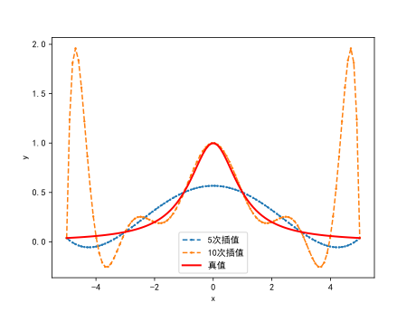
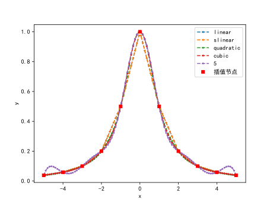
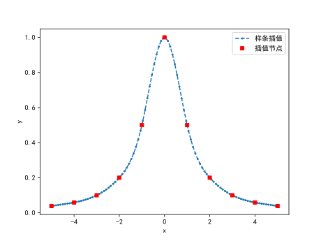
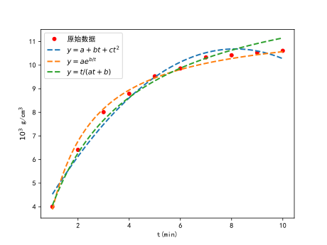
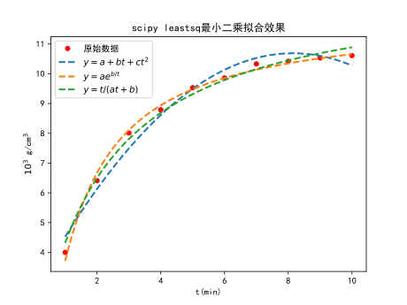

# 实验3: 插值与拟合实验

## 问题1：Lagrange插值

**实验题目**：根据下表已知数据，用Lagrange插值多项式分别求$\sin 0.6389$和$\sin 0.6886$的近似值。试编写出插值多项式的通用程序。

| ${x}$     | 0.4    | 0.5    | 0.6    | 0.7    | 0.8    |
| --------- | ------ | ------ | ------ | ------ | ------ |
| $\sin(x)$ | 0.3894 | 0.4794 | 0.5646 | 0.6442 | 0.7147 |

**实验原理**：已知函数值表

| ${x}$    | $x_0$ | $x_1$ | $\cdots$ | $x_n$ |
| -------- | ----- | ----- | -------- | ----- |
| $y=f(x)$ | $y_0$ | $y_1$ | $\cdots$ | $y_n$ |

设两两互异的插值节点为$x_0, x_1,\cdots, x_n$，则Lagrange插值多项式为

$$
L_n(x) = \sum_{k=0}^n y_k l_k(x),\\
其中,\\
l_k(x) = \prod_{i=0,i\neq k}^n\frac{x-x_i}{x_k-x_i},~~ k=0, 1,\cdots, n
$$

**实验过程**：编写Lagrange插值通用程序。

```python showLineNumbers
import numpy as np

'''Lagrange插值多项式'''
def Lagrange(xdata, ydata, x_list):
    '''
    :param xdata: 插值节点, 类型为list或np.array
    :param ydata: 插值节点的函数值，list
    :param x_list: 用插值函数计算自变量x_list的值
    :return: y_list = Ln(x_list)
    '''
    n = len(xdata) #插值节点的数量
    y_list = []  #y_list的初始化，计算插值函数在x_list处的值
    for x in x_list:
        L_n = 0 #Lagrange函数初始化
        for k in range(len(xdata)):
            l_k = 1 #Lagrange插值基函数l_k(x)
            for i in range(len(xdata)):
                if i != k:
                    l_k *= (x - xdata[i])/(xdata[k] - xdata[i])
            L_n = L_n + ydata[k] * l_k
        y_list.append(L_n)
    return y_list

if __name__ == '__main__':
    xdata = np.arange(0.4, 0.9, 0.1)
    ydata = [ 0.3894, 0.4794, 0.5646, 0.6442, 0.7147]
    x_list = [0.6389, 0.6886]
    y_list = Lagrange(xdata=xdata, ydata=ydata, x_list=x_list)
    print('Lagrange插值多项式计算结果为')
    print('---'*10)
    for x, y in zip(x_list, y_list):
        print(f'f({x}) = {y}')
```

输出结果为

```python
Lagrange插值多项式计算结果为
------------------------------
f(0.6389) = 0.5963626475627078
f(0.6886) = 0.6354956588305982
```

## 问题2：Runge现象和分段插值

### 2.1 Runge现象

**实验题目**：研究函数$y=\dfrac{1}{1+x^2}, x\in[-5, 5]$在区间上的$n$等分点的函数值来构造Lagrange插值多项式，画图感受Runge现象的产生。

```python showLineNumbers
import matplotlib.pyplot as plt
import numpy as np
# #绘图显示中文
plt.rcParams['font.sans-serif'] = ['SimHei']
plt.rcParams['axes.unicode_minus'] = False

# 绘图观察Runge现象
def Runge():
    x_list = np.linspace(-5, 5, 100)  # 插值计算每个内部点的值
    for n in [5, 10]: # 区间n等分，n+1个点
        xdata = np.linspace(-5, 5, n + 1) #插值节点
        ydata = f(xdata) #采集y的值
        #计算Lagrange插值结果
        y_list = Lagrange(xdata=xdata, ydata=ydata, x_list=x_list)
        plt.plot(x_list, y_list, 'o--', markersize=1.5, label=str(n) + '次插值')
    
    y_true = f(x_list) #计算真实值，绘图观察插值效果
    plt.plot(x_list, y_true, 'r', linewidth=2, label='真值')
    plt.xlabel('x')
    plt.ylabel('y')
    plt.legend()
    plt.savefig('Runge.svg', dpi=500)

if __name__ == '__main__':
   Runge()
```
<div style={{display: 'flex', justifyContent:'center', alignItems:'center'}}>



</div>

<p align="center"><b>图1:</b> 高次插值产生的龙格Runge现象</p>

**结论**：高次插值多项式的误差在某些情况下较大，往往称为**Runge现象**。为了避免使用**高阶插值多项式**出现的Runge现象，实际应用中经常使用分段插值，包括分段线性、三次样条插值等。

### 2.2 分段插值以及基于scipy函数的结果检验

在掌握了分段线性和样条插值原理的基础上，下面直接使用Python科学计算库scipy里的插值函数来验证分段插值的效果。

在scipy里可以用`scipy.interpolate`模块下的`interp1d`函数实现分段多项式插值，特点是插值凸点点多，不够光滑。 分段插值方式有：kind='linear','zero', 'slinear', 'quadratic'(2次), 'cubic'(3次), 4, 5等。

```python
import matplotlib.pyplot as plt
import numpy as np
from scipy.interpolate import interp1d # scipy一元插值
# #绘图显示中文
plt.rcParams['font.sans-serif'] = ['SimHei']
plt.rcParams['axes.unicode_minus'] = False


#编写函数f(x)
def f(x):
    '''
    :param x: np.array()，支持向量化运算
    :return: y, np.array()
    '''
    return 1 / (1 + x**2)


# 绘图观察分段插值避免Runge现象
def piecewise_interp():
    x_list = np.linspace(-5, 5, 100)  # 插值计算每个内部点的值
    n = 10 # n+1个插值节点
    for kind in ['linear', 'slinear', 'quadratic', 'cubic', 5]: # 区间n等分，n+1个点
        xdata = np.linspace(-5, 5, n + 1) #插值节点
        ydata = f(xdata) #采集y的值
        f_interp = interp1d(xdata, ydata, kind=kind) #利用scipy进行插值
        y_list = f_interp(x_list)  #利用插值多项式计算新点的函数值
        plt.plot(x_list, y_list, 'o--', markersize=2, linewidth=1.5, label=kind)

    plt.plot(xdata, ydata, 'rs', markersize=5, linewidth=2, label='插值节点')
    plt.xlabel('x')
    plt.ylabel('y')
    plt.legend()
    plt.savefig('interp1d_result.svg', dpi=500)


if __name__ == '__main__':
    #调用scipy分段插值
   piecewise_interp()
```



<p align="center"><b>图2:</b> scipy实现的分段插值可以避免高阶插值多项式的龙格现象</p>

样条插值法是一种以可变样条来作出一条经过一系列点的光滑曲线的数学方法。插值样条是由一些多项式组成的，每一个多项式都是由相邻的两个数据点决定的，这样，任意两个相邻的多项式以及它们的导数在内部连接点处都是**连续的**。 

`scipy.interpolate`包里提供了两个函数`splev`和`splrep`共同完成(B-样条: 贝兹曲线(又称贝塞尔曲线))插值，和之前一元插值`interp1d`一步就能完成不同，样条插值需要两步完成，第一步先用`splrep`计算出B样条曲线的参数tck，第二步在第一步的基础上用`splev`计算出各取样点的插值结果。

```python
import matplotlib.pyplot as plt
import numpy as np
from scipy.interpolate import splev, splrep #样条插值
# #绘图显示中文
plt.rcParams['font.sans-serif'] = ['SimHei']
plt.rcParams['axes.unicode_minus'] = False


#编写函数f(x)
def f(x):
    '''
    :param x: np.array()，支持向量化运算
    :return: y, np.array()
    '''
    return 1 / (1 + x**2)


# 绘图观察分段插值避免Runge现象
def spline_main():
    x_list = np.linspace(-5, 5, 100)  # 插值计算每个内部点的值
    n = 10 # n+1个插值节点
    xdata = np.linspace(-5, 5, n + 1)  # 插值节点
    ydata = f(xdata)  # 采集y的值

    spl = splrep(xdata, ydata) #样条插值节点和系数
    '''
    splrep返回的tck：A tuple (t,c,k) containing the vector of knots, the B-spline
    coefficients, and the degree of the spline.
    '''
    y_list = splev(x_list, spl) #利用样条插值函数计算新点的函数值
    plt.plot(x_list, y_list, 'o--', markersize=2, linewidth=1.5, label='样条插值')
    plt.plot(xdata, ydata, 'rs', markersize=5, linewidth=2, label='插值节点')
    plt.xlabel('x')
    plt.ylabel('y')
    plt.legend()
    plt.savefig('spline_result.svg', dpi=500)

if __name__ == '__main__':
    #调用scipy样条插值
   spline_main()
```



<p align="center"><b>图3:</b> scipy实现的样条插值效果</p>

## 问题3：牛顿插值

**实验题目**：对问题1，使用牛顿多项式求$\sin 0.6389$和$\sin 0.6886$的近似值。试编写出牛顿差商表和牛顿插值多项式的通用程序。

**实验原理**：已知函数值表

| ${x}$    | $x_0$ | $x_1$ | $\cdots$ | $x_n$ |
| -------- | ----- | ----- | -------- | ----- |
| $y=f(x)$ | $y_0$ | $y_1$ | $\cdots$ | $y_n$ |

设两两互异的插值节点为$x_0, x_1,\cdots, x_n$，则差商表为

| $x_k$    | $y_k$    | 一阶差商          | 二阶差商                   |          | $n$阶差商                |
| -------- | -------- | ----------------- | -------------------------- | -------- | ------------------------ |
| $x_0$    | $y_0$    |                   |                            |          |                          |
| $x_1$    | $y_1$    | $f[x_0, x_1]$     |                            |          |                          |
| $x_2$    | $y_2$    | $f[x_1, x_2]$     | $f[x_0, x_1,x_2]$          |          |                          |
| $\cdots$ | $\cdots$ | $\cdots$          | $\cdots$                   | $\cdots$ |                          |
| $x_n$    | $y_n$    | $f[x_{n-1}, x_n]$ | $f[x_{n-2}, x_{n-1}, x_n]$ | $\cdots$ | $f[x_0,x_1,\cdots, x_n]$ |

根据上述差商表可得Newton插值多项式为

$$
N_n(x) = f(x_0) +
f[x_0, x_1](x-x_0)+f[x_0, x_1,x_2](x-x_0)(x-x_1)\\+\cdots\\
+ f[x_0, x_1,x_2,\cdots, x_n](x-x_0)(x-x_1)\cdots{\color{red}(x-x_{n-1})}
$$

**实验过程**：编写差商表和牛顿插值多项式的Python程序。

```python showLineNumbers
'''
构造牛顿差商表，
利用牛顿插值多项式计算函数值
'''
import numpy as np

#牛顿差商表
def Newton_diff_table(xdata, ydata):
    '''
    :param xdata: [x0, x1, ..., xn]
    :param ydata:
    :return:
    '''
    xdata = np.array(xdata) #转化为numpy array
    ydata = np.array(ydata) #转化为1列
    n = len(xdata)  # 数据点的数量
    df = np.zeros(shape=(n, n + 1))  # 差商表初始化
    df[:, 0] = xdata  #差商表的第0列存放xdata
    df[:, 1] = ydata  #差商表的第1列存放ydata

    #计算各阶差商，差商表的第j + 1列, 考虑到对角线位置所在的列
    for j in range(2, n+1):
        for i in range(j-1, n): # 对每一列的差商
            df[i, j] = (df[i, j-1] - df[i - 1, j-1]) / (xdata[i] - xdata[i - (j - 1)])

    print('牛顿差商表为')
    print(df)
    return df

#牛顿插值多项式求函数值
def Newton_interp(xdata, ydata, x_list):
    '''
    :param xdata: 插值节点, 类型为list或np.array
    :param ydata: 插值节点的函数值，list
    :param x_list: 用插值函数计算自变量x_list的值
    :return: y_list = Ln(x_list)
    '''

    #构造差商表
    df = Newton_diff_table(xdata=xdata, ydata=ydata)
    y_list = []  # y_list的初始化，计算插值函数在x_list处的值
    for x in x_list:
        N_x = 0   #初始值
        basis = 1 #牛顿基函数1, (x-x0), (x-x0)(x-x1),...
        for k in range(len(ydata) - 1): #迭代n次， n= len(ydata)-1
            N_x += df[k, k + 1] * basis
            basis = basis * (x - xdata[k])

        y_list.append(N_x)
    return y_list


if __name__ == '__main__':
    xdata = np.arange(0.4, 0.9, 0.1)
    ydata = [0.3894, 0.4794, 0.5646, 0.6442, 0.7147]
    x_list = [0.6389, 0.6886]
    y_list = Newton_interp(xdata=xdata, ydata=ydata, x_list=x_list)
    print('Newton插值多项式计算结果为')
    print('---'*10)
    for x, y in zip(x_list, y_list):
        print(f'f({x}) = {y}')
```

输出结果为

```python
牛顿差商表为
[[ 0.4         0.3894      0.          0.          0.          0.        ]
 [ 0.5         0.4794      0.9         0.          0.          0.        ]
 [ 0.6         0.5646      0.852      -0.24        0.          0.        ]
 [ 0.7         0.6442      0.796      -0.28       -0.13333333  0.        ]
 [ 0.8         0.7147      0.705      -0.455      -0.58333333 -1.125     ]]
Newton插值多项式计算结果为
------------------------------
f(0.6389) = 0.5962739193508
f(0.6886) = 0.6354338103392001
```

**结论**：Newton插值多项式和Lagrange插值多项式虽然形式不同，但它们是等价（相等）的，即$L_n(x)= N_n(x)$。

## 问题4：最小二乘拟合

### 4.1 最小二乘拟合原理和算例

在某化学反应里，测得生成物的质量浓度$y(10^{-3}\text{g/cm}^3)$与时间$t(\min)$的关系如下表。为了研究该化学反应的性质，如反应速度等，试求$y$与$t$之间的连续函数关系式$y=f(t)$.

| t    | 1    | 2    | 3    | 4    | 5    | 6    | 7     | 8     | 9     | 10    |
| ---- | ---- | ---- | ---- | ---- | ---- | ---- | ----- | ----- | ----- | ----- |
| y    | 4.00 | 6.41 | 8.01 | 8.79 | 9.53 | 9.86 | 10.33 | 10.42 | 10.53 | 10.61 |

1．用线性模型$\varphi(t) =a +bt+ct^2$拟合上表数据，求拟合函数。

2．若选取非线性模型$\varphi(t)=a e^{\frac{b}{t}}$拟合上述数据，求$a, b$.

3．若选取线性模型$\varphi(t)= \dfrac{t}{a t +b}$拟合上述数据，求$a, b$.

4．试分别计算上述三种拟合方法的平方误差，并进行比较，做出上面三种拟合效果图。

**实验原理**：

已知函数值表

| ${x}$    | $x_0$ | $x_1$ | $\cdots$ | $x_m$ |
| -------- | ----- | ----- | -------- | ----- |
| $y=f(x)$ | $y_0$ | $y_1$ | $\cdots$ | $y_m$ |

求函数$
\color{blue}
S(x;a_0,a_1,\cdots,a_n)=a_0\varphi_0(x)+a_1\varphi_1(x)+\cdots+a_n\varphi_n(x)
$按最小二乘原则拟合函数$f(x)$，即

$$
\min F(a_0,\cdots,a_n)=\min\sum\limits_{k=0}^m\left[a_0\varphi_0(x_k)+a_1\varphi_1(x_k)+\cdots+a_n\varphi_n(x_k)-y_k\right]^2
$$

根据多元函数求极值的方法，$a_0,a_1,\cdots, a_n$需满足

$$
\left\{
  \begin{split}
      \frac{\partial F}{\partial a_0}& =0 \\
      \frac{\partial F}{\partial a_1}& =0 \\
       & \cdots \\
      \frac{\partial F}{\partial a_n}& =0 
  \end{split}
\right.
$$

整理，得

$$
\begin{pmatrix}
  \sum\limits_{k=0}^m {\color{red}\varphi_0}(x_k)\varphi_0(x_k) & \cdots & \sum\limits_{k=0}^m {\color{red}\varphi_0}(x_k)\varphi_n(x_k)  \\
   \cdots & \ddots & \cdots  \\
  \sum\limits_{k=0}^m \varphi_n(x_k)\varphi_0(x_k) & \cdots & \sum\limits_{k=0}^m \varphi_n(x_k)\varphi_n(x_k)  \\
\end{pmatrix}\begin{pmatrix}
  a_0 \\
  \cdots \\
  a_n \\
\end{pmatrix}
=\begin{pmatrix}
  \sum\limits_{k=0}^m y_k \varphi_0(x_k)\\
  \cdots \\
  \sum\limits_{k=0}^m y_k\varphi_n(x_k) \\
\end{pmatrix}
$$

引入离散内积

$$
(\varphi_i, \varphi_j)=\sum\limits_{k=0}^m \varphi_i(x_k)\varphi_j(x_k),~i,j=0,1,\cdots,n 
$$

这样，上述方程组可以化为

$$
\begin{equation*}

\begin{pmatrix}
  ({\color{red}\varphi_0}, \varphi_0) & ({\color{red}\varphi_0}, \varphi_1) & \cdots & ({\color{red}\varphi_0}, \varphi_n)  \\
   \cdots & \cdots & \ddots & \cdots  \\
  (\varphi_n, \varphi_0) & (\varphi_n, \varphi_1) & \cdots & (\varphi_n, \varphi_n)\\
\end{pmatrix}\begin{pmatrix}
  a_0 \\
 a_1 \\
  \cdots \\
  a_n \\
\end{pmatrix}
=\begin{pmatrix}
  (f, {\color{red}\varphi_0}) & \\
  \cdots \\
  (f, \varphi_n) & \\
\end{pmatrix}

\end{equation*}
$$

该方程组通常称为法方程组。引入矩阵

$$
A_{(m+1)\times(n+1)}=\begin{pmatrix}
    \varphi_0(x_0) & \varphi_1(x_0) & \cdots & \varphi_n(x_0) \\
    \varphi_0(x_1) & \varphi_1(x_1) & \cdots & \varphi_n(x_1) \\
    \cdots & \cdots & \ddots & \cdots \\
    \varphi_0(x_m) & \varphi_1(x_m) & \cdots & \varphi_n(x_m) \\
  \end{pmatrix}
$$

这样利用矩阵乘法可以把法方程组写为

$$
\color{blue}A^TA \alpha =A^T Y
$$

其中$\alpha=(a_0, a_1,\cdots, a_n)^T, Y=(y_0, y_1,\cdots, y_n)^T$.

**实验过程**：1. 用线性模型$\varphi(t) =a +bt+ct^2$拟合上表数据时，取$\varphi_0(t)=1, \varphi_1(t)=t, \varphi_2(t)=t^2,$ 求解法方程组即可得拟合系数$a, b, c$。

2. 用非线性模型$\varphi(t)=a e^{\frac{b}{t}}$拟合上述数据时，两边取对数
   $$
   \ln \varphi(t) = \ln a +\frac{b}{t}
   $$
   

令$\Psi = \ln \varphi(t), a' = \ln a$,  取$\varphi_0(t)=1, \varphi_1(t)=\dfrac{1}{t},$ 则
$$
\Psi = a'\varphi_0(t)+b\varphi_1(t)
$$
需要准备好拟合数据$(t_i, \Psi_i)$，然后转化为第1种情形。

3.  类似第2种情形。

```python showLineNumbers
'''
利用最小二乘原理拟合曲线
'''
import matplotlib.pyplot as plt
import numpy as np
from numpy.linalg import inv

# #绘图显示中文
plt.rcParams['font.sans-serif'] = ['SimHei']
plt.rcParams['axes.unicode_minus'] = False

#f = a + b t + c t**2
def curvefit1(tdata, ydata):
    '''
    :param tdata: 拟合数据
    :param ydata:
    :return: alpha = [a, b, c]
    '''
    tdata = np.array(tdata).reshape((-1, 1)) #转化为1列
    ydata = np.array(ydata).reshape((-1, 1))
    #phi0 =1, phi1 = t, phi2=t**2
    A1 = np.ones_like(tdata)
    A2 = tdata
    A3 = tdata ** 2
    A = np.hstack((A1, A2))
    A = np.hstack((A, A3))
    alpha = np.matmul(inv(np.matmul(A.T, A)), np.matmul(A.T, ydata))
    alpha = np.round(alpha, 6) #显示小数点后6位
    print(f'拟合函数1为y = {float(alpha[0])} + {float(alpha[1])} t + {float(alpha[2])} t**2')
    return alpha

#f = a exp(b/t)
# F = ln f = ln a + b/t = a' + b/t
def curvefit2(tdata, ydata):
    '''
    :param tdata: 拟合数据
    :param ydata:
    :return: alpha = [a, b]
    '''
    tdata = np.array(tdata).reshape((-1, 1)) #转化为1列
    ydata = np.array(ydata).reshape((-1, 1))
    #phi0 =1, phi1 = 1/t
    
    '''
    ------------------------------
    这里作为作业思考，请根据你的理解补充完整
    ------------------------------
    '''

#f = t/(at+b)
# 1/f = a + b/t
def curvefit3(tdata, ydata):
    '''
    :param tdata: 拟合数据
    :param ydata:
    :return: alpha = [a, b]
    '''
    tdata = np.array(tdata).reshape((-1, 1)) #转化为1列
    ydata = np.array(ydata).reshape((-1, 1))
    #phi0 =1, phi1 = 1/t
    '''
    ------------------------------
    这里作为作业思考，请根据你的理解补充完整
    ------------------------------
    '''

#绘图观察拟合效果
def draw_fitfun(tdata, ydata):
    '''
    :param tdata: 拟合数据
    :param ydata:
    :return:
    '''
    alpha1 = curvefit1(tdata=tdata, ydata=ydata)
    alpha2 = curvefit2(tdata=tdata, ydata=ydata)
    alpha3 = curvefit3(tdata=tdata, ydata=ydata)

    #y = a + bt+c t**2
    ydata1 = alpha1[0] + alpha1[1] * tdata + alpha1[2] * tdata ** 2
    #y =a exp(b/t)
    '''
    ------------------------------
    这里作为作业思考，请根据你的理解补充完整
    ------------------------------
    '''
    # y = t/(a t + b)
    '''
    ------------------------------
    这里作为作业思考，请根据你的理解补充完整
    ------------------------------
    '''
    # 计算目标函数：偏差平方和
    error1 = np.sum((ydata1 - ydata) ** 2)  # 拟合函数1的偏差平方和    
    print(f'拟合函数1的偏差平方和为{np.round(error1, 6)}')
    '''
    ------------------------------
    这里作为作业思考，请根据你的理解补充完整
    ------------------------------
    '''
    #绘图
    tdata_new = np.linspace(min(tdata), max(tdata), 200)
    # y = a + bt+c t**2
    ydata1_new = alpha1[0] + alpha1[1] * tdata_new + alpha1[2] * tdata_new ** 2
    # y =a exp(b/t)
    ydata2_new = alpha2[0] * np.exp(alpha2[1] / tdata_new)
    # y = t/(a t + b)
    ydata3_new = tdata_new / (alpha3[0] * tdata_new + alpha3[1])
    plt.plot(tdata, ydata, 'ro', markersize=5, linewidth=2, label='原始数据')
    plt.plot(tdata_new, ydata1_new, '--', linewidth=2, label='$y=a+bt+ct^2$')
    '''
    ------------------------------
    这里作为作业思考，请根据你的理解补充完整
    ------------------------------
    '''
    plt.legend()
    plt.xlabel('t(min)')
    plt.ylabel('$10^3$ g/cm$^3$')
    plt.savefig('result_lsqcurvefit.svg', dpi=500)


if __name__ == '__main__':
    tdata = np.arange(1, 11)
    ydata = np.array([4.00, 6.41, 8.01, 8.79, 9.53, 9.86, 10.33, 10.42, 10.53, 10.61])
    draw_fitfun(tdata=tdata, ydata=ydata)
```

计算结果（供参考）

```python
拟合函数1为y = 2.687167 + 1.96378 t + -0.120492 t**2
拟合函数2为 y = 11.816521 exp(-1.112608 / t)
拟合函数3为 y = t / (0.072233 t+ 0.174338)
拟合函数1的偏差平方和为0.957941
拟合函数2的偏差平方和为0.289657
拟合函数3的偏差平方和为0.689003
```

<div style={{display: 'flex', justifyContent:'center', alignItems:'center'}}>



</div>

<p align="center"><b>图2:</b> 不同拟合函数拟合效果的比较</p>

**结果分析**：三种曲线均能反映数据的增长趋势，从均方误差来看，非线性模型$\varphi(t)=11.816521  e^{\frac{-1.112608}{t}}$拟合效果最好。

### 4.2 基于scipy的leastsq函数的结果检验

利用scipy提供的最小二乘工具来验证上面的拟合结果的准确性。

`scipy.optimize`包里提供了最小二乘法的功能函数`leastsq()`，最小二乘法是一种数学优化技术，最小二乘法还可用于曲线拟合。它通过最小化误差的平方和寻找数据的最佳函数匹配。具体拟合步骤可以参考下面的示例。

```python
'''
利用scipy.optimize模块的最小二乘拟合函数leastsq()
与独立编写程序的结果进行比较和验证
'''
import matplotlib.pyplot as plt
import numpy as np
from scipy.optimize import leastsq

# #绘图显示中文
plt.rcParams['font.sans-serif'] = ['SimHei']
plt.rcParams['axes.unicode_minus'] = False

'''
step1: 定义拟合函数
'''
#拟合函数1：y = a + b t + c t**2
def fitfun1(alpha, t):
    '''
    :param alpha: 拟合函数的参数列表alpha = [a, b, c]
    :param t: 拟合函数的自变量
    :return: y: 拟合函数的因变量
    '''
    a, b, c = alpha #拟合系数
    y = a * t**2 + b * t +c
    return y

#拟合函数2：:y = a exp(b/t)
def fitfun2(alpha, t):
    '''
    :param alpha: 拟合函数的参数列表alpha = [a, b]
    :param t: 拟合函数的自变量
    :return: y: 拟合函数的因变量
    '''
    '''
    ------------------------------
    这里作为作业思考，请根据你的理解补充完整
    ----------------------------
    '''


#拟合函数3：y = t/(at+b)
def fitfun3(alpha, t):
    '''
    :param alpha: 拟合函数的参数列表alpha = [a, b]
    :param t: 拟合函数的自变量
    :return: y: 拟合函数的因变量
    '''
    '''
    ------------------------------
    这里作为作业思考，请根据你的理解补充完整
    ----------------------------
    '''
    
    
'''
step2: 定义残差项
'''
def error1(alpha, t, y):
    '''
    :param alpha: 拟合函数的未知参数
    :param t:
    :param y:
    :return:
    '''
    return fitfun1(alpha, t) - y

def error2(alpha, t, y):
    '''
    :param alpha: 拟合函数的未知参数
    :param t:
    :param y:
    :return:
    '''
    '''
    ------------------------------
    这里作为作业思考，请根据你的理解补充完整
    ----------------------------
    '''

def error3(alpha, t, y):
    '''
    :param alpha: 拟合函数的未知参数
    :param t:
    :param y:
    :return:
    '''
    '''
    ------------------------------
    这里作为作业思考，请根据你的理解补充完整
    ----------------------------
    '''

'''
step3: 进行拟合
'''
def fit_main(tdata, ydata):
    '''
    :param tdata: 拟合数据表
    :param ydata:
    :return: 绘图观察拟合效果
    '''
    # 对第一个拟合函数进行参数拟合
    alpha1_0 = np.array([0.1, 0.01, 1])  # 拟合的初始参数设置
    para1 = leastsq(error1, alpha1_0, args=(tdata, ydata))  # 进行拟合
    alpha1 = para1[0] #拟合参数结果

    '''
    ------------------------------
    这里作为作业思考，请根据你的理解补充完整
    ----------------------------
    '''

    #绘图观察拟合效果
    tdata_new = np.linspace(min(tdata), max(tdata), 200)
    # y = a + bt+c t**2
    ydata1_new = fitfun1(alpha1, tdata_new)
    # y =a exp(b/t)
    '''
    ------------------------------
    这里作为作业思考，请根据你的理解补充完整
    ----------------------------
    '''
    # y = t/(a t + b)
    '''
    ------------------------------
    这里作为作业思考，请根据你的理解补充完整
    ----------------------------
    '''
    
    plt.plot(tdata, ydata, 'ro', markersize=5, linewidth=2, label='原始数据')
    plt.plot(tdata_new, ydata1_new, '--', linewidth=2, label='$y=a+bt+ct^2$')
    plt.plot(tdata_new, ydata2_new, '--', linewidth=2, label='$y=a e^{b/t}$')
    plt.plot(tdata_new, ydata3_new, '--', linewidth=2, label='$y=t / (at+b)$')
    plt.legend()
    plt.xlabel('t(min)')
    plt.ylabel('$10^3$ g/cm$^3$')
    plt.title('scipy leastsq最小二乘拟合效果')
    plt.savefig('scipy_leastsq_result.svg', dpi=500)


if __name__ == '__main__':
    #拟合数据
    tdata = np.arange(1, 11)
    ydata = np.array([4.00, 6.41, 8.01, 8.79, 9.53, 9.86, 10.33, 10.42, 10.53, 10.61])
    #使用scipy的leastsq()来验证手工编写的最小二乘结果
    fit_main(tdata=tdata, ydata=ydata)
```



<p align="center"><b>图3:</b> scipy提供的leastsq工具的最小二乘拟合效果</p>

