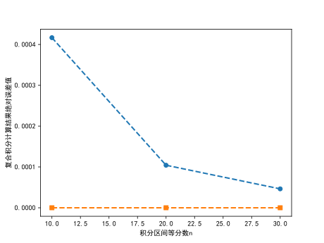

# 实验4: 数值微积分实验

## 问题1：复合梯形和复合辛普森公式

问题1：编写$n$等分的复合梯形公式和复合辛普森公式计算积分$I=\int_0^1\dfrac{1}{1+x^2}\text{d}x$的程序，输入参数为$n$，然后分别取$n=10, 20, 30$计算积分近似值。

**实验原理**：为了数值计算积分$I=\int_a^b f(x)\text{d}x$，对积分区间$[a, b]$进行$n$等分，步长$h=\dfrac{b-a}{n}$，积分节点为$x_k = a+ kh,k=0,1,\cdots, n$.  这样就得到$n$个子积分区间$[x_k, x_{k+1}], k=0, 1,\cdots, n-1$，对每个子区间上的积分使用梯形积分公式，整理可得复合梯形公式为
$$
I = \int_a^b f(x)\text{d}x \approx I_n \triangleq  \frac{h}{2}\left[f(a)+2\sum_{k=1}^{n-1}f(x_k) +f(b)\right]
$$
同理，对每个子区间上的积分使用辛普森（Simpson）公式，整理可得复合辛普森公式为
$$
I = \int_a^b f(x)\text{d}x \approx S_n \triangleq  \frac{h}{6}\left[f(a)+4\sum_{k=0}^{n-1}f(x_{k+\frac{1}{2}}) + 2\sum_{k=1}^{n-1}f(x_k) +f(b)\right]
$$
**实验过程**：编写复合梯形和复合辛普森公式计算数值积分，比较计算效果和观察误差。

```python showLineNumbers
'''
复合梯形公式求数值积分
'''
import numpy as np
import matplotlib.pyplot as plt
# #绘图显示中文
plt.rcParams['font.sans-serif'] = ['SimHei']
plt.rcParams['axes.unicode_minus'] = False

#函数f(x)
def f(x):
    '''
    :param x: np.array(), 支持矢量化运算
    :return: y, np.array()
    '''
    x = np.array(x)
    return 1 / (1 + x ** 2)

# 复合梯形公式
def trapz(func, a, b, n):
    '''
    :param func: 被积函数
    :param a: 积分区间[a, b]
    :param b:
    :param n: 区间n等分
    :return: 复合梯形求积结果Tn
    '''
    h = (b-a)/n  #步长
    xdata = np.linspace(a, b, n+1) #n等分对应n+1个点
    ydata = func(xdata)
    Tn = h/2 * (ydata[0] + 2 * np.sum(ydata[1:-1]) + ydata[-1])
    return Tn

# 复合辛普森公式
def Simpson(func, a, b, n):
    '''
    :param func: 被积函数
    :param a: 积分区间[a, b]
    :param b:
    :param n: 区间n等分
    :return: 复合梯形求积结果Tn
    '''
    h = (b-a)/n  #步长
    xdata = np.linspace(a, b, n+1) #n等分对应n+1个点
    xdata_half = np.linspace(a + h/2, b-h/2, n) #每个区间的中点
    ydata = func(xdata) #求函数值
    ydata_half = func(xdata_half)
    '''
    ------------------------------
    这里作为作业思考，请根据你的理解补充完整
    ------------------------------
    '''
    return Sn

#批量计算和绘图展示误差
def draw_error(a, b, func, n_list):
    '''
    :param a: 积分区间
    :param b:
    :param func: 被积函数
    :return: []
    '''
    result_true = np.pi / 4  # 积分精确值
    trapz_error = []  # 保存复合梯形计算误差

    for n in n_list:
        Tn = trapz(func=func, a=a, b=b, n=n)
        trapz_error.append(abs(result_true - Tn))
        print(f'{n}等分复合梯形积分公式计算结果为T{n}={Tn}, 误差={np.round(abs(result_true - Tn), 8)}')
    print('---' * 10)
    simpson_error = []  # 保存复合辛普森公式计算误差
    for n in n_list:
        '''
    	------------------------------
    	这里作为作业思考，请根据你的理解补充完整
    	------------------------------
    	'''

    plt.plot(n_list, trapz_error, '--o', linewidth=2, label='复合梯形公式')
    plt.plot(n_list, simpson_error, '--s', linewidth=2, label='复合辛普森公式')
    plt.xlabel('积分区间等分数n')
    plt.ylabel('复合积分计算结果绝对误差值')
    plt.savefig('composed_intergral_abs_error.svg', dpi=500)


if __name__ == '__main__':
    #积分区间[a, b]
    a = 0
    b = 1
    func = f #被积函数
    n_list = [10, 20, 30] #区间等分数
    draw_error(a=a, b=b, func=f, n_list=n_list)
```

输出结果为

```python
10等分复合梯形积分公式计算结果为T10=0.7849814972267897, 误差=0.00041667
20等分复合梯形积分公式计算结果为T20=0.7852939967385322, 误差=0.00010417
30等分复合梯形积分公式计算结果为T30=0.7853518671018326, 误差=4.63e-05
------------------------------
10等分复合辛普森积分公式计算结果为S10=0.7853981632424463, 误差=1.55002e-10
20等分复合辛普森积分公式计算结果为S20=0.7853981633950262, 误差=2.4221e-12
30等分复合辛普森积分公式计算结果为S30=0.7853981633972357, 误差=2.126e-13
```

<div style={{display: 'flex', justifyContent:'center', alignItems:'center'}}>



</div>

<p align="center"><b>图1:</b> 不同区间等分数下的复合梯形公式和复合辛普森公式数值积分的误差比较</p>

结果分析：在相同的条件下，复合辛普森公式比复合梯形公式所求的解精确得多。

## 动手实践

**问题2**：给定计算精度$\varepsilon$，编写复合梯形公式和复合辛普森公式计算积分$I=\int_0^1\dfrac{1}{1+x^2}\text{d}x$的程序，要求输入参数为$\varepsilon$，然后分别取$\varepsilon=0.5\times 10^{-4}, 0.5\times 10^{-8}$计算积分近似值。

:::tip
提示：利用$n$等分与$2n$等分的复合公式来估算其计算精度$\varepsilon$。
$$
I - T_{2n }\approx \dfrac{T_{2n}-T_n}{4-1}\triangleq e_{2n}^T\\
I - S_{2n }\approx \dfrac{S_{2n}-S_n}{4^2-1}\triangleq e_{2n}^S\\
$$
:::

参考结果：

```python
------------------------------
精度为5e-05: 复合梯形公式共进行32次等分，结果为0.7853574732937436
精度为5e-09: 复合梯形公式共进行4096次等分，结果为0.7853981609139216
------------------------------
精度为5e-05: 复合辛普森公式共进行4次等分，结果为0.7853981256146767
精度为5e-09: 复合辛普森公式共进行8次等分，结果为0.7853981628062054
```

**问题3**：编写龙贝格三等分的加速算法程序，并计算积分$\int_0^1 \dfrac{\sin x}{x}\text{d}x$的近似值。

:::tip
Romberg加速算法计算数值积分的思路：

通常采取将区间**不断对分**的方法，即取$n = 2^k$ ，**反复使用复合求积公式**，直到所得到的计算结果满足指定的精度为止。

在复合梯形公式$T_n$的基础上，对每个小区间进行二分，则得到复合梯形公式$T_{2n}$，且
$$
T_{2n} = \frac{1}{2}T_n +\frac{h}{2}\sum_{i=0}^{n-1}f(x_{i+\frac{1}{2}})
$$
在上述对梯形法加速的基础上，使用外推算法，得到下面的Romberg加速过程。

| $T_1$    |                               |                                   |                                   |          |
| -------- | ----------------------------- | --------------------------------- | --------------------------------- | -------- |
| $T_2$    | $S_1 = \dfrac{4T_2-T_1}{4-1}$ |                                   |                                   |          |
| $T_4$    | $S_2 = \dfrac{4T_4-T_2}{4-1}$ | $C_1 = \dfrac{4^2S_2-S_1}{4^2-1}$ |                                   |          |
| $T_8$    | $S_4 = \dfrac{4T_8-T_4}{4-1}$ | $C_2 = \dfrac{4^2S_4-S_2}{4^2-1}$ | $R_1 = \dfrac{4^3C_2-C_1}{4^3-1}$ |          |
| $\cdots$ | $\cdots$                      | $\cdots$                          | $\cdots$                          | $\ddots$ |

:::

参考结果：

```python showLineNumbers
'''
Romberg加速计算积分
'''
import numpy as np
from math import sin
#被积函数sin(x)/x
def f(x):
    if x != 0:
        return sin(x)/x
    else:
        return 1 #在0点函数值定义为极限


#龙贝格加速算法
def Romberg(a, b, func, n=3):
    '''
    :param a: 积分区间
    :param b:
    :param func: 被积函数
    :param n: 默认复合梯形二分进行n次
    :return: 积分结果
    '''
    T = np.zeros((n+1, n+1))
    h = b - a #初始积分区间
    T[0, 0] = np.array(h / 2 * (func(a) + func(b)))
    err = 1 #误差初始值
    for k in range(n): #二分n次
        addT = 0 #复合梯形不断二分
        for j in range(2** k):
            x = a + (2*j + 1) * h /2
            addT += func(x)
        T[k+1, 0] = 0.5 * (T[k, 0] + h*addT)
        for m in range(k+1):
            T[k+1, m+1] = (4**(m+1) * T[k+1, m] - T[k, m])/(4 ** (m+1)-1)
        h = h / 2
    print('Romberg加速过程为：')
    print('   Tn        Sn          Cn         Rn')
    print(T)
    error = abs(T[k + 1, m + 1] - T[k, m])
    return T[n, n], error

#龙贝格加速算法：考虑容许误差
def Romberg_tolerance(a, b, func, tol=0.5e-8):
    '''
    :param a: 积分区间
    :param b:
    :param func: 被积函数
    :param tol: 容许误差
    :return: 积分结果
    '''
    
    '''代码从略'''

    return T[k, k]


if __name__ == '__main__':
    a = 0 #积分区间
    b = 1
    n = 3 #梯形法步长折半n次
    result, err = Romberg(a=a, b=b, func=f, n=n)
    print(f'进行{n}次步长折半，Romberg加速得到的积分值为{result}')
    print(f'误差为{err}')
    print('---' * 10)
    tol = 0.5e-8
    result = Romberg_tolerance(a=a, b=b, func=f, tol=tol)
    print(f'精度={tol}，Romberg加速得到的积分值为{result}')
```

输出结果为

```python
Romberg加速过程为：
   Tn        Sn          Cn         Rn
[[0.92073549 0.         0.         0.        ]
 [0.93979328 0.94614588 0.         0.        ]
 [0.94451352 0.94608693 0.946083   0.        ]
 [0.94569086 0.94608331 0.94608307 0.94608307]]
进行3次步长折半，Romberg加速得到的积分值为0.9460830703872225
误差为6.632354832003529e-08
------------------------------
Romberg加速过程为：
   Tn        Sn          Cn         Rn   ... 
[[0.92073549 0.         0.         0.         0.         0.        ]
 [0.93979328 0.94614588 0.         0.         0.         0.        ]
 [0.94451352 0.94608693 0.946083   0.         0.         0.        ]
 [0.94569086 0.94608331 0.94608307 0.94608307 0.         0.        ]
 [0.94598503 0.94608309 0.94608307 0.94608307 0.94608307 0.        ]
 [0.         0.         0.         0.         0.         0.        ]]
精度=5e-09，Romberg加速得到的积分值为0.9460830703671812
```

