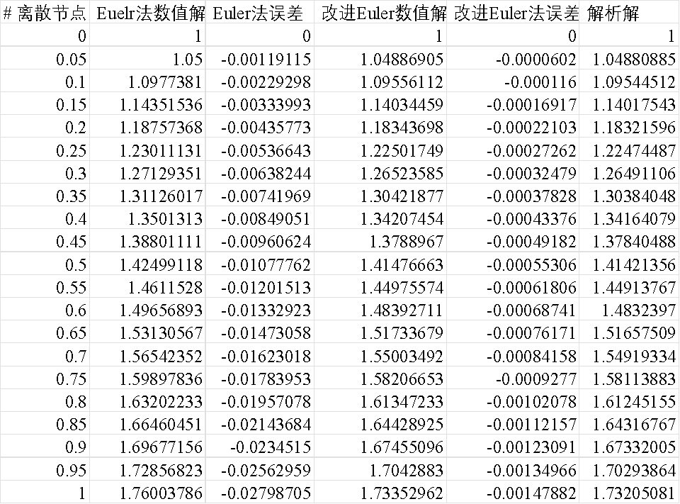

# 实验6: 常微分方程数值解实验

## 问题1：欧拉法和改进欧拉法求常微分方程初值问题数值解

**问题1**：分别编写Euler方法和改进的Euler方法计算常微分方程初值问题的数值解程序。分别取步长$h=0.1, 0.05$来计算下面的初值问题，并画图比较计算效果（解析解为$y=\sqrt{1+2x}$）。
$$
\begin{cases}
y'(x) = y - \dfrac{2x}{y}, x\in[0, 1]\\
y(0) = 1
\end{cases}
$$
**实验原理**：考虑一阶常微分方程(组)的初值问题(Initial Value Problem, IVP)
$$
\begin{equation*}
        \left\{
           \begin{split}
            & y'(x)=f(x,y), x\in [a,b] \\
               & y(a)=y_0.
           \end{split}
        \right.
      \end{equation*}
$$
对区间$[a, b]$进行$N$等分，步长$h= \dfrac{b-a}{N}$,  离散节点为$x_n=a+nh, n=0,1,\cdots, N.$ 

- [x] 欧拉(Euler)公式为
  $$
  y_{n+1}=y_n+h f(x_n,y_n),~~n=0,1,\cdots,N-1
  $$
  
- [x] 改进欧拉公式为
  $$
  \left\{ {\begin{array}{lr}
      {\color{red}\bar y_{n+1}}=y_n+hf(x_n,y_n),&\text{prediction}\\
      \\
      y_{n+1}=y_n+\dfrac{h}{2}[f(x_n,y_n)+f(x_{n+1},{\color{red}\bar y_{n+1}})].&\text{correction}\end{array}}\right.
  $$
  为了便于编程，改进欧拉公式常改写为
  $$
  \begin{cases}
  {\color{red}k_1}=f(x_n,y_n),\\
  {\color{red}k_2}=f(x_n+h,y_n+hk_1)\\
  y_{n+1}=y_n+h\left(\dfrac{1}{2}{\color{red}k_1}+\dfrac{1}{2}{\color{red}k_2}\right),&\\
  \end{cases}, n=0,1,\cdots,N-1
  $$

**实验过程**：

```python showLineNumbers
'''
欧拉法和改进欧拉法求ODE初值问题数值解
'''
import numpy as np
import matplotlib.pyplot as plt
# #绘图显示中文
plt.rcParams['font.sans-serif'] = ['SimHei']
plt.rcParams['axes.unicode_minus'] = False

#欧拉法
def Euler(f, a, b, y0, h):
    '''
    :param f: y'(x) = f(x, y)
    :param a: 区间[a, b]
    :param b:
    :param y0: 初始值y(a) = y0
    :param h: 步长
    :return: 数值解[X, Y]
    '''
    N = round((b-a)/h)  #区间等分数
    X = np.linspace(a, b, N+1).reshape((-1, 1)) #离散节点，转化为列向量
    Y = np.zeros_like(X)
    Y[0] = y0 #初始值
    for n in range(N):
        '''
        ------------------------------
        这里作为作业思考，请根据你的理解补充完整
        ------------------------------
        '''

    return X, Y

#改进欧拉法
def improved_Euler(f, a, b, y0, h):
    '''
    :param f: y'(x) = f(x, y)
    :param a: 区间[a, b]
    :param b:
    :param y0: 初始值y(a) = y0
    :param h: 步长
    :return: 数值解[X, Y]
    '''
    N = round((b-a)/h)  #区间等分数
    X = np.linspace(a, b, N+1).reshape((-1, 1)) #离散节点，转化为列向量
    Y = np.zeros_like(X)
    Y[0] = y0 #初始值
    '''
    ------------------------------
    这里作为作业思考，请根据你的理解补充完整
    ------------------------------
    '''
    
#定义微分函数
def f(x, y):
    return y - 2 * x / y

# y'(x) = f(x, y)的解析解
def exact_solution(x):
    return np.sqrt(1 + 2 * x)

#计算误差和观察数值解效果
def plotting_Euler_result(f, a, b, y0, h_list):
    '''
    :param f: y'(x) = f(x, y)
    :param a: 区间[a, b]
    :param b:
    :param y0: 初始值y(a) = y0
    :param h_list: 步长
    '''
    for h in h_list:
        X1, Y1 = Euler(f=f, a=a, b=b, y0=y0, h=h)
        Y_exact = exact_solution(X1)
        error1 = Y_exact - Y1  #欧拉方法误差
        result = np.hstack((X1, Y1)) #保存结果到result
        result = np.hstack((result, error1))
        plt.plot(X1, Y1, 'o', markersize=2, linewidth=2, label=f'Euler方法h={h}')

        '''
        利用改进欧拉法求数值解
        ------------------------------
        这里作为作业思考，请根据你的理解补充完整
        ------------------------------
        '''
        result = np.hstack((result, Y2))
        result = np.hstack((result, error2))
        result = np.hstack((result, Y_exact))
        #输出结果到csv文件，用excel可打开显示
        np.savetxt('Euler-result_h=' + str(h) + '.csv',
                   result,
                   header='离散节点, Euelr法数值解, Euler法误差, 改进Euler数值解, 改进Euler法误差, 解析解',
                   fmt='%10.8f',
                   delimiter=',')

        plt.plot(X2, Y2, 'd', markersize=2, linewidth=2, label=f'改进Euler方法h={h}')

    #绘制解析解
    xdata = np.linspace(a, b, 100)
    ydata = exact_solution(xdata)
    plt.plot(xdata, ydata, '-', markersize=2, linewidth=2, label='解析解')

    plt.xlabel('x')
    plt.ylabel('y')
    plt.title('Euler方法和改进Euler方法求ODE的数值解')
    plt.legend()
    plt.savefig('Euler_result.svg', dpi=500)
    plt.close()

    #绘制误差曲线
    plt.plot()
    plt.plot(X1, abs(error1), '--o', markersize=4, linewidth=2, label=f'Euler方法取h={h}时的绝对误差')
    '''
    ------------------------------
    这里作为作业思考，请根据你的理解补充完整
    ------------------------------
    '''
    plt.close()


if __name__ == '__main__':
    a = 0 #区间[a, b]
    b = 1.0
    y0 = 1.0 #初始值
    h_list = [0.1, 0.05]  #步长列表
    plotting_Euler_result(f=f, a=a, b=b, y0=y0, h_list=h_list)
```

输出结果为
<div style={{display: 'flex', justifyContent:'center', alignItems:'center'}}>


</div>

<p align="center"><b>图1:</b> Euler和改进Euler方法求解常微分方程数值解效果</p>

<div style={{display: 'flex', justifyContent:'center', alignItems:'center'}}>


</div>

<p align="center"><b>图2:</b> Euler和改进Euler方法求解常微分方程数值解绝对误差</p>


<p align="center"><b>图3:</b> h=0.1时，Euler和改进Euler方法保存到csv文件的数值解结果</p>



<p align="center"><b>图4:</b> h=0.05时，Euler和改进Euler方法保存到csv文件的数值解结果</p>

## 问题2：龙格-库塔(Runge-Kutta)法求常微分方程初值问题数值解

问题2：编写经典四阶龙格-库塔公式计算常微分方程初值问题的数值解程序。并分别取步长$h=0.1, 0.05$来计算问题1中微分方程初值问题的数值解。并画图比较计算效果。

**实验原理**：考虑一阶常微分方程(组)的初值问题(Initial Value Problem, IVP)
$$
\begin{equation*}
        \left\{
           \begin{split}
            & y'(x)=f(x,y), x\in [a,b] \\
               & y(a)=y_0.
           \end{split}
        \right.
      \end{equation*}
$$
对区间$[a, b]$进行$N$等分，步长$h= \dfrac{b-a}{N}$,  离散节点为$x_n=a+nh, n=0,1,\cdots, N.$ 


- [x] 四阶经典龙格-库塔(Runge-Kutta)格式为
  $$
  \begin{cases}
  {\color{red}k_1}=f(x_n,y_n),\\
  {\color{red}k_2}=f\left(x_n+\dfrac{1}{2}h,y_n+\dfrac{1}{2}k_1\right),\\
  {\color{red}k_3}=f\left(x_n+\dfrac{1}{2}h,y_n+\dfrac{1}{2}k_2\right),\\
  {\color{red}k_4}=f(x_n+h,y_n+k_3)\\
  y_{n+1}=y_n+\dfrac{1}{6}h({\color{red}k_1+2k_2+2k_3+k_4}),\\
  \end{cases},~~n=0,1,\cdots,N-1
  $$

**实验原理**：请自己动手实践和探讨对结果的分析。

## 问题3：一阶常微分方程组初值问题数值解

一阶微分方程组IVP：
$$
\begin{equation*}
       \left\{
       \begin{split}
         y_1'(x) & =f_1(x, y_1(x), \cdots, y_m(x)), \\
           & \cdots , \\
         y_m'(x) & =f_m(x, y_1(x), \cdots, y_m(x)), \\
         y_1(x_0) & =y_1^0, \\
           &\cdots,\\
         y_m(x_0) & =y_m^0.
       \end{split}
       \right.
     \end{equation*}
$$
上述微分方程组改写成向量形式：令
$
Y=\begin{pmatrix}
y_1 \\
\vdots \\
y_m \\
\end{pmatrix}
$,
$F=\begin{pmatrix}
f_1 \\
\vdots \\
f_m \\
\end{pmatrix}
$,
$Y_0=\begin{pmatrix}
y_1^0 \\
\vdots \\
y_m^0 \\
\end{pmatrix}
$, 
则向量形式为

$$
\begin{equation*}
    \left\{
      \begin{split}
        Y'(x) & =F(x,Y), \\
        Y(x_0)  &= Y_0
      \end{split}
    \right.
  \end{equation*}
$$

### **实例：传染病SIR模型**及其数值求解

天花、麻疹等传染病有免疫性，将人群分为三类：已感染者（Infective）、易感染者（Susceptible）和移出者（Removed）. 记$t$时刻三类病人所占的比例分别为$i(t)$, $s(t)$, $r(t) = 1- i(t) - s(t)$.

设病人的日接触率为$\lambda$, 日治愈率为$\mu$，可建立$i(t), s(t)$所满足的一阶微分方程组
$$
\begin{equation*}
        \left\{
          \begin{split}
            \frac{di(t)}{dt} & =\lambda s(t)i(t)- \mu i(t), \\
            \frac{ds(t)}{dt} & =-\lambda s(t)i(t), t\in[0, T] \\
            i(0)  & =i_0, s(0)=s_0
          \end{split}
        \right.
      \end{equation*}
$$
传染病SIR模型的欧拉格式数值求解：类似前面的讨论，可建立如下格式
$$
\begin{equation*}
        \left\{
          \begin{split}
            i_{n+1} & =i_n+ dt(\lambda s_n i_n - \mu i_n), \\
            s_{n+1} & =s_n -dt \lambda s_n i_n, n=0,1,\cdots, N-1\\
            i_0, & s_0 \\
          \end{split}
        \right.
      \end{equation*}
$$

<div style={{display: 'flex', justifyContent:'center', alignItems:'center'}}>


</div>

**图5：**$i_0=0.02, s_0 = 0.98, \lambda = 1, \mu = 0.3$的三类人群的动态变化曲线

<div style={{display: 'flex', justifyContent:'center', alignItems:'center'}}>


</div>

**图6：**$i_0=0.02, s_0 = 0.98, \lambda = 1, \mu = 0.3$的$s(t)-i(t)$的相平面曲线

### 高阶微分方程化为一阶微分方程组

Higher-Order Equations：
$$
\begin{equation*}
        \left\{
          \begin{split}
            y^{(n)}(x) & =f(x, y(x), y'(x),\cdots, y^{(n-1)}(x)), \\
            y(x_0)  & =a_0, y'(x_0)=a_1, \cdots, y^{(n-1)}(x_0)=a_{n-1}
          \end{split}
        \right.
      \end{equation*}
$$
引入新变量化为一阶微分方程组：令$y_1=y(x), y_2=y'(x), \cdots, y_n=y^{(n-1)}(x)$, 则
$$
\begin{equation*}
       \left\{
       \begin{split}
         y_1'(x) & =y_2, \\
           & \cdots , \\
         y_{n-1}'(x) & =y_n, \\
         y_{n}'(x) & =f(x, y_1, y_2, \cdots, y_n), \\
         y_1(x_0) & =a_0,\cdots,  y_n(x_0)=a_{n-1}.
       \end{split}
       \right.
     \end{equation*}
$$

## 问题4：有限差分法初步

二阶常微分方程边值问题
$$
\begin{equation*}
        \left\{
          \begin{split}
            y''(x)& =f\left(x, y(x), y'(x)\right), x\in[a,b], \\
            y(a)  & =\alpha, \\
            y(b)  & =\beta.
          \end{split}
        \right.
      \end{equation*}
$$
有限差分法（Finite Difference Method，FDM）：将求解区间$[a, b]$等分为$N$份，取节点 $x_i = a + ih,$ $(i = 0,1， \cdots, N )$，利用数值微分在每一个节点处将 $y'$和 $y''$离散化。上述边值问题可化为线性方程组
$$
\begin{equation*}
       \left\{
       \begin{split}
         &\frac{y_{i+1}-2y_i+y_{i-1}}{h^2}  =f(x_i, y_i, \frac{y_{i+1}-y_{i-1}}{2h}), i=1,\cdots, N-1 \\
          & y_0   =\alpha, \\
          &  y_N   =\beta \\
       \end{split}
       \right.
     \end{equation*}
$$
示例：
$$
\begin{equation*}
        \left\{
          \begin{split}
            y''(x)& =6x, x\in[0, 1], \\
            y(0)  & =0, \\
            y(1)  & =0.
          \end{split}
        \right.
      \end{equation*}
$$
FD格式为
$$
\begin{equation*}
       \left\{
       \begin{split}
         &\frac{y_{i+1}-2y_i+y_{i-1}}{h^2}  =6 x_i, i=1,\cdots, N-1 \\
          & y_0   =0, \\
          &  y_N   =0 \\
       \end{split}
       \right.
     \end{equation*}
$$
化为线性方程组为
$$
\begin{equation*}
       \begin{pmatrix}
         -2 & 1 & 0 & \cdots & 0 \\
         1 & -2 & 1 & \cdots &  0\\
         \cdots & \cdots & \cdots & \cdots & \cdots\\
         0 & \cdots & 1 & -2 & 1 \\
         0 & \cdots & 0 & 1 & -2 \\
       \end{pmatrix}
       \begin{pmatrix}
         y_1 \\
         y_2 \\
         \vdots \\
         y_{N-2} \\
         y_{N-1} \\
       \end{pmatrix}
       =\begin{pmatrix}
          6h^2x_1-y_0 \\
          6h^2x_2 \\
          \vdots \\
          6h^2x_{N-2} \\
          6h^2x_{N-1}-y_N\\
        \end{pmatrix}
     \end{equation*}
$$
请动手编写程序，可与解析解$y=x^3-x$进行比较，数值解效果如下。

<div style={{display: 'flex', justifyContent:'center', alignItems:'center'}}>


</div>


### 拓展：热传导偏微分方程数值求解及应用

数学建模应用案例中的“**多层高温作业专业服装设计问题**”、“**炉温曲线机理建模与优化设计**”等需要建立热传导微分方程及其边界条件、初始条件，可利用上面的有限差分法建立有限差分显格式和有限差分隐格式。

感兴趣的同学可以关注数学建模相关问题和应用。