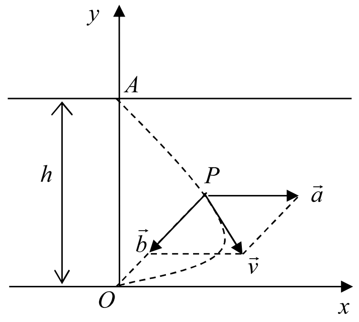
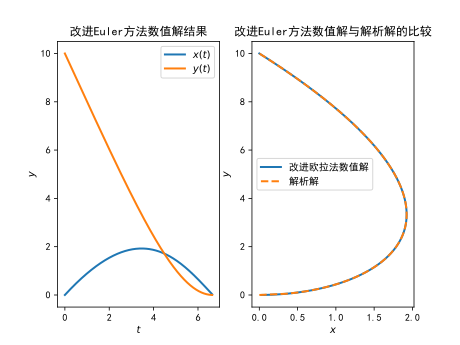
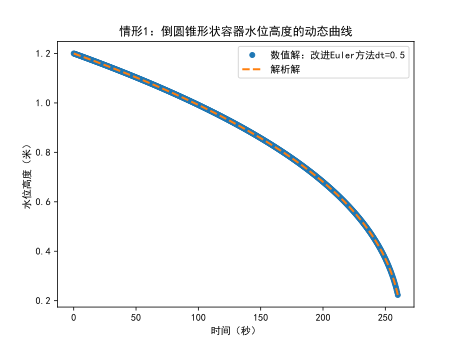
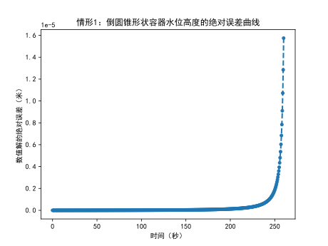
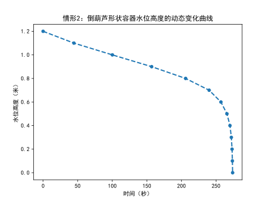

# 实验8: 数学建模问题

微分方程是一个瞬时表达式，当建立方程时，有许多表示导数的常用词如“速率”，“增长率”(在生物学及人口问题研究中)，“衰变”（放射性问题中）等。注意什么量在“改变”、“变化”、“增长”、“减少”等信息，建模时或许会用到导数。

有些问题遵循某原则或物理定律，能够很快得到相应的微分方程。也有些问题不是我们所熟悉领域的问题，但细分析它们遵循下面的模式：

<p align='center'>净变化率=输入率-输出率，</p>

或

<p align='center'>净增长率=增长率-消耗率，</p>

显然这类模式的问题的数学模型往往可归结为微分方程。

## 问题1：鸭子渡河问题

设河边点$O$的正对岸为点$A$，河宽$OA=h$（如图1所示），水流速度为$a$，有一只鸭子从点$A$游向点$O$，设鸭子（在静水中）的游速为$b(b>a)$，且鸭子游动的方向始终朝着点$O$。

（1）设$h=10~\mathrm{m}$，$a=1 ~\mathrm{m/s}$，$b=2~ \mathrm{m/s}$，用数值解法求渡河所需时间、任意时刻鸭子的位置及游动曲线。

（2）建立任意时刻鸭子的位置和鸭子游动的数学模型，求解析解。



<p align="center"><b>图1:</b> 鸭子渡河轨迹示意图</p>

### 1.1 模型的建立

如图1所示，设$O$为坐标原点，河岸朝顺水方向为$x$轴，$y$轴指向对岸。

设起点$A$的坐标$(x, y)=(0, h)$，终点$O$的坐标为$(0，0)$，时刻$t$鸭子位于点$P(x, y)$，考虑到鸭子的游速为$b$，且鸭子游动的方向始终朝着点$O$，则向量$\vec b $为
$$
\vec b = b\dfrac{\vec {PO}}{|PO|} = - b\dfrac{\vec {OP}}{|OP|}= -b\times \dfrac{1}{\sqrt{x^2+y^2}}\{x, y\}
$$
水流速度向量为
$$
\vec a = \{a, 0\}
$$
鸭子渡河的合成速度为
$$
\vec v = \vec a +\vec b = \left\{a - \dfrac{bx}{\sqrt{x^2+y^2}}, - \dfrac{by}{\sqrt{x^2+y^2}}\right\} \triangleq \{v_x, v_y\}
$$

于是鸭子游动的轨迹满足下面的一阶微分方程组初值问题：
$$
\begin{cases}
\dfrac{dx}{dt} = a - \dfrac{bx}{\sqrt{x^2+y^2}},\\
\dfrac{dy}{dt} =  - \dfrac{by}{\sqrt{x^2+y^2}},\\
x(0)=0,\\
y(0)=h.
\end{cases}
$$
### 1.2 模型的数值求解

利用实验6中的一阶常微分方程组初值问题进行数值求解，记上面的微分方程组为
$$
\begin{equation*}
       \left\{
       \begin{split}
         x'(t) & =f_1(t, x(t), y(t)), \\
         y'(t) & =f_2(t, x(t), y()t), \\
         x(t_0) & =x_0, \\
         y(t_0) & =y_0.
       \end{split}
       \right.
     \end{equation*}
$$
记$Y = (x(t), y(t))$,  一阶微分方程组写成向量的形式为
$$
\begin{equation*}
    \left\{
      \begin{split}
        Y'(t) & =F(t,Y), \\
        Y(t_0)  &= Y_0
      \end{split}
    \right.
  \end{equation*}
$$
离散的时间步长为$\Delta t$，可建立改进的欧拉格式为
$$
\begin{cases}
    \bar x_{n+1}=x_n+\Delta t f_1(t_n, x_n ,y_n),\\
    \bar y_{n+1}=y_n+\Delta t f_2(t_n, x_n ,y_n),\\
    x_{n+1}=x_n+\dfrac{\Delta t}{2}[f_1(t_n, x_n,y_n)+f_1(t_{n+1},\bar x_{n+1}), \bar y_{n+1})],\\
    y_{n+1}=y_n+\dfrac{\Delta t}{2}[f_2(t_n, x_n,y_n)+f_2(t_{n+1},\bar x_{n+1}), \bar y_{n+1})].\\
\end{cases}
$$
或者
$$
\begin{cases}
    \bar Y_{n+1}=Y_n+\Delta t F(t_n, Y_n),\\
    Y_{n+1}=Y_n+\dfrac{\Delta t}{2}[F(t_n, Y_n)+F(t_{n+1},\bar Y_{n+1})].\\
\end{cases}
$$
迭代结束的条件为鸭子游到原点$O$，可以引入纵坐标$y$的数值解$Y_n$与原点$0$的绝对误差小于给定精度tol，进而可以探索游到原点所需要的时间，并绘制鸭子游动的轨迹观察计算效果。

### 1.3 模型的解析解

根据上面的一阶微分方程组，可得
$$
\dfrac{dx}{dy} = \dfrac{v_x}{v_y} = \dfrac{x}{y} - \dfrac{a\sqrt{x^2+y^2}}{by}
$$
这是个齐次微分方程，初始条件为$x(h)=0$，解得鸭子游动的轨迹方程为
$$
x = \dfrac{h}{2}\left[\left(\dfrac{y}{h}\right)^{1-\dfrac{a}{b}}-\left(\dfrac{y}{h}\right)^{1+\dfrac{a}{b}}\right]， 0\leq y\leq h
$$


### 1.4 数值解与解析解的比较

编写改进欧拉法求上述一阶微分方程组的Python程序，并与解析解比较。

```python
'''
利用改进欧拉法求一阶微分方程组初值问题数值解
'''
import numpy as np
import matplotlib.pyplot as plt
# #绘图显示中文
plt.rcParams['font.sans-serif'] = ['SimHei']
plt.rcParams['axes.unicode_minus'] = False

#改进欧拉法
def improved_Euler(F, t0, tol, Y0, dt):
    '''
    :param F: Y'(t) = F(t, Y)
    :param t0: 初始时间
    :param tol: 容许误差，鸭子终点位置与原点O的绝对误差
    :param Y0: 初始值Y(a) = Y0
    :param dt: 步长
    :return: 数值解[T, Y]
    '''
    Y0 = np.array(Y0).reshape(1, -1)  #初始值转化为np.array一行
    T = [t0] # 保存离散时刻，初始值
    Y = Y0   # 保存数值解结果，初始值
    n = 0 # 迭代次数计数器
    #判断Y的最后一行的y值是否==0，
    while np.abs(Y[-1, 1]) > tol:
        T = np.vstack((T, T[n] + dt))
        K1 = F(T[n], Y[n, :])
        Y_temp = Y[n, :] + dt * K1
        K2 = F(T[n + 1], Y_temp)
        Y = np.vstack((Y, Y[n, :] + dt * (0.5 * K1 + 0.5 * K2)))
        n += 1  # 更新迭代次数
    return T, Y
#定义微分函数
def F(t, Y):
    '''
    :param t: 自变量
    :param Y: 因变量向量，Y = [x(t), y(t)]
    :return: dY = [f1(t, x, y), f2(t, x, y)]
    '''
    a = 1 #水流速度
    b = 2 #鸭子的游速
    x = Y[0] #因变量向量的第一个分量
    y = Y[1]
    return np.array([a - b*x/np.sqrt(x**2+y**2), - b*y/np.sqrt(x**2+y**2)])

# Y'(t) = F(t, Y)的解析解
def exact_solution(y):
    a = 1  # 水流速度
    b = 2  # 鸭子的游速
    h = 10 # 河宽
    return h/2 * ((y/h)**(1-a/b) - (y/h) ** (1+a/b))

#计算误差和观察数值解效果
def plotting_Euler_result(F, t0, tol, Y0, dt):
    '''
    :param F: Y'(x) = F(x, y)
    :param t0: 初始时间
    :param tol: 容许误差，鸭子终点位置与原点O的绝对误差
    :param Y0: 初始值Y(t0=a) = Y0
    :param dt: 时间步长
    '''
    T, Y = improved_Euler(F=F, t0=t0, tol=tol, Y0=Y0, dt=dt)
    print(f'鸭子渡河所需要的时间为{T[-1, 0]}秒')

    #绘图观察数值解与解析解的比较
    fig, ax = plt.subplots(1, 2)
    ax[0].plot(T, Y[:, 0], linewidth=2, label='$x(t)$')
    ax[0].plot(T, Y[:, 1], linewidth=2, label='$y(t)$')
    ax[0].legend()
    ax[0].set_xlabel('$t$')
    ax[0].set_ylabel('$y$')
    ax[0].set_title('改进Euler方法数值解结果')

    ax[1].plot(Y[:, 0], Y[:, 1], '-', linewidth=2, label='改进欧拉法数值解')

    #绘制解析解
    h = 10 #河宽
    ydata = np.linspace(0, h, 200)
    xdata = exact_solution(ydata)
    ax[1].plot(xdata, ydata, '--', markersize=2, linewidth=2, label='解析解')
    ax[1].legend()
    ax[1].set_xlabel('$x$')
    ax[1].set_ylabel('$y$')
    ax[1].set_title('改进Euler方法数值解与解析解的比较')

    plt.savefig('cross-river-result.svg', dpi=500)
    plt.close()

if __name__ == '__main__':
    t0 = 0 #初始时间t0
    h = 10  #河宽
    Y0 = [0, h] #Y0初始值
    tol = 0.5e-3 #容许误差，鸭子终点位置与原点O的绝对误差
    dt = 0.01  #步长列表
    plotting_Euler_result(F=F, t0=t0, tol=tol, Y0=Y0, dt=dt)
```

输出结果为

```python
鸭子渡河所需要的时间为6.639999999999903秒
```



<p align="center"><b>图2:</b> 鸭子渡河问题数值解与解析解的比较</p>

**结果分析**：从图2右侧子图可以看出，改进欧拉法计算的数值解与解析解基本吻合，说明上述数值算法的有效性和结论的正确性。

### 1.5 基于scipy库odeint函数的结果检验

具体可参考实验6中3.1.4利用scipy的odeint函数求数值解部分，用于本问题的更多探讨。

## 问题2：底端有孔容器的水面高度

容器盛满水后，底端直径为$d_0$的小孔开启。根据水力学知识，当水面高度为$h$时，水从小孔中流出的速度为 $v=0.6\sqrt{2gh}$（$g$为重力加速度，$0.6$为孔口收缩系数)，

(1) 若容器为**倒圆锥形**，现测得容器高$H$和上底面直径$D$均为$1.2$m，小孔直径为$3$cm，问水从小孔中流完需要多少时间；$2$分钟时水面高度为多少？

(2) 若容器为**倒葫芦形**（水平截面为圆），现测得容器高$1.2$m，小孔直径$3$cm，由底端（记作$h=0$）向上每隔$0.1$(m)测出容器的直径$d$(m)如下表所示，问水从小孔中流完需要多少时间；$2$分钟时水面高度为多少？

<p align="center"><b>表1：</b>倒葫芦形容器的高度h与直径d的关系</p>

| $h$  | 0    | 0.1  | 0.2  | 0.3  | 0.4  | 0.5  | 0.6  | 0.7  | 0.8  | 0.9  | 1.0  | 1.1  | 1.2  |
| ---- | ---- | ---- | ---- | ---- | ---- | ---- | ---- | ---- | ---- | ---- | ---- | ---- | ---- |
| $d$  | 0.03 | 0.05 | 0.08 | 0.14 | 0.19 | 0.33 | 0.45 | 0.68 | 0.98 | 1.10 | 1.20 | 1.13 | 1.00 |

### 2.1 模型的建立

#### 2.1.1 水从小孔中流完所需要的时间

水不断从小孔流出，容器中水的高度是不断变化的，流速为$v=0.6\sqrt{2gh}$。设容器底端的高度为$h=0$, 根据质量守恒，即流出体积=容器水的减少量，时刻$t$时的水位高度为$h(t)$，初始的水位高度满足$h(0)=H$。

设时间增量为$dt$,  高度变化量为$dh$，则$t+dt$时刻的高度为$h(t)+dh$, 考虑到水面是下降的，$dh<0$。记$t$时刻高度$h(t)$对应的水截面（水平截面为圆）的直径为$d(t)$.

利用**微元法**，容器中水的下降量近似为圆柱体的体积，即$ -\dfrac{\pi d(t)^2 }{4}dh$。根据质量守恒可得

$$
\dfrac{\pi}{4}d_0^2 v dt =- \dfrac{\pi d(t)^2 }{4}dh
$$
整理，得
$$
dt  =\dfrac{d^2(t) }{d_0^2  v} dh = -\dfrac{d^2(t) }{0.6d_0^2 \sqrt{2gh(t)} } dh
$$
为了求水从小孔中流完所需要的时间$T$，可以对上式两边分别取积分，即 
$$
T= \int_0^T dt  =\int_H^0 - \dfrac{d^2(t) }{0.6d_0^2 \sqrt{2gh(t)} } dh = \int_0^H \dfrac{d^2(t) }{0.6d_0^2 \sqrt{2gh(t)} } dh
$$
这样转化为**计算积分**的问题，可利用实验4中的**复合梯形公式**或**复合辛普森公式**对问题（1）和问题（2）进行求解。

##### 2.1.1.1 情形1：容器为倒圆锥形

特别地，对于问题（1），容器为倒圆锥形，根据几何相似性，可得
$$
\dfrac{d(t)}{D} = \dfrac{h}{H}
$$
即 
$$
d(t) = \dfrac{D}{H}h(t).
$$
利用微元法，容器中水的下降量近似为圆柱体的体积，即$-\dfrac{\pi D^2 }{4H^2}h^2(t)dh$。根据质量守恒，可得

$$
\dfrac{\pi}{4}d_0^2 v dt = -\dfrac{\pi D^2 }{4H^2}h^2(t) dh
$$
整理，得
$$
dt  =\dfrac{D^2 h^2}{d_0^2 H^2 v} dh= -\dfrac{D^2 h^2}{0.6 d_0^2H^2 \sqrt{2gh}} dh = -\dfrac{D^2h^{\frac{3}{2}}}{0.6 d_0^2H^2 \sqrt{2g}} dh
$$
可以对上式两边分别取积分，即 
$$
T= \int_0^T dt  =\int_H^0  -\dfrac{D^2h^{\frac{3}{2}}}{0.6 d_0^2H^2 \sqrt{2g}} dh = \int_0^H  \dfrac{D^2h^{\frac{3}{2}}}{0.6 d_0^2H^2 \sqrt{2g}} dh
$$


对于问题（1），可以求出精确积分值，即
$$
T =\dfrac{2 D^2H^{\frac{5}{2}}}{0.6\times 5\times d_0^2H^2 \sqrt{2g}} = \dfrac{2D^2 }{3d_0^2} \sqrt{\dfrac{H}{2g}}.
$$

##### 2.1.1.2 情形2：容器为倒葫芦形（水平截面为圆）

对于问题（2）， 利用表格数据的$h(t), d(t)$可以进行**复合梯形或复合辛普森数值积分**，也可以根据表格数据进行**插值加密**，得到更精确的积分结果。

#### 2.1.2 2分钟时的水面高度

##### 2.1.2.1 情形1：容器为倒圆锥形

为了求在$2$分钟或者第$t=120$秒时水的高度$h(120)$，可以建立微分方程初值问题
$$
\begin{cases}
\dfrac{dh}{dt}  = - \dfrac{0.6d_0^2 \sqrt{2gh(t)}}{d^2(t)},~~~ 0\leq t\leq 120\\
h(0)=H =1.2m
\end{cases}
$$
对于问题（1）的倒圆锥形，整理有微分方程初值问题
$$
\begin{cases}
\dfrac{dh}{dt}= -\dfrac{0.6 d_0^2H^2 \sqrt{2g}}{D^2h^{\frac{3}{2}}},~~~ 0\leq t\leq 120\\
h(0)=H =1.2m
\end{cases}
$$
利用实验6中**改进的欧拉法**或**四阶龙格-库塔方法**可求解此问题。对于问题（1），利用**分离变量法**可以求出**解析解**为
$$
h^{\frac{5}{2}} = H^{\frac{5}{2}} - \frac{5}{2}\times \dfrac{0.6 d_0^2H^2 \sqrt{2g}}{D^2}t
$$
或者
$$
h = \left( H^{\frac{5}{2}} - \frac{3}{2} \dfrac{d_0^2H^2 \sqrt{2g}}{D^2}t\right)^{\frac{2}{5}}
$$
##### 2.1.2.2 情形2：容器为倒葫芦形

对于问题（2）倒葫芦形状容器， 所给表格数据并**不是等时间步长**采集的，不能直接使用微分方程数值解进行求解。

首先，可以利用积分求出不同水位高度对应的时间，得到时间与水位高度的对应数据。再利用**插值方法**求出时间$t=120$秒时的水位高度。

下面求出不同水位高度$h$对应的时间$t$. 根据上面的讨论，微分方程为
$$
dt  =\dfrac{d^2(t) }{d_0^2  v} dh = -\dfrac{d^2(t) }{0.6d_0^2 \sqrt{2gh(t)} } dh
$$
方程两边分别积分，水位高度从$H$变化到$h$，
$$
\int_0^t dt = \int_H ^ h  -\dfrac{d^2(t) }{0.6d_0^2 \sqrt{2gh(t)} } dh 
$$
即
$$
t = \int_h ^ H  \dfrac{d^2(t) }{0.6d_0^2 \sqrt{2gh(t)} } dh
$$
利用**复合梯形公式**和已知的表格数据进行求解，可得不同水位高度$h_k$对应的时间$t_k$，从而得到水位高度随着时间的动态变化曲线，进而可以利用**插值方法**计算出倒葫芦形状容器在$t=120$秒时的水位高度。

### 2.2 模型的数值求解

#### 2.2.1 水从小孔中流完所需要时间的数值求解

```python
'''
底端有孔容器的水面高度part1：水从容器流完所需要的时间
'''
import numpy as np
import matplotlib.pyplot as plt
# #绘图显示中文
plt.rcParams['font.sans-serif'] = ['SimHei']
plt.rcParams['axes.unicode_minus'] = False

'''
水从容器流完所需要的时间: 复合Simpson公式求数值积分
----------------------
情形1：倒圆锥形状容器
----------------------
'''
#函数f(x)
def f(h):
    '''
    :param h: 水位高度，np.array(), 支持矢量化运算
    :return: t, 时间，np.array()
    '''
    D = 1.2    # 倒圆锥容器的上底面直径
    H = 1.2    # 容器高度
    d0 = 0.03  #小孔直径，3cm
    g = 9.8    #重力加速度
    h = np.array(h)
    return D**2 * h**(3/2)/(0.6 * d0**2 * H** 2 * np.sqrt(2*g))
#倒圆锥容器的精确解：流完需要的时间
def exact_result_scenario1():
    D = 1.2  # 倒圆锥容器的上底面直径
    H = 1.2  # 容器高度
    d0 = 0.03  # 小孔直径，3cm
    g = 9.8  # 重力加速度
    time_required = 2 * D**2 / 3 / d0**2 * np.sqrt(H/2/g) #水从容器流完所需要的时间
    return time_required

# 倒圆锥情形数值积分：复合Simpson公式求水从容器流完所需要的时间
def Simpson_time_required_scenario1(func, a, b, n):
    # 复合辛普森公式
    '''
    :param func: 被积函数
    :param a: 积分区间[a, b]
    :param b:
    :param n: 区间n等分
    :return: 复合Simpson求积结果Sn
    '''
    dh = (b - a) / n  # 步长
    xdata = np.linspace(a, b, n + 1)  # n等分对应n+1个点
    xdata_half = np.linspace(a + dh / 2, b - dh / 2, n)  # 每个区间的中点
    ydata = func(xdata)  # 求函数值
    ydata_half = func(xdata_half)
    #复合积分结果为所需要的时间
    Sn = dh / 6 * (ydata[0] + 4 * np.sum(ydata_half) + 2 * np.sum(ydata[1:-1]) + ydata[-1])
    return Sn
'''
---------------------------
情形2：倒葫芦形状容器        
---------------------------
'''
# 倒葫芦情形：复合Simpson公式求水从容器流完所需要的时间
def Simpson_time_required_scenario2(height_data, diameter_data):
    # 复合辛普森公式
    '''
    :param height_data: 高度的离散数据
    :param diameter_data: 直径的离散数据
    :return: 求积结果Sn
    '''
    d0 = 0.03  # 小孔直径，3cm
    g = 9.8    # 重力加速度
    dh = height_data[2] - height_data[0]  # 步长
    height_data = np.array(height_data)
    height_data[0] = 0.01 #该项出现在分母上，不能为0，可以利用插值或者直接修正第一个高度值为0.01
    diameter_data = np.array(diameter_data)
    ydata = diameter_data**2 /(0.6 * d0**2 * np.sqrt(2*g*height_data))  # 被积函数值
    # 复合积分结果为全部流出所需要的时间
    Sn = 
    '''
    ------------------------------
    这里作为作业思考，请根据你的理解补充完整
    ------------------------------
    '''
    return Sn

if __name__ == '__main__':
    '''
    情形1：倒圆锥形状容器
    '''
    a = 0    #积分区间[a, b]
    H = 1.2  #容器高度
    n = 100  #区间等分数
    time_required1 = Simpson_time_required_scenario1(func=f, a=a, b=H, n=n)
    exact_time_required1 = exact_result_scenario1()
    #输出结果
    print('----' * 10)
    print('情形1：倒圆锥形状容器')
    print(f'水从容器流完所需要的时间近似为 {time_required1}秒')
    print(f'水从容器流完所需要的时间精确值为 {exact_time_required1}秒')
    '''
    情形2：倒葫芦形状容器
    '''
    height_data = np.arange(0, 1.25, 0.1)  # 倒葫芦容器高度离散数据
    diameter_data = [0.03, 0.05, 0.08, 0.14, 0.19,
                     0.33, 0.45, 0.68, 0.98, 1.10,
                     1.20, 1.13, 1.00]  # 倒葫芦容器高度直径数据
    time_required2 = Simpson_time_required_scenario2(height_data=height_data, diameter_data=diameter_data)
    print('----' * 10)
    print('情形2：倒葫芦形状容器')
    print(f'水从容器流完所需要的时间近似为 {time_required2}秒')
    print('----' * 10)
```

输出结果为

```python
----------------------------------------
情形1：倒圆锥形状容器
水从容器流完所需要的时间近似为 263.9315680462005秒
水从容器流完所需要的时间精确值为 263.9315516295432秒
----------------------------------------
情形2：倒葫芦形状容器
水从容器流完所需要的时间近似为 273.11906072252657秒
----------------------------------------
```

**结果分析**：

表2为整理后的计算结果，可以发现：

（1）若容器为倒圆锥形，水从小孔中流完需要$263.931568$秒，与解析解进行比较可知计算结果具有8位有效数字。

（2）若容器为倒葫芦形，水从小孔中流完需要$273.119061$秒。

<p align="center"><b>表2：</b>水从容器流完所需要的时间计算结果</p>

| 容器形状 | 解的分类 | 流完所需要的时间（秒） |
| -------- | -------- | ---------------------- |
| 倒圆锥   | 数值解   | 263.9315680462005      |
| 倒圆锥   | 解析解   | 263.9315516295432      |
| 倒葫芦   | 数值解   | 273.11906072252657     |

#### 2.2.2 2分钟时的水面高度的数值求解

```python
'''
底端有孔容器的水面高度part2：2分钟或120秒时的水位高度
'''
import numpy as np
import matplotlib.pyplot as plt
from math import sqrt
# #绘图显示中文
plt.rcParams['font.sans-serif'] = ['SimHei']
plt.rcParams['axes.unicode_minus'] = False

'''
2分钟或120秒时的水位高度
情形1：倒圆锥形状容器
'''
#定义微分函数h'(t) = f(t, h)
def f(t, h):
    D = 1.2  # 倒圆锥容器的上底面直径
    H = 1.2  # 容器高度
    d0 = 0.03  # 小孔直径，3cm
    g = 9.8  # 重力加速度
    return -0.6 * d0**2 * H**2 /D**2  *np.sqrt(2*g) / h**(3/2)

# h'(t) = f(t, h)的解析解
def exact_solution(t):
    '''
    :param t: 时刻t
    :return: 对应的水位高度
    '''
    D = 1.2  # 倒圆锥容器的上底面直径
    H = 1.2  # 容器高度
    d0 = 0.03  # 小孔直径，3cm
    g = 9.8  # 重力加速度
    
    height = 
    '''
    ------------------------------
    这里作为作业思考，请根据你的理解补充完整
    ------------------------------
    '''
    return height
#改进欧拉法求倒圆锥形容器t秒时的高度
def scenario1_improved_Euler(f, a, b, h0, dt):
    '''
    :param f: y'(t) = f(t, h)
    :param a: 区间[a, b]
    :param b:
    :param h0: 初始值y(a) = h0
    :param dt: 时间离散步长
    :return: 数值解[X, Y]
    '''
    N = round((b-a)/dt)  #区间等分数
    X = np.linspace(a, b, N+1).reshape((-1, 1)) #离散节点，转化为列向量
    Y = np.zeros_like(X)
    Y[0] = h0 #初始值
    for n in range(N):
        k1 = f(X[n], Y[n])
        k2 = f(X[n] + dt, Y[n] + dt * k1)
        Y[n+1] = Y[n] + dt * (0.5 * k1 + 0.5 * k2)
    return X, Y

#与解析解比较，观察数值解效果
def scenario1_plotting(f, t0, tf, h0, dt):
    '''
    :param f: y'(x) = f(x, y)
    :param t0: 初始时刻
    :param tf: 结束时间
    :param h0: 初始值y(a) = y0
    :param dt: 时间离散步长
    '''
    # 调用改进欧拉法数值解结果
    tdata, hdata = scenario1_improved_Euler(f=f, a=t0, b=tf, h0=h0, dt=dt)
    height_120 = hdata[-1, 0]
    print('---' * 15)
    print(f'情形1：倒圆锥形状容器在t ={tf}秒时的水位高度')
    print(f'改进欧拉法求得结果为：h={height_120}米')
    h_exact = exact_solution(tdata)
    print(f'精确值为：h={h_exact[-1, 0]}米')

    #绘图观察效果
    tf = 260 #观察更大范围的数值解
    t_plot, h_plot = scenario1_improved_Euler(f=f, a=t0, b=tf, h0=h0, dt=dt)
    h_exact_plot = exact_solution(t_plot)
    error = h_exact_plot - h_plot   #改进欧拉方法误差
    plt.plot(t_plot, h_plot, 'o', markersize=5, linewidth=2, label=f'数值解：改进Euler方法dt={dt}')
    #绘制解析解
    plt.plot(t_plot, h_exact_plot, '--', markersize=2, linewidth=2, label='解析解')
    plt.xlabel('时间（秒）')
    plt.ylabel('水位高度（米）')
    plt.title('情形1：倒圆锥形状容器水位高度的动态曲线')
    plt.legend()
    plt.savefig('scenario1_dynamic_height.svg', dpi=500)
    plt.close()

    #绘制误差曲线
    plt.plot()
    plt.plot(t_plot, abs(error), '--o', markersize=4, linewidth=2, label=f'改进Euler方法取dt={dt}时的绝对误差')
    plt.xlabel('时间（秒）')
    plt.ylabel('数值解的绝对误差（米）')
    plt.title('情形1：倒圆锥形状容器水位高度的绝对误差曲线')
    plt.savefig('scenario1_error_curve.svg', dpi=500)
    plt.close()

'''
情形2：倒葫芦形状容器
'''
# 倒葫芦情形：复合梯形公式求水从容器流完所需要的时间
def scenario2_trapz_time_required(height_data, diameter_data):
    # 复合辛普森公式
    '''
    :param height_data: 高度的离散数据
    :param diameter_data: 直径的离散数据
    :return: 求积结果Sn
    '''
    d0 = 0.03  # 小孔直径，3cm
    g = 9.8  # 重力加速度
    dh = height_data[0] - height_data[1]  # 步长
    height_data = np.array(height_data)
    if height_data[-1] == 0:
        height_data[-1] = 0.01 #该项出现在分母上，不能为0，可以利用插值或者直接修正第一个高度值为0.01
    diameter_data = np.array(diameter_data)
    ydata = diameter_data**2 /(0.6 * d0**2 * np.sqrt(2*g*height_data))  # 被积函数值
    Tn = 
    '''
    ------------------------------
    这里作为作业思考，请根据你的理解补充完整
    ------------------------------
    '''
    return Tn

# 求出不同高度对应的时间，得到时间与高度的函数关系，后面利用插值求得t=120秒时的水位高度
def dynamic_height_time():
    height_data = np.linspace(1.2, 0, 13)  # 倒葫芦容器高度离散数据
    diameter_data = [0.03, 0.05, 0.08, 0.14, 0.19,
                     0.33, 0.45, 0.68, 0.98, 1.10,
                     1.20, 1.13, 1.00]  # 倒葫芦容器高度直径数据
    diameter_data = diameter_data[-1::-1] #反转数据
    dynamic_time = np.zeros_like(height_data) #用于保存不同高度时的时间
    for k in range(1, len(height_data)):
        sub_height_data = height_data[0:k+1]
        sub_diameter_data = diameter_data[0:k+1]
        dynamic_time[k] = scenario2_trapz_time_required(height_data=sub_height_data, diameter_data=sub_diameter_data)
    #绘倒葫芦形状时间与水位高度的函数关系制
    plt.plot(dynamic_time, height_data, 'o--', markersize=5, linewidth=2)
    plt.xlabel('时间（秒）')
    plt.ylabel('水位高度（米）')
    plt.title('情形2：倒葫芦形状容器水位高度的动态变化曲线')
    plt.savefig('scenario2_dynamic_height.svg', dpi=500)
    plt.close()
    #输出高度的动态变化结果
    dynamic_time = dynamic_time.reshape((-1, 1)) #转化为1列
    height_data = height_data.reshape((-1, 1))   #转化为1列
    result = np.hstack((dynamic_time, height_data))
    print('---' * 15)
    print('情形2：倒葫芦形状时间与水位高度的函数关系为')
    print(result)
    return dynamic_time, height_data

'''Lagrange插值多项式'''
def scenario2_Lagrange(xdata, ydata, x_list):
    '''
    :param xdata: 插值节点, 类型为list或np.array
    :param ydata: 插值节点的函数值，list
    :param x_list: 用插值函数计算自变量x_list的值
    :return: y_list = Ln(x_list)
    '''
    n = len(xdata) #插值节点的数量
    y_list = []  #y_list的初始化，计算插值函数在x_list处的值
    for x in x_list:
        L_n = 0 #Lagrange函数初始化
        for k in range(len(xdata)):
            l_k = 1 #Lagrange插值基函数l_k(x)
            for i in range(len(xdata)):
                if i != k:
                    l_k *= (x - xdata[i])/(xdata[k] - xdata[i])
            L_n = L_n + ydata[k] * l_k
        y_list.append(L_n)
    return y_list
#计算情形2的计算结果
def scenario2_main():
    dynamic_time, height_data = dynamic_height_time()
    tf = [120] #120秒
    # 观察输出结果，利用相关的几个值，进行反插值求出120秒时的高度
    height_120 = scenario2_Lagrange(dynamic_time[2:4], height_data[2:4], tf)
    print('---' * 15)
    print(f'情形2：倒葫芦形状容器在t ={tf[0]}秒时的水位高度')
    print(f'复合梯形和插值求得结果为：h={height_120[0][0]}米')

if __name__ == '__main__':
    '''
    情形1：倒圆锥形状容器
    '''
    t0 = 0
    tf = 120  #120秒时的数值解
    dt = 0.5 #时间离散步长
    h0 = 1.2 #容器高度
    scenario1_plotting(f=f, t0=t0, tf=tf, h0=h0, dt=dt)
    '''
    情形2：倒葫芦形状容器
    '''
    scenario2_main()
```

输出结果为

```python
---------------------------------------------
情形1：倒圆锥形状容器在t =120秒时的水位高度
改进欧拉法求得结果为：h=0.9415581223187794米
精确值为：h=0.9415581015546691米
---------------------------------------------
情形2：倒葫芦形状时间与水位高度的函数关系为
[[0.00000000e+00 1.20000000e+00]
 [4.45552229e+01 1.10000000e+00]
 [1.00135105e+02 1.00000000e+00]
 [1.56927520e+02 9.00000000e-01]
 [2.06060193e+02 8.00000000e-01]
 [2.40076294e+02 7.00000000e-01]
 [2.57102818e+02 6.00000000e-01]
 [2.65791432e+02 5.00000000e-01]
 [2.70206218e+02 4.00000000e-01]
 [2.72148418e+02 3.00000000e-01]
 [2.73196139e+02 2.00000000e-01]
 [2.73660788e+02 1.00000000e-01]
 [2.74014363e+02 0.00000000e+00]]
---------------------------------------------
情形2：倒葫芦形状容器在t =120秒时的水位高度
复合梯形和插值求得结果为：h=0.9650219226612691米
```



<p align="center"><b>图3:</b> 倒圆锥形容器水位高度的动态曲线</p>



<p align="center"><b>图4:</b> 倒圆锥形容器水位高度的绝对误差曲线</p>



<p align="center"><b>图5:</b> 倒葫芦形容器水位高度的动态曲线</p>

**结果分析**：

表3为整理后的计算结果，可以发现：

（1）若容器为倒圆锥形，2分钟时的水位高度为$0.941558$米，与解析解进行比较可知计算结果具有8位有效数字。

（2）若容器为倒葫芦形，水从小孔中流完需要$0.96502192$米。

<p align="center"><b>表3：</b>2分钟时的水位高度计算结果</p>

| 容器形状 | 解的分类 | 2分钟时的水位高度（米） |
| -------- | -------- | ----------------------- |
| 倒圆锥   | 数值解   | 0.9415581223187794      |
| 倒圆锥   | 解析解   | 0.9415581015546691      |
| 倒葫芦   | 数值解   | 0.9650219226612691      |

**结论**：从表2、表3的结果数据以及图4的误差曲线，可以看出计算结果的准确性和数值计算方法的有效性。

### 2.3 结果检验和更多探讨

已知表格数据是每间隔0.1采集得到的，建议先利用实验3中2.2节的`scipy.interpolate`模块下的**样条插值**函数进行加密数据，在此基础上时间和水位高度的关系，结果更精确和有效。

基于上面的讨论，期待你的更多探讨。
