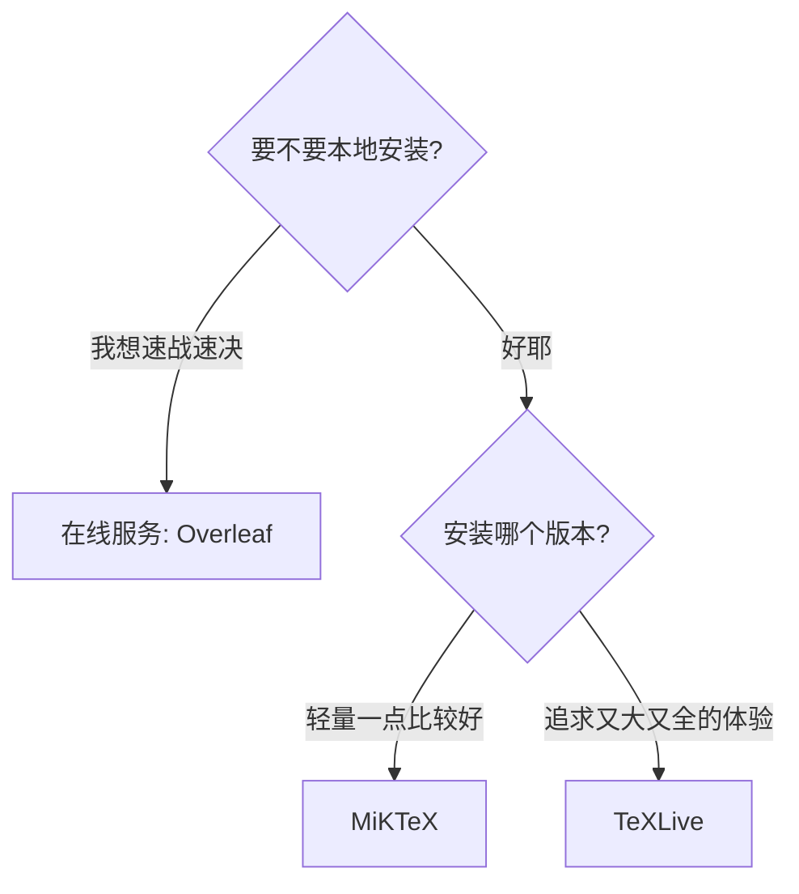

# 安装LaTeX哪个版本？

## LaTeX版本

### TeXLive
* 官方维护，首选，跨平台
* MacTeX ≈ macOS 下的 TEX Live
* 缺点:完整版体积大(7GB+)、每年需重装

### MiKTeX
* 由 Christian Schenk 维护(是个狠人)
* 宏包随用随装
* 缺点:部分细节与 TEX Live 不兼容、网络问题

:::danger
**不要安装 CTEX 套装!**
>存在严重 bug，并且完全过时
:::

## 神圣的战争⸺选择编辑器

### 专用型
* TeXworks: TEX Live 自带 <icon icon="fa-brands fa-windows" size="lg" /> <icon icon="fa-brands fa-apple" size="lg" /> <icon icon="fa-brands fa-linux" size="lg" /> 
* TeXstudio: 功能丰富，对新手友好 <icon icon="fa-brands fa-windows" size="lg" /> <icon icon="fa-brands fa-apple" size="lg" /> <icon icon="fa-brands fa-linux" size="lg" /> 
* TeXShop: MacTEX 自带 <icon icon="fa-brands fa-apple" size="lg" />
* WinEdt: 功能丰富，收费 <icon icon="fa-brands fa-windows" size="lg" />

### 通用型

* Visual Studio Code: 利益相关(逃 • Atom:听说很卡?
* Sublime Text: 收费
* Vim: 编辑器之神
* Emacs: 神之编辑器

圣战: [链接1](https://tex.stackexchange.com/questions/339/latex-editors-ides)
[链接2](https://en.wikipedia.org/wiki/Comparison_of_TeX_editors)
[链接3](https://www.zhihu.com/question/19954023)

