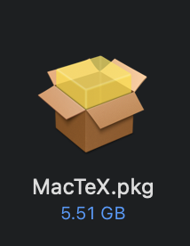
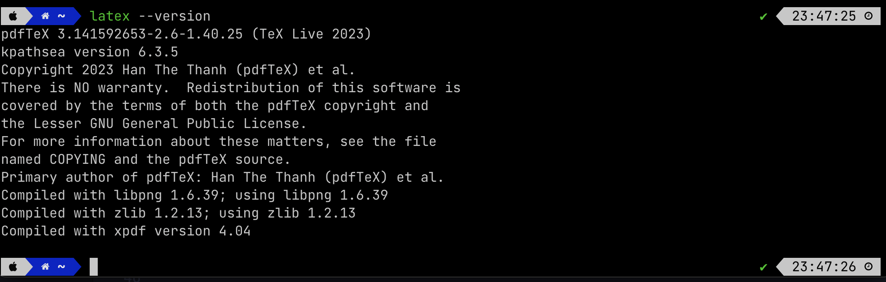

# MacOS 安装 LaTeX

:::caution

*非常重要，请仔细阅读完本文以后再进行相关操作。（因未仔细阅读完本文，出现任何错误后果自负， 逃～～～逃～～～逃*

:::

## 为啥MacOS不使用MiKTeX版本，而使用MacTeX？
最主要的原因是MiKTeX当前版本不能很好兼容Apple Silicon的芯片，而MacTeX能够很好的支持Apple Silicon芯片。

## MacTeX VS BasicTeX

- MacTeX属于大而全的版本，包括了LaTeX所需要用到的所有宏包和库。
- BasicTeX属于精简版本，**初学者不建议使用此版本**，需要解决本地缺失宏包和库的问题

## 安装MacTeX

### 1. MacTeX下载链接

https://mirrors.tuna.tsinghua.edu.cn/CTAN/systems/mac/mactex/MacTeX.pkg


### 2. MacTeX安装

### 3. 安装

双击已下载好的安装包



### 4. 检查安装是否成功

请在命令行中输入如下命令：

```sh
latex --version
```

若安装成功，终端显示 LaTeX 的版本信息（如下图）。

