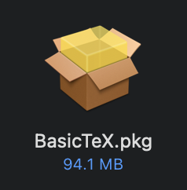

# MacOS 安装 LaTeX

:::caution

*非常重要，请仔细阅读完本文以后再进行相关操作。（因未仔细阅读完本文，出现任何错误后果自负， 逃～～～逃～～～逃*

:::

## 为啥MacOS不使用MiKTeX版本，而使用MacTeX？
最主要的原因是MiKTeX当前版本不能很好兼容Apple Silicon的芯片，而MacTeX能够很好的支持Apple Silicon芯片。

## MacTeX VS BasicTeX

- MacTeX属于大而全的版本，包括了LaTeX所需要用到的所有宏包和库。
- BasicTeX属于精简版本，**初学者不建议使用此版本**，需要解决本地缺失宏包和库的问题

## 安装MacTeX

### 1. MacTeX下载链接

https://mirrors.tuna.tsinghua.edu.cn/CTAN/systems/mac/mactex/MacTeX.pkg


### 2. MacTeX安装

### 3. 安装

双击已下载好的安装包


### 4. 检查安装是否成功

请在命令行中输入如下命令：

```sh
latex --version
```

若安装成功，终端显示 LaTeX 的版本信息（如下图）。


## 安装BasicTeX

### 1. BasicTeX下载链接
https://mirrors.tuna.tsinghua.edu.cn/CTAN/systems/mac/mactex/BasicTeX.pkg

### 2. 安装

双击已下载好的安装包



### 3. 检查安装是否成功

请在命令行中输入如下命令：

```sh
latex --version
```

若安装成功，终端显示 LaTeX 的版本信息（如下图）。


### 4. 宏包缺失怎么解决？

BasicTex是轻量化的版本，所以如果使用中发现一些工具不存在，命令行报错“multirow.sty not found”，那你可以直接安装这个缺失的模块。例如：

```sh
sudo tlmgr install multirow
```

:::info
tlmgr是BasicTeX自带的宏包管理工具，类似MacOS上的Homebrew。tlmgr[介绍](https://github.com/syvshc/tlmgr-intro-zh-cn)
:::

### 5. tlmgr中国加速
由于众所周知的原因，在中国大陆访问默认的LaTeX远程宏包管理库非常慢，因此需要选择中国大陆的官方镜像源。

```sh
sudo tlmgr option repository https://mirrors.ustc.edu.cn/CTAN/systems/texlive/
```
这样使用tlmgr安装缺失的宏包的速度会起飞。


## Perl环境安装

由于有部分LaTeX宏包依赖Perl，所以需要在MacOS上安装Perl环境。安装命令如下：

```bash
brew install perl
```