# 在线版的LaTeX编辑器——Overleaf
本文参考
- https://ri0016.github.io/Overleaf-zh/

:::caution

*非常重要，请仔细阅读完本文以后再进行相关操作。（因未仔细阅读完本文，出现任何错误后果自负， 逃～～～逃～～～逃*

:::

[OverLeaf](https://cn.overleaf.com/)是一款在线的LaTeX编辑器，它提供了很多非常强大的功能。借助Overleaf,你可以实现多人合作编辑,无缝同步进度,追踪文件修改历史等功能。本节简单介绍了Overleaf的一些功能以及如何使用Overleaf来导入和使用本课程的报告模板。

## 文件同步
不说多人合作的情况,就自己一个人的话,可能也会有多台设备.在多台设备之间同步文章撰写进度,需要网盘或者随身带u盘。
Overleaf利用网页技术,可以很方便的实现不同账户、不同设备之间的文件进度同步。

## 多人合作
多人合作的项目需要购买套餐。收到别人的项目邀请后,进入项目[列表界面](https://cn.overleaf.com/project)，会看到横幅通知: 

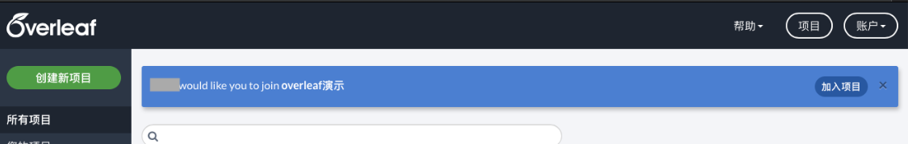

点击加入即可。之后这个项目会被归类到左侧与您共享的分类下。这时每个人的修改会被实时添加到项目中。

## 历史版本和修改记录
我们在写论文时,需要进行备份。比如最后论文完成时，可能会产生很多中间文件:XX第一版、XX第一版修改后…

这些Overleaf都可以帮我们保存,而且还可以实现类似Word修订模式的修改记录。但是免费账户只能查看24h内的记录，订阅后，可以保留项目的所有历史版本，可以对比不同版本的差别(包括文件目录以及tex源文件)。对于重要的版本，可以添加标签，方便后续查看。

## 新建一个项目
通过国内的[OverLeaf](https://cn.overleaf.com/)可以很轻松的注册以及订阅Overleaf，注册完成并登录后我们可以看到如下页面

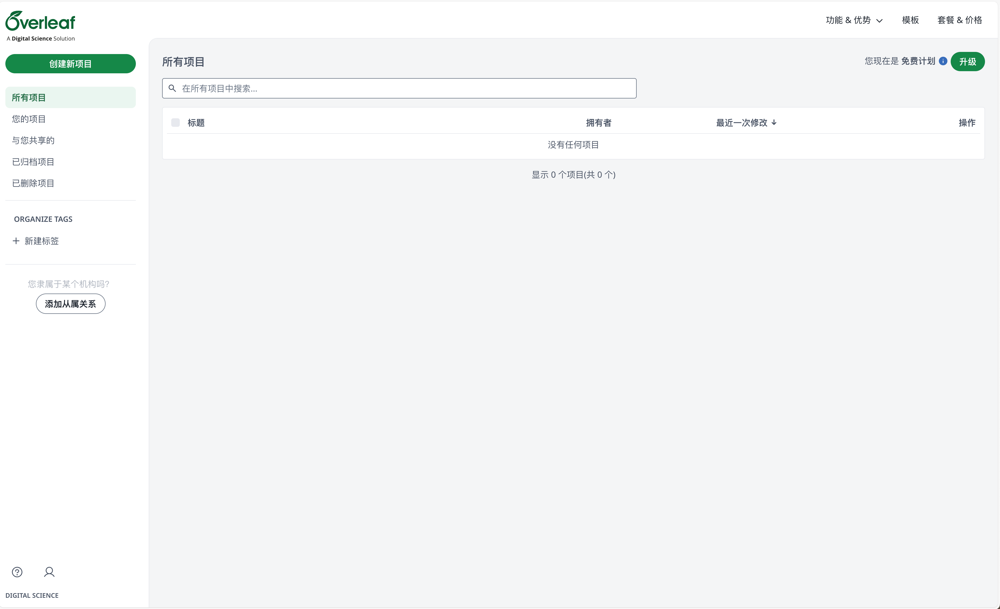

点击创建新项目

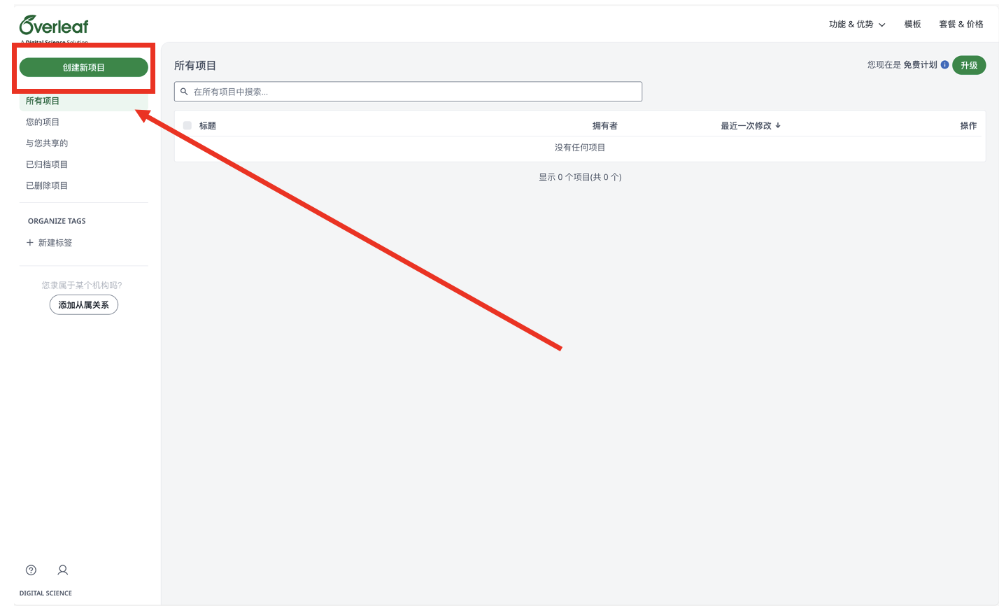

选择空白项目

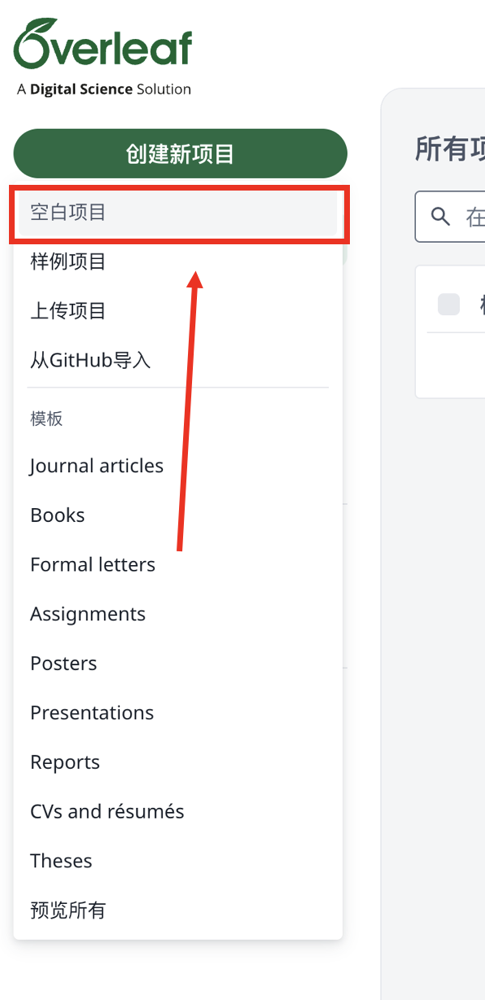

输入项目名称，并点击创建

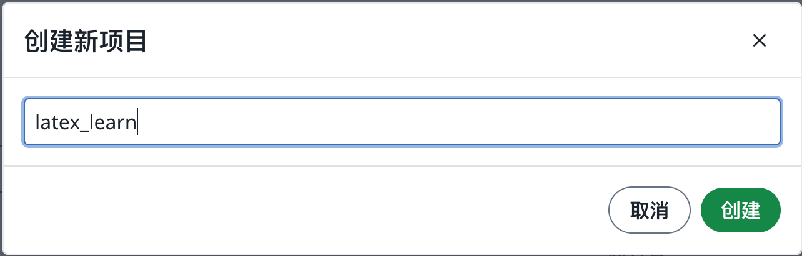

于是我们完成新建一个项目，并且进入Overleaf的编辑界面

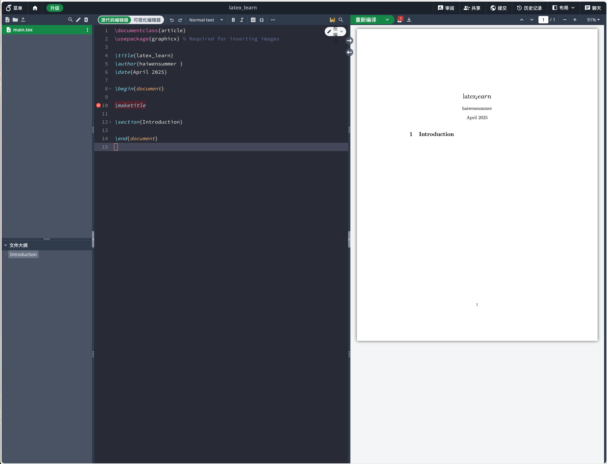

通常我们选择的是中文文档制作，因此需要更换LaTeX的编译器，Overleaf默认的编译器是pdfLaTeX，我们需要更换为XeLaTeX。
点击左上角的菜单

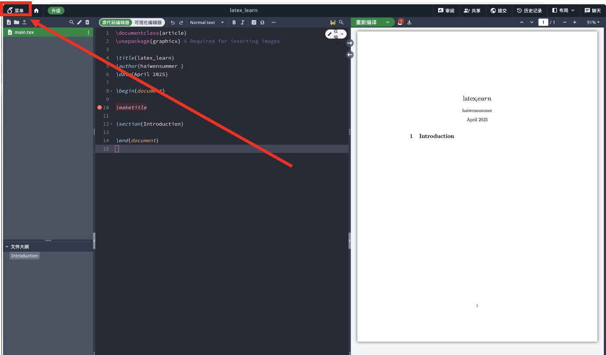

然后选择编译器为XeLaTeX

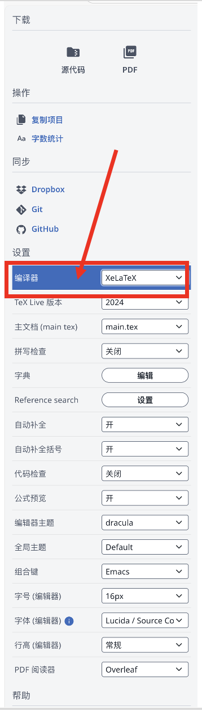

讲如下代码在Overleaf的源代码编辑界面中输入

```latex
\documentclass{ctexart}
\usepackage{graphicx} % Required for inserting images

\title{latex_learn}
\author{SUEP }
\date{April 2025}

\begin{document}

\maketitle

\section{Introduction}

 你好世界!

\end{document}
```

点击重新编译，便可在Overleaf的右侧看到编译后的pdf文件
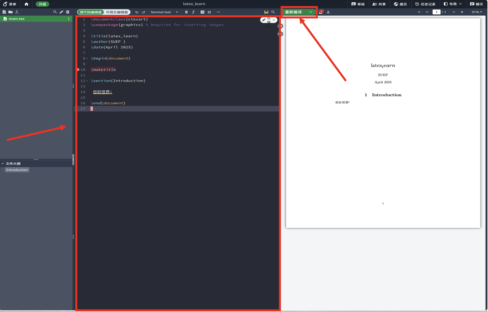

## 如何在项目中新建一个LaTeX文件
在Overleaf的左侧目录树中，点击新建文件

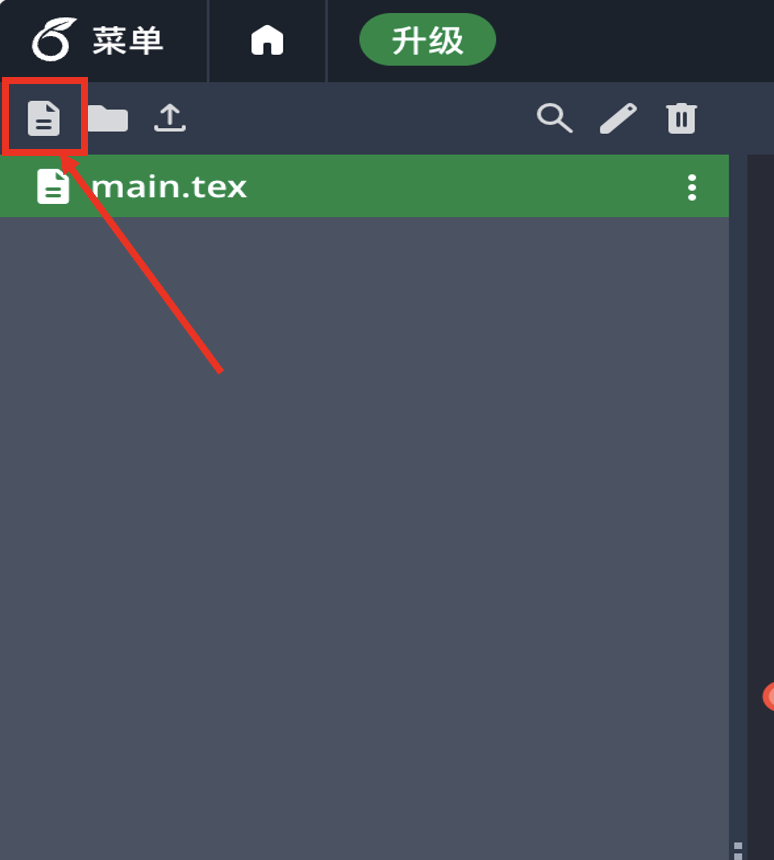

在弹出的对话框中，输入文件名，点击创建

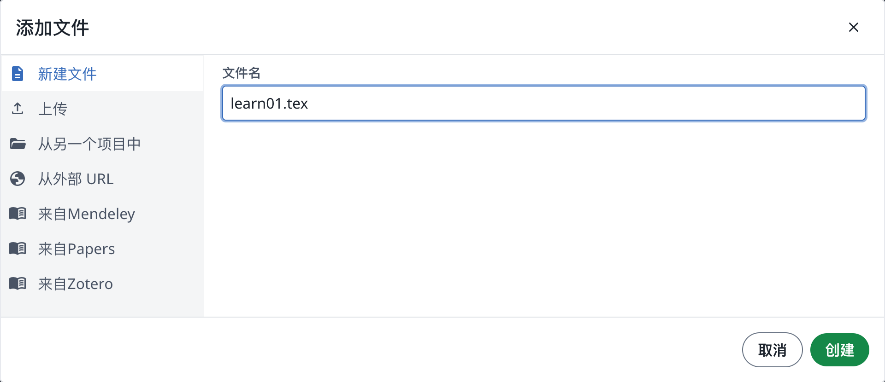

此时，Overleaf会自动在项目中新建一个LaTeX文件

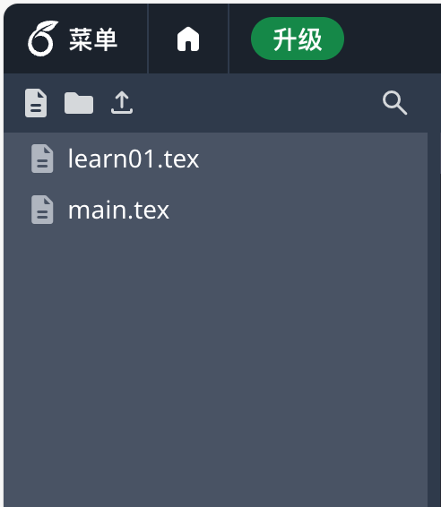

选择 `learn01.tex`的文件, 输入如下代码：

```latex
\documentclass{ctexart}

\title{latex_learn}
\author{SUEP }
\date{April 2025}

\begin{document}

\maketitle

\begin{equation}
    E = mc^2
\end{equation}

\end{document}

```
点击重新编译，便可在Overleaf的右侧看到编译后的pdf文件
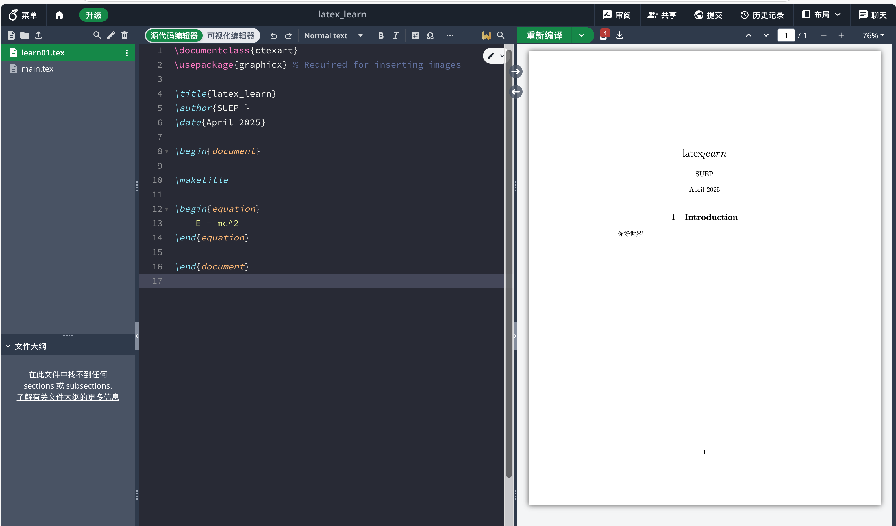