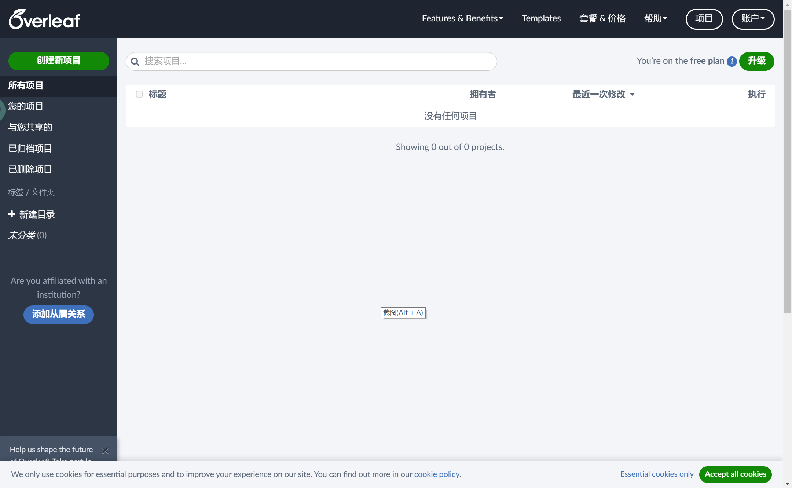
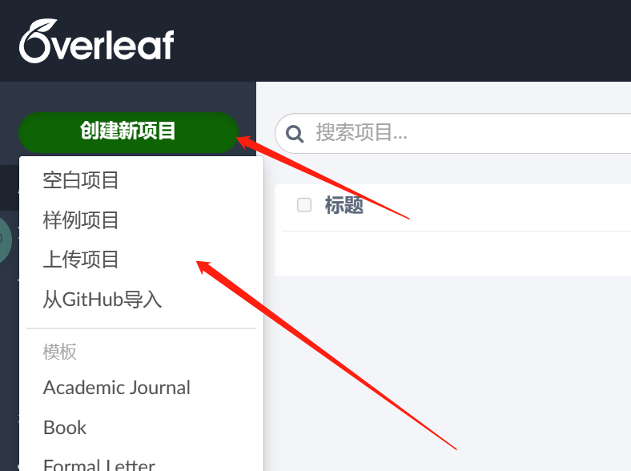

# 在线版的LaTeX编辑器——Overleaf
本文参考
- https://ri0016.github.io/Overleaf-zh/

:::caution

*非常重要，请仔细阅读完本文以后再进行相关操作。（因未仔细阅读完本文，出现任何错误后果自负， 逃～～～逃～～～逃*

:::

[OverLeaf](https://cn.overleaf.com/)是一款在线的LaTeX编辑器，它提供了很多非常强大的功能。借助Overleaf,你可以实现多人合作编辑,无缝同步进度,追踪文件修改历史等功能。本节简单介绍了Overleaf的一些功能以及如何使用Overleaf来导入和使用本课程的报告模板。

## 文件同步
不说多人合作的情况,就自己一个人的话,可能也会有多台设备.在多台设备之间同步文章撰写进度,需要网盘或者随身带u盘。
Overleaf利用网页技术,可以很方便的实现不同账户、不同设备之间的文件进度同步。

## 多人合作
多人合作的项目需要购买套餐。收到别人的项目邀请后,进入项目[列表界面](https://cn.overleaf.com/project)，会看到横幅通知: 

点击加入即可。之后这个项目会被归类到左侧与您共享的分类下。这时每个人的修改会被实时添加到项目中。

## 历史版本和修改记录
我们在写论文时,需要进行备份。比如最后论文完成时，可能会产生很多中间文件:XX第一版、XX第一版修改后…

这些Overleaf都可以帮我们保存,而且还可以实现类似Word修订模式的修改记录。但是免费账户只能查看24h内的记录，订阅后，可以保留项目的所有历史版本，可以对比不同版本的差别(包括文件目录以及tex源文件)。对于重要的版本，可以添加标签，方便后续查看。

## 导入课程模板
通过国内的[OverLeaf](https://cn.overleaf.com/)可以很轻松的注册以及订阅Overleaf，注册完成并登录后我们可以看到如下页面

当我们在下载好GitHub上的课程报告模板时([点击此处下载](https://codeload.github.com/SUEPaper/math201-latex-report/zip/refs/heads/main))，我们可以得到一个math201-latex-report-main.zip压缩包，之后我们点击左上角的创建新项目并点击上传项目

然后，将我们的math201-latex-report-main.zip压缩包拖进页面区域即可

最后，由于使用pdfLaTex编译器会报错，需要修改为XeLaTex。我们点击左上角菜单

再将编译器换为XeLaTex并重新编译即可。

本课程报告模板已将格式等信息规定好并保存在math201.cls文件里，我们只需要在main.tex文件里修改我们的信息以及完成正文部分即可，详细的编写方法可以参考[入门教程](../../category/入门教程)。

## 总结
对于以上功能，我们都可以通过本地的vscode搭建的LaTeX环境、git的版本控制以及利用GitHub来进行管理来实现，这些都是作为一名程序员最基本的能力，同样还能为我们省下订阅费。同时，更多的功能介绍大家可以参考 https://ri0016.github.io/Overleaf-zh/