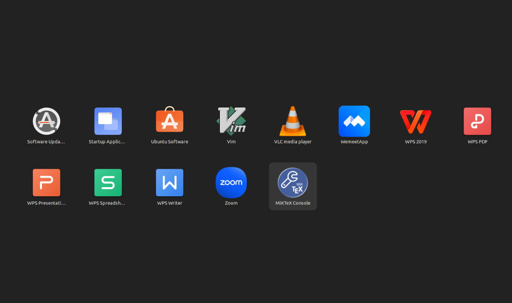
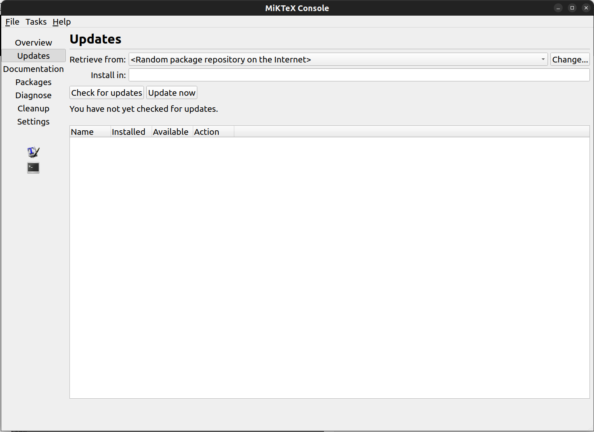
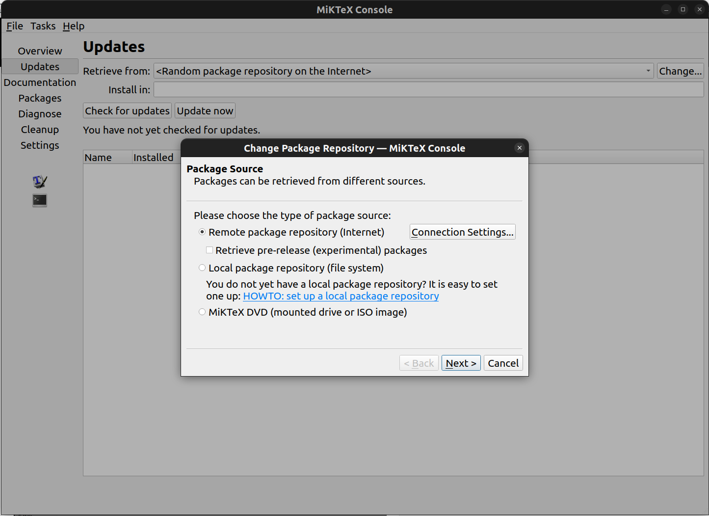
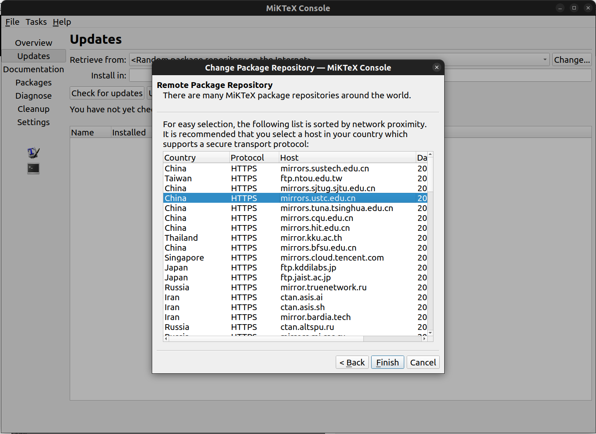

# Ubuntu Linux 安装 MiKTeX

:::caution

*非常重要，请仔细阅读完本文以后再进行相关操作。（因未仔细阅读完本文，出现任何错误后果自负， 逃～～～逃～～～逃*

:::

## MiKTeX安装

你已经是一个成熟的 Linux 用户啦，乖乖去读[官方文档](https://miktex.org/download)吧!

## MiKTeX远程仓库配置

由于众所周知的原因，在中国大陆访问默认的MiKTeX远程宏包管理库非常慢，因此要将MiKTeX的远程宏包管理库配置为中国大陆内的镜像仓库。


#### 1. 打开MiKTeX Console程序
在开始菜单栏中找到MiKTex Console程序，打开该程序。



#### 2. 配置页面01
选择 更新 -> 更改，进入宏包源配置界面。



#### 3. 配置页面02
选择 Next，进入远程宏包存储库配置界面。



#### 4. 配置页面03
选择Country为China，并且Host离你最近的仓库，这里推荐使用: mirrors.ustc.edu.cn。点击Finish，即可完成远程宏包管理库的配置



## Perl环境安装

由于有部分LaTeX宏包依赖Perl，所以需要在Ubuntu上安装Perl环境。安装命令如下：

```bash
sudo apt install perl
```
