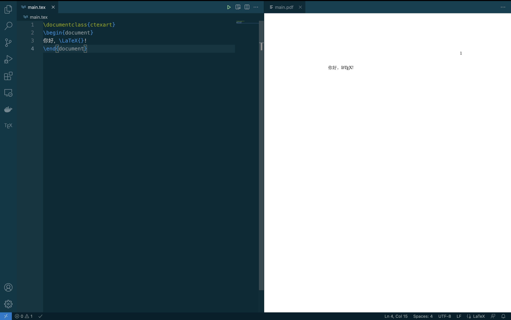
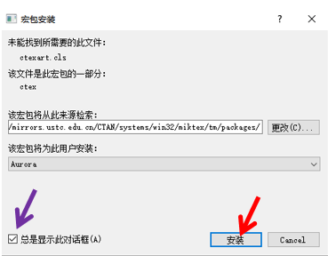

# VS Code 搭建LaTeX编辑环境

## 安装VS Code

本人强烈推荐 Microsoft Visual Studio Code 软件作为LaTeX配套的文本编辑器。

[VS Code官方下载页面](https://code.visualstudio.com/Download)

## 配置VS Code

安装完成后，打开 Visual Studio Code 应用程序，使用
快捷键 Ctrl + Shift + X（MacOS: Command + Shift + B） 打开扩展列表，在应用商店中搜索 并安装以下两个扩展

> ▶ Chinese(Simplified)

> ▶ LaTeXWorkshop

最后需要进行插件配置。使用快捷键 Ctrl + Shift + P（MacOS: Command + Shift + B）打开命令列表，输入“setting”，找到并点击“首选项:打开设置(json)”。

```json

{
    "latex-workshop.latex.autoBuild.run": "never", // 禁止保存时自动编译
    "latex-workshop.latex.recipe.default": "lastUsed", // 使用前一次的编译方法
    "latex-workshop.latex.tools": [
        {
            "name": "pdflatex",
            "command": "pdflatex",
            "args": [
                "-shell-escape",
                "-interaction=nonstopmode",
                "-file-line-error",
                "%DOCFILE%"
            ]
        },
        {
            "name": "xelatex",
            "command": "xelatex",
            "args": [
                "-synctex=1",
                "-shell-escape",
                "-interaction=nonstopmode",
                "-file-line-error",
                "%DOCFILE%"
            ]
        },
        {
            "name": "lualatex",
            "command": "lualatex",
            "args": [
                "-interaction=nonstopmode",
                "-file-line-error",
                "%DOCFILE%"
            ]
        },
        {
            "name": "latexmk",
            "command": "latexmk",
            "args": [
                "-interaction=nonstopmode",
                "%DOCFILE%"
            ]
        },
        {
            "name": "latexmk-xe",
            "command": "latexmk",
            "args": [
                "-xelatex",
                "-interaction=nonstopmode",
                "%DOCFILE%"
            ]
        },
        {
            "name": "latexmk-lua",
            "command": "latexmk",
            "args": [
                "-lualatex",
                "-interaction=nonstopmode",
                "%DOCFILE%"
            ]
        }
    ],
    "latex-workshop.latex.recipes": [
        {
            "name": "latexmk(xe)",
            "tools": [
                "latexmk-xe"
            ]
        },
        {
            "name": "latexmk(lua)",
            "tools": [
                "latexmk-lua"
            ]
        },
        {
            "name": "latexmk",
            "tools": [
                "latexmk"
            ]
        },
        {
            "name": "xelatex",
            "tools": [
                "xelatex"
            ]
        },
        {
            "name": "lualatex",
            "tools": [
                "lualatex"
            ]
        },
        {
            "name": "pdflatex",
            "tools": [
                "pdflatex"
            ]
        }
    ]
}
```

将上面内容复制到刚刚打开的文件里，保存并重启应用程序。设置完成!

## 第一个LaTeX项目

最后的最后，我们终于可以开始着手构建第一个 LaTeX 文档。找一个你喜欢的 地方新建文件夹，然后右键选择这个文件夹，点击“通过 Code 打开”。
接着，在左侧的文件列表中点击鼠标右键，新建文件，命名为 main.tex。在这 个文件里输入下面的内容:

```latex
\documentclass{ctexart} 
\begin{document}
你好，\LaTeX{}! 
\end{document}
```

接下来:
> ▶ 使用快捷键Ctrl+Alt+B（MacOS: Command + Option + B）运行编译

> ▶ 使用快捷键Ctrl+Alt+V（MacOS: Command + Option + V）查看PDF 

稍等片刻编译完成，你就会在侧栏中看到一份简单的文档。如下图所示:



恭喜通关!!!（好像事情有可能不是这样的，我们猜测你可能会遇到如下问题）

由于MiKTeX默认安装没有带 ctex 这个中文支持宏包，所以在编译时会弹出如下窗口，点击安装，MiKTeX即可自动从远程宏包管理库安装 ctex 这个宏包。



:::tip

这里可以取消勾选“总是显示此对话框”, MiKTeX会自动安装我们LaTeX项目中用到的本地没有的宏包。如果不取消勾选，则每次遇到缺失的宏包要安装时，都会弹出此界面。

:::

重新运行编译———>查看PDF，恭喜你终于**通关了！！！**