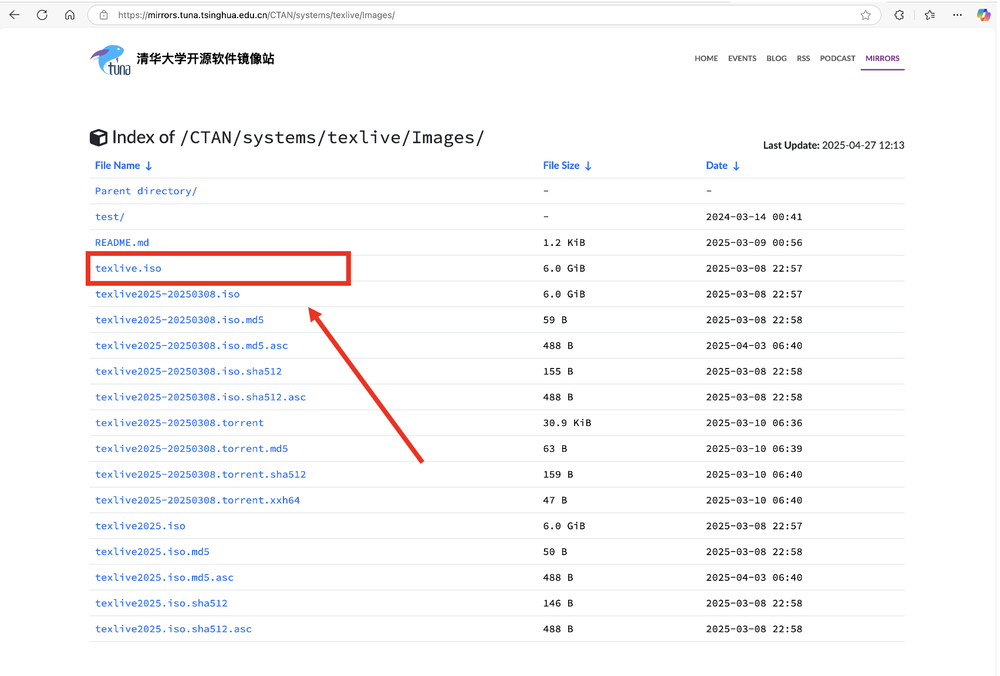
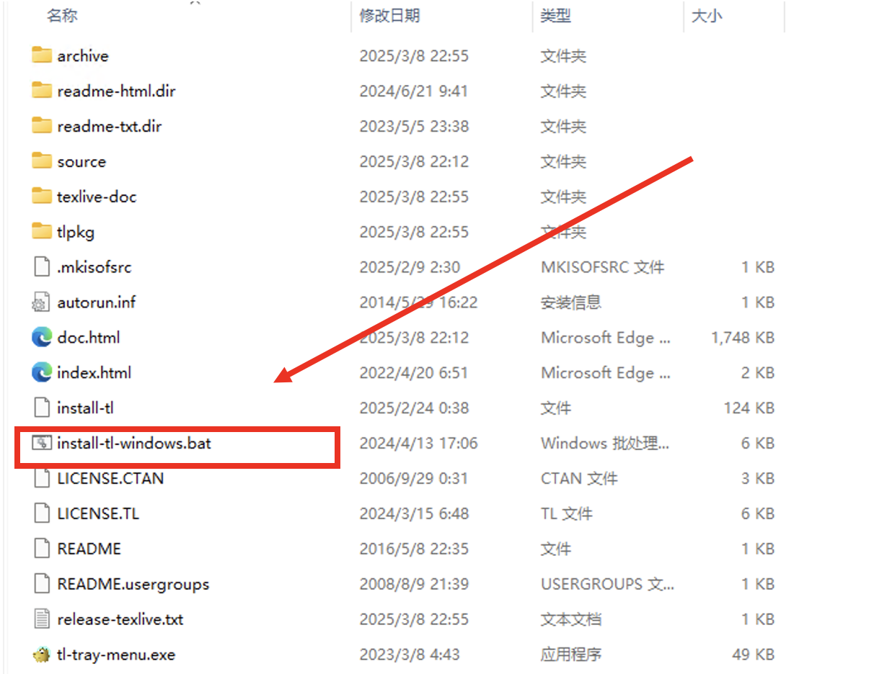
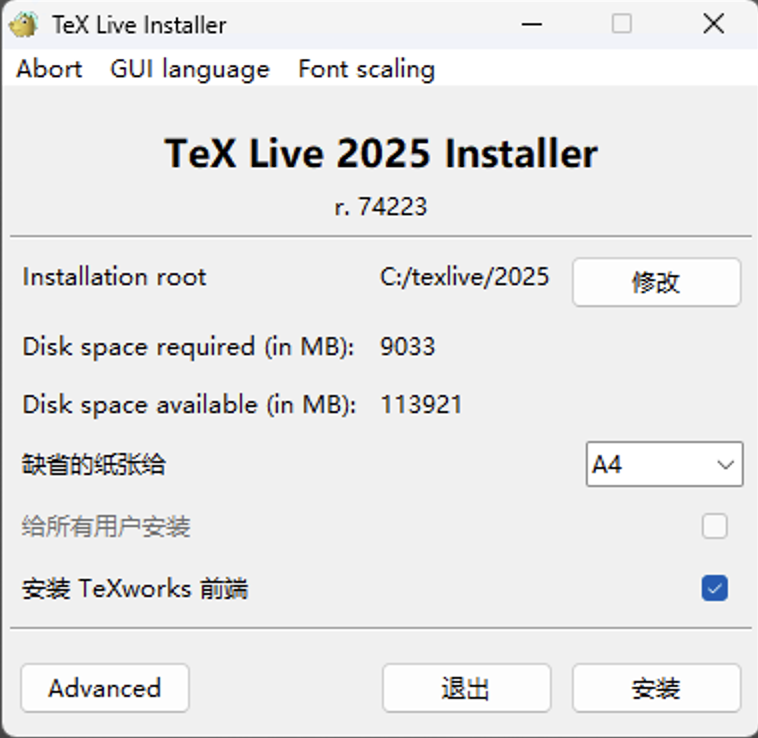
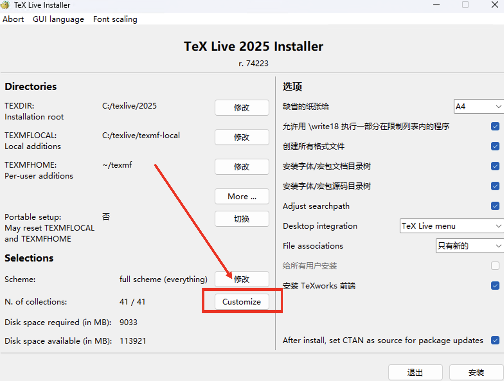
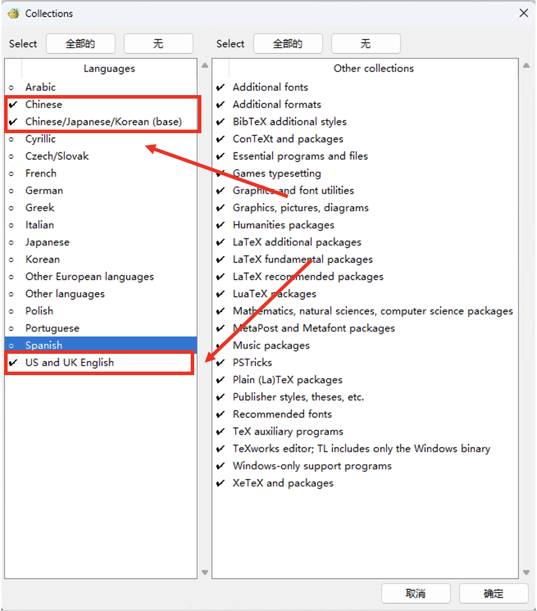
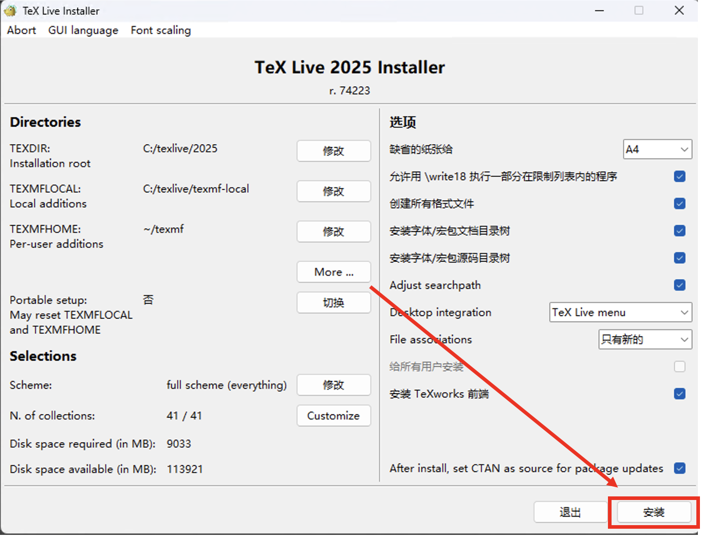
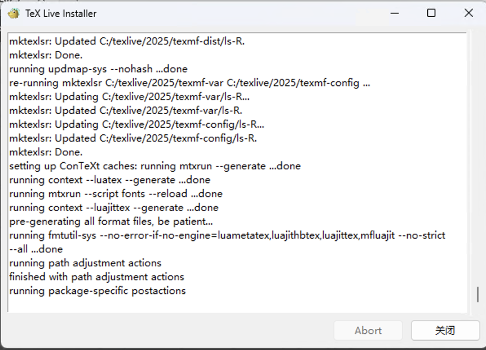
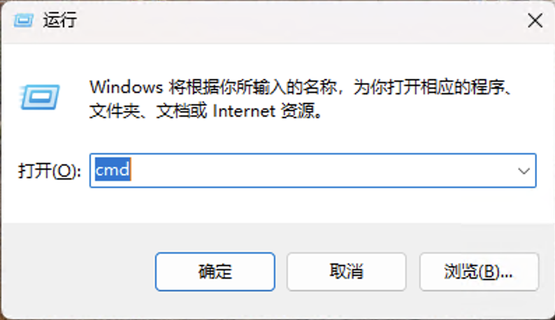
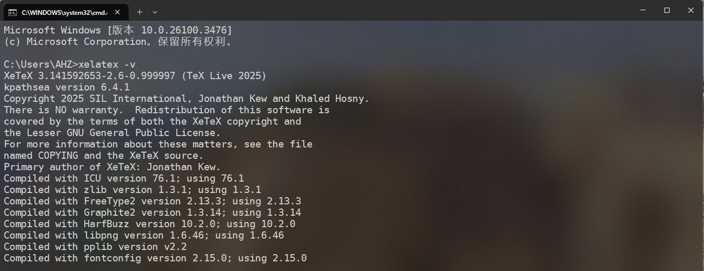

# Windows 安装 TeXLive

**待更新**

:::caution

*非常重要，请仔细阅读完本文以后再进行相关操作。（因未仔细阅读完本文，出现任何错误后果自负， 逃～～～逃～～～逃*

:::

## 下载安装包

点击TexLive使用清华镜像: https://mirrors.tuna.tsinghua.edu.cn/CTAN/systems/texlive/Images/ 进行下载。如下图所示




## 安装

1. 打开下载后的.ISO文件，如下图所示。以管理员身份运行`install-tl-windows.bat`文件。



2. 运行后的界面如下图所示。软件的安装路径默认为C盘，这里可以修改为其他磁盘。



3. 修改好软件的安装路径后，点击`Advanced`，会出现如下图所示界面。紧接着点击`Customize`



4. 由于我们只是使用中文和英文，所以为了节省存储空间，我们可以只安装中文和英文。当然你想把其他语言装上也可以。



5. 选择好语言之后，点击`安装`, 安装过程大约持续一个小时左右。



6. 安装完成后，点击`关闭`。



## 验证是否安装成功

1. 在键盘上按下`Windows+R`，出现以下界面，并输入`cmd`，点击`确定`。



2. 在弹出的界面中依次输入以下命令，如果可以看到类似下图的信息，则说明TexLive安装成功。

```bash
xelatex -v
```

