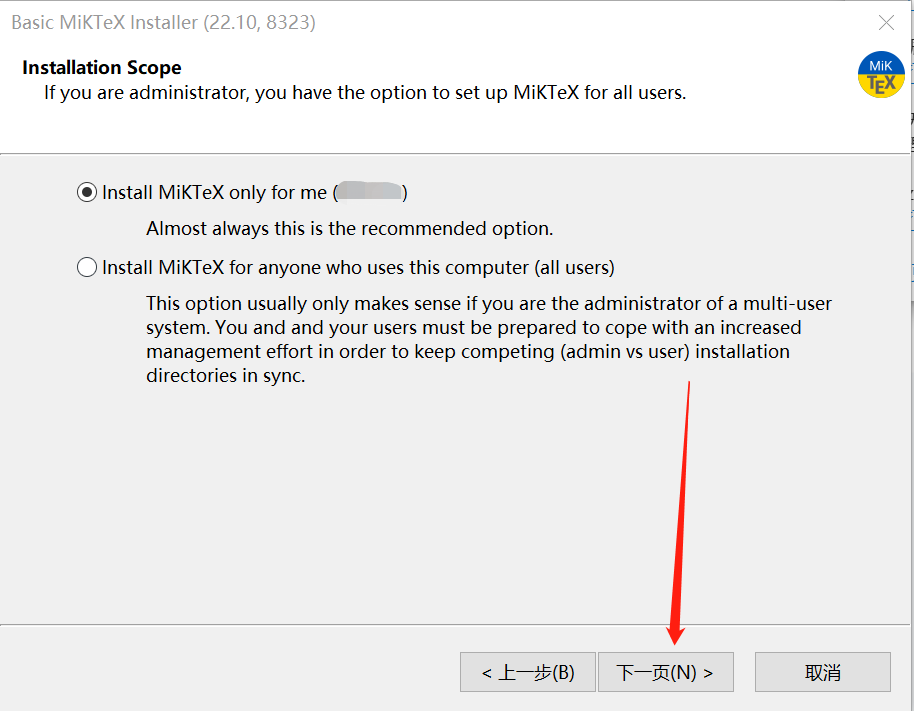

# Windows 安装 MiKTeX

## 下载安装包

MiKTex 官网下载地址为：https://miktex.org/download

点击Download，下载安装包。

## 安装

#### 1. 双击安装包, 运行安装程序

#### 2. 安装页面01
点击下一页。

#### 2. 安装页面02
选择为当前用户安装，点击下一页。

#### 3. 安装页面03
设置安装路径，推荐使用默认配置。配置结束后，点击下一页。

#### 4. 安装页面04
推荐使用默认配置。配置结束后，点击下一页。

#### 5. 安装页面05
点击Start, 开始安装。

#### 6. 安装页面06
正在安装。。。。。。

#### 7. 安装页面07
点击下一页。

#### 8. 安装页面08
推荐勾选 Check for updates now选项，点击下一页。

#### 9. 安装页面09
点击Close， 结束安装。

## MiKTeX远程仓库配置
由于众所周知的原因，在中国大陆访问默认的MiKTeX远程宏包管理库非常慢，因此要将MiKTeX的远程宏包管理库配置为中国大陆内的镜像仓库。

#### 1. 打开MiKTeX Console程序
在开始菜单栏中找到MiKTex Console程序，打开该程序。

#### 2. 配置页面01
选择 更新 -> 更改，进入宏包源配置界面。

#### 3. 配置页面02
选择 Next，进入远程宏包存储库配置界面。

#### 4. 配置页面03
选择Country为China，并且Host离你最近的仓库，这里推荐使用: mirrors.ustc.edu.cn。点击Finish，即可完成远程宏包管理库的配置

## Perl环境安装

由于有部分LaTeX宏包依赖Perl，所以需要在Windows安装Perl环境。安装过程如下：

### 下载安装包

Windows的Perl安装包下载地址：https://strawberryperl.com/

下载选择64位版本的Perl

### 安装

#### 1. 双击下载好的程序，点击`Next`

#### 2. 勾选`I accept the terms in the License Agreement`，点击`Next`

#### 3. 点击`Next`

#### 4. 点击`Install`

#### 5. 安装成功，点击`Finish`结束安装

