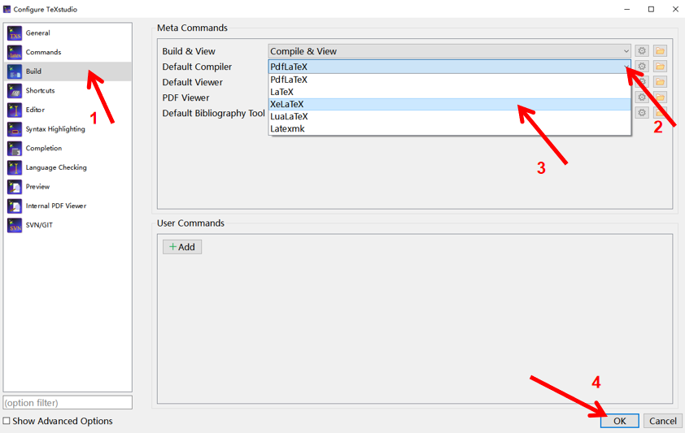

# TeXstudio 搭建Latex编辑环境

## 下载

Texstudio 官网下载地址为：https://texstudio.org

点击Download，下载安装包。


## 安装

#### 1. 运行安装程序
双击运行安装程序。


#### 2. 安装页面01
选择下一步。


#### 3. 安装页面02
选择关闭，结束安装。


## 配置XeLatex

#### 1. 打开TeXsudio
在开始菜单中找到TeXsudio, 并打开。

#### 2. 进入TeXsudio配置界面

点击 Options -> Configure TeXsudio 便可进入TeXsudio配置界面。


#### 3. 将默认编译器改为XeLaTex

点击 Build -> Default Compiler， 选择 XeLaTex。 点击 OK，完成配置



## 测试是否安装成功 & MiKTeX 缺失宏包安装

#### 1. 新建一个LaTex项目
点击新建文件图标。


#### 2. 保存LaTex文件
点击保存图标，进入保存路径设置界面，将.tex文件保存到你想保存的路径。


#### 3. 输入LaTeX代码
在TeXsudio 界面中输入以下代码: (目前的你无需懂得这段代码的意思，只是为了测试LaTex环境是否成功安装)

```latex showLineNumbers
\documentclass{ctexart}
\begin{document}
你好！\LaTeX
\end{document}
```

#### 4. 编译
点击Build & View图标或者按F5健，进行LaTeX项目编译。


#### 5. MiKTeX 缺失宏包安装
由于MiKTeX默认安装没有带 ctex 这个中文支持宏包，所以在编译时会弹出如下窗口，点击安装，MiKTeX即可自动从远程宏包管理库安装 ctex 这个宏包。


:::tip

这里可以取消勾选“总是显示此对话框”, MiKTeX会自动安装我们LaTeX项目中用到的本地没有的宏包。如果不取消勾选，则每次遇到缺失的宏包要安装时，都会弹出此界面。

:::


#### 6. 编译成功并且显示PDF
MiKTeX自动安装宏包成功后，XeLaTex会将我们的LaTeX项目编译成PDF文件，并且在右侧预览PDF文件。

