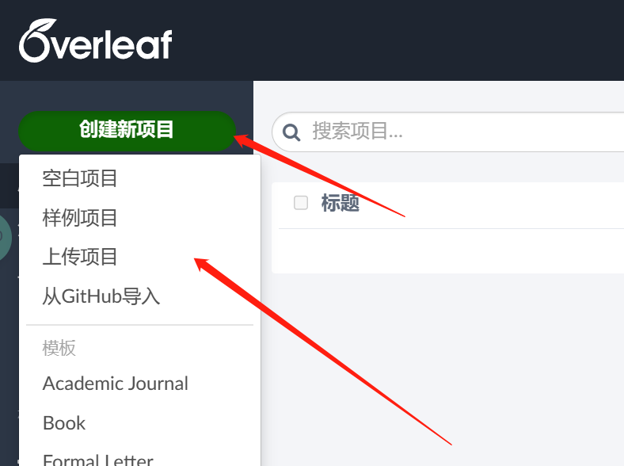
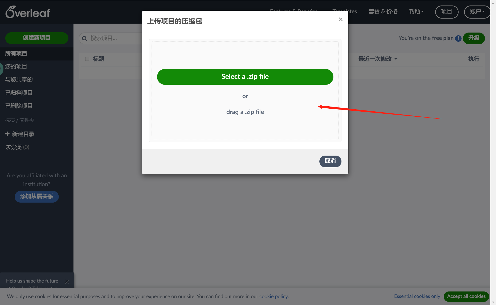
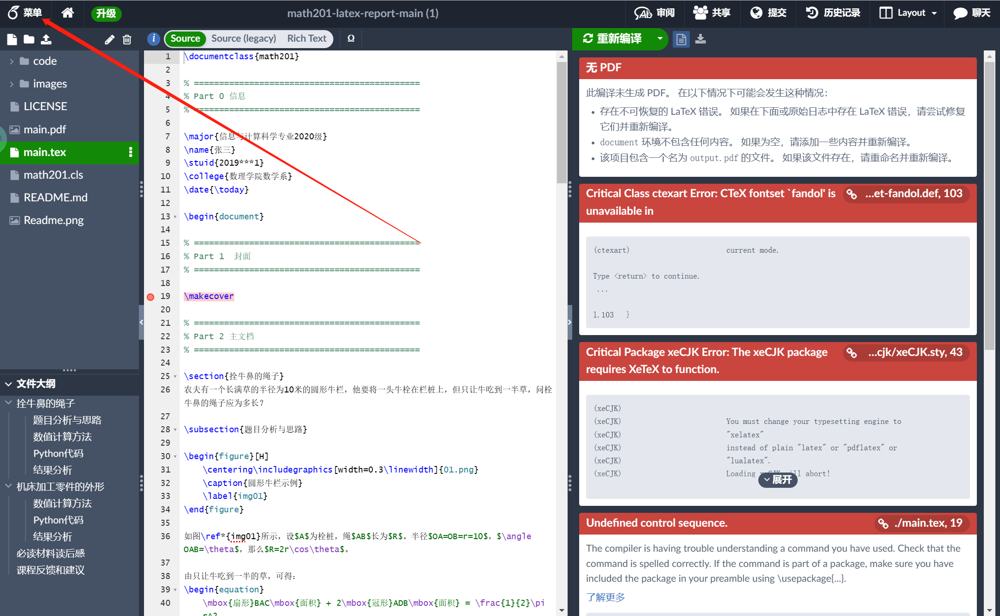
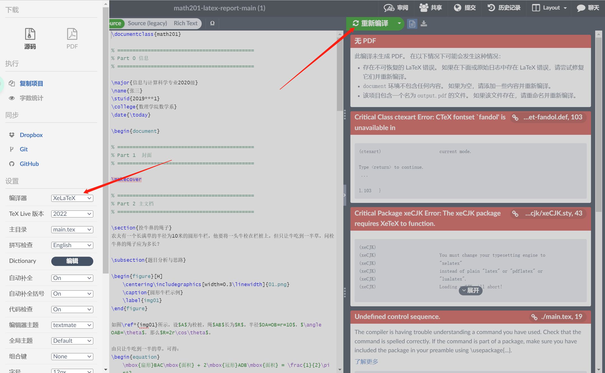
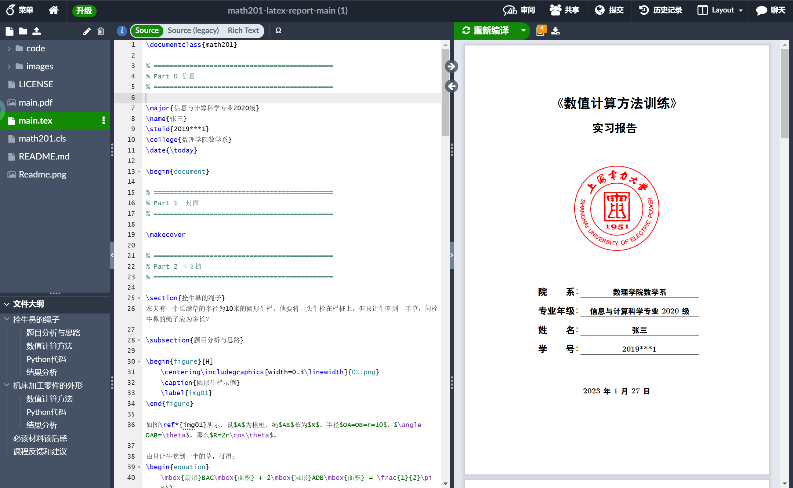

# 课程实验报告模板使用教程

上海电力大学数学系数值计算方法训练课程报告LaTeX模板下载链接：https://github.com/SUEPaper/math201-latex-report

## VS Code

## Overleaf

当我们在下载好GitHub上的课程报告模板时([点击此处下载](https://codeload.github.com/SUEPaper/math201-latex-report/zip/refs/heads/main))，我们可以得到一个math201-latex-report-main.zip压缩包，之后我们点击左上角的创建新项目并点击上传项目

然后，将我们的math201-latex-report-main.zip压缩包拖进页面区域即可

最后，由于使用pdfLaTex编译器会报错，需要修改为XeLaTex。我们点击左上角菜单

再将编译器换为XeLaTex并重新编译即可。

本课程报告模板已将格式等信息规定好并保存在math201.cls文件里，我们只需要在main.tex文件里修改我们的信息以及完成正文部分即可，详细的编写方法可以参考[入门教程](../../category/入门教程)。

