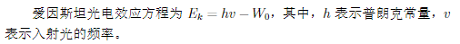
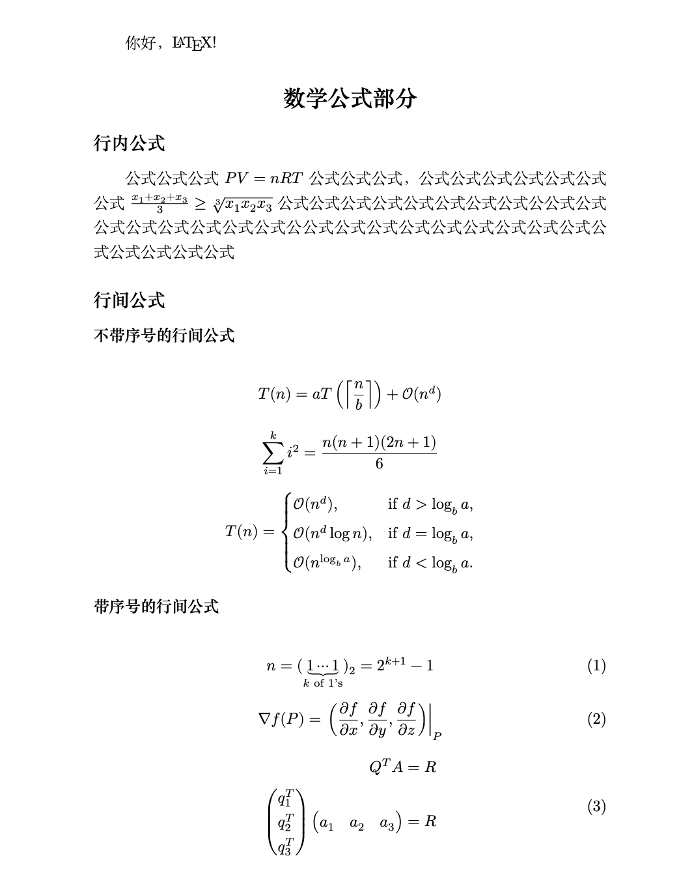

# 数学公式

LaTeX 相较于 Word 来说，对于数学公式的书写是非常非常方便的，且对于公式的管理也更加方便。本节主要介绍 LaTeX 的 3 种公式形式，更多的数学符号以及公式的书写方法我们网站还提供了[LaTeX 的数学公式大全](../math)，当然，你也可以使用该[网站](https://latex.codecogs.com/eqneditor/editor.php)进行实现。

## LaTeX 数学公式宏包

一切数学公式都要在数学模式下输入，需要引用 `amsmath` 宏包，由美国数学学会 (American Mathematical Society, AMS) 提供。而数学符号不是按钮点出来的，也不是天上掉下来的，而是有字体提供的。`unicode-math` 宏包提供了现代一揽子解决方案，它把符号、字体、样式精调都统一了。

在文件夹 `latex_learn` 中创建一个名为 `math_doc.tex` 的文件, 并在其中输入以下代码，并且编译代码:

```latex
\documentclass{ctexart}
\usepackage{amsmath}
\usepackage{unicode-math}
\begin{document}
质能方程： $E=mc^2$
\end{document}
```

## 行内公式

行内公式也就是在书写正文时需要插入的公式，将`math_doc.tex` 的代码修改如下并编译：

```latex
\documentclass{ctexart}
\usepackage{amsmath}
\usepackage{unicode-math}
\begin{document}
爱因斯坦光电效应方程为$E_k=hv-W_0$，其中，$h$表示普朗克常量，$v$表示入射光的频率。
\end{document}
```



## 行间公式

行间公式分为 2 种，一种是不带序号的行间公式，一种是带序号的行间公式。

### 不带序号的行间公式

不带序号的行间公式需要使用 `equation*` 环境来实现，将`math_doc.tex` 的代码修改如下并编译：：

```latex
\documentclass{ctexart}
\usepackage{amsmath}
\usepackage{unicode-math}
\begin{document}
爱因斯坦光电效应方程为:

\begin{equation*}
    E_k=hv-W_0
\end{equation*}

其中，$h$表示普朗克常量，$v$表示入射光的频率。
\end{document}
```


### 带序号的行间公式

带序号的行间公式需要使用 `equation` 环境来实现，带序号的行间公式可以利用 `label` 进行管理，并在正文中引用。将`math_doc.tex` 的代码修改如下并编译：

```latex
\documentclass{ctexart}
\usepackage{amsmath}
\usepackage{unicode-math}
\begin{document}
爱因斯坦光电效应方程如下式\ref{eq:peq}所示：

\begin{equation}
E_k=hv-W_0
\label{eq:peq}
\end{equation}

其中，$h$表示普朗克常量，$v$表示入射光的频率。
\end{document}
```


:::info 公式引用

`\label{eq:peq}` 这个命令用于给公式打标签，相当于给它起了个名字叫 `eq:peq`。
这个标签的作用是：你可以在文中其他地方通过 `\ref{eq:peq}` 来引用这个公式的编号。注意：`\label{}` 必须写在 `\begin{equation}...\end{equation}` 环境内部，通常放在公式的末尾，这样才能正确关联公式编号。

`\ref{eq:peq}`这个命令表示：引用编号为 `eq:peq` 的公式的编号。编译后，`\ref{eq:peq}` 会被自动替换为该公式的实际编号（如 (1)、(2) 等，取决于你所在文档中的编号顺序）。

:::

## 多行公式
多行公式的实现方式有 2 种，一种是使用 `align` 环境，另一种是使用 `gather` 环境。
### 使用 `align` 环境
`align` 环境可以让你在一行中输入多个公式，每个公式都有自己的编号。
将`math_doc.tex` 的代码修改如下并编译：
```latex
\documentclass{ctexart}
\usepackage{amsmath}
\usepackage{unicode-math}
\begin{document}
\begin{align}
    \begin{split}
        \frac{\partial u}{\partial x} &= \frac{\partial v}{\partial y} \\
        \frac{\partial v}{\partial y} &= -\frac{\partial u}{\partial x}
    \end{split}
\end{align}
\end{document}
```

### 使用 `gather` 环境
`gather` 环境可以让你在多行中输入多个公式，每个公式都有自己的编号。
将`math_doc.tex` 的代码修改如下并编译：
```latex
\documentclass{ctexart}
\usepackage{amsmath}
\usepackage{unicode-math}
\begin{document}
\begin{gather}
    \frac{\partial u}{\partial x} = \frac{\partial v}{\partial y} \\        
    \frac{\partial v}{\partial y} = -\frac{\partial u}{\partial x}
\end{gather}
\end{document}
```

### 分段函数
分段函数可以用`cases`环境来实现，它必须包含在数学环境之内。
将`math_doc.tex` 的代码修改如下并编译：
```latex
\documentclass{ctexart}
\usepackage{amsmath}
\usepackage{unicode-math}
\begin{document}
\begin{equation}
    f(x) =      
    \begin{cases}
        x^2, & \text{if } x > 0 \\
        0, & \text{if } x = 0 \\
        -x^2, & \text{if } x < 0
    \end{cases}   
\end{equation}
\end{document}
```

## 数学符号

### 上标和标

- 上标（Powers）使用 `^` 来表示，比如 `$n^2$` 生成的效果为 $n^2$。
- 下标（Indices）使用 `_` 表示，比如 `$2_a$` 生成的效果为 $2_a$。

如果上标或下标的内容包含多个字符，请使用花括号包裹起来。比如 `$b_{a-2}$` 的效果为 $b_{a-2}$。

### 分数

分数使用 `\frac{numerator}{denominator}` 命令插入。比如 `$\frac{a}{3}$` 的生成效果为

$\frac{a}{3}$

分数可以嵌套。比如 `$\frac{y}{\frac{3}{x}+b}$` 的生成效果为

$\frac{y}{\frac{3}{x}+b}$

### 根号

我们使用 `\sqrt{...}` 命令插入根号。省略号的内容由被开根的内容替代。如果需要添加开根的次数，使用方括号括起来即可。

例如 `$\sqrt{y^2}$` 的生成效果为

$\sqrt{y^2}$

而 `$\sqrt[x]{y^2}$` 的生成效果为

$\sqrt[x]{y^2}$

### 求和与积分

使用 `\sum` 和 `\int` 来插入求和式与积分式。对于两种符号，上限使用 `^` 来表示，而下限使用 `_` 表示。

`$\sum_{x=1}^5 y^z$` 的生成效果为

$\sum_{x=1}^5y^z$

而 `$\int_a^b f(x)$` 的生成效果为

$\int_a^b f(x)$

### 极限
使用 `\lim` 来插入极限。
`$\lim_{x\to 0} \frac{1}{x}$` 的生成效果为
$\lim_{x\to 0} \frac{1}{x}$
### 微分

使用 `\frac{\partial f}{\partial x}` 来插入微分。
`$\frac{\partial f}{\partial x}$` 的生成效果为

$\frac{\partial f}{\partial x}$

### 偏导数
使用 `\frac{\partial f}{\partial x}` 来插入偏导数。
`$\frac{\partial f}{\partial x}$` 的生成效果为

$\frac{\partial f}{\partial x}$


### 矩阵

`amsmath` 的 `pmatrix`, `bmatrix`, `Bmatrix`, `vmatrix`, `Vmatrix` 等环境可以在矩阵两边加上各种分隔符。使用 `smallmatrix` 环境，可以生成行内公式的小矩阵。


将`math_doc.tex` 的代码修改如下并编译：
```latex
\documentclass{ctexart}
\usepackage{amsmath}
\usepackage{unicode-math}
\begin{document}
    \begin{equation}
        \begin{pmatrix} a&b\\c&d \end{pmatrix} \quad
        \begin{bmatrix} a&b\\c&d \end{bmatrix} \quad
        \begin{Bmatrix} a&b\\c&d \end{Bmatrix} \quad
        \begin{vmatrix} a&b\\c&d \end{vmatrix} \quad
        \begin{Vmatrix} a&b\\c&d \end{Vmatrix} 
    \end{equation}

    Marry has a little matrix $ ( \begin{smallmatrix} a&b\\c&d \end{smallmatrix} ) $.
\end{document}
```

## 数学公式案例

在文件夹 `latex_learn` 中创建一个名为 `math_example_doc.tex` 的文件, 并在其中输入以下代码，并且编译代码:

```latex

\documentclass{ctexart}
\usepackage{amsmath}
\usepackage{unicode-math}
\begin{document}
你好，\LaTeX{}!

\section*{数学公式部分}

\subsection*{行内公式}

公式公式公式$PV=nRT$公式公式公式，公式公式公式公式公式公式公式
$\frac{x_{1}+x_{2}+x_{3}}{3}\geq \sqrt[3]{x_{1}x_{2}x_{3}}$
公式公式公式公式公式公式公式公式公公式公式公式公式公式公式公式
公式公公式公式公式公式公式公式公式公式公式公式公式公式公式公式

\subsection*{行间公式}

\subsubsection*{不带序号的行间公式}

\begin{equation*}
    T(n) = aT\left(\left\lceil\frac{n}{b}\right\rceil\right) + \mathcal{O}(n^d)
\end{equation*}

\begin{equation*}
    \sum_{i=1}^ki^2=\frac{n(n+1)(2n+1)}{6}
\end{equation*}

\begin{equation*}
    T(n) = \begin{cases}
        \mathcal{O}(n^d),&\textrm{if } d>\log_b a, \\
        \mathcal{O}(n^d\log n), &\textrm{if } d=\log_b a,\\
        \mathcal{O}(n^{\log_b a}), &\textrm{if } d<\log_b a.
      \end{cases}
\end{equation*}

\subsubsection*{带序号的行间公式}

\begin{equation}
    n=(\underbrace{1\cdots 1}_{k\text{ of 1's}})_2=2^{k+1}-1
\end{equation}

\begin{equation}
    \nabla f (P)= \left.\left(\frac{\partial f}{\partial x},\frac{\partial f}{\partial y},\frac{\partial f}{\partial z}\right)\right|_{P}
\end{equation}

\begin{equation}
    \begin{aligned}
        Q^{T}A&=R \\
        \begin{pmatrix}
          q_1^T \\ q_2^T \\ q_3^T
        \end{pmatrix}
        \begin{pmatrix}
          a_1 & a_2 & a_3
        \end{pmatrix}
        &=R
    \end{aligned}
\end{equation}

\end{document}

```

效果：


