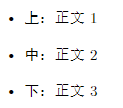
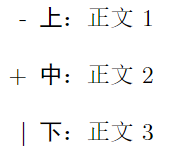
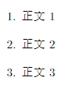
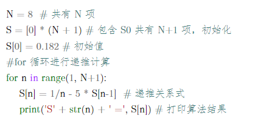
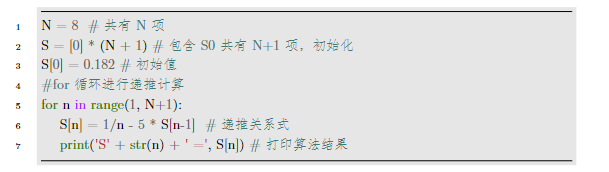

# 其他
本节会将一些杂乱的东西补充一下

## 局部字体和字号和颜色
在导言区我们设置了全局字体，现在我们学习如何改变局部的字体。我们可以通过{}来将我们需要设定的局部内容框起来，使用方法如下：
```latex
\songti{正文} % 宋体
\heiti{正文} % 黑体
\fangsong{正文} % 仿宋
\kaishu{正文} % 楷书
\lishu{正文} % 隶属
\youyuan{正文} % 圆体
\yahei{正文} % 微软雅黑
\textbf{正文} % 粗体
\underline{正文} % 下划线
```

对于字号而言，可以使用如下方法：
```latex
\zihao{-2} % 小二
\zihao{4} % 四号
```


| LaTeX字号 | 字体大小 |
|:----------|:----------|
|`\zihao{0}`| 初号 |
|`\zihao{-0}`| 小初号 |
|`\zihao{1}`| 一号 |
|`\zihao{-1}`| 小一号 |
|`\zihao{2}`| 二号 |
|`\zihao{-2}`| 小二号 |
|`\zihao{3}`| 三号 |
|`\zihao{-3}`| 小三号 |
|`\zihao{4}`| 四号 |
|`\zihao{-4}`| 小四号 |
|`\zihao{5}`| 五号 |
|`\zihao{-5}`| 小五号 |
|`\zihao{6}`| 六号 |
|`\zihao{-6}`| 小六号 |
|`\zihao{7}`| 七号 |
|`\zihao{8}`| 八号 |


对于颜色而言，需要添加color宏包，使用方法如下：
```latex
{\color{red} 正文} %可选项red，blue，green，yellow，magenta，white，black
```

当然，我们可以利用{}将字体和字号和颜色结合使用，方法如下：
```latex
{\zihao{3}\color{red}\heiti{正文}} % 红色黑体3号字
```

## 列表
### 无序列表
对于无序列表，可以利用itemize环境来实现：
```latex
\begin{itemize}
\item \textbf{上}：正文1
\item \textbf{中}：正文2
\item \textbf{下}：正文3
\end{itemize}
```


当然 如果我们不想用·来作为编号，我们可以使用如下方法进行修改：
```latex
\begin{itemize}
\item[-] \textbf{上}：正文1
\item[+] \textbf{中}：正文2
\item[|] \textbf{下}：正文3
\end{itemize}
```


### 有序列表
对于有序列表，我们需要导入enumerate宏包，使用方法如下：
```latex
\begin{enumerate}
	\item 正文1
	\item 正文2
    \item 正文3
\end{enumerate}
```


## 取消缩进
可以使用\noindent命令，方法如下：
```latex
\documentclass[UTF8,12pt,a4paper]{ctexart}
\begin{document}
\noindent 正文

正文
\end{document}
```


## 空行
对于空行，我们可以使用空格来代替，并通过换行或分段来来实现，方法如下：
```latex
\documentclass[UTF8,12pt,a4paper]{ctexart}
\begin{document}
正文\\
{ }\\
正文\\ % 不换段空行
{ }\\
{ }\par
正文 % 换段空2行
\end{document}
```


## 代码环境
使用代码环境，需要引入宏包minted，并将language设置成目标语言类型，方法如下：
```latex
\begin{minted}{python}
N = 8  #共有N项
S = [0] * (N + 1) #包含S0共有N+1项，初始化
S[0] = 0.182 #初始值
#for循环进行递推计算
for n in range(1, N+1):
    S[n] = 1/n - 5 * S[n-1]  #递推关系式
    print('S' + str(n) + ' =', S[n]) #打印算法结果
\end{minted}
```


同样的，为了使我们的代码更加好看，我们可以使用xcolor宏包并在导言区进行一些配置来完成，方法如下：
```latex
\begin{minted}
[
    frame=lines,
    framesep=2mm,
    baselinestretch=1.2,
    bgcolor=LightGray,
    fontsize=\footnotesize,
    linenos
]
{python}
N = 8  #共有N项
S = [0] * (N + 1) #包含S0共有N+1项，初始化
S[0] = 0.182 #初始值
#for循环进行递推计算
for n in range(1, N+1):
    S[n] = 1/n - 5 * S[n-1]  #递推关系式
    print('S' + str(n) + ' =', S[n]) #打印算法结果
\end{minted}
```


我们也可以直接通过导入代码文件的方式进行引入，方法如下：
```latex
\inputminted[
    frame=lines,
    framesep=2mm,
    baselinestretch=1.2,
    fontsize=\small,
    linenos
]{python}{代码文件名} % 我们也可以利用路径{代码文件夹/代码文件名}的方式导入
```


本文参考
- https://duter2016.github.io/2020/08/09/LaTeX%E6%8E%92%E7%89%88%E5%9F%BA%E7%A1%80%E8%AF%AD%E6%B3%95/

导言区即为了设定文档的排版格式，由于本教程为入门教程，是为了快速入门使用后面的模板，因此不在此过多阐述导言区的内容，感兴趣的可以自由探索。

## 文档类型
CTEX 宏集提供了四个中文文档类：ctexart、ctexrep、ctexbook 和 ctexbeamer。

|文档类|文档类型|特点|
|:----|:----|:----|
|ctex|短文，学术论文|无左右页区分，无章设置|
|ctexbook|著作，书|默认有左右页区分，章起右页|
|ctexrep|报告|默认无左右页区分，章起新页|
|ctexbeamer|幻灯片|提供多种主题式样，可方便更改幻灯片的整体风格|

不同文档类对应的格式不一样，而我们通常利用ctexart文档类进行文章排版。使用方法如下：
```latex
\documentclass{文档类型} 
```
同样的，我们也可以在此设置文章中最基本的格式，如编码方式，纸张大小，正文字体大小等，方法如下：
```latex
\documentclass[UTF8,12pt,a4paper]{ctexart}
```

## 宏包
latex的宏包就类似于python的库，旨在扩展或提供LaTeX的某一特定功能，以便利用户使用，使用方法如下：
```latex
\usepackage{宏包}
```

对于宏包的使用就非常丰富了，而本文旨在帮助大家快速入门，使用后面提供的模板完成课程报告，因此我们不做过多阐述。

通常我们需要设置中文和英文的字体可以使用如下宏包继续设置，且在导言区设置的字体将是全局的
```latex
\usepackage{fontspec} % 中文字体宏包
\setmainfont{SimSun} % 设置为宋体
\usepackage{times} %使得英文默认字体都是Times New Roman
```

## 注意事项
该点是为了说明一些latex的内置的基本规则，旨在帮助同学们后面写正文时防止踩坑。建议将下面代码自己手动编译一次感受区别并牢牢记住！

### 空格的使用
latex默认是忽略文字之间的空格的，如果想要使用空格，可以在设置文档类型时加入space，这样latex就不会忽略我们输入的空格，方法如下：
```latex
\documentclass[UTF8,12pt,a4paper,space]{ctexart}
```
当然，我是很不推荐这样使用space的，我们可以利用如下方法来添加空格：
```latex
\documentclass[UTF8,12pt,a4paper]{ctexart}
\begin{document}
你好啊！你好 啊！你好{ }啊！你好\ 啊！
\end{document}
```


### 换行
latex中回车是不会换行的，需要输入\\或\newline来进行换行，方法如下：
```latex
\documentclass[UTF8,12pt,a4paper]{ctexart}
\begin{document}
你好啊！\\
你好{ }啊！\newline
你好\ 啊！
\end{document}
```


### 分段
当运行了上面的代码时可以发现，第一个你好啊！是有首行缩进的，而后面两个是没有的，说明他们依旧是一个段落，如果想对他们进行分段，可以对两个段落之间空一行或使用\par进行分段
```latex
\documentclass[UTF8,12pt,a4paper]{ctexart}
\begin{document}
你好啊！\\
你好{ }啊！

你好\ 啊！\par
你好啊！
\end{document}
```


### 换页
换页只需要在你想换页的地方使用\clearpage命令即可实现。

### 特殊字符
特殊控制字符：#，$， %， & ，{， }， ^， ~，由于这些字符在latex各司其职，要输出这些控制符用下列命令：
```latex
\documentclass[UTF8,12pt,a4paper]{ctexart}
\begin{document}
\#，\$，\%，\&，\{，\}，\^{}，\~{} 
\end{document}
```
