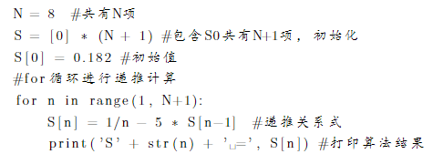
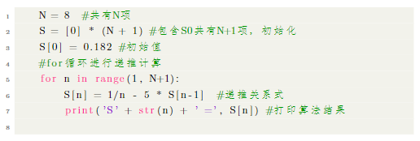

# 其他
本节会将一些杂乱的东西补充一下

## 局部字体和字号和颜色
在导言区我们设置了全局字体，现在我们学习如何改变局部的字体。我们可以通过{}来将我们需要设定的局部内容框起来，使用方法如下：
```latex
\songti{正文} % 宋体
\heiti{正文} % 黑体
\fangsong{正文} % 仿宋
\kaishu{正文} % 楷书
\lishu{正文} % 隶属
\youyuan{正文} % 圆体
\yahei{正文} % 微软雅黑
\textbf{正文} % 粗体
\underline{正文} % 下划线
```
对于字号而言，可以使用如下方法：
```latex
\zihao{-2} % 小二
\zihao{4} % 四号
```
对于颜色而言，需要添加color宏包，使用方法如下：
```latex
{\color{red} 正文} %可选项red，blue，green，yellow，magenta，white，black
```
当然，我们可以利用{}将字体和字号和颜色结合使用，方法如下：
```latex
{\zihao{3}\color{red}\heiti{正文}} % 红色黑体3号字
```

## 列表
### 无序列表
对于无序列表，可以利用itemize环境来实现：
```latex
\begin{itemize}
\item \textbf{上}：正文1
\item \textbf{中}：正文2
\item \textbf{下}：正文3
\end{itemize}
```


当然 如果我们不想用·来作为编号，我们可以使用如下方法进行修改：
```latex
\begin{itemize}
\item[-] \textbf{上}：正文1
\item[+] \textbf{中}：正文2
\item[|] \textbf{下}：正文3
\end{itemize}
```


### 有序列表
对于有序列表，我们需要导入enumerate宏包，使用方法如下：
```latex
\begin{enumerate}
	\item 正文1
	\item 正文2
    \item 正文3
\end{enumerate}
```


## 取消缩进
可以使用\noindent命令，方法如下：
```latex
\documentclass[UTF8,12pt,a4paper]{ctexart}
\begin{document}
\noindent 正文

正文
\end{document}
```


## 空行
对于空行，我们可以使用空格来代替，并通过换行或分段来来实现，方法如下：
```latex
\documentclass[UTF8,12pt,a4paper]{ctexart}
\begin{document}
正文\\
{ }\\
正文\\ % 不换段空行
{ }\\
{ }\par
正文 % 换段空2行
\end{document}
```


## 代码环境
使用代码环境，需要引入宏包listings，并将language设置成目标语言类型，方法如下：
```latex
\begin{lstlisting}[language={Python}]
N = 8  #共有N项
S = [0] * (N + 1) #包含S0共有N+1项，初始化
S[0] = 0.182 #初始值
#for循环进行递推计算
for n in range(1, N+1):
    S[n] = 1/n - 5 * S[n-1]  #递推关系式
    print('S' + str(n) + ' =', S[n]) #打印算法结果
\end{lstlisting}
```


同样的，为了使我们的代码更加好看，我们可以使用xcolor宏包并在导言区进行一些配置来完成，方法如下：
```latex
\documentclass[UTF8,12pt,a4paper]{ctexart}
\usepackage{listings}
\usepackage{fontspec} % 中文字体宏包
\setmainfont{SimSun} % 设置为宋体
\usepackage{times} %使得英文默认字体都是Times New Roman
\usepackage{xcolor}

\definecolor{codegreen}{rgb}{0,0.6,0}
\definecolor{codegray}{rgb}{0.5,0.5,0.5}
\definecolor{codepurple}{rgb}{0.58,0,0.82}
\definecolor{backcolour}{rgb}{0.95,0.95,0.92}
\lstdefinestyle{mystyle}{
    backgroundcolor=\color{backcolour},   
    commentstyle=\color{codegreen},
    keywordstyle=\color{magenta},
    numberstyle=\tiny\color{codegray},
    stringstyle=\color{codepurple},
    basicstyle=\ttfamily\footnotesize,
    breakatwhitespace=false,         
    breaklines=true,                 
    captionpos=b,                    
    keepspaces=true,                 
    numbers=left,                    
    numbersep=5pt,                  
    showspaces=false,                
    showstringspaces=false,
    showtabs=false,                  
    tabsize=2
}
\lstset{style=mystyle}

\begin{document}
\begin{lstlisting}[language={Python}]
    N = 8  #共有N项
    S = [0] * (N + 1) #包含S0共有N+1项，初始化
    S[0] = 0.182 #初始值
    #for循环进行递推计算
    for n in range(1, N+1):
        S[n] = 1/n - 5 * S[n-1]  #递推关系式
        print('S' + str(n) + ' =', S[n]) #打印算法结果
    \end{lstlisting}
\end{document}
```

