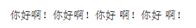

# 其他
本节会将一些杂乱的东西补充一下

## 局部字体和字号和颜色
在导言区我们设置了全局字体，现在我们学习如何改变局部的字体。我们可以通过{}来将我们需要设定的局部内容框起来，使用方法如下：
```latex
\songti{正文} % 宋体
\heiti{正文} % 黑体
\fangsong{正文} % 仿宋
\kaishu{正文} % 楷书
\lishu{正文} % 隶属
\youyuan{正文} % 圆体
\yahei{正文} % 微软雅黑
\textbf{正文} % 粗体
\underline{正文} % 下划线
```

对于字号而言，可以使用如下方法：
```latex
\zihao{-2} % 小二
\zihao{4} % 四号
```


| LaTeX字号 | 字体大小 |
|:----------|:----------|
|`\zihao{0}`| 初号 |
|`\zihao{-0}`| 小初号 |
|`\zihao{1}`| 一号 |
|`\zihao{-1}`| 小一号 |
|`\zihao{2}`| 二号 |
|`\zihao{-2}`| 小二号 |
|`\zihao{3}`| 三号 |
|`\zihao{-3}`| 小三号 |
|`\zihao{4}`| 四号 |
|`\zihao{-4}`| 小四号 |
|`\zihao{5}`| 五号 |
|`\zihao{-5}`| 小五号 |
|`\zihao{6}`| 六号 |
|`\zihao{-6}`| 小六号 |
|`\zihao{7}`| 七号 |
|`\zihao{8}`| 八号 |


对于颜色而言，需要添加color宏包，使用方法如下：
```latex
{\color{red} 正文} %可选项red，blue，green，yellow，magenta，white，black
```

当然，我们可以利用{}将字体和字号和颜色结合使用，方法如下：
```latex
{\zihao{3}\color{red}\heiti{正文}} % 红色黑体3号字
```

## 取消缩进
可以使用\noindent命令，方法如下：
```latex
\documentclass[UTF8,12pt,a4paper]{ctexart}
\begin{document}
\noindent 正文

正文
\end{document}
```


## 空行
对于空行，我们可以使用空格来代替，并通过换行或分段来来实现，方法如下：
```latex
\documentclass[UTF8,12pt,a4paper]{ctexart}
\begin{document}
正文\\
{ }\\
正文\\ % 不换段空行
{ }\\
{ }\par
正文 % 换段空2行
\end{document}
```


## 注意事项
该点是为了说明一些latex的内置的基本规则，旨在帮助同学们后面写正文时防止踩坑。建议将下面代码自己手动编译一次感受区别并牢牢记住！

### 空格的使用
latex默认是忽略文字之间的空格的，如果想要使用空格，可以在设置文档类型时加入space，这样latex就不会忽略我们输入的空格，方法如下：
```latex
\documentclass[UTF8,12pt,a4paper,space]{ctexart}
```
当然，我是很不推荐这样使用space的，我们可以利用如下方法来添加空格：
```latex
\documentclass[UTF8,12pt,a4paper]{ctexart}
\begin{document}
你好啊！你好 啊！你好{ }啊！你好\ 啊！
\end{document}
```


### 换行
latex中回车是不会换行的，需要输入\\或\newline来进行换行，方法如下：
```latex
\documentclass[UTF8,12pt,a4paper]{ctexart}
\begin{document}
你好啊！\\
你好{ }啊！\newline
你好\ 啊！
\end{document}
```


### 分段
当运行了上面的代码时可以发现，第一个你好啊！是有首行缩进的，而后面两个是没有的，说明他们依旧是一个段落，如果想对他们进行分段，可以对两个段落之间空一行或使用\par进行分段
```latex
\documentclass[UTF8,12pt,a4paper]{ctexart}
\begin{document}
你好啊！\\
你好{ }啊！

你好\ 啊！\par
你好啊！
\end{document}
```


### 换页
换页只需要在你想换页的地方使用\clearpage命令即可实现。

### 特殊字符
特殊控制字符：#，$， %， & ，{， }， ^， ~，由于这些字符在latex各司其职，要输出这些控制符用下列命令：
```latex
\documentclass[UTF8,12pt,a4paper]{ctexart}
\begin{document}
\#，\$，\%，\&，\{，\}，\^{}，\~{} 
\end{document}
```
