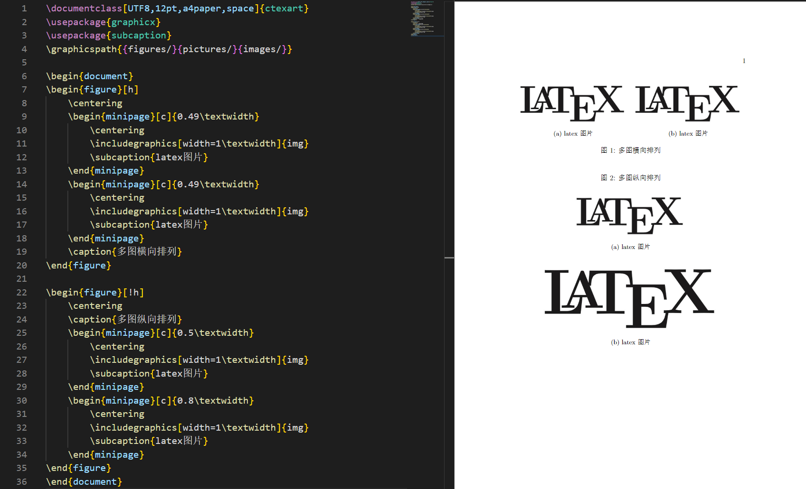

# 图片的插入
如果想要在文章中插入图片，此时，宏包的作用就来了，我们需要在导言区中调用graphicx宏包。
```latex
\usepackage{graphicx}
```

## 图片的缩放和旋转
在正式插入图片之前，我们需要了解如何更改插入图片的大小，以及对图片的旋转。方法如下：
1. 按照图片原大小进行缩放
下面的代码意为将图片缩放为原来的0.6倍
```latex
\includegraphics[scale=0.6]{图片名} 
```
2. 设定图片的高度或宽度的大小
其中的”高度”和”宽度”是指希望图片打印的高度和宽度, 必须给出单位, 可用厘米(cm)或英寸(in)。高度和宽度若同时给出, 就会改变原图的长宽比
```latex
\includegraphics[height=3in]{图片名}
或者: 
\includegraphics[width=5cm]{图片名}
```
3. 按照文本高度或宽度进行缩放
我非常推荐在下面的图片插入时利用此方法来实现，文本高度和宽度即为当文字充满整页时一列或一行的长度。
```latex
\includegraphics[height=0.2\textheight]{图片名}
或者
\includegraphics[width=0.8\textwidth]{图片名}
```

4. 图片的旋转
图片的旋转可以在原来代码的基础上再添加一个angle参数即可
```latex
\includegraphics[width=0.8\textwidth, angle=60]{图片名}
```

## 定位
为了使图片的位置在我们希望的地方，我们需要引入一个新的环境。
```latex
\begin{figure}[h]
\includegraphics[width=8cm]{图片名}
\end{figure}
```
该figure环境用于将图片显示为文档中的浮动元素。这意味着我们将图片包含在环境中，而不必担心它的位置。当然，除了h参数以外，还有如下参数：

|参数|位置|
|:----:|:----|
|h|在这里放置浮动体，即大约在源文本中出现的同一位置（然而，并不完全在该位置）|
|t|位于页面顶部|
|b|位于页面底部|
|p|放在一个仅用于浮动的特殊页面上|
|!|覆盖LaTeX用于确定“良好”浮动位置的内部参数|
|H|将浮动体精确地放置在LATEX代码中的位置，需宏包float，但偶尔可能会导致一些问题|

## 单图插入
现在我们正式开始插入一张图片
```latex
\begin{figure}[h]  
    \centering  %图片居中
    \includegraphics[width=0.8\textwidth]{img.png}
    \caption{latex图片} %文档中显示的图片标题
\end{figure}
```
如果一篇文章中我们需要插入较多的图片，我们可以将这些图片保存在某些文件夹下，并在导言区设定好这些文件夹，那么系统将会在这些文件夹下搜索我们图片的名字来进行导入，方法如下：
```latex
\graphicspath{{figures/}{pictures/}{images/}}
```
同样的，我们可以给这些图片设置label，以便在正文中引用他们，不仅如此，在左侧的结构栏中也可以让我们快速找到这些标签以便管理。综合以上代码：
```latex
\documentclass[UTF8,12pt,a4paper,space]{ctexart}
\usepackage{graphicx}
\graphicspath{{figures/}{pictures/}{images/}}

\begin{document}
这是正文\par
这是图\ref{fig:latex},一张latex的图片
\begin{figure}[h]  
    \centering  %图片居中
    \includegraphics[width=0.8\textwidth]{img.png}
    \caption{latex图片} %文档中显示的图片标题
    \label{fig:latex} %用于文内引用的标签
\end{figure}

这是图\ref{fig:latex60},一张latex的图片旋转60度
\begin{figure}[h]  
    \centering  %图片居中
    \includegraphics[width=0.5\textwidth, angle=60]{img.png}
    \caption{latex图片旋转60度} %文档中显示的图片标题
    \label{fig:latex60} %用于文内引用的标签
\end{figure}
\end{document}
```


## 多图插入
对于多图插入，需要使用宏包subcaption来辅助实现。

```latex
\begin{figure}[h]
    \centering
    \caption{多图横向排列}
    \begin{minipage}[c]{0.49\textwidth}
        \centering
        \includegraphics[width=1\textwidth]{img}
        \subcaption{latex图片}
    \end{minipage}
    \begin{minipage}[c]{0.49\textwidth}
        \centering
        \includegraphics[width=1\textwidth]{logo}
        \subcaption{组徽}
    \end{minipage}
\end{figure}
```
对于以上代码而言，首先在figure环境下，我们设置了居中对齐以及标题，随后引入了minipage环境，此处[c]表示居中，同意还要参数[l][r]表示左对齐和右对齐，随后利用{0.49\textwidth}设置了minipage的大小，这里如果若干个minipage的大小之和大于等于1\textwidth，那么最后一个minipage将会换行，因此通过控制minipage的大小我们可以实现多图横向排列或者纵向排列，而minipage里面的参数与单图插入类似。需要注意的是上述minipage里面的[width=1\textwidth]表示的是minipage的宽度。通过以下示例可以方便大家快速理解

### 横向排列或横向排列
需要注意的是caption在源代码的位置将决定其在图片上方还是下方
```latex
\begin{figure}[h]
    \centering
    \begin{minipage}[c]{0.49\textwidth}
        \centering
        \includegraphics[width=1\textwidth]{img}
        \subcaption{latex图片}
    \end{minipage}
    \begin{minipage}[c]{0.49\textwidth}
        \centering
        \includegraphics[width=1\textwidth]{img}
        \subcaption{latex图片}
    \end{minipage}
    \caption{多图横向排列}
\end{figure}

\begin{figure}[!h]
    \centering
    \caption{多图纵向排列}
    \begin{minipage}[c]{0.5\textwidth}
        \centering
        \includegraphics[width=1\textwidth]{img}
        \subcaption{latex图片}
    \end{minipage}
    \begin{minipage}[c]{0.8\textwidth}
        \centering
        \includegraphics[width=1\textwidth]{img}
        \subcaption{latex图片}
    \end{minipage}
\end{figure}
```


### 特殊排列方式
通过以上示例，我们可以体会到minipage其实就是一个小方框，这些小方框里面可以继续套小方框，因此，通过控制这些方框的参数来实现我们想要的排列方式，以下为一个示例，其他更多的排列方式可自行研究。
```latex
\begin{figure}[h]
    \begin{minipage}[c]{0.49\textwidth}
        \begin{minipage}[c]{1\textwidth}
            \centering
            \includegraphics[width=1\textwidth]{img}
            \subcaption{latex图片}
        \end{minipage}
        \begin{minipage}[c]{1\textwidth}
            \centering
            \includegraphics[width=1\textwidth]{img}
            \subcaption{latex图片}
        \end{minipage}
    \end{minipage}
    \begin{minipage}[c]{0.49\textwidth}
        \centering
        \includegraphics[height=0.14\textheight, angle=90]{img}
        \subcaption{latex图片}
    \end{minipage}
    \caption{特殊排列}
\end{figure}
```
