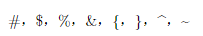

# 导言区
本文参考
- https://duter2016.github.io/2020/08/09/LaTeX%E6%8E%92%E7%89%88%E5%9F%BA%E7%A1%80%E8%AF%AD%E6%B3%95/

导言区即为了设定文档的排版格式，由于本教程为入门教程，是为了快速入门使用后面的模板，因此不在此过多阐述导言区的内容，感兴趣的可以自由探索。

## 文档类型
CTEX 宏集提供了四个中文文档类：ctexart、ctexrep、ctexbook 和 ctexbeamer。

|文档类|文档类型|特点|
|:----|:----|:----|
|ctex|短文，学术论文|无左右页区分，无章设置|
|ctexbook|著作，书|默认有左右页区分，章起右页|
|ctexrep|报告|默认无左右页区分，章起新页|
|ctexbeamer|幻灯片|提供多种主题式样，可方便更改幻灯片的整体风格|

不同文档类对应的格式不一样，而我们通常利用ctexart文档类进行文章排版。使用方法如下：
```latex
\documentclass{文档类型} 
```
同样的，我们也可以在此设置文章中最基本的格式，如编码方式，纸张大小，正文字体大小等，方法如下：
```latex
\documentclass[UTF8,12pt,a4paper]{ctexart}
```

## 宏包
latex的宏包就类似于python的库，旨在扩展或提供LaTeX的某一特定功能，以便利用户使用，使用方法如下：
```latex
\usepackage{宏包}
```

对于宏包的使用就非常丰富了，而本文旨在帮助大家快速入门，使用后面提供的模板完成课程报告，因此我们不做过多阐述。

通常我们需要设置中文和英文的字体可以使用如下宏包继续设置，且在导言区设置的字体将是全局的
```latex
\usepackage{fontspec} % 中文字体宏包
\setmainfont{SimSun} % 设置为宋体
\usepackage{times} %使得英文默认字体都是Times New Roman
```

## 注意事项
该点是为了说明一些latex的内置的基本规则，旨在帮助同学们后面写正文时防止踩坑。建议将下面代码自己手动编译一次感受区别并牢牢记住！

### 空格的使用
latex默认是忽略文字之间的空格的，如果想要使用空格，可以在设置文档类型时加入space，这样latex就不会忽略我们输入的空格，方法如下：
```latex
\documentclass[UTF8,12pt,a4paper,space]{ctexart}
```
当然，我是很不推荐这样使用space的，我们可以利用如下方法来添加空格：
```latex
\documentclass[UTF8,12pt,a4paper]{ctexart}
\begin{document}
你好啊！你好 啊！你好{ }啊！你好\ 啊！
\end{document}
```


### 换行
latex中回车是不会换行的，需要输入\\或\newline来进行换行，方法如下：
```latex
\documentclass[UTF8,12pt,a4paper]{ctexart}
\begin{document}
你好啊！\\
你好{ }啊！\newline
你好\ 啊！
\end{document}
```


### 分段
当运行了上面的代码时可以发现，第一个你好啊！是有首行缩进的，而后面两个是没有的，说明他们依旧是一个段落，如果想对他们进行分段，可以对两个段落之间空一行或使用\par进行分段
```latex
\documentclass[UTF8,12pt,a4paper]{ctexart}
\begin{document}
你好啊！\\
你好{ }啊！

你好\ 啊！\par
你好啊！
\end{document}
```


### 换页
换页只需要在你想换页的地方使用\clearpage命令即可实现。

### 特殊字符
特殊控制字符：#，$， %， & ，{， }， ^， ~，由于这些字符在latex各司其职，要输出这些控制符用下列命令：
```latex
\documentclass[UTF8,12pt,a4paper]{ctexart}
\begin{document}
\#，\$，\%，\&，\{，\}，\^{}，\~{} 
\end{document}
```



