# 参考文献管理

当大家阅读到论文，可以点文章中的数字索引到对应参考文献，而参考文献也可以直接连接浏览器索引对应论文，方便读者下载浏览。

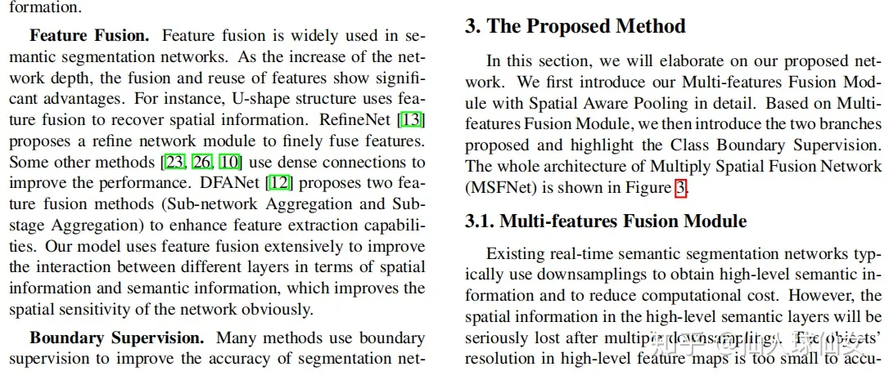


## Bibtex案例

接下来教大家怎么使用Bibtex来管理参考文献。

请新建一个文件夹名叫 `ref_demo`，用 VS Code打开，并且用VS Code 新建两个文件分别为: `main.tex`,`reference.bib`。

```bash
ref_demo/
  main.tex   --- LaTeX正文
  reference.bib --- 放置参考文献
```

用 VS Code 在 `reference.bib`输入如下代码：

```tex
@article{lecun2015deep,
  title={Deep learning},
  author={LeCun, Yann and Bengio, Yoshua and Hinton, Geoffrey},
  journal={nature},
  volume={521},
  number={7553},
  pages={436--444},
  year={2015},
  publisher={Nature Publishing Group UK London}
}

@article{尹宝才2015深度学习研究综述,
  title={深度学习研究综述},
  author={尹宝才 and 王文通 and 王立春 and others},
  journal={北京工业大学学报},
  volume={41},
  number={1},
  pages={48--59},
  year={2015}
}

@article{pouyanfar2018survey,
  title={A survey on deep learning: Algorithms, techniques, and applications},
  author={Pouyanfar, Samira and Sadiq, Saad and Yan, Yilin and Tian, Haiman and Tao, Yudong and Reyes, Maria Presa and Shyu, Mei-Ling and Chen, Shu-Ching and Iyengar, Sundaraja S},
  journal={ACM Computing Surveys (CSUR)},
  volume={51},
  number={5},
  pages={1--36},
  year={2018},
  publisher={ACM New York, NY, USA}
}

```

第一行`@article` 告诉 BibTeX 这是一个文章类型的参考文献，
还有其它格式：

- 期刊论文：**article**: any article published in a periodical like a journal article or magazine article
- 书籍：**book**: a book
- 小册子：**booklet**: like a book but without a designated publisher
- 会议论文：**conference**: a conference paper
- 书籍中的一个章节： **inbook**: a section or chapter in a book
- 文集中的一篇文章：**incollection**: an article in a collection
- 会议论文：**inproceedings**: a conference paper (same as the conference entry type)
- 技术手册： **manual**: a technical manual
- 硕士论文：**masterthesis**: a Masters thesis
- 如果没有其他合适的：**misc**: used if nothing else fits
- 博士论文： **phdthesis**: a PhD thesis
- 整个会议记录： **proceedings**: the whole conference proceedings
- 科技报告： **techreport**: a technical report, government report or white paper
- 未正式发表的作品：**unpublished**: a work that has not yet been officially published

接下来的`lecun2015deep`、`尹宝才2015深度学习研究综述`、`pouyanfar2018survey`，就是你在正文中应用这个条目的名称。

那么如何编写参考文献条目呢？其实通常我们不会编写参考文献的条目，而是会使用Google Scholar。具体内容请看下一节，本小节只介绍如何实现一个带参考文献的LaTeX案例。

用 VS Code 在 `main.tex` 输入如下代码：

```tex
\documentclass[UTF8]{ctexart}
\bibliographystyle{plain}

\begin{document}
    这是一个参考文献的引用\cite{lecun2015deep}
    
    这是两个参考文献的引用\cite{尹宝才2015深度学习研究综述,pouyanfar2018survey}

\bibliography{reference.bib}
    
\end{document}    
```

`\cite` 命令用于在正文中使用参考文献的，支持引用一个或者多个参考文献。例如

```tex
\cite{条目一，条目二，条目三}
```

`\bibliographystyle{plain}`定义的参考文献的样式，LaTeX参考文献样式标准选项共有以下8种：

- `plain`，按字母的顺序排列，比较次序为作者、年度和标题.
- `unsrt`，样式同plain，只是按照引用的先后排序.
- `alpha`，用作者名首字母+年份后两位作标号，以字母顺序排序.
- `abbrv`，类似plain，将月份全拼改为缩写，更显紧凑.
- `ieeetr`，国际电气电子工程师协会期刊样式.
- `acm`，美国计算机学会期刊样式.
- `siam`，美国工业和应用数学学会期刊样式.
- `apalike`，美国心理学学会期刊样式.

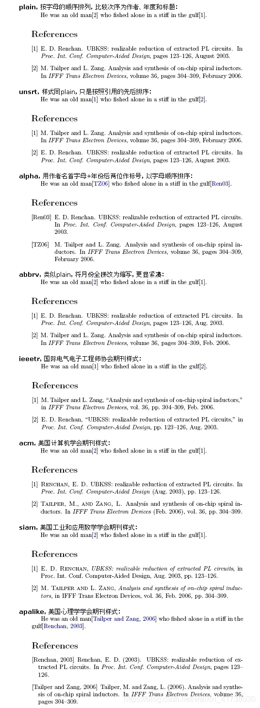

`\bibliography{reference.bib}` 定义参考文献使用的文件路径是当前文件夹下的`reference.bib`文件。

### 编译案例

请在命令行中一次输入如下命令，`#`后面为该命令的说明，请手动敲`#`前面的命令：

```bash
xelatex main.tex  # 第一次编译
bibtex main.aux   # 处理参考文献
xelatex main.tex  # 第二次编译
xelatex main.tex  # 第三次编译
```

于是你便可得到带参考文献的PDF文档了

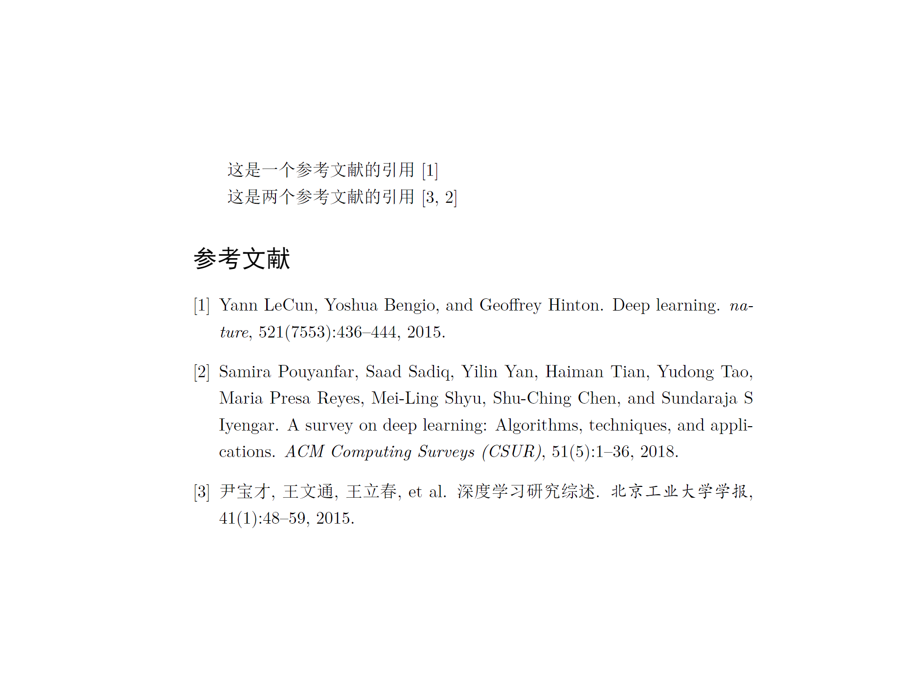

## Google Scholar、百度学术使用教程

作为新时代的你们，要学会的一个定律就是：**凡事你们头疼的问题，前人都已经解决过了，因此你只需要使用搜索引擎或者ChatGPT寻找解决方案**。因此根据上述定律，参考文献的bibtex条目格式这么复杂的事情根本不需要手动编写，而是使用[Google Scholar](https://scholar.google.com/)大法好。（如果你不能访问Google Scholar，本教程也增加了百度学术的教程

### Google Scholar

网址：[https://scholar.google.com/](https://scholar.google.com/)

举例一篇论文索引，点击箭头所指：

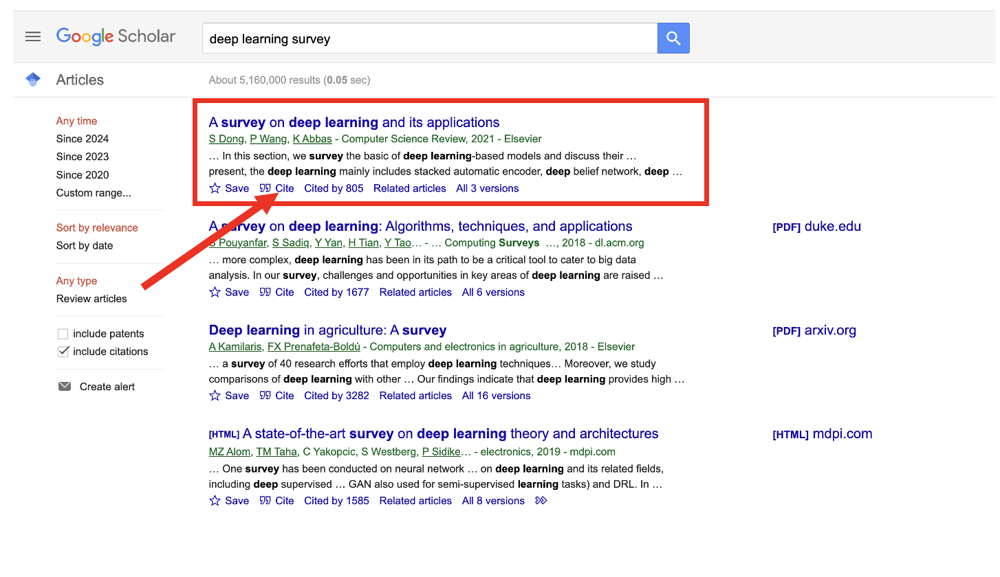

会弹出来一个**Cite**框：

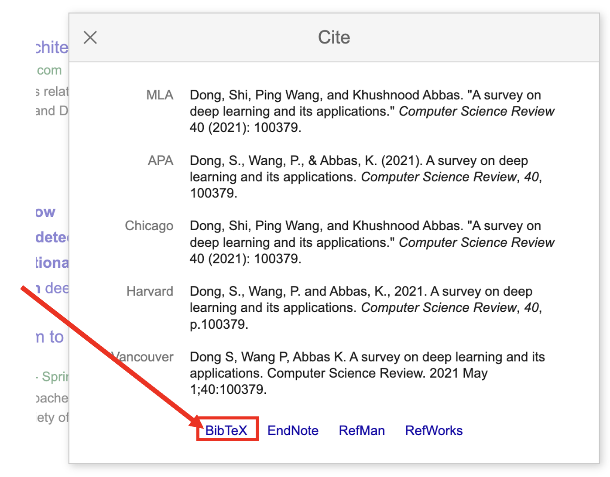

点击Bibtex格式，如图上红色箭头，会出现如下图所示的代码：

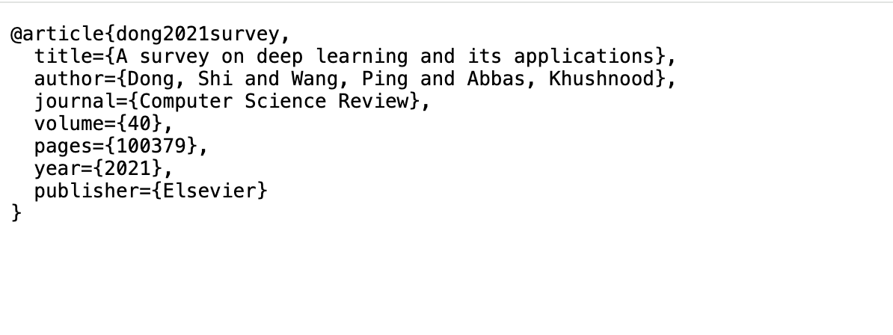

复制这一段代码，粘贴进之前建立的`reference.bib`文件。

### 百度学术

网址：[https://xueshu.baidu.com/](https://xueshu.baidu.com/)

举例一篇论文索引，点击箭头所指：

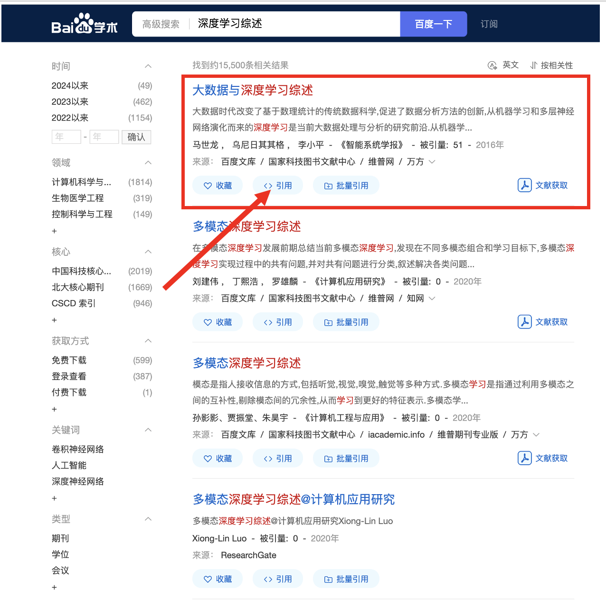

会弹出来一个**引用**框：

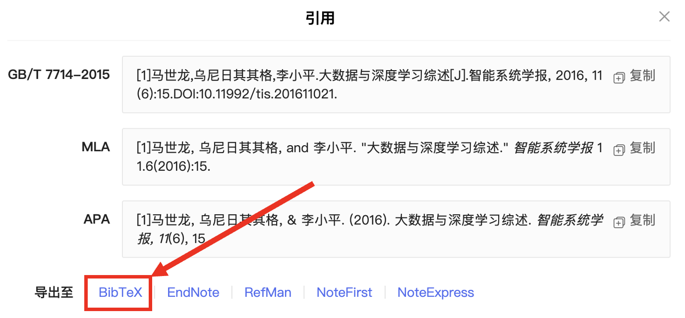

点击Bibtex格式，如图上红色箭头，会出现如下图所示的代码：

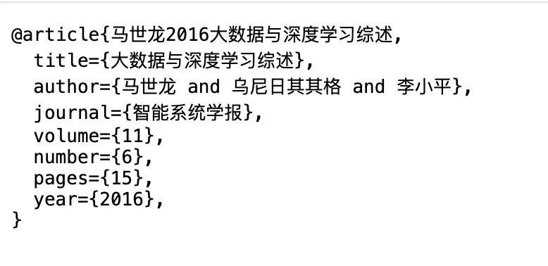

复制这一段代码，粘贴进之前建立的`reference.bib`文件。

## 参考文献格式：国标GB／T7714-2015

《信息与文献参考文献著录规则》（旧称文后参考文献著录规则）是中华人民共和国关于参考文献著录格式的一部国家标准，参照国际标准ISO 690编制，广泛用于中国内地的学术期刊、论文中。目前的标准号是：`GB/T 7714－2015`。

因此大家的学位论文使用LaTeX编写的时候，参考文献的格式需要遵守`GB/T 7714－2015`。接下来我们实践一下如何在上述案例中实现`GB/T 7714－2015`的参考文献。

为了实现`GB/T 7714－2015`的参考文献，我们使用一种流行的 LaTex 宏包`biblatex`，它用于处理参考文献和引文。它与 `biber` 结合使用，以提供更灵活的参考文献处理方式。

用 VS Code 将 `main.tex` 代码修改成如下：

```tex
\documentclass{article} 
\usepackage{ctex}

\usepackage[
  backend=biber,
  style=gb7714-2015,
  gbalign=gb7714-2015,
  gbnamefmt=lowercase,
  gbpub=false
]{biblatex}   

\addbibresource{reference.bib}

\begin{document}
    这是一个参考文献的引用\cite{lecun2015deep}
    
    这是两个参考文献的引用\cite{尹宝才2015深度学习研究综述,pouyanfar2018survey}

    \printbibliography
    
\end{document}    
```

请在命令行中一次输入如下命令，`#`后面为该命令的说明，请手动敲`#`前面的命令：

```bash
xelatex main.tex  # 第一次编译
biber main        # 处理参考文献
xelatex main.tex  # 第二次编译
xelatex main.tex  # 第三次编译
```
于是我们就得到了一篇支持`GB/T 7714－2015`标准的参考文献PDF文档。

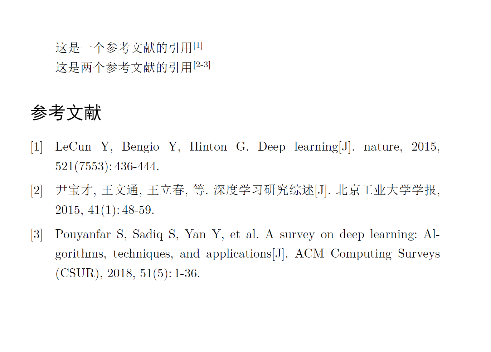

### biber命令不存在的错误

如果你遇到了biber命令不存在的问题，请用MikTeX手动安装biber这个宏包。

请打开 `MikTeX Console`。

1. 点击宏包
2. 在搜索框搜索 `biber`
3. 右击名称为`biber-ms-windows-x64`的宏包
4. 点击`安装宏包`
5. 安装好便解决了 biber not found的问题了。

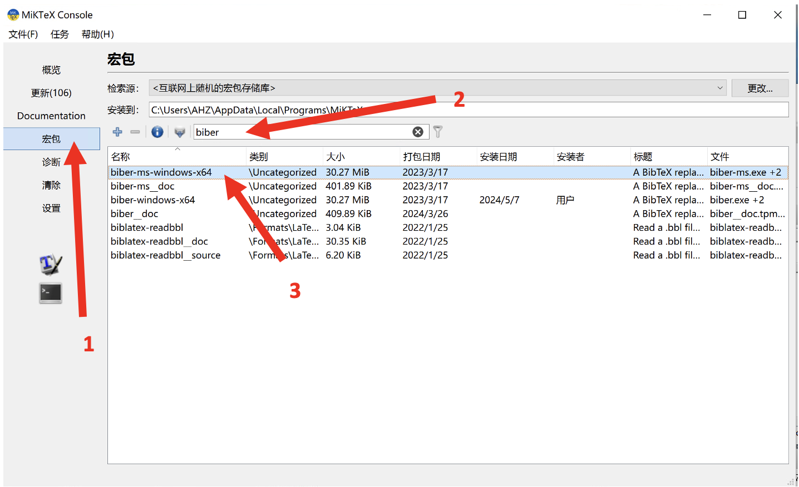
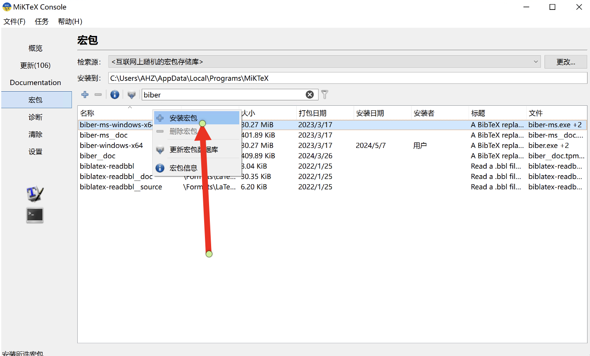


