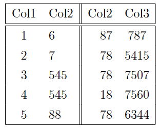

# 表格

LaTeX提供了许多工具来创建和定制表格，在本节中，将使用tabular环境来创建和定制表。表格的环境table和figure类似，他们都是一个浮动体，可以利用htbp!H等来设定他的位置。在table环境里，可以在利用tabular环境来插入表格，方法如下：
```latex
\begin{table}[h]
    \centering
    \begin{tabular}{|c l||r c|} 
        \hline
        Col1 & Col2 & Col2 & Col3 \\ 
        \hline
        \hline
        1 & 6 & 87 & 787 \\ 
        2 & 7 & 78 & 5415 \\
        3 & 545 & 78 & 7507 \\
        4 & 545 & 18 & 7560 \\
        5 & 88 & 78 & 6344 \\ 
        \hline
    \end{tabular}
    \caption{这是一个表}
    \label{table:table1}
\end{table}
```



以上代码中，tabular环境中的{|c l||r c|}的意思为这个表有4列，其中c表示该列为居中对齐，l和r分别为左右对齐，|表示在何处有竖线，2个||则表示有2条竖线，\hline表示横线，同样的可以使用多次表示有多条横线，对于一行中的每个元素利用&进行分开，\\意味换行。

当然，如果你不想自己去写一个表格的代码，你可以利用[Tables Generator](https://www.tablesgenerator.com/) 来自动生成代码。更多的表格样式可以自己去探索。