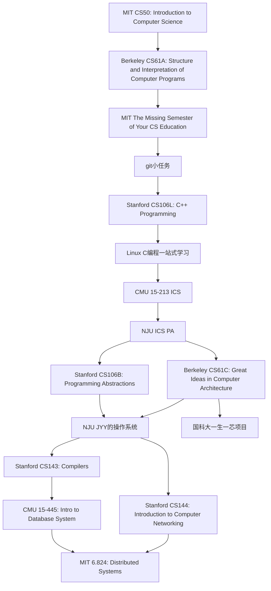

# 计算机科学自学路径图

本文参考

- [CS自学指南](https://csdiy.wiki/)

## Roadmap

:::caution

1. 由于很多课程是北美CS领域TOP4高校(Stanford、MIT、CMU、Berkeley)课程，授课语言为英文，请不要使用翻译，只需硬着头皮啃就好了，慢慢的就会习惯。整个CS领域几乎都是由美国人从零构建出来的，如果选择学好CS，那英语是你必过的一关。换句话说，英语这一关过不了，你的CS也就学不好。掌握了英语，你就会更好的了解到先驱们是怎样构建了计算机这个人类有史以来最伟大的发明。
2. 整个Roadmap 课程，课程视频不是最主要的，核心是课程的homework和lab， 只有在准守[学术诚信](http://integrity.mit.edu/)的条件下完成作业，你才能收获最大。同时你可以感受到大佬们为了让你们真正学会CS，是耗费了极大的心血才设计出课程的homework和lab， 请珍惜他们的工作，并且感激他们愿意把自己多年心血公开到互联网上，让你受益匪浅。
3. 能否完成Roadmap与是否是985/211的学生、年级、专业都没有直接关系，一个高中生只要愿意坚持也能完成Roadmap。因此能不能成为CS大佬，取决于你是否完成观念和心态上的转变，锻炼出独立解决问题的意识和能力，并且为了达成目标是否付出努力。
4. 不要为自己的躺平找任何理由。例如：我看英文手册很慢，所以我想用翻译软件翻译一下。我今天不想学习，因为今天XXX。我想参考一下别人的代码，因为太难了，我不想摸索。。。。and so on
5. 躺平容易坚持难, 但如果你能坚持下来, 你就可以得到脱胎换骨的提升。
6. 纸上得来终觉浅，绝知此事要躬行。

:::

## MIT CS50

连续多年被哈佛大学学生评为最受欢迎的公选课程。Malan 教授上课非常有激情，撕黄页讲二分法的场面让人记忆犹新（笑）。但因为它的入门以及全校公选的属性，课程内容难度比较温和，但是课程作业质量非常高而且全部免费开源，非常适合小白入门，或者大佬休闲。

课程网站链接：https://cs50.harvard.edu/x/2022/

B站视频链接：https://www.bilibili.com/video/BV1ER4y157uA

## Berkeley CS61A

CS61A是加州大学伯克利分校 CS 专业的入门课，强调抽象，让学生掌握用程序来解决实际问题，而不关注底层的硬件细节。因此这不仅仅是一门编程语言课，而是会深入到程序构造与运行的原理。最后你将在第 4 个 Project 中用 Python 实现一个 Scheme 的解释器。此外，抽象将是这门课的一大主题，你将学习到函数式编程、数据抽象、面向对象等等知识来让你的代码更易读，更模块化。当然，学习编程语言也是这门课的一大内容，你将会掌握 Python、Scheme 和 SQL 这三种编程语言，在它们的学习和比较中，相信你会拥有快速掌握一门新的编程语言的能力。

课程网站链接：https://inst.eecs.berkeley.edu/~cs61a/sp21/

B站视频链接：https://www.bilibili.com/video/BV1v64y1Q78o

## MIT The Missing Semester of Your CS Education

正如课程名字所言：“计算机教学中消失的一个学期”，这门课将会教会你许多大学的课堂上不会涉及但却对每个 CSer 无比重要的工具或者知识点。例如 Shell 编程、命令行配置、Git、Vim、tmux、ssh 等等。如果你是一个计算机小白，那么我非常建议你学习一下这门课，因为它基本涉及了本书必学工具中的绝大部分内容。

课程网站链接：https://missing.csail.mit.edu/

B站视频链接：https://www.bilibili.com/video/BV14E411J7n2

虚拟机安装Ubuntu视频教程：https://www.bilibili.com/video/BV1vq4y1X7Wp

## git小任务

git学习资料1：https://learngitbranching.js.org/?locale=zh_CN

git学习资料2: https://backlog.com/git-tutorial/cn/

用Python实现git: https://wyag.thb.lt/

## Stanford CS106L: C++ Programming

这门课会深入到很多标准 C++ 的特性和语法，让你编写出高质量的 C++ 代码。例如 auto binding, uniform initialization, lambda function, move semantics，RAII 等技巧都在我此后的代码生涯中被反复用到，非常实用。

值得一提的是，这门课的作业里你会实现一个 HashMap（类似于 STL 中的 unordered_map), 这个作业几乎把整个课程串联了起来，非常考验代码能力。特别是 iterator 的实现，做完这个作业我开始理解为什么 Linus 对 C/C++ 嗤之以鼻了，因为真的很难写对。总的来讲这门课并不难，但是信息量很大，需要你在之后的开发实践中反复巩固。

课程网站链接：http://web.stanford.edu/class/cs106l/

B站视频链接：https://www.bilibili.com/video/BV1K8411b7AU

## Linux C编程一站式学习
链接：http://akaedu.github.io/book/

## CMU 15-213 Introduction to Computer Systems (ICS)

CMU 大名鼎鼎的镇系神课，以其内容庞杂，Project 巨难而闻名遐迩。课程内容覆盖了汇编语言、体系结构、操作系统、编译链接、并行、网络等，作为系统入门课，兼具深度和广度，如果自学确实需要相当的毅力和代码功底。

这门课配合的教材由 CMU 计算机系主任 Bryant 教授执笔，也即所谓的 CSAPP。这也是我第一本认认真真一页一页读过去的计算机教材，虽然很难啃，但着实收获良多。

这门课由于过于出名，全世界的码农争相学习，导致其 Project 的答案在网上几乎唾手可得。但如果你真的想锻炼自己的代码能力，希望你不要借鉴任何第三方代码。

认真学完这一门课，你对计算机系统的理解绝对会上升一个台阶。

B站课程视频： https://www.bilibili.com/video/BV1iW411d7hd

推荐一个非常棒的中文课程讲解：https://www.bilibili.com/video/BV1cD4y1D7uR/

CSAPP作业地址(**强烈建议使用NJU的ICS PA作为课程作业，学有余力的同学可以做本作业**)：http://csapp.cs.cmu.edu/3e/labs.html

推荐书籍：[深入理解计算机系统 第三版](https://item.jd.com/12006637.html)

## NJU ICS PA
PA实验内容网站：https://nju-projectn.github.io/ics-pa-gitbook/ics2022/

B站视频链接：https://www.bilibili.com/video/BV1Z541127RJ

## Stanford CS106B

主要通过 C++ 语言让学生在实际的编程作业里培养通过编程抽象解决实际问题的能力，同时也会涉及一些简单的数据结构和算法的知识，但总体来说没有一门专门的数据结构课那么系统。

课程网站链接：https://web.stanford.edu/class/archive/cs/cs106b/cs106b.1224/

2020年夏B站视频链接：https://www.bilibili.com/video/BV1Hr4y137Do

由于Stanford上课时间结束，有些作业可能下载不了附上百度网盘的备份链接：https://pan.baidu.com/s/1lUQ8agQHJhpUOyFPIKhf6A?pwd=cs16 

## Berkeley CS61C

伯克利 CS61 系列的最后一门课程，深入计算机的硬件细节，带领学生逐步理解 C 语言是如何一步步转化为 RISC-V 汇编并在 CPU 上执行的。

这门课的 Project 也非常新颖有趣。Project1 会让你用 C 语言写一个小程序，20 年秋季学期是著名的游戏 Game of Life。Project2 会让你用 RISC-V 汇编编写一个神经网络，用来 识别 MNIST 手写数字，非常锻炼你对汇编代码的理解和运用。Project3 中你会用 Logisim 这个数字电路模拟软件搭建出一个二级流水线的 CPU，并在上面运行 RISC-V 汇编代码。Project4 会让你使用 OpenMP, SIMD 等方法并行优化矩阵运算，实现一个简易的 Numpy。

总而言之，这是个人上过的最好的计算机体系结构的课程。

课程网站：https://cs61c.org/su22/

B站视频链接：https://www.bilibili.com/video/BV1fC4y147iZ

## NJU JYY的操作系统

蒋炎岩老师作为非常年轻的老师，有着丰富的一线代码的经验，因此课程讲授有着满满的 Hacker 风格，课上经常“一言不合”就在命令行里开始写代码，很多重要知识点也都配有生动直白的代码示例。让我印象最为深刻的就是老师为了让学生更好地理解动态链接库的设计思想，甚至专门实现了一个迷你的可执行文件与一系列的二进制工具，让很多困扰我多年的问题都得到了解答。

这门课的讲授思路也非常有趣，蒋老师先从“程序就是状态机”这一视角入手，为“万恶之源”并发程序建立了状态机的转化模型，并在此基础上讲授了并发控制的常见手段以及并发bug的应对方法。接着蒋老师将操作系统看作一系列对象（进程/线程、地址空间、文件、设备等等）以及操作它们的 API （系统调用）并结合丰富的实际例子介绍了操作系统是如何利用这系列对象虚拟化硬件资源并给应用软件提供各类服务的。最后的可持久化部分，蒋老师从 1-bit 的存储介质讲起，一步步构建起各类存储设备，并通过设备驱动抽象出一组接口来方便地设计与实现文件系统。我之前虽然上过许多门操作系统的课程，但这种讲法确实独此一家，让我收获了很多独到的视角来看待系统软件。

这门课除了在理论知识的讲授部分很有新意外，注重实践也是蒋老师的一大特点。在课堂和编程作业里，蒋老师会有意无意地培养大家阅读源码、查阅手册的能力，这也是计算机从业者必备的技能。

编程作业共由 5个 MiniLab 和 4个 OSLab 组成。美中不足的是作业的评测机是不对校外开放的。另外其实几个 MiniLab 都能非常方便地进行本地测试，就算没有评测机也不影响自学。

课程网站：http://jyywiki.cn/OS/2022/

B站视频链接：https://space.bilibili.com/202224425/channel/collectiondetail?sid=192498

## Stanford CS143

斯坦福的编译原理课程，设计者开发了一个 Class-Object-Oriented-Language，简称 COOL 语言。这门课的核心就是通过理论知识的学习，为 COOL 语言实现一个编译器，将 COOL 高级语言编译为 MIPS 汇编并在 Spim 这个 MIPS 模拟器上成功执行。

理论部分基本按照龙书的顺序覆盖了词法分析、语法分析、语义分析、运行时环境、寄存器分配、代码优化与生成等内容，实践部分则相应地分为词法分析、语法分析、语义分析、代码生成四个阶段，难度循序渐进，并在优化部分给学生留下了很大的设计空间。

课程网站：http://web.stanford.edu/class/cs143/

B站视频链接：https://www.bilibili.com/video/BV17K4y147Bz

## CMU 15-445

作为 CMU 数据库的入门课，这门课由数据库领域的大牛 Andy Pavlo 讲授（“这个世界上我只在乎两件事，一是我的老婆，二就是数据库”）。15-445 会自底向上地教你数据库系统的基本组成部分：存储、索引、查询，以及并发事务控制。 这门课的亮点在于 CMU db 专门为此课开发了一个教学用的关系型数据库 bustub，并要求你对这个数据库的组成部分进行修改，实现上述部件的功能。此外 bustub 作为一个 C++ 编写的中小型项目涵盖了程序构建、代码规范、单元测试等众多要求，可以作为一个优秀的开源项目学习。

课程网站：https://15445.courses.cs.cmu.edu/fall2022/

B站视频链接：https://www.bilibili.com/video/BV1Cp4y1C7dv

## Stanford CS144

这门课的主讲人之一是网络领域的巨擘 Nick McKeown 教授。这位拥有自己创业公司的学界业界双巨佬会在他慕课每一章节的最后采访一位业界的高管或者学界的高人，非常开阔眼界。

在这门课的 Project 中，你将用 C++ 循序渐进地搭建出整个 TCP/IP 协议栈，实现 IP 路由以及 ARP 协议，最后利用你自己的协议栈代替 Linux Kernel 的网络协议栈和其他学生的计算机进行通信，非常 amazing！

课程网站：https://cs144.github.io/

B站视频链接：https://www.bilibili.com/video/BV137411Z7LR

## MIT 6.824

这门课和 MIT 6.S081 一样，出品自 MIT 大名鼎鼎的 PDOS 实验室，授课老师 Robert Morris 教授曾是一位顶尖黑客，世界上第一个蠕虫病毒 Morris 病毒就是出自他之手。

这门课每节课都会精读一篇分布式系统领域的经典论文，并由此传授分布式系统设计与实现的重要原则和关键技术。同时其课程 Project 也是以其难度之大而闻名遐迩，4 个编程作业循序渐进带你实现一个基于 Raft 共识算法的 KV-store 框架，让你在痛苦的 debug 中体会并行与分布式带来的随机性和复杂性。

同样，这门课由于太过出名，网上答案无数，希望大家不要参考，而是力图自主实现整个 Project。

课程网站：https://pdos.csail.mit.edu/6.824/schedule.html

B站视频链接：https://www.bilibili.com/video/BV1R7411t71W

## 国科大一生一芯项目
网站地址：https://ysyx.oscc.cc/

B站视频链接：https://space.bilibili.com/2107852263/channel/collectiondetail?sid=690279
