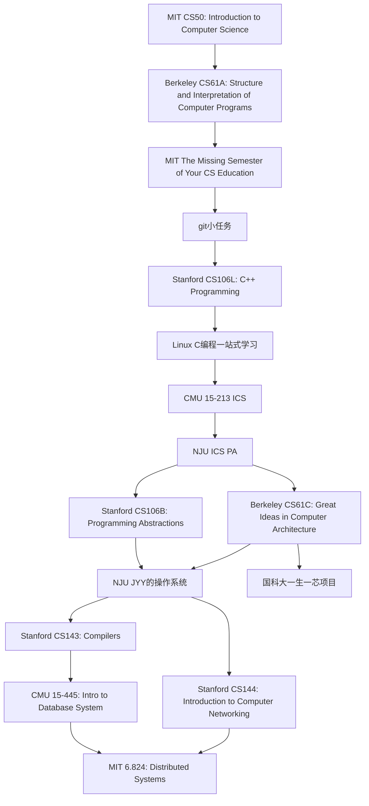

# 计算机科学自学路径图

:::caution

1. 由于很多课程是北美CS领域TOP4高校(Stanford、MIT、CMU、Berkeley)课程，授课语言为英文，请不要使用翻译，只需硬着头皮啃就好了，慢慢的就会习惯。整个CS领域几乎都是由美国人从零构建出来的，如果选择学好CS，那英语是你必过的一关。换句话说，英语这一关过不了，你的CS也就学不好。掌握了英语，你就会更好的了解到先驱们是怎样构建了计算机这个人类有史以来最伟大的发明。
2. 整个Roadmap 课程，课程视频不是最主要的，核心是课程的homework和lab， 只有在准守[学术诚信](http://integrity.mit.edu/)的条件下完成作业，你才能收获最大。同时你可以感受到大佬们为了让你们真正学会CS，是耗费了极大的心血才设计出课程的homework和lab， 请珍惜他们的工作，并且感激他们愿意把自己多年心血公开到互联网上，让你受益匪浅。
3. 能否完成Roadmap与是否是985/211的学生、年级、专业都没有直接关系，一个高中生只要愿意坚持也能完成Roadmap。因此能不能成为CS大佬，取决于你是否完成观念和心态上的转变，锻炼出独立解决问题的意识和能力，并且为了达成目标是否付出努力。
4. 不要为自己的躺平找任何理由。例如：我看英文手册很慢，所以我想用翻译软件翻译一下。我今天不想学习，因为今天XXX。我想参考一下别人的代码，因为太难了，我不想摸索。。。。and so on
5. 躺平容易坚持难, 但如果你能坚持下来, 你就可以得到脱胎换骨的提升。
6. 纸上得来终觉浅，绝知此事要躬行。

:::

## MIT CS50
课程网站链接：https://cs50.harvard.edu/x/2022/

B站视频链接：https://www.bilibili.com/video/BV1ER4y157uA

## Berkeley CS61A
课程网站链接：https://inst.eecs.berkeley.edu/~cs61a/sp21/

B站视频链接：https://www.bilibili.com/video/BV1v64y1Q78o

## MIT The Missing Semester of Your CS Education
课程网站链接：https://missing.csail.mit.edu/

B站视频链接：https://www.bilibili.com/video/BV14E411J7n2

虚拟机安装Ubuntu视频教程：https://www.bilibili.com/video/BV1vq4y1X7Wp

## git小任务

git学习资料1：https://learngitbranching.js.org/?locale=zh_CN

git学习资料2: https://backlog.com/git-tutorial/cn/

用Python实现git: https://wyag.thb.lt/

## Stanford CS106L: C++ Programming
课程网站链接：http://web.stanford.edu/class/cs106l/

B站视频链接：https://www.bilibili.com/video/BV1K8411b7AU

## Linux C编程一站式学习
链接：http://akaedu.github.io/book/

## CMU 15-213 Introduction to Computer Systems (ICS)

B站课程视频： https://www.bilibili.com/video/BV1iW411d7hd

推荐一个非常棒的中文课程讲解：https://www.bilibili.com/video/BV1cD4y1D7uR/

CSAPP作业地址(**强烈建议使用NJU的ICS PA作为课程作业，学有余力的同学可以做本作业**)：http://csapp.cs.cmu.edu/3e/labs.html

## NJU ICS PA
PA实验内容网站：https://nju-projectn.github.io/ics-pa-gitbook/ics2022/

B站视频链接：https://www.bilibili.com/video/BV1Z541127RJ

## Stanford CS106B
课程网站链接：https://web.stanford.edu/class/archive/cs/cs106b/cs106b.1224/

2020年夏B站视频链接：https://www.bilibili.com/video/BV1Hr4y137Do

由于Stanford上课时间结束，有些作业可能下载不了附上百度网盘的备份链接：https://pan.baidu.com/s/1lUQ8agQHJhpUOyFPIKhf6A?pwd=cs16 

## Berkeley CS61C
课程网站：https://cs61c.org/su22/

B站视频链接：https://www.bilibili.com/video/BV1fC4y147iZ

## NJU JYY的操作系统
课程网站：http://jyywiki.cn/OS/2022/

B站视频链接：https://space.bilibili.com/202224425/channel/collectiondetail?sid=192498

## Stanford CS143
课程网站：http://web.stanford.edu/class/cs143/

B站视频链接：https://www.bilibili.com/video/BV17K4y147Bz

## CMU 15-445
课程网站：https://15445.courses.cs.cmu.edu/fall2022/

B站视频链接：https://www.bilibili.com/video/BV1Cp4y1C7dv

## Stanford CS144
课程网站：https://cs144.github.io/

B站视频链接：https://www.bilibili.com/video/BV137411Z7LR

## MIT 6.824
课程网站：https://pdos.csail.mit.edu/6.824/schedule.html

B站视频链接：https://www.bilibili.com/video/BV1R7411t71W

## 国科大一生一芯项目
网站地址：https://ysyx.oscc.cc/

B站视频链接：https://space.bilibili.com/2107852263/channel/collectiondetail?sid=690279
