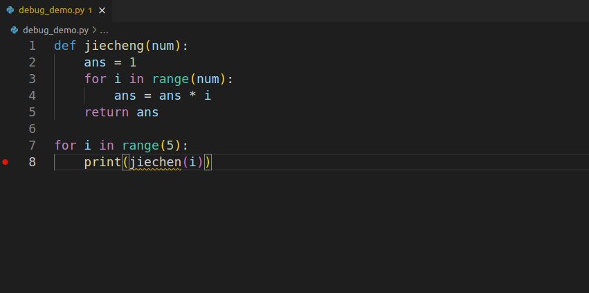
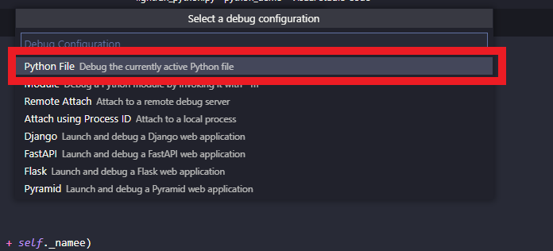
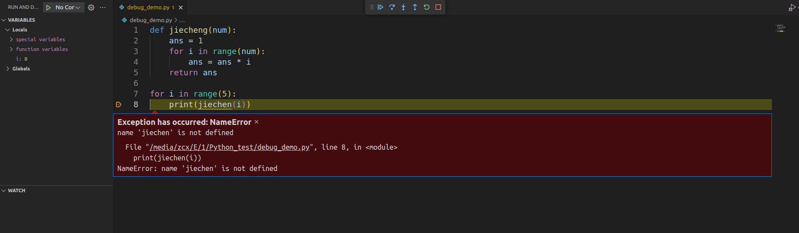
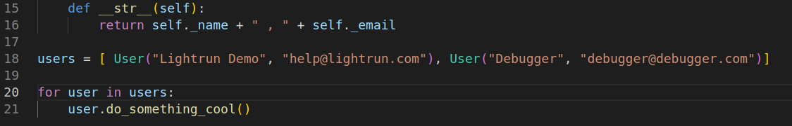
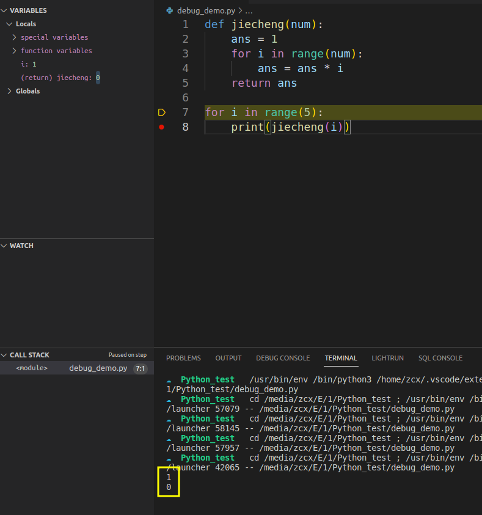
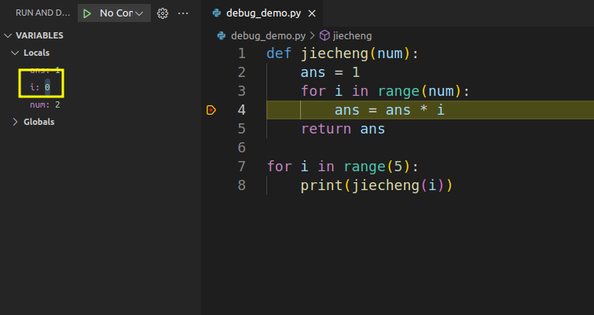

# VS Code Debug Python

:::caution

*非常重要，请仔细阅读完本文以后再进行相关操作。（因未仔细阅读完本文，出现任何错误后果自负， 逃～～～逃～～～逃*

:::

```python
def jiecheng(num):
    ans = 1
    for i in range(num):
        ans = ans * i
    return ans

for i in range(5):
    print(jiechen(i))
```
## 调试当前文件

打开要调试的文件。在我们的例子中，它是带有上面代码示例的文件。当您将鼠标悬停在行号的左侧时，会出现一个褪色的红点。如果你点击这个点，它会设置一个断点。

断点是代码中的一个点，程序的执行将在此处暂时停止，以便可以检查程序的状态。断点有助于调试目的，因为它们允许程序员检查变量的值并查看程序在该点的执行情况。
当您第一次单击“运行和调试”时，您将获得选择调试配置的选项。对于本教程，选择Python 文件。



当您单击位于VARIABLES(变量)面板左上角的播放按钮时，调试器将运行代码并在断点处停止。


调试工具栏也将在此时可用。调试工具栏包含的按钮可让您前进、后退以及根据您当前在断点中的位置跳转到代码的不同部分。关于您的代码的元数据也将出现在VARIABLES(变量)面板中，您可以在其中观察和监视局部变量和全局变量的更改。

以下是工具栏中每个图标功能的简要说明：

* __继续(F5)__ – 这将越过断点并继续执行程序的其余部分，直到遇到下一个断点。

* __Step over (F10)__ – 这将使调试器进入下一行。

* __进入 (F11)__ – 这将使调试器进入以下函数。

* __退出 (F12)__ – 这将使调试器退出函数并进入下一步。

* __重新启动 (Ctrl+shift+F5)__ – 重新启动整个调试器。

* __停止 (shift+F5)__ – 停止调试过程并退出。

点击右上角的小箭头，点击Debug Python File即可开始调试

让我们运行我们的调试器，我们看到 'jiechen' 这个函数不存在。



发现原因为jiechen这个函数没有定义,为拼写错误



正常拼写后再次调试



出现错误，1的阶乘为0。

设置断点，继续调试



发现此时的i为0，因为range(num)会生成是从0到num-1，所以设置为range(1,num+1)使得其生成1到num


结果输出正确

## 推选阅读资料
[GDB debug](https://heather.cs.ucdavis.edu/~matloff/UnixAndC/CLanguage/Debug.html)
