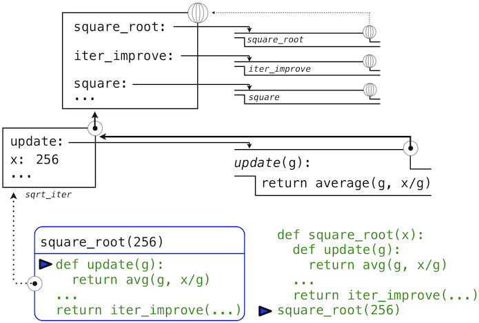

# 函数和高阶函数
## Python 函数
函数是所有程序的要素，无论规模大小，并且在编程语言中作为我们表达计算过程的主要媒介。

__函数是被定义的、可重复使用的，用来实现单一，或相关联功能的代码段。__

__函数能提高应用的模块性，和代码的重复利用率。（可以使用函数来简化算法）__

### Python 函数的分类
- 1、内置函数：是Python编程语言中预先定义的函数。
- 2、标准库函数：需要用import语句进行导入，常见标准库有time，os等
- 3、第三方库：需要另外下载到本地的库，例如opencv库，然后用import导入
- 4、自定义函数：自己在模块里的写的函数
（我们用的比较多的是内置函数与自定义函数）
### Python 内建函数
在Python中，内置了很多函数，需要导入它们来使用这些元素。例如，math模块提供了大量的常用数学函数：
```bash
>>> from math import sqrt, exp
>>> sqrt(256)
16.0
>>> exp(1)
2.718281828459045
```

### Python 自定义函数
在Python中，可以自己创建函数，这被叫做用户自定义函数。

__实例__
```bash
def say_hello():
    # 该块属于这一函数
    print('hello world')
# 函数结束
say_hello()  # 调用函数
say_hello()  # 再次调用函数
```
:::tip
- 函数代码块以**def关键词开头**，后接函数标识符名称和圆括号()。
- 任何传入**参数和自变量必须放在圆括号中间**。圆括号之间可以用于定义参数。
- 函数的第一行语句可以选择性地使用文档字符串—用于存放函数说明。
- 函数内容以**冒号**起始，并且缩进。
- return [ 表达式 ] 结束函数，选择性地返回一个值给调用方。不带表达式的return相当于返回 None。
:::
函数定义包含def语句，它标明了name（名称）和一列带有名字的formal parameters（形式参数）。之后，return（返回）语句叫做函数体，指定了函数的return expression（返回表达式），它是函数无论什么时候调用都需要求值的表达式。
```bash
def <name>(<formal parameters>):
    return <return expression>
```
第二行必须**缩进**！按照惯例我们应该缩进四个空格，而不是一个Tab，返回表达式并不是立即求值，它储存为新定义函数的一部分，并且只在函数最终调用时会被求出。（很快就会发现缩进区域可以跨越多行!）
:::tip
- 每个函数都应该只做一个任务。这个任务可以使用短小的名称来定义，使用一行文本来标识。顺序执行多个任务的函数应该拆分在多个函数中。
- 不要重复劳动（DRY）是软件工程的中心法则。所谓的DRY原则规定多个代码段不应该描述重复的逻辑。反之，逻辑应该只实现一次，指定一个名称，并且多次使用。如果你发现自己在复制粘贴一段代码，你可能发现了一个使用函数抽象的机会。
- 函数应该定义得通常一些。
:::
### Python 无参数函数
函数定义时，函数名后跟一对空的括号，那它就是无参数函数。例如：
```bash
def print_pattern():
    size = 4
    for i in range(size):
        print("*" * size)
```
调用函数时的输出：
```bash
>>> print_pattern()
****
****
****
****
```
:::tip
在调用的时候，你必须在函数名后加一对空括号。
:::
### Python 有1个参数的函数
函数定义时，函数名后的括号中是一个或多个参数的列表。
```bash
def welcome_student(name):
    print(f"Hi, {name}! Welcome to class.")
```
当调用函数时，我们只需要传递一个值作为参数，该值会被函数定义中使用参数的地方替代：
```bash
>>> welcome_student("Nora")
Hi, Nora! Welcome to class.
```
再看另外一个例子 – 一个打印由星号构成的图案的函数。你需要指定所要打印的行数：
```bash
def print_pattern(num_rows):
    for i in range(num_rows):
        for num_cols in range(num_rows-i):
            print("*", end="")
        print()
```
你可以看到不同的num_rows值，输出不同的结果：
```bash
>>> print_pattern(3)
***
**
*

>>> print_pattern(5)
*****
****
***
**
*

>>> print_pattern(8)
********
*******
******
*****
****
***
**
*
```
### Python 2个或多个参数的函数
为了定义 2 个或多个参数，我们只需要将它们用逗号进行分割：
```bash
def print_sum(a, b):
    print(a + b)
```
当调用上面的函数时，我们必须得传 2 个参数：
```bash
>>> print_sum(4, 5)
9

>>> print_sum(8, 9)
17

>>> print_sum(0, 0)
0

>>> print_sum(3, 5)
8
```
可以将刚刚看到的带有一个参数的函数调整为使用两个参数并打印带有自定义字符的图案：
```bash
def print_pattern(num_rows, char):
	for i in range(num_rows):
		for num_cols in range(num_rows-i):
			print(char, end="")
		print()
```
你可以看到下面带有自定义字符的输出，是通过我们传了 2 个参数的调用输出的。
```bash
>>> print_pattern(5, "A")
AAAAA
AAAA
AAA
AA
A

>>> print_pattern(8, "%")
%%%%%%%%
%%%%%%%
%%%%%%
%%%%%
%%%%
%%%
%%
%

>>> print_pattern(10, "#")
##########
#########
########
#######
######
#####
####
###
##
#
```
### Python 如何返回一个值
我们经常需要从函数中返回一个值，而return语句可以做到。我们只需要将 return 语句加到函数的定义中。
```bash
return <value_to_return>
```
 当发现return语句时，函数会立即停止执行并返回值。
```bash
def get_rectangle_area(length, width):
    return length * width
```
调用该函数将结果赋给一个变量，结果是由该函数返回的。
```bash
>>> area = get_rectangle_area(4, 5)
>>> area
20
```
可以用条件语句跟return语句一起使用，return 会根据条件是True还是False来返回一个值。
函数返回序列中找到的第一个元素：
```bash
def get_first_even(seq):
    for elem in seq:
        if elem % 2 == 0:
            return elem
        else:
            return None
```
我们调用函数，将会看到结果：
```bash
>>> value1 = get_first_even([2, 3, 4, 5])
>>> value1
2
```
```bash
>>> value2 = get_first_even([3, 5, 7, 9])
>>> print(value2)
None
```
:::tip
如果函数没有return语句，函数将会返回默认值None。
返回语句要保持一致。函数中的 return 语句，要么所有的都返回一个表达式，要么都不要返回。如果确定让所有返回语句都返回一个表达式，那么对于那些没有返回值的函数应该明确地说明返回值为 None，且在函数的结尾要有一个显式的 return 语句（如果可以执行到 return 语句）。
:::
### 默认参数
给参数b赋了一个默认值 5。当函数调用时，省略参数b，b的默认值 5 将会被使用。
```bash
def print_product(a, b=5):
    print(a * b)
```
省略参数b的调用, 我们看到的输出:
```bash
>>> print_product(4)
20
```
从上面的结果可以确定的是，运算中确实使用了默认值 5。

我们还可以给参数b赋一个自定义的值：
```bash
>>> print_product(3, 4)
12
```
:::tip
 带有默认值的参数，需要放在参数列表的最后面。否则，你会看到一个错误：语法错误：非默认值参数放到了默认值参数后面了。
:::
下面是用来打印图案函数的另外的一个例子。我们将"*"作为默认值赋值给char参数。
```bash
def print_pattern(num_rows, char="*"):
	for i in range(num_rows):
		for num_cols in range(num_rows-i):
			print(char, end="")
		print()
```
现在我们可以选择用默认值或者自己赋一个值：
```bash
>>> print_pattern(5)
*****
****
***
**
*

>>> print_pattern(6, "&")
&&&&&&
&&&&&
&&&&
&&&
&&
&
```
## 难度提升
## Python 高阶函数
函数实际上是描述复合操作的抽象，这些操作不依赖于它们的参数值。在square中。
```bash
>>> def square(x):
        return x * x
```
如果谈论特定数值的平方，也建议你写成函数的形式，便可一个获得任何数值平方的方法。当然，我们可以不定义这个函数来使用它，通过始终编写这样的表达式：
```bash
>>> 3 * 3
9
>>> 5 * 5
25
```
如果不写成函数的形式，甚至不涉及到square，会使程序减少多样性，再次，重复利用的时候会变得麻烦。但是对于更加复杂的操作会变得困难。通常，缺少函数定义会对我们非常不利，它会强迫我们始终工作在特定操作的层级上，这在语言中非常原始（这个例子中是乘法），而不是高级操作。

我们应该从强大的编程语言索取的东西之一，是通过将名称赋为常用模式来构建抽象的能力，以及之后直接使用抽象的能力。函数提供了这种能力。

如果不写成函数的形式，甚至不涉及到square，会使程序减少多样性，再次，重复利用的时候会变得麻烦。

**为了将特定的通用模式表达为具名概念，我们需要构造可以接受其他函数作为参数的函数，或者将函数作为返回值的函数。操作函数的函数叫做高阶函数。为了将特定的通用模式表达为具名概念，我们需要构造可以接受其他函数作为参数的函数，或者将函数作为返回值的函数。操作函数的函数叫做高阶函数。**

### 作为参数的函数
考虑下面三个函数，它们都计算总和。

第一个，sum_naturals，计算截至n的自然数的和：
```bash
>>> def sum_naturals(n):
        total, k = 0, 1
        while k <= n:
            total, k = total + k, k + 1
        return total
>>> sum_naturals(100)
5050
```
第二个，sum_cubes，计算截至n的自然数的立方和：
```bash
>>> def sum_cubes(n):
        total, k = 0, 1
        while k <= n:
            total, k = total + pow(k, 3), k + 1
        return total
>>> sum_cubes(100)
25502500
```

第三个，计算这个级数中式子的和：


它会慢慢收敛于pi。
```bash
>>> def pi_sum(n):
        total, k = 0, 1
        while k <= n:
            total, k = total + 8 / (k * (k + 2)), k + 4
        return total
>>> pi_sum(100)
3.121594652591009
```
这三个函数在背后都具有相同模式。它们大部分相同，只是名字、用于计算被加项的k的函数，以及提供k的下一个值的函数不同。我们可以通过向相同的模板中填充槽位来生成每个函数：
```bash
def <name>(n):
    total, k = 0, 1
    while k <= n:
        total, k = total + <term>(k), <next>(k)
    return total
```
这个通用模板的出现是一个强有力的证据，证明有一个实用抽象正在等着我们表现出来。这些函数的每一个都是式子的求和。作为程序的设计者，我们希望我们的语言足够强大，便于我们编写函数来自我表达求和的概念，而不仅仅是计算特定和的函数。我们可以在 Python 中使用上面展示的通用模板，并且把槽位变成形式参数来轻易完成它。
```bash
>>> def summation(n, term, next):
        total, k = 0, 1
        while k <= n:
            total, k = total + term(k), next(k)
        return total
```
要注意summation接受上界n，以及函数term和next作为参数。我们可以像任何函数那样使用summation，它简洁地表达了求和。
```bash
>>> def cube(k):
        return pow(k, 3)
>>> def successor(k):
        return k + 1
>>> def sum_cubes(n):
        return summation(n, cube, successor)
>>> sum_cubes(3)
36
```
使用identity函数来返回参数自己，我们就可以对整数求和：
```bash
>>> def identity(k):
        return k
>>> def sum_naturals(n):
        return summation(n, identity, successor)
>>> sum_naturals(10)
55
```
我们也可以逐步定义pi_sum，使用我们的summation抽象来组合组件。
```bash
>>> def pi_term(k):
        denominator = k * (k + 2)
        return 8 / denominator
>>> def pi_next(k):
        return k + 4
>>> def pi_sum(n):
        return summation(n, pi_term, pi_next)
>>> pi_sum(1e6)
3.1415906535898936
```
### 作为一般方法的函数
我们引入的用户定义函数作为一种数值运算的抽象模式，便于使它们独立于涉及到的特定数值。使用高阶函数，我们开始寻找更强大的抽象类型：一些函数表达了计算的一般方法，独立于它们调用的特定函数。

尽管函数的意义在概念上扩展了，我们对于如何求解调用表达式的环境模型也优雅地延伸到了高阶函数，没有任何改变。当一个用户定义函数以一些实参调用时，形式参数会在最新的局部帧中绑定实参的值（它们可能是函数）。

考虑下面的例子，它实现了迭代改进的一般方法，并且可以用于计算黄金比例。迭代改进算法以一个方程的解的guess（推测值）开始。它重复调用update函数来改进这个推测值，并且调用test来检查是否当前的guess“足够接近”所认为的正确值。
```bash
>>> def iter_improve(update, test, guess=1):
        while not test(guess):
            guess = update(guess)
        return guess
```
test函数通常检查两个函数f和g在guess值上是否彼此接近。测试f(x)是否接近于g(x)也是计算的一般方法。
```bash
>>> def near(x, f, g):
        return approx_eq(f(x), g(x))
```
程序中测试相似性的一个常见方式是将数值差的绝对值与一个微小的公差值相比：
```bash
>>> def approx_eq(x, y, tolerance=1e-5):
        return abs(x - y) < tolerance
```
黄金比例，通常叫做phi，是经常出现在自然、艺术、和建筑中的数值。它可以通过iter_improve使用golden_update来计算，并且在它的后继等于它的平方时收敛。
```bash
>>> def golden_update(guess):
        return 1/guess + 1
>>> def golden_test(guess):
        return near(guess, square, successor)
```
这里，我们已经向全局帧添加了多个绑定。函数值的描述为了简短而有所删节：


使用golden_update和golden_test参数来调用iter_improve会计算出黄金比例的近似值。
```bash
>>> iter_improve(golden_update, golden_test)
1.6180371352785146
```
通过跟踪我们的求值过程的步骤，我们就可以观察结果如何计算。首先，iter_improve的局部帧以update、test和guess构建。在iter_improve的函数体中，名称test绑定到golden_test上，它在初始值guess上调用。之后，golden_test调用near，创建第三个局部帧，它将形式参数f和g绑定到square和successor上。


完成near的求值之后，我们看到golden_test为False，因为 1 并不非常接近于 2。所以，while子句代码组内的求值过程，以及这个机制的过程会重复多次。

这个扩展后的例子展示了计算机科学中两个相关的重要概念。首先，命名和函数允许我们抽象而远离大量的复杂性。当每个函数定义不重要时，由求值过程触发的计算过程是相当复杂的，并且我们甚至不能展示所有东西。其次，基于事实，我们拥有了非常通用的求值过程，小的组件组合在复杂的过程中。理解这个过程便于我们验证和检查我们创建的程序。

像通常一样，我们的新的一般方法iter_improve需要测试来检查正确性。黄金比例可以提供这样一个测试，因为它也有一个闭式解，我们可以将它与迭代结果进行比较。
```bash
>>> phi = 1/2 + pow(5, 1/2)/2
>>> def near_test():
        assert near(phi, square, successor), 'phi * phi is not near phi + 1'
>>> def iter_improve_test():
        approx_phi = iter_improve(golden_update, golden_test)
        assert approx_eq(phi, approx_phi), 'phi differs from its approximation'
```
新的环境特性：高阶函数。

附加部分：我们在测试的证明中遗漏了一步。求出公差值e的范围，使得如果tolerance为e的near(x, square, successor)值为真，那么使用相同公差值的approx_eq(phi, x)值为真。
### 定义函数 III：嵌套定义
上面的例子将函数作为参数传递的能力如何提高了编程语言的表现力。每个通用的概念或方程都能映射为自己的小型函数，这一方式的一个负面效果是全局帧会被小型函数弄乱。另一个问题是我们限制于特定函数的签名：iter_improve的update参数必须只接受一个参数。Python 中，嵌套函数的定义解决了这些问题。

让我们考虑一个新问题：计算一个数的平方根。重复调用下面的更新操作会收敛于x的平方根：
```bash
>>> def average(x, y):
        return (x + y)/2
>>> def sqrt_update(guess, x):
        return average(guess, x/guess)
```
这个带有两个参数的更新函数和iter_improve不兼容，并且它只提供了一个介值。我们实际上只关心最后的平方根。这些问题的解决方案是把函数放到其他定义的函数体中。
```bash
>>> def square_root(x):
        def update(guess):
            return average(guess, x/guess)
        def test(guess):
            return approx_eq(square(guess), x)
        return iter_improve(update, test)
```
就像局部赋值，局部的def语句仅仅影响当前的局部帧。这些函数仅仅当square_root求值时在作用域内。和求值过程一致，局部的def语句在square_root调用之前并不会求值。

**词法作用域。**局部定义的函数也可以访问它们定义所在作用域的名称绑定。这个例子中，update引用了名称x，它是外层函数square_root的一个形参。这种在嵌套函数中共享名称的规则叫做词法作用域。严格来说，内部函数能够访问定义所在环境（而不是调用所在位置）的名称。

我们需要两个对我们环境的扩展来兼容词法作用域。
- 1、每个用户定义的函数都有一个关联环境：它的定义所在的环境。
- 2、当一个用户定义的函数调用时，它的局部帧扩展于函数所关联的环境。

回到square_root，所有函数都在全局环境中定义，所以它们都关联到全局环境，当我们求解square_root的前两个子句时，我们创建了关联到局部环境的函数。
```bash
>>> square_root(256)
16.00000000000039
```
在调用中，环境首先添加了square_root的局部帧，并且求出def语句update和test（只展示了update）：


随后，update的名称解析到这个新定义的函数上，它是向iter_improve传入的参数。在iter_improve的函数体中，我们必须以初始值 1 调用update函数。最后的这个调用以一开始只含有g的局部帧创建了update的环境，但是之前的square_root帧上仍旧含有x的绑定。


这个求值过程中，最重要的部分是函数所关联的环境变成了局部帧，它是函数求值的地方。这个改变在图中以蓝色箭头高亮。

以这种方式，update的函数体能够解析名称x。所以我们意识到了词法作用域的两个关键优势。
- 局部函数的名称并不影响定义所在函数外部的名称，因为局部函数的名称绑定到了定义处的当前局部环境中，而不是全局环境。
- 局部函数可以访问外层函数的环境。这是因为局部函数的函数体的求值环境扩展于定义处的求值环境。

update函数自带了一些数据：也就是在定义处环境中的数据。因为它以这种方式封装信息，局部定义的函数通常叫做闭包。

**新的环境特性：**局部函数定义。
### 作为返回值的函数
程序可以通过创建返回值是它们本身的函数，获得更高的表现力。带有词法作用域的编程语言的一个重要特性就是，局部定义函数在它们返回时仍旧持有所关联的环境。下面的例子展示了这一特性的作用。

在定义了许多简单函数之后，composition是包含在的编程语言中的自然组合法。提供两个函数f(x)和g(x)，那可以定义h(x) = f(g(x))。我们可以使用现有工具来定义复合函数：
```bash
>>> def compose1(f, g):
        def h(x):
            return f(g(x))
        return h
>>> add_one_and_square = compose1(square, successor)
>>> add_one_and_square(12)
169
```
compose1中的1表明复合函数和返回值都只接受一个参数。这种命名惯例并不由解释器强制，1只是函数名称的一部分。

这里，观察在计算的复杂模型中投入的回报。环境模型不需要任何修改就能支持以这种方式返回函数的能力。

### Lambda 表达式
定义新的函数时，我们都会给它一个名称。但是对于其它类型的表达式，其实不需要将一个间接产物关联到名称上。也就是说，我们可以计算a*b + c*d，而不需要给子表达式a*b或c*d，或者整个表达式来命名。Python 中，可以使用 Lambda 表达式凭空创建函数，它会求值为匿名函数。Lambda 表达式是函数体具有单个返回表达式的函数，不允许出现赋值和控制语句。

Lambda 表达式十分受限：它们仅仅可用于简单的单行函数，求解和返回一个表达式。在它们适用的特殊情形中，Lambda 表达式具有强大的表现力。
```bash
>>> def compose1(f,g):
        return lambda x: f(g(x))
```
我们可以通过构造相应的英文语句来理解 Lambda 表达式：
```bash
 lambda              x            :          f(g(x))
"A function that    takes x    and returns     f(g(x))"
```
一些程序员发现使用 Lambda 表达式作为匿名函数非常简短和直接。但是，复合的 Lambda 表达式非常难以辨认，尽管它们很简洁。下面的定义是是正确的，但是许多程序员不能很快地理解它：
```bash
>>> compose1 = lambda f,g: lambda x: f(g(x))
```
通常，Python 的代码风格倾向于显式的def语句而不是 Lambda 表达式，但是允许它们在简单函数作为参数或返回值的情况下使用。

这种风格规范不是准则，你可以想怎么写就怎么写，但是，在你编写程序时，要考虑某一天可能会阅读你的程序的人们。如果你可以让你的程序更易于理解，你就帮了人们一个忙。

Lambda 的术语是一个历史的偶然结果，来源于手写的数学符号和早期打字系统限制的不兼容。

>使用 lambda 来引入过程或函数看起来是不正当的。这个符号要追溯到 Alonzo Church，他在 20 世纪 30 年代开始使用“帽子”符号；他把平方函数记为ŷ . y × y。但是失败的打字员将这个帽子移到了参数左边，并且把它改成了大写的 lambda：Λy . y × y；之后大写的 lambda 就变成了小写，现在我们就会在数学书里看到λy . y × y，以及在 Lisp 里看到(lambda (y) (* y y))。-- Peter Norvig (norvig.com/lispy2.html)

尽管它的词源不同寻常，Lambda 表达式和函数调用相应的形式语言，以及 Lambda 演算都成为了计算机科学概念的基础，并在 Python 编程社区广泛传播。当我们学习解释器的设计时，我们将会在第三章中重新碰到这个话题。

### 抽象和一等函数
观察用户定义函数作为关键的抽象技巧，因为它们让我们能够将计算的通用方法表达为编程语言中的显式元素。现在我们已经看到了高阶函数如何让我们操作这些通用方法来进一步创建抽象。

作为程序员，我们应该留意识别程序中低级抽象的机会，在它们之上构建，并泛化它们来创建更加强大的抽象。这并不是说，一个人应该总是尽可能以最抽象的方式来编程；专家级程序员知道如何选择合适于他们任务的抽象级别。但是能够基于这些抽象来思考，以便我们在新的上下文中能使用它们十分重要。高阶函数的重要性是，它允许我们更加明显地将这些抽象表达为编程语言中的元素，使它们能够处理其它的计算元素。

通常，编程语言会限制操作计算元素的途径。带有最少限制的元素被称为具有一等地位。一些一等元素的“权利和特权”是：
- 1、它们可以绑定到名称。
- 2、它们可以作为参数向函数传递。
- 3、它们可以作为函数的返回值返回。
- 4、它们可以包含在数据结构中。

Python 总是给予函数一等地位，所产生的表现力的收益是巨大的。另一方面，控制结构不能做到：你不能像使用sum那样将if传给一个函数。
