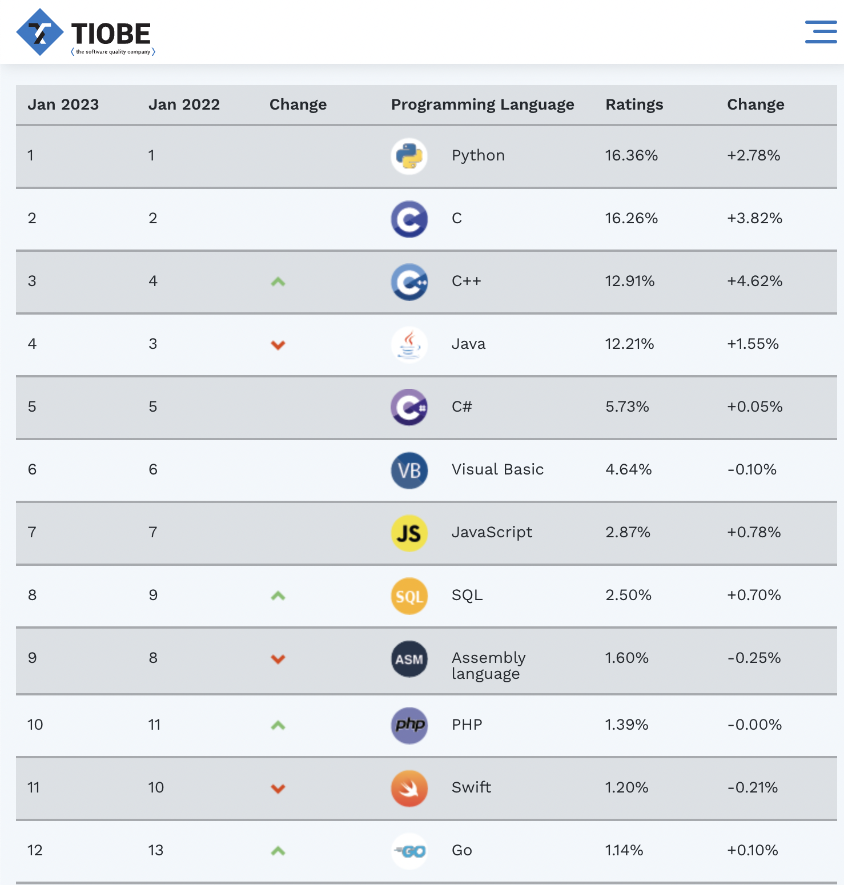

# 关于Python
本文参考：
1. [AWS Python介绍](https://aws.amazon.com/cn/what-is/python/)

## 什么是Python？

Python 是一门易于学习、功能强大的编程语言，它提供了高效的高级数据结构，还能简单有效地面向对象编程。Python 优雅的语法和动态类型以及解释型语言的本质，使它成为多数平台上写脚本和快速开发应用的理想语言。广泛用于 Web 应用程序、软件开发、数据科学和机器学习 (ML)。开发人员使用 Python 是因为其高效和易于学习，并且可以在许多不同的平台上运行。Python 软件可供免费下载，可与所有类型的系统完美集成，并且还可以提高开发速度。

:::tip

人生苦短，我用 Python。

目前Python 是当下最火的编程语言之一，连续多次荣获TIOBE（[TIOBE index](https://www.tiobe.com/tiobe-index/)是一种衡量编程语言流行度的标准）『年度最佳编程语言』桂冠。

截止2023年1月，Python 在 TIOBE index排行榜。

:::

## Python 有哪些优势？

Python 的优势包括：

- 开发人员可以轻松阅读和理解 Python 程序，因为其具有像英语一样的基本语法。 
- Python 可提高开发人员的效率，因为与许多其他语言相比，开发人员使用较少行数的代码即可编写 Python 程序。
- Python 具有大型标准库，包含适用于几乎任何任务的可重复使用代码。因此，开发人员不必从头开始编写代码。
- 开发人员可以轻松使用 Python 搭配其他受欢迎的编程语言（例如 Java、C 和 C++）。
- 活跃的 Python 社群包括来自全球的数百万名开发人员，可提供支持。如果您遇到问题，您可以从社群获得快速支持。
- 如果您想学习 Python，海量有帮助的资源遍布互联网。例如，您可以轻松找到视频、教程、文档和开发人员指南。
- Python 可在不同的计算机操作系统（例如 Windows、macOS、Linux 和 Unix）之间迁移。

## Python 有哪些用途？

Python 语言在应用程序开发方面具有多种使用场景，包括以下示例：

### 服务器端 Web 开发
服务器端 Web 开发包括复杂的后端函数，网站通过执行这些函数向用户显示信息。例如，在通过网络发送数据时，网站必须与数据库进行交互，与其他网站进行通信，以及保护数据。 

Python 对编写服务器端代码非常有用，因为其提供许多库，这些库中包含预编写的复杂后端函数代码。开发人员也可以使用广泛的 Python 框架，这些框架提供所有必须的工具以快速和轻松构建 Web 应用程序。例如，开发人员可以在数秒内创建框架 Web 应用程序，因为他们不需要从头开始编写。然后，他们可以使用框架的测试工具对其进行测试，而无需依赖于外部测试工具。

### 通过 Python 脚本实现自动化
脚本语言是一种编程语言，用于自动化人类通常执行的任务。程序员广泛使用 Python 脚本自动化许多日常任务，如下所列：

1. 一次性重命名大量文件
2. 将文件转化为另一种文件类型
3. 删除文本文件中的重复字词
4. 执行基本数学运算
5. 发送电子邮件消息
6. 下载内容
7. 执行基本日志分析
8. 查找多个文件中的错误

### 数据科学和机器学习
数据科学从数据提取有价值的知识，机器学习（ML）教授计算机自动从数据学习并做出准确预测。数据科学家将 Python 用于数据科学任务，如下所列:

修复和删除不正确的数据，也称为数据清理 
提取和选择众多数据功能
数据标注指为数据添加有意义的名称
从数据中查找不同的统计数据
使用图表和图形（例如折线图、条形图、直方图和饼图）可视化数据
 
数据科学家使用 Python ML 库训练 ML 模型并构建准确分类数据的分类器。不同领域的人员使用基于 Python 的分类器执行分类任务，例如图像、文本和网络流量分类；语音识别；以及人脸识别。数据科学家也将 Python 用于深度学习，深度学习是一种高级 ML 技术。

### 软件开发
软件开发人员通常将 Python 用于不同的开发任务和软件应用程序，如下所列：

持续跟踪软件代码中的错误
自动构建软件
处理软件项目管理
开发软件原型
使用图形用户界面 (GUI) 库开发桌面应用程序
开发基于文本的简单游戏直至更复杂的视频游戏
软件测试自动化
软件测试是指检查软件的实际结果是否与预期结果相匹配以确保软件没有错误的流程。 

开发人员使用 Python 单元测试框架（例如 Unittest、Robot 和 PyUnit）测试其编写的函数。 
软件测试人员使用 Python 为众多测试场景编写测试用例。例如，他们使用其测试 Web 应用程序的用户界面、多个软件组件和新功能。 
开发人员可以使用多种工具自动运行测试脚本。这些工具称为持续集成/持续部署 (CI/CD) 工具。软件测试人员和开发人员使用 CI/CD 工具（例如 Travis CI 和 Jenkins）自动化测试。只要开发人员引入新的代码更改，CI/CD 工具就会自动运行 Python 测试脚本并报告测试结果。

## Python 的发展历史？

荷兰的计算机程序员吉多·范罗苏姆（Guido Van Rossum）创建了 Python。他于 1989 年在荷兰国家数学与计算机科学研究中心 (CWI) 开启了 Python 之旅，最初只是为在圣诞节期间能保持依旧忙碌的业余爱好。语言的名字受 BBC 电视剧《巨蟒剧团之飞翔的马戏团》的启发，因为吉多·范罗苏姆是该剧的忠实粉丝。 

Python 版本的历史
- 吉多·范罗苏姆于 1991 年发布了首版 Python 代码（版本 0.9.0）。其已包括一些优秀功能，例如一些用于错误处理的数据类型和函数。 

- Python 1.0 于 1994 年发布，提供轻松处理数据列表的新函数，例如映射、筛选和减少。
- Python 2.0 于 2000 年 10 月 16 日发布，为程序员提供新的有用功能，例如支持 Unicode 字符和以较短方式遍历列表。
- Python 3.0 于 2008 年 12 月 3 日发布。其包括更多功能，例如打印函数，为数字除法和错误处理提供更多支持。 

## Python 有哪些特点？
Python 编程语言的特点铸就其独一无二：

### 一种直译式语言
Python 是一种直译式语言，这意味着其直接逐行运行代码。如果程序代码中存在错误，其将停止运行。因此，程序员可以快速找到代码中的错误。

### 一种易于使用的语言
Python 使用像英语一样的字词。与其他编程语言不同，Python 不使用花括号。其使用缩进。 

### 一种动态输入的语言
程序员在编写代码时不必说明变量类型，因为 Python 会在运行时确定变量类型。正因为如此，您可以快速编写 Python 程序。

### 一种高级语言
与一些其他编程语言相比，Python 更接近于人类语言。因此，程序员不必担心其底层功能性，例如架构和内存管理。

### 一种面向对象语言
Python 将任何事物视为对象，但是其也支持其他类型的编程，例如结构化和函数式编程。

## 常用的Python库

### 什么是Python库？
库是常用代码的合辑，开发人员可以在其 Python 程序中包括库以避免从头开始编写代码。默认情况下，Python 附带标准库，内含大量可重复使用的函数。此外，超过 13.7 万个 Python 库适用于众多应用程序，包括 Web 开发、数据科学和机器学习 (ML)。

### Web后端开发

1. [Flask](https://flask.palletsprojects.com/en/2.2.x/)

3. [FastAPI](https://fastapi.tiangolo.com/)

2. [Django](https://www.djangoproject.com/)

### 数据分析

1. [NumPy](https://numpy.org/)

2. [Pandas](https://pandas.pydata.org/)

3. [Matplotlib](https://matplotlib.org/)

### 科学计算

1. [SciPy](https://scipy.org/)

### 机器学习与人工智能

1. [scikit-learn](https://scikit-learn.org/stable/)

2. [Pytorch](https://pytorch.org/)

### 网络爬虫

1. [Scrapy](https://scrapy.org/)

### 计算机图形学

1. [Taichi](https://www.taichi-lang.org/)

### 游戏

1. [PyGame](https://www.pygame.org/)
