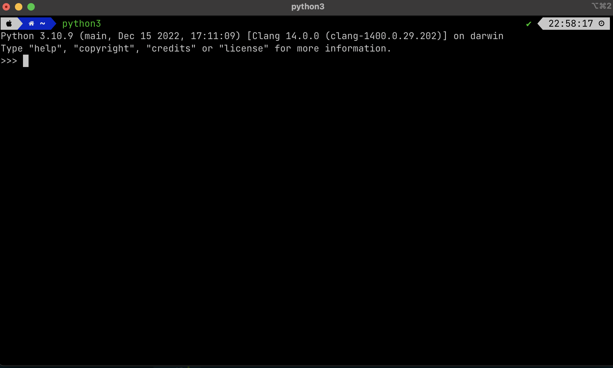

# MacOS 安装

:::caution

*非常重要，请仔细阅读完本文以后再进行相关操作。（因未仔细阅读完本文，出现任何错误后果自负， 逃～～～逃～～～逃*

:::

## 安装C编译器

```bash
xcode-select --install
```

## 配置Homebrew 环境变量
安装完成Homebrew后，需将其所在路径插入到PATH环境变量的最前面，即在您所登录用户的 ~/.profile 文件末尾加上这一行：

```bash
export PATH=/usr/local/bin:/opt/homebrew/bin:$PATH
```

:::note

Homebrew 是啥？请看[Mac必备神器Homebrew](https://zhuanlan.zhihu.com/p/59805070)

:::

## Homebrew 安装Python

```bash
brew install python
```

## 运行Python交互式解释器(REPL)

:::tip
“读取-求值-输出”循环（英语：Read-Eval-Print Loop，简称REPL），也被称做交互式顶层构件（英语：interactive toplevel），是一个简单的，交互式的编程环境。这个词常常用于指代一个Lisp的交互式开发环境，也能指代命令行的模式。———[维基百科](https://zh.m.wikipedia.org/zh-hans/%E8%AF%BB%E5%8F%96%EF%B9%A3%E6%B1%82%E5%80%BC%EF%B9%A3%E8%BE%93%E5%87%BA%E5%BE%AA%E7%8E%AF)
:::

在命令行中输入如下命令，便可进入Python的REPL
```bash
python3
```

见到如下界面便说明Python安装成功了：



