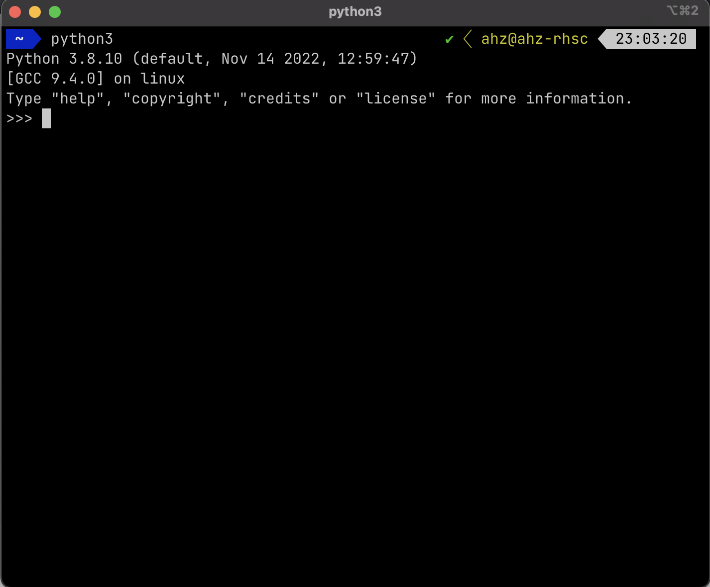

# Ubuntu Linux 安装

## Ubuntu 包管理工具安装

```bash
sudo apt install python3 python3-pip
```

## 运行Python交互式解释器(REPL)

:::tip
“读取-求值-输出”循环（英语：Read-Eval-Print Loop，简称REPL），也被称做交互式顶层构件（英语：interactive toplevel），是一个简单的，交互式的编程环境。这个词常常用于指代一个Lisp的交互式开发环境，也能指代命令行的模式。———[维基百科](https://zh.m.wikipedia.org/zh-hans/%E8%AF%BB%E5%8F%96%EF%B9%A3%E6%B1%82%E5%80%BC%EF%B9%A3%E8%BE%93%E5%87%BA%E5%BE%AA%E7%8E%AF)
:::

在命令行中输入如下命令，便可进入Python的REPL
```bash
python3
```

见到如下界面便说明Python安装成功了：

