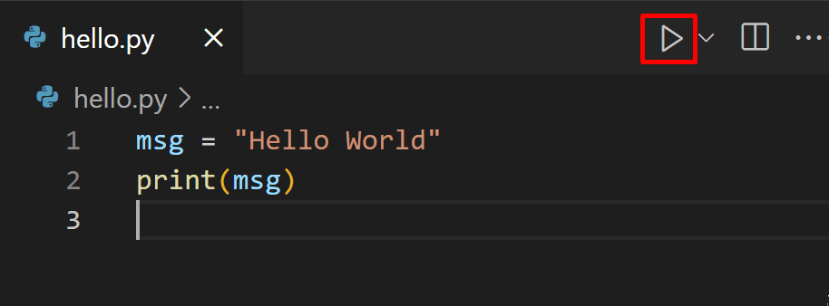

# VS Code 搭建 Python 开发环境

本文参考：

- [Getting Started with Python in VS Code](https://code.visualstudio.com/docs/python/python-tutorial#_start-vs-code-in-a-workspace-folder)

在本教程中，你将使用 Python 3 在 VS Code 中创建最简单的一个 “Hello World” 应用程序。

## VS Code是什么？

VS Code 是由微软推出的一款轻量级但功能强大的源代码编辑器，支持 Windows、macOS 和 Linux 操作系统。它内置了对 JavaScript、TypeScript 和 Node.js 的支持，并拥有丰富的其他语言和运行时扩展生态系统（例如 C++、C#、Java、Python、PHP、Go、.NET）。VS Code近些年来越来越受开发者欢迎，是因为它的身上存在这么几个亮点：

1. 第一是**打开速度快**，用VS Code来打开一个项目，基本上可以说是秒开，即使是很大的项目，也可以非常快的被打开。

2. 第二是**支持的编程语言非常多**，VS Code在初始状态（即不按装任何的扩展的情况）下对Web前端开发、Node.js开发等语言的开发都有很好的支持，至于其它的一些编程语言，比如说：Java、Python、Go、Ruby、C#、C/C++等等，只要安装相应的扩展就能很好的完成开发环境的搭建。

3. 第三是**拥有丰富的扩展**，VS Code的扩展十分丰富，首先从量上来看，VS Code的扩展数量已经上万，涵盖了方方面面，你能想到的它都有。

接下来，我们来看两个可能会遇到的并且有点令人迷惑的英文词汇：``Visual Studio Code``和``Visual Studio``。其实``VS Code``的全称叫做 ``Visual Studio Code``，作为微软于2015年推出的一款代码编辑器，他还有一位老大哥，叫做``Visual Studio``。所以，``Visual Studio Code``和``Visual Studio``是两款不同的代码编辑器。

## 安装 VS Code

通过前面的教程，你应该在你电脑安装好了 Python 环境，接下来就需要你搭建一个 Python 开发环境。首先第一步就是安装 VS Code。

VS Code 的下载地址：https://code.visualstudio.com。  鉴于你已经开始进入编程的世界，并且已经读了我们[Lab0预学习](../../labs/index.md)阶段的内容，我们相信你可以通过自己的自我探索在你的电脑上成功安装VS Code。我们在此不提供保姆级的教程。

## 安装 Python 拓展

由于VS Code原生不完美支持 Python，我们需要安装一个 Python 插件用以支持 Python 编程所需要各种功能。

:::tip

这也是VS Code这么轻量的原因，最基础版本只提供必备功能，其他的功能通过插件来扩展，你需要什么通过插件便可得到，宇宙第一的代码编辑器由此得来。（Vim： 什么宇宙第一编辑器？那我还是编辑器之神呢？ Emacs：那我还是神之编辑器！！！

:::

### 1. 打开VS Code，进入插件市场


### 2. 搜索 `Python`

通过搜索，你可以看到 Python 这个插件，安装此插件。


重启VS Code，VS Code就会加载 Python 插件，这样你就得到一个支持 Python 的VS Code。


## 创建一个 Python 工作目录

在进入代码编写之前，VS Code 需要一个 `workspace`。对于这个 `workspace` 其实很简单，VS Code打开一个文件夹，这个文件夹所在的地方就是 VS Code 的 `workspace`

### 1. 新建一个文件夹

请在你的电脑的合适位置，新建一个用于存放 Hello World 代码的文件夹。（我这文件夹名字叫 `HELLO`

### 2. 用 VS Code 打开这个文件夹。

在 VS Code 的菜单栏中打开 `File --> Open Folder`, 选择刚创建的文件夹 `HELLO`。


这样你就得到了一个 VS Code 的 `workspace`。


## Hello World 程序运行

接下来我们开始进入 Hello world 程序的编写。

### 1. 新建一个 Python 源代码文件

在文件资源管理器工具栏中，选择 `HELLO` 文件夹上的新建文件按钮：


将文件命名为 `hello.py`，它会自动在编辑器中打开。


通过使用 .py 文件扩展名，您告诉 VS Code 将此文件解释为 Python 程序，以便它使用 Python 插件和 Python 解释器。

:::tip

文件资源管理器工具栏还允许你在工作区内创建文件夹以便更好地组织代码, 你可以使用新建文件夹按钮快速创建文件夹。

:::

### 2. 输入代码

现在您的工作区中已有代码文件，请在VS Code 中的`hello.py`文件里输入以下源代码。

```python
msg = "Hello World"
print(msg)
```

当您开始键入 print 时，请注意 VS Code 的 IntelliSense 功能会自动开启代码补全，提供自动补全的候选项。


IntelliSense 的自动补全功能支持标准 Python 模块以及在你电脑里安装的 Python 包。它还为对象类型上可用的方法提供补全。例如，因为 `msg` 变量包含一个字符串，所以当您键入 `msg` 时，IntelliSense 会提供字符串方法：


### 3. 保存代码

按住 `ctrl+s(MacOS ⌘+s)`, 保存代码。

### 4. 运行代码

VS Code 中运行 hello.py 很简单，只需单击编辑器右上角的 `Run Python File in Terminal` 的按钮



该按钮会打开一个终端，Python 解释器会在其中自动激活，然后运行 `​​python3 hello.py` (macOS/Linux) 或 `python hello.py` (Windows)。然后你就能在终端里看到 `Hello World` 的信息被打印出来。


## Debug 代码

建议你开始对 Python 语法有了一些初步认知以后，学习一下 VS Code 里面 Debug Python 代码。一个合格的程序员应该知道如何 Debug 自己写的代码，课程网站提供[用 VS Code Debug Python 代码的教程](../debug.md)

## 推荐观看视频

此视频为 Windows 搭建开发环境。什么你是 MacOS/Linux 用户？？？ 那已经是一个成熟的类Unix操作系统用户了，类比一下教程或者视频内容，就能搭建好 Python 开发环境。

<iframe src="//player.bilibili.com/player.html?aid=298326232&bvid=BV1tF411M7hy&cid=581061448&page=1" width="100%" height="600" allowfullscreen="allowfullscreen" scrolling="no" border="0" frameborder="no" framespacing="0" allowfullscreen="true"> </iframe>

视频链接：https://www.bilibili.com/video/BV1tF411M7hy


