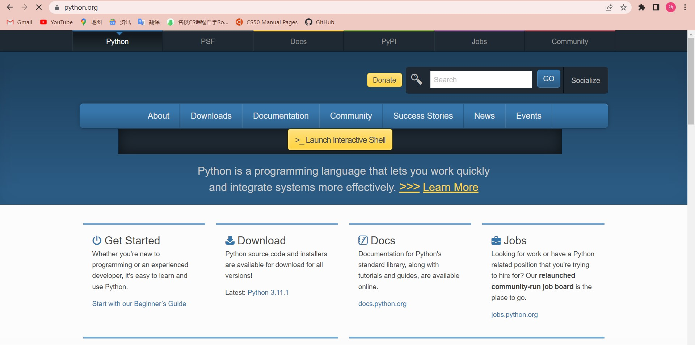
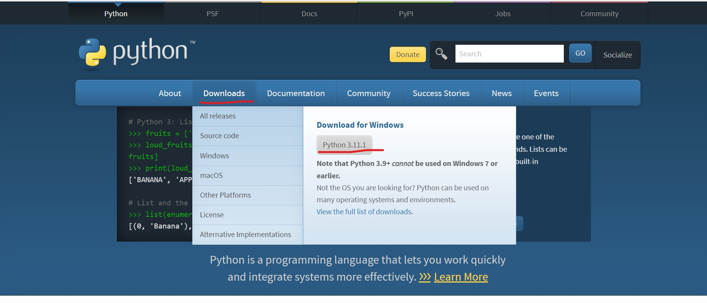
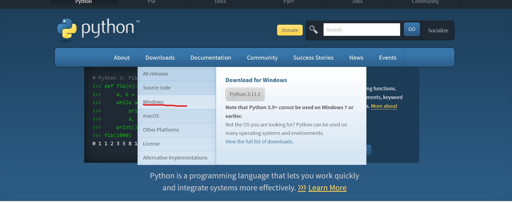
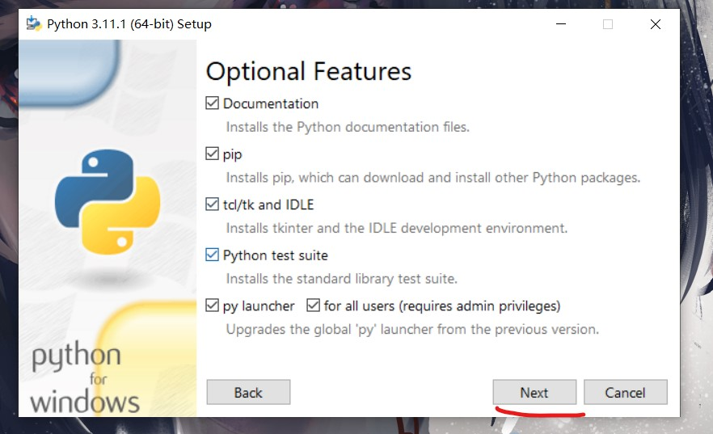
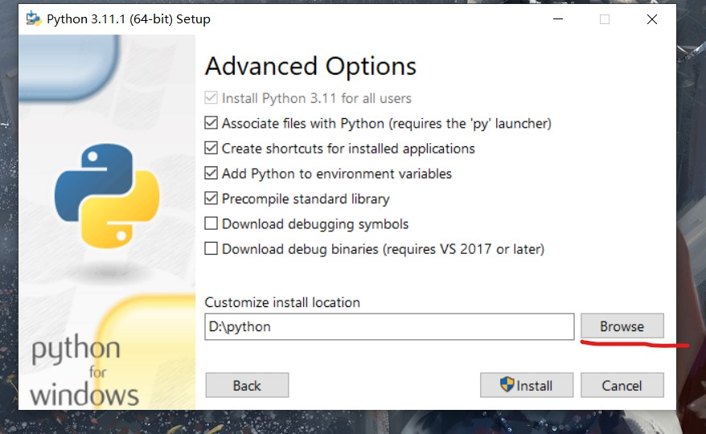
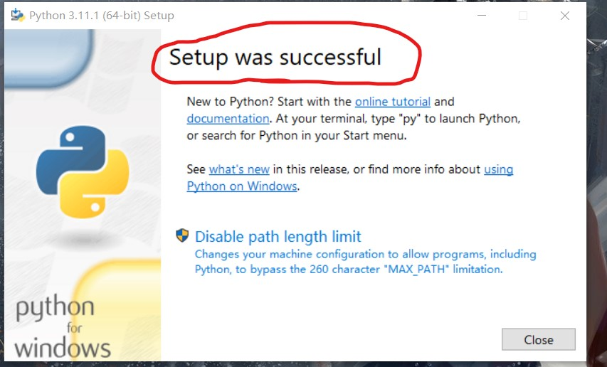
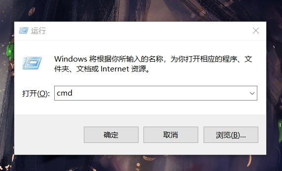
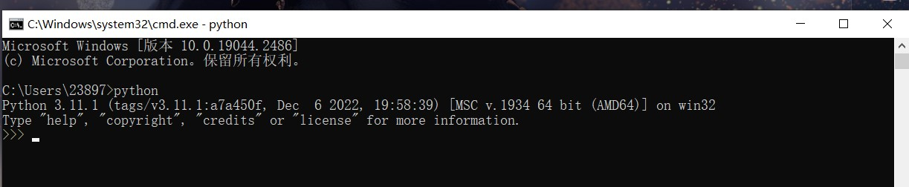

# Windows 安装
## 使用浏览器进入python官网:python.cn

##进入首页点击"Downloads"
##若你的windows系统是Win7以上的版本则可以点击"Python 3.11.1"下载最新版本

##若是Win7及以下的版本则需点击Windows进入相关页面寻找适配版本

##打开安装包,点击"Customize installation"选择安装路径

##若显示"Setup was successful"字样则下载成功

##下载完成后关闭页面，通过"windows+R"打开调试页面，输入"cmd"进入调试

##输入python后若出现对应版本则安装无误
 