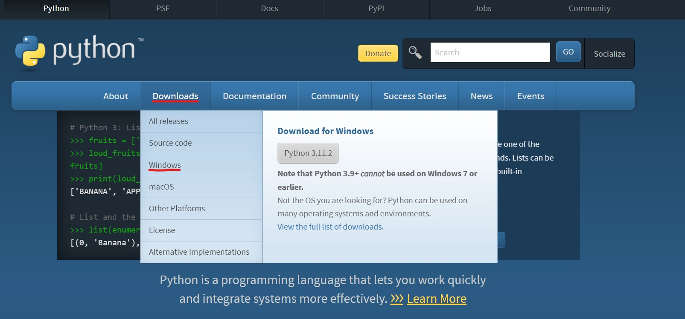
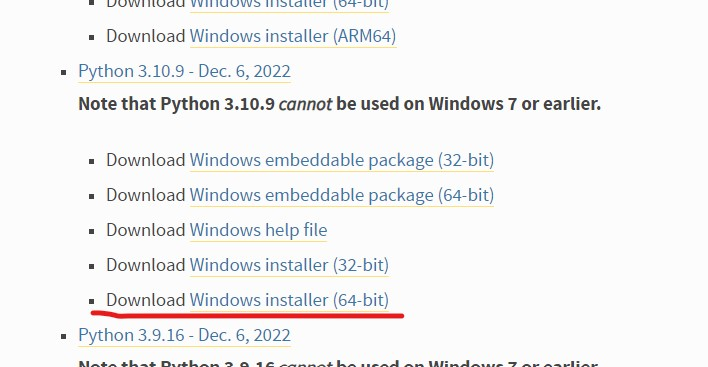
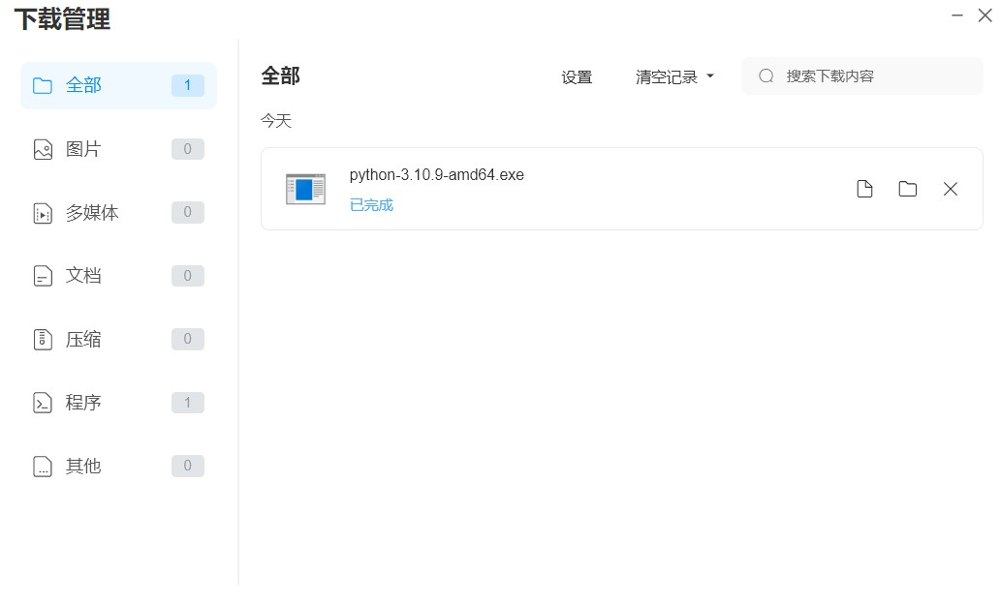
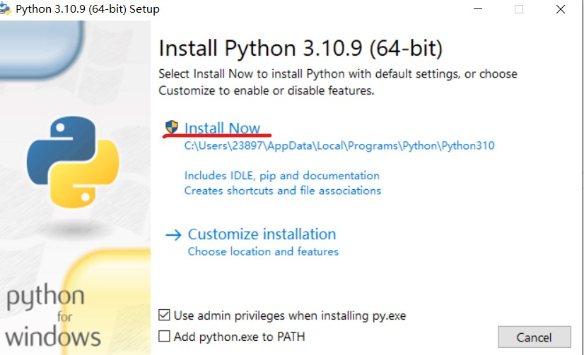
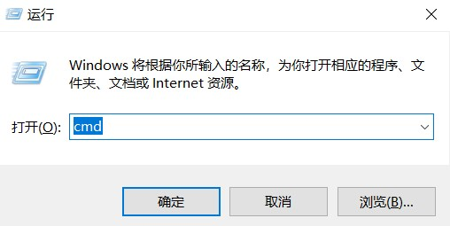
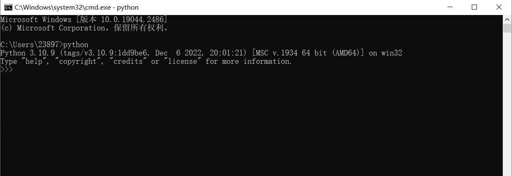

# Windows 安装

## 下载安装包

Python官网地址为:https://www.python.org/

1.进入首页点击"Downloads"，然后点击"windows"

2.选择"Python 3.10.9"这一版本进行下载

:::danger
本课程Windows上的Python版本为3.10.9，请不要下错版本。
:::

## 安装
1.找到刚才下载好的Python安装程序，双击进行安装

2.勾选`Add python.exe to PATH`，然后点击"Install Now"进行默认安装

:::danger
一定要勾选 `Add python.exe to PATH`
:::

3.当出现"Setup was successful"时则安装结束

## 验证是否安装成功

1."windows+R"打开运行页面，输入"cmd"进入Windows命令行终端。

2.输入`python`命令出现如下类似信息，则说明安装成功。

