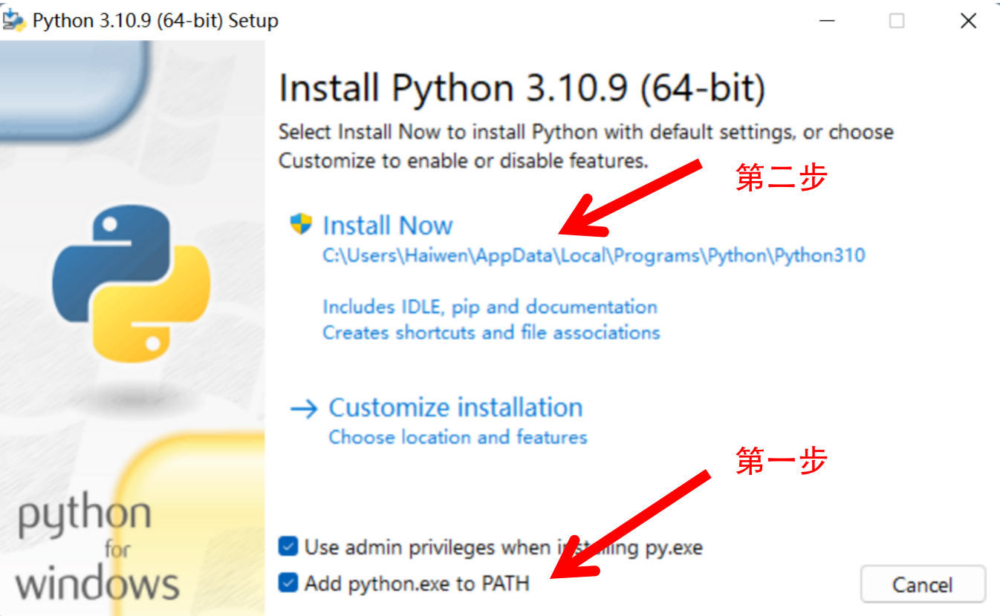
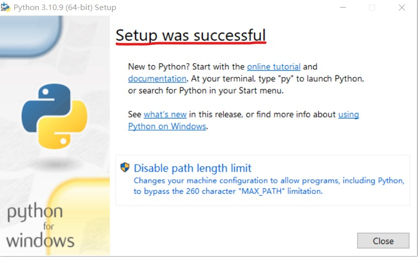

# Windows 安装
## 下载安装包
python官网地址为:https://www.python.org/
1.进入首页点击"Downloads",将鼠标移动过去，然后点击"windows"

2.选择"python 3.10.9"这一版本进行下载

## 安装
1.exe可执行程序下载完后点击进行安装

2.点击"Install Now"默认安装的选项

3.当出现"Setup was successful"时则下载成功

## 配置python
1.找到你下载python的目录,并复制路径

2.右击"此电脑"后单击"属性"

3.点击"高级系统设置"

4.选择"环境变量"

5.双击"系统变量"中的"Path"选项

6.点击"新建"后将复制的路径粘贴上去

7.点击"确定"关闭所有页面

## 验证是否安装成功
1."windows+R"打开调试页面，输入"cmd"进入Windows命令行终端。

2.输入python出现如下类似信息，则说明安装没有问题。
