# Jupyter Notebook 介绍

## Jupyter 速查手册


## 1. 安装
```bash
pip install notebook
```
## 2.扩展
扩展官方文档：https://jupyter-contrib-nbextensions.readthedocs.io/en/latest/ Github地址 ：https://github.com/ipython-contrib/jupyter_contrib_nbextensions
 
发现多了Nbextensions， 然后取消勾选下面的这个选项就可以使用扩展了
 

## 3. notebook界面
3.1 在终端环境下输入 jupyter notebook即可在浏览器中自动打 notebook
点击 NEW 可创建新的 notebook、Text File(文本文件)、Folder(文件夹)或Terminal(终端)
- "Text File" 选项中，你会得到一个空白的文档。输入你喜欢的任何字母，单词和数字。它基本上是一个文本编辑器（类似于 Ubuntu 上的应用程序）。你也可以选择一种语言（支持非常多的语言），然后用该语言来写一个脚本。你还可以查找和替换文件中的单词。
- "Folder" 选项中， 顾名思义它的功能就是创建文件夹。你可以创建一个新文件夹来放入文件，重新命名或者删除它。
- "Terminal" 的工作方式与你的 Mac 电脑或 Linux 电脑上的终端完全相同（或者 Windows 上的 cmd ）。它在你的Web浏览器中支持终端会话。在这个终端中输入 python ，瞧！现在你已经可以开始写 python 脚本了。
但在本文中，我们将重点介绍 Notebooks，因此我们将从“New”选项中选择 "Python 3" 选项。你会看到如下的截图
 
3.2 你可以导入最常见的 Python 库——pandas 和 numpy——来开始你的项目。代码上方的菜单栏提供了操作单元格的各种选项：insert (添加)，edit (编辑)，cut (剪切)，move cell up/down (上下移动单元格)，run cells(在单元格中运行代码)，interupt (停止代码)，save (保存工作)，以及 restart (重新启动内核)。
 
在下拉菜单中（如上所示），你有四个选项：
- Code - 这是你输入代码的地方
- Markdown - 这是你输入文本的地方。你可以在运行代码后添加结论，添加注释等。
- Raw NBConvert - 这是一个命令行工具，可将你的笔记本转换为另一种格式（如 HTML ）
- Heading - 你可以将标题添加到单独的小节并使你的 Notebook 看起来干净整洁。这个选项现在已经集成到 Markdown 选项中。添加一个“##”，以确保在你之后输入的内容将被视为标题

## 4.快捷键
notebook 自带一组快捷键，能让你快速使用键盘与单元格交互，而无需使用鼠标和工具栏。熟悉这些快捷键需要花费一点时间，但如果能熟练掌握，将大大加快你在 notebook 中的工作速度。
这些快捷键可以通过单元格 蓝色 状态下按 "h" 来查看：
 

## 5.命令
### 5.1系统命令
以!开始的一行命令可以运行系统命令（也就是启动jupyter notebook时的终端命令），这里以windows下的cmd命令提示符为例。
 
5.1.1 系统命令的输出内容可以储存在python变量中
 
5.1.2 在命令行中使用python变量
 
5.1.3 系统命令也可以嵌套在python循环内使用
 
### 5.2魔法命令
5.2.1 Magic有两种形式：Line Magics和Cell Magics
- Line Magics：以%开头，该行后面的内容都是Line Magics代码
- Cell Magics：以%%开头，后面整个单元格内都是Cell Magics代码
 
5.2.2 %lsmagic查看所有魔法命令
 
5.2.3 %time?查看time魔法命令帮助文档
 
5.2.4 %time??查看time魔法命令源代码
 
### 5.3 常用的魔法命令
5.3.1 %%writefile命令用于将本单元格中的代码写入一个文件。
命令格式：%%writefile [-a] filename
如果带有-a参数则将内容追加到文件中，否则将覆盖文件内容
5.3.2 %pycat命令用于显示python源文件内容。
命令格式：%pycat filename，filename可以是本地文件、URL和代码历史范围等
5.3.3 %run命令用于运行python源文件。
命令格式：%run filename。
5.3.4 %load命令用于加载文件到Notebook中
命令格式：%run filename，filename可以是本地文件、URL和代码历史范围等
5.3.5 %store命令用于保存变量当前值，可以在多个Notebook之间传递变量。
命令格式：%store variablename。
当前Notebook中储存,另一个Notebook中取出
5.3.6 %who命令用于显示所有变量清单，也可以显示指定变量类型。
命令格式：%who [type].
5.3.7 %matplotlib inline，使得matplotlib绘制的图像直接在单元格中显示，而不需要plt.show()
5.3.8 自定义魔法命令
官方文档：https://ipython.readthedocs.io/en/stable/config/custommagics.html

## 6. display模块显示示多媒体内容
Jupyter notebook中使用IPython.display模块可以输出显示多媒体内容，如音频、视频、图片和网页等
### 6.1 显示图片、HTML、音频、视频
6.1.1 导入需要的类和函数，display用于显示多媒体内容
 
6.1.2 显示图片
 
6.1.3 显示HTML
 
6.1.4 播放音频
 
6.1.5 显示视频
 
### 6.2 显示网页
6.2.1 直接嵌入网页
 
6.2.2 嵌入在线音频
需要找到相应的嵌入代码，例如嵌入网易云音乐，可以去网易云官网找到嵌入代码，如下图所示：
 
 
6.2.3 嵌入本地pdf
 

## 7. ipywidgets创建交互界面
widget是可以和用户交互的控件，如文本输入框，滑动条，按钮等，从而在Jupyter Notebook中构建可交互的用户界面。ipywidgets包含了丰富的widget，这些widget既是后端的python对象，也是前端的网页元素，他们可以相互发送和同步信息。
### 7.1 widget简介
ipywidgets中提供了多种widget的类，在使用各种widget时一般先进行实例化，然后设置属性，最后使用display显示。
通过dir()函数查看widget的属性和方法
 
通过widget的keys属性显示widget的所有同步的、有状态的属性

### 7.2 创建常用的widgets
7.2.2 滑动条类
滑动条类的widget控件有很多，有单个数值的IntSlider和FloatSlider和范围数值的IntRangeSlider和FloatRangeSlider。
- IntSlider和FloatSlider
IntSlider的数值都是整数，而FloatSilder是浮点数
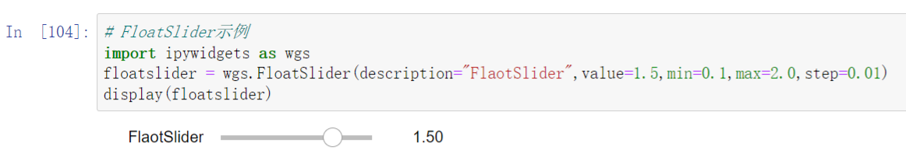 
- IntRangeSlider和FloatRangeSlider
**和上面的区别在于，这里的数值返回的是一个范围**
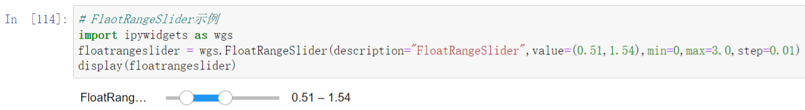 
7.2.3 进度条类
- IntProgress和FloatProgress用于显示进度条。
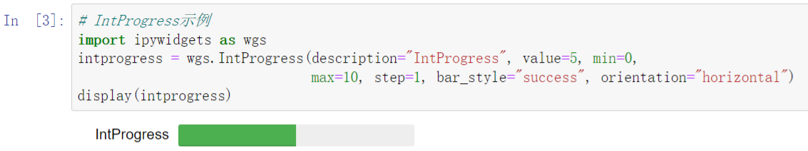
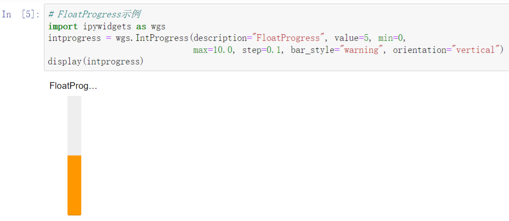
7.2.4 文本类
数值文本IntText、FloatText、BoundedIntText、BoundedFloatText，这四个widget提供了整数或者浮点数的数值文本框，并且可以通过右侧的箭头调整数值大小。
- IntText和FloatText，没有数值范围限制
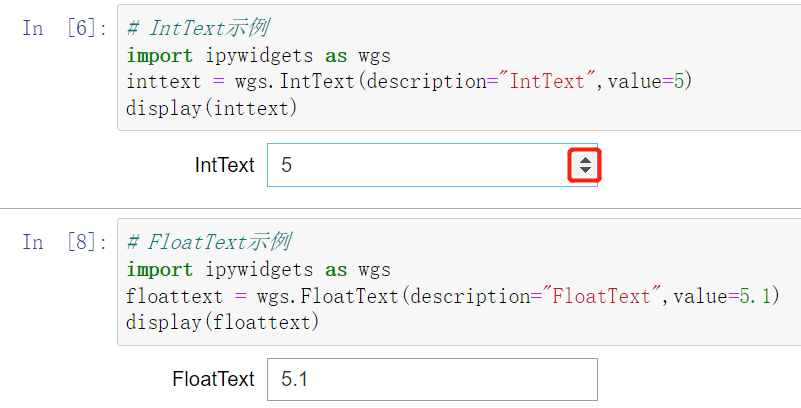
- BoundedIntText和BoundedFloatText，有数值范围限制
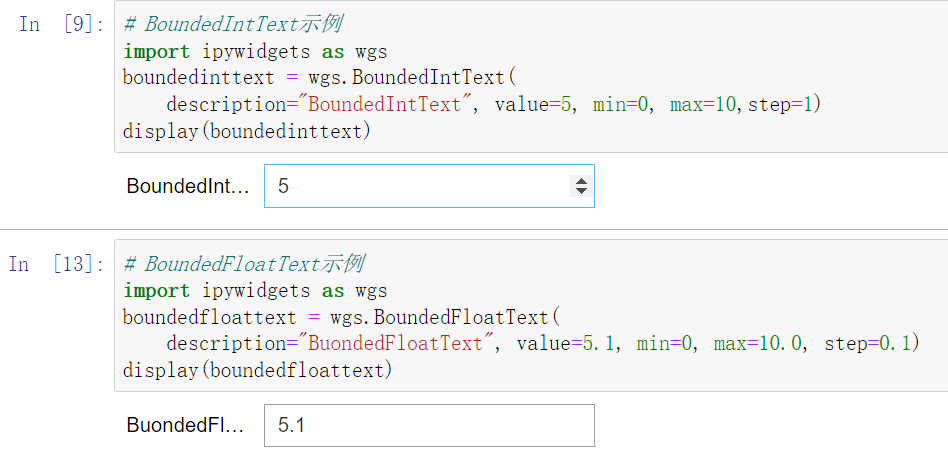
- 文字文本Text、Textarea、Label、HTML
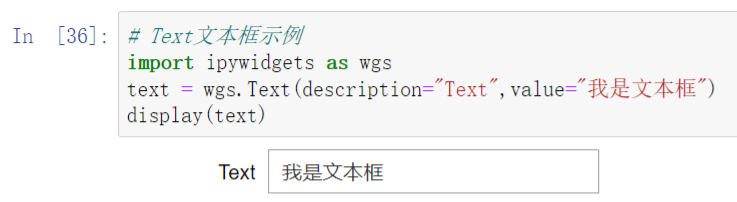
- Textarea用于输入和显示多行文本
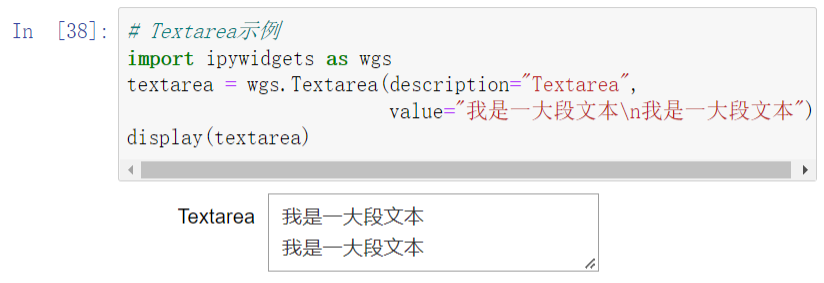
- Label用于显示标签文本
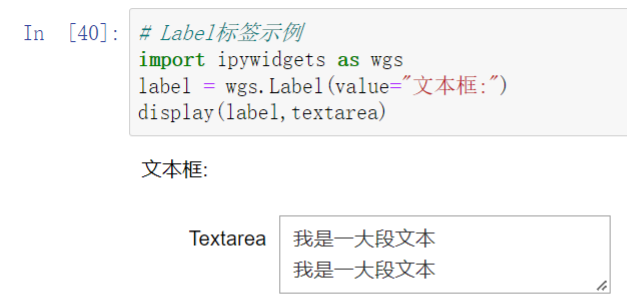
- HTML用于显示复杂格式文本

7.2.5 点击类
用于显示Bool值的一些控件
- 复选框Checkbox
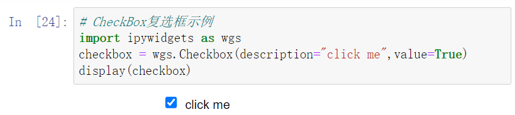
- 状态开关按钮ToggleButton
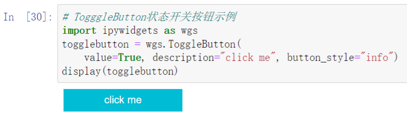
- 验证控件Valid，无法点击改变值，只能设置和读取
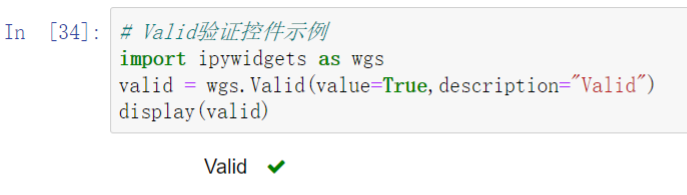
还有一种常用的点击类控件Button，它有自己的特殊方法on_click()来监听Button控件的点击情况，这种点击情况可以称之为事件
7.2.6 选项类
选项类可以显示选项列表，包括单选功能的Dropdown、RadioButtons和Select，多选功能有SelectMultiple。
- Dropdown下拉菜单
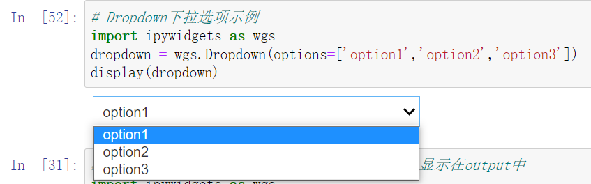
- RadioButtons选项
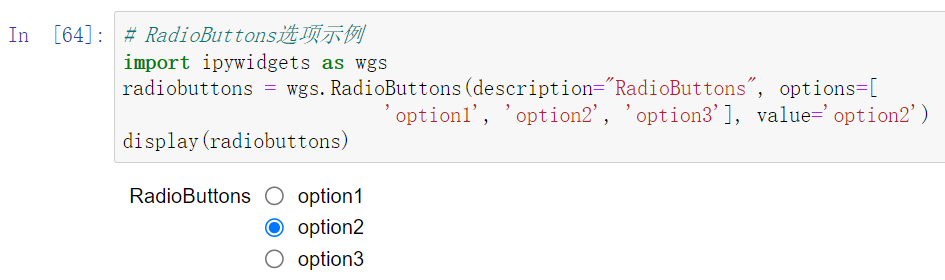
- Select选项
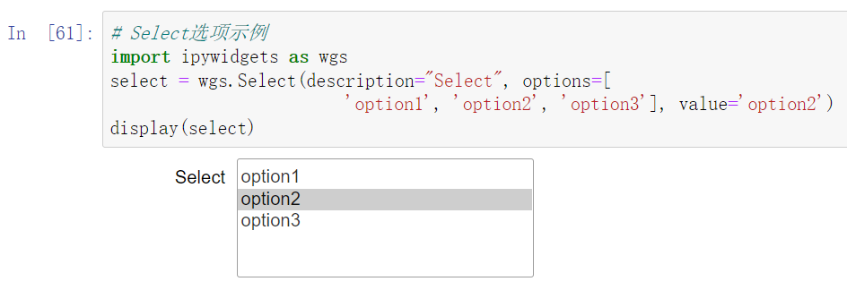
- SelectMultiple多选项
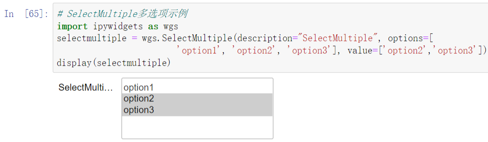
7.2.7 多媒体类
- Image显示图片
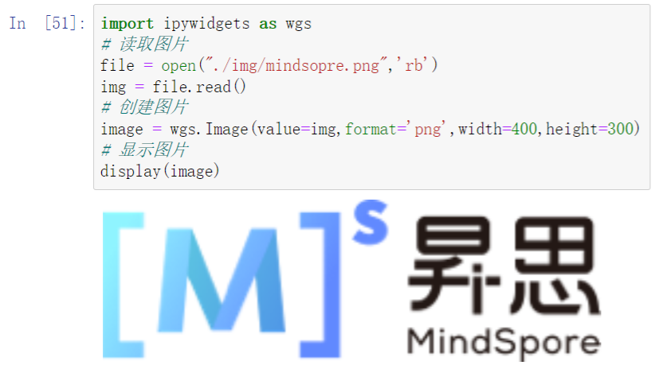
7.2.8 输出类
- 在所有widget中有一种特殊的控件——Output控件，它可以将输出统一显示在其实例化的控件中。
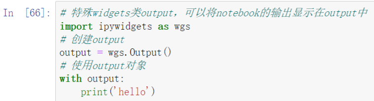
7.2.9  排版类
如果需要按一定的布局来显示多种控件，那么一些排版类的控件很方便我们实现一定的布局，常用的排版控件主要有Box、HBox、VBox、GridBox、Layout、AppLayout等。
- Box、HBox、VBox可以将各控件封装在一个“盒子”中进行排版，Box比较灵活，一般HBox和VBox可以满足一般的需求，HBox是将多个widget横向排列，VBox是将多个widget钟祥排列，下面是利用HBox和VBox排版后，显示昇思深度学习框架的一些信息。
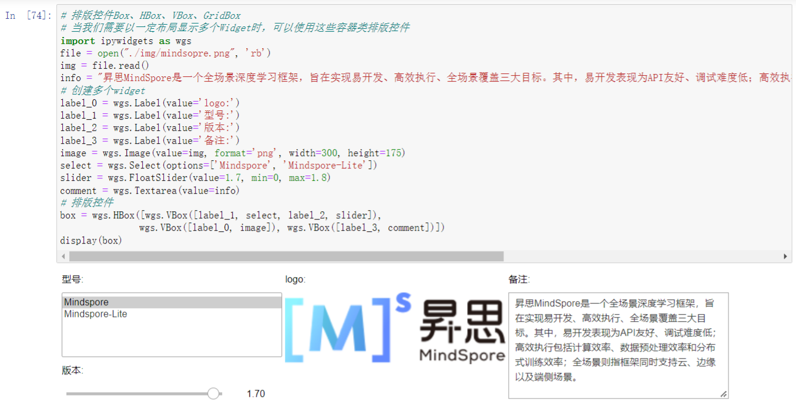
- AppLayout
AppLayout控件有header、left_siderbar、center、right_sidebar、footer属性，这些属性分别对象下面输出中的区域，可以使用AppLayout将想进行排版的控件赋值给相应的属性，用不到的位置可以赋值None，AppLayout会自动适应填充新布局。
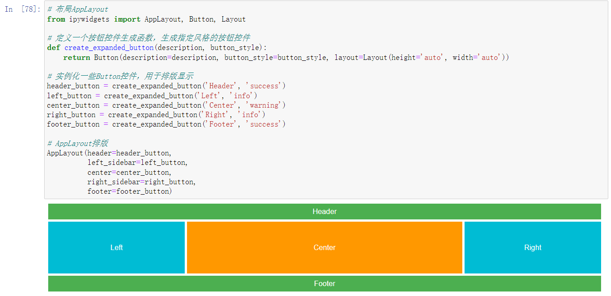

### 7.3 widget之间建立关联
**一些数值类的widget可以建立关联，改变其中一个widget的值，与其关联的widget的值也会发生变化。**
7.3.1 ink()和dlink()方法
- link()
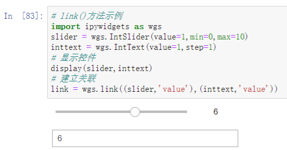
 注意建立关联的位置，改变滑动条的数值时文本框中的数值也会发生改变，反之亦然。
- dlink()
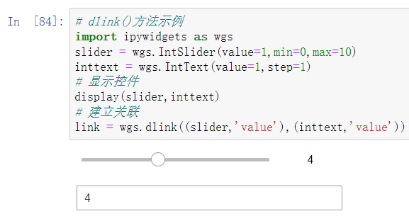
**与link()的区别在于dlink()是单向连接的，改变滑动条的数值时文本框中的数值也会发生改变，反之则不行**
7.3.2jslink()和jsdlink()方法
- jslink()
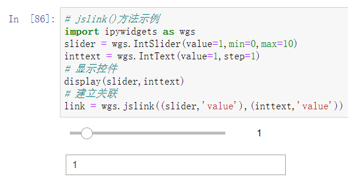
- jsdlink
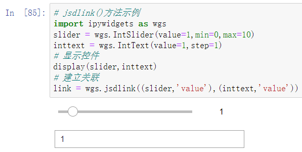
**jslink()和jsdlink()在正常情况下于link()和dlink()的功能完全一致，但是当浏览器前端于后端内核断开时，前者依然有效（仅仅在显示层面）而后者失效。**

### 7.4 断开关联
对于已经建立关联的对象，使用unlink()方法即可断开连接。

### 7.5 widget事件绑定
7.5.1 事件
交互式应用要求应用需要对操作做出相应的响应，从使用者做出操作到应用响应这个过程被称为事件。例如，点击一个按钮控件就可以触发执行一个函数，这个函数被称为事件处理函数。
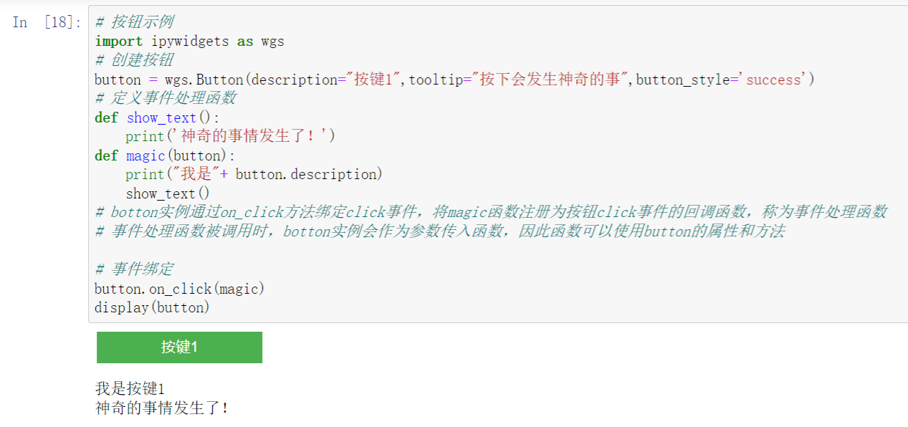
**上面的例子中，只要点击“按键1”就会打印上图所示两行内容，Button控件和事件处理函数是通过on_click()方法进行绑定的，它是Button的一种特殊方法。**
**进一步观察magic()事件处理函数可以发现，该函数的传入参数是Button控件实例化的对象，on_click()方法可以执行magic()函数并且将控件对象传入，因此事件处理函数可以使用控件的属性和方法。**
7.5.2 事件绑定方法
on_click()和on_submit()是Button控件和Text控件特有的事件绑定方法，对于其他控件有一种通用的事件绑定方法observe()
7.5.3 制作一个完整的交互应用
前面介绍了widget控件的基本使用方法，现在可以利用上面介绍的内容制作一个完整的交互式应用，该应用的功能是显示指定图片及其高斯模糊图片，并且可以实时调节高斯模糊度，进行显示。
运行前请执行pip uninstall scikit-image和pip install scikit-image==0.18，其他版本可能会出现警告。

### 7.6 自动生成交互应用
7.6.1 用interact()
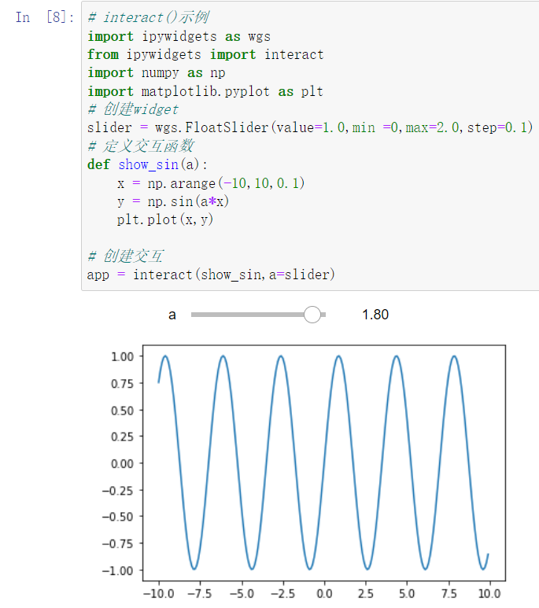
7.6.2 使用装饰器
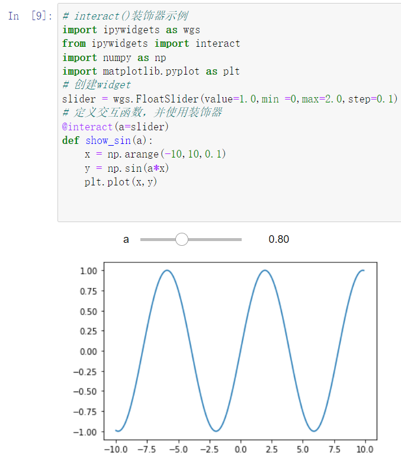
7.6.3 使用interactive()
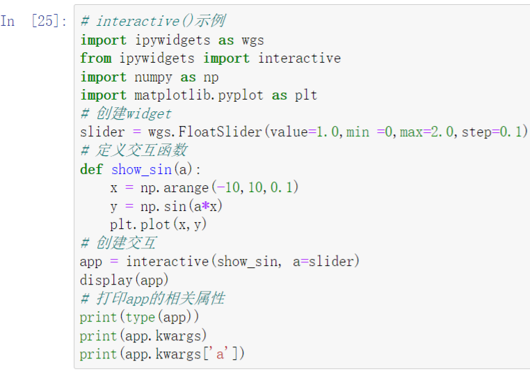
interactive()和interact()的区别在于前者必须使用diaplay()才能显示，可以根据需要自主选择显示的位置，同时interactive()返回的是一个widget，因此可以根据需要调用interactive()中各widget的属性。
7.6.4 interact_manual()或continuous_update
- 有时候希望调整结束后再显示最终结果，那么就可以使用interact_mannal()手动控制结果显示。
 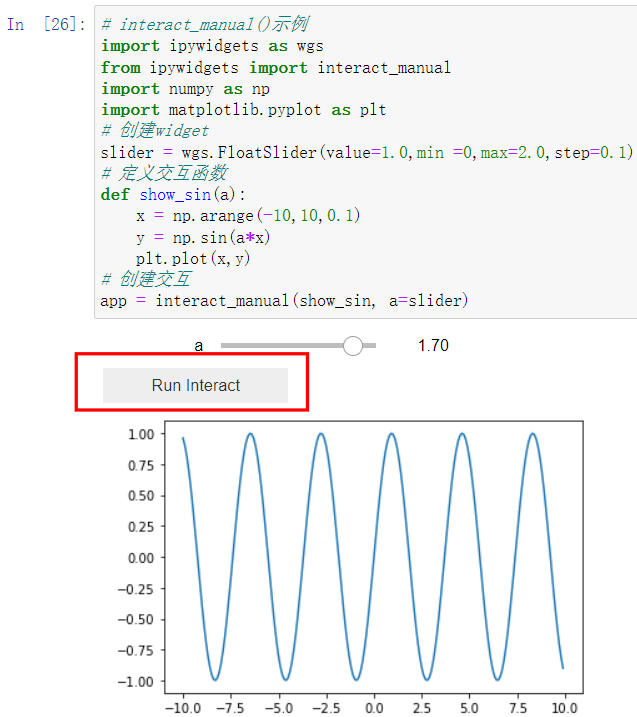
- 也可以使用控件的continuous_update属性，将其设置为False，及鼠标停止调节时，widget中的值才进行更新。
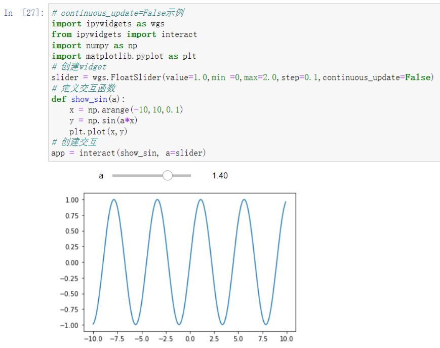

