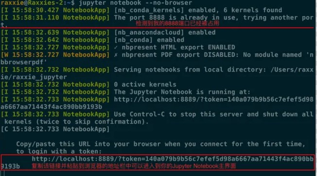
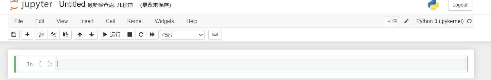
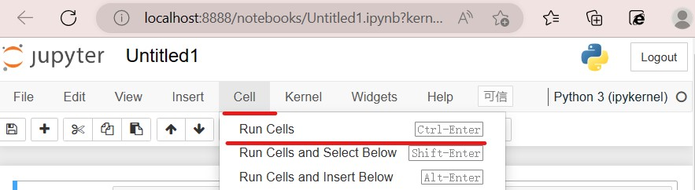
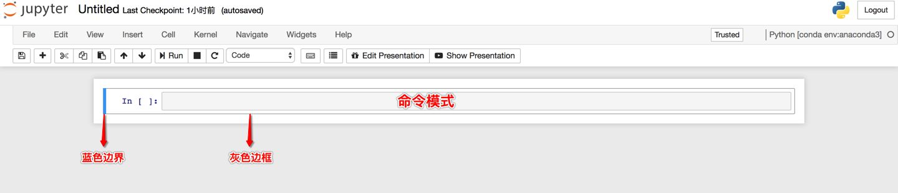
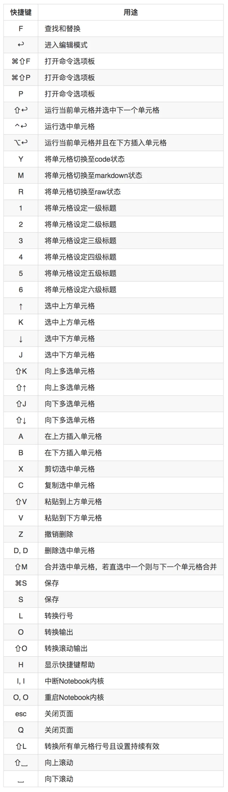
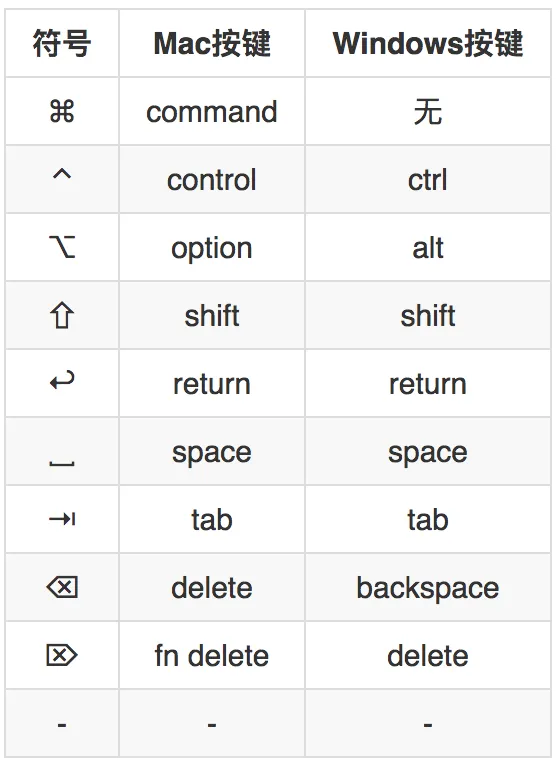

# Jupyter Notebook 介绍

## Jupyter 速查手册


## 1.简介
什么是 Jupyter Notebook呢？
>官方是这样告诉你的 ：Jupyter Notebook是基于网页的用于交互计算的应用程序。其可被应用于全过程计算：开发、文档编写、运行代码和展示结果。
但简单来说 ，它是以网页的形式打开，可以在网页页面中直接编写代码和运行代码，代码的运行结果也会直接在代码块下显示的程序。
总的来说，他是一个很牛的应用程序，也非常值得你花一些时间来了解它的应用。

## 2. 安装
```bash
pip install notebook
```
## 3. 启动
- 通过"win+R"输入"cmd"打开电脑终端


###默认端口启动
-在终端输入以下命令
```
jupyter notebook
```
-执行命令后终端会显示一系列notebook的服务信息，同时浏览器将会自动启动Jupyter Notebook。
-启动过程中终端会显示如下内容
```
$ jupyter notebook
[I 08:58:24.417 NotebookApp] Serving notebooks from local directory: /Users/catherine
[I 08:58:24.417 NotebookApp] 0 active kernels
[I 08:58:24.417 NotebookApp] The Jupyter Notebook is running at: http://localhost:8888/
[I 08:58:24.417 NotebookApp] Use Control-C to stop this server and shut down all kernels (twice to skip confirmation).
```
*注意：之后在Jupyter Notebook的所有操作，都**保持终端不要关闭**，一旦关闭就会与本地链接断开，就无法再继续再Jupyter Notebook中进行其他操作啦。*

-浏览器地址栏中默认地会显示：http://localhost:8888
"localhost"是指本机，"8888"则为端口号
但如果你启动了多个Jupyter Notebook，由于默认端口“8888”被占用，因此地址栏中的数字将从“8888”起，每多启动一个Jupyter Notebook数字就加1，如“8889”、“8890”……

###指定端口
-在终端输入以下命令
```
jupyter notebook --port port_number
```
其中，`port_number`是自定义端口号，直接以数字的形式写在命令当中。如："jupyter notebook --port 9999"，即在端口号为“9999”的服务器启动Jupyter Notebook。

###启动服务器但不打开浏览器
如果你只是想启动Jupyter Notebook的服务器但不打算立刻进入到主页面，那么就无需立刻启动浏览器。在终端中输入：
```
jupyter notebook --no-browser
```
此时，将会在终端显示启动的服务器信息，并在服务器启动之后，显示出打开浏览器页面的链接。当你需要启动浏览器页面时，只需要复制链接，并粘贴在浏览器的地址栏中，轻按回车变转到了你的Jupyter Notebook页面。



再上图就可以看见我同时启动了多个Jupyter Notebook，因此显示我的“8888”端口号被占用，最终分配给我的是“8889”。


## 4.帮助
如果你有任何关于 Jupyter Notebook命令的疑问你可以选择在终端查看官方文档，命令如下：
```
jupyter notebook --help
```


## 5. 运行
-启动后你会看到这样一个页面


- 这时需要你点击"NEW"然后选择"python"打开一个新的文件


- 在这个页面你就可以编写你的程序了



- 例如，我们现在输入
```
print(Hello,World)
```
- 输入完成后你可以通过点击小三角图标或者点击Cell菜单（Cell > Run Cells）来完成程序的运行




- 最终你将会看到这样的运行结果


** 如果你是想要在notebook中嵌入Matplotilb画出来的图像，你需要在最开始加入如下代码：
```
%matplotib inline
```

## 6. Jupyter Notebook快捷键
-  Jupyter Notebook笔记本的两种模式
① 命令模式
命令模式将键盘命令与Jupyter Notebook笔记本命令相结合，可以通过键盘不同键的组合运行笔记本的命令。
按esc键进入命令模式。
命令模式下，单元格边框为灰色，且左侧边框线为蓝色粗线条。



② 编辑模式
编辑模式使用户可以在单元格内编辑代码或文档。
按enter或return键进入编辑模式。
编辑模式下，单元格边框和左侧边框线均为绿色。


- 两种模式的快捷键
① 命令模式



② 编辑模式




## 7.关闭和退出
- 关闭笔记本和终端
当我们在Jupyter Notebook中创建了终端或笔记本时，将会弹出新的窗口来运行终端或笔记本。当我们使用完毕想要退出终端或笔记本时，仅仅关闭页面是无法结束程序运行的，因此我们需要通过以下步骤将其完全关闭。
⑴ 进入“Running”页面。


⑵ 第一栏是“Terminals”，即所有正在运行的终端均会在此显示；第二栏是“Notebooks”，即所有正在运行的“ipynb”笔记本均会在此显示。
⑶ 点击想要关闭的终端或笔记本后黄色“关闭”按钮。


⑷ 成功关闭终端或笔记本。
- 退出Jupyter Notebook程序
如果你想退出Jupyter Notebook程序，仅仅通过关闭网页是无法退出的，因为当你打开Jupyter Notebook时，其实是启动了它的服务器。
因此，想要彻底退出Jupyter Notebook，需要关闭它的服务器。只需要在它启动的终端上按：
```
ctrl c
```
然后在终端上会提示：“Shutdown this notebook server (y/[n])?”输入y即可关闭服务器，这才是彻底退出了Jupyter Notebook程序。