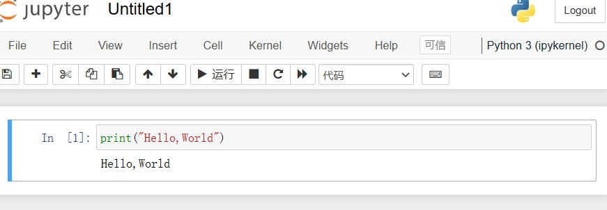
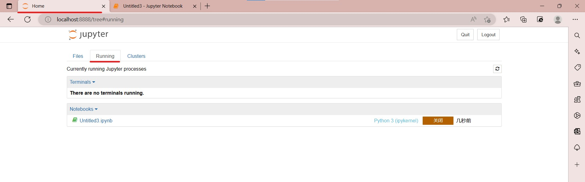
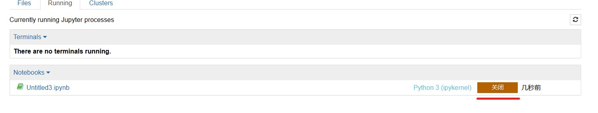

# Jupyter Notebook 介绍

## Jupyter 速查手册


## 1. 安装
```bash
pip install notebook
```
## 2. 启动
- 通过"win+R"输入"cmd"打开Dos页面

- 在Dos页面输"jupyter notebook"，他就会自动给你打开一个网页。但你的电脑可能也没有给你打开，那就需要你自己复制出现的路径在浏览器中打开。


## 3. 运行
- 打开网页你一般会看到这样一个页面

- 这时需要你点击"NEW"然后选择"python"打开一个新的文件

- 在这个页面你就可以编写你的程序了

- 例如，我们现在输入"print(Hello,World)"
- 输入完成后你可以通过点击小三角图标或者点击
Cell菜单（Cell > Run Cells）来完成程序的运行


- 最终你将会看到这样的运行结果


## 4.使用matplotilb画图
matplotlib可能是Python 2D绘图领域使用最广泛的库了。它能够让使用者轻松地将数据图形化，并且提供多样化的输出格式。同时，它几乎能够对图进行所有你能够想到的细节的修饰。

首先，我们现看一个示例

这就是一个完整的绘制简单饼状图的过程

绘制这样的图像你首先需要了解matplotilb的编程方式，主要有以下三种：
- pyplot： 是 Matplotlib 的子库，提供了和 MATLAB 类似的绘图 API。（**常用**）

- 面向对象的方式：Matplotlib的精髓，更基础和底层的方式。（**常用**）

- pylab：将Matplotlib和Numpy合并的模块，模拟Matlab的编程环境。（不推荐使用）
pyplot与pylab的区别：从pylab代码可以看出，通过pylab可以直接调用函数。例：arange(0,10)，而不是np.arange(0,10)


接下来你就可以了解基础的绘图了
### Matplotlib绘图基础
- Matplotlib绘图标记使用plot()方法的marker参数定义
在下面的网页中你可以看到详细的标记参数信息
(https://blog.csdn.net/Yangyuqing_/article/details/124099762?spm=1001.2014.3001.5502)
然后你就可以绘制出一张这样的图


### Matplotlib绘图线
- Matplotlib线的类型用linestyle参数来定义：
|类型(简写)|说明 |
|:--:|:--:|
|'-'|实线|
|':'|点虚线|
|'--'|破折线|
|'-.'|点划线|
|''或' '|不画线|
|'steps'|阶梯线|
同样我也给出一个示例


- Matplotlib线的颜色用color参数来定义
'r'	红色    'g'	绿色     'c'青色     'y'黄色     'k'黑色
(部分常见用色)
这可以实现这样的效果


- Matplotlib线的宽度用linewidth参数来定义
*说明：值除了是整数，也可以是浮点数*


- Matplotlib轴标签使用xlabel()和ylabel()方法
*说明：Matplotlib默认情况下不支持中文，可以使用rcParams显示中文*


- Matplotlib标题使用title()方法


- Matplotlib标题与标签的定位提供了loc参数
|方法|参数|默认|
|:--:|:--:|:--:|
|title()|'left', 'right', 和 'center'|'center'|
|xlabel()|'left', 'right', 和 'center'|'center'|
|ylabel()|'bottom', 'top', 和 'center'|	'center'|


- Matplotlib网格线使用pyplot中的grid()方法
grid()语法：
matplotlib.pyplot.grid(b=None, which='major', axis='both', )
b：可选，默认为 None，可以设置布尔值，true 为显示网格线，false 为不显示，如果设置 **kwargs 参数，则值为 true。
which：可选，可选值有 'major'、'minor' 和 'both'，默认为 'major'，表示应用更改的网格线。
axis：可选，设置显示哪个方向的网格线，可以是取 'both'（默认），'x' 或 'y'，分别表示两个方向，x 轴方向或 y 轴方向。
**kwargs：可选，设置网格样式，可以是 color='r', linestyle='-' 和 linewidth=2，分别表示网格线的颜色，样式和宽度。

- 添加网格线，参数使用默认值。plt.grid() 
- 使用axis参数控制网格线显示方向。
plt.grid(axis='x')设置在x轴方向显示网格或者plt.grid(axis='y')设置在y轴方向显示网格
- 更改网格线样式 参数color,linestyle,linewidth等同于Matplotlib绘图线


# 设置字体为黑体 显示中文
plt.rcParams['font.sans-serif']=['STLiti']
 
x=np.arange(0,10)
 
plt.plot(x,marker='o',color='r',linewidth=2)
 
# fontsize设置字体大小
# loc设置标签显示位置
plt.xlabel('x轴',fontsize=20,loc='left')
plt.ylabel('y轴',fontsize=20,loc='top')
plt.title('标题',fontsize=25,loc="left")
plt.show()

下面是一些matplotlib中使用的简单参数和配置项：
- 使用参数字典 rcParams，就像上面我们想要正常显示中文和负号进行的参数设置
- 调用matplotlib.rc()命令，通过传入关键字元组来修改参数
- axis：设置坐标轴边界和表面的颜色、坐标刻度值大小和网格的显示
- figure: 控制dpi、边界颜色、图形大小、和子区( subplot)设置
- font: 字体集（font family）、字体大小和样式设置
- grid: 设置网格颜色和线性
- legend: 设置图例和其中的文本的显示
- line: 设置线条（颜色、线型、宽度等）和标记
- patch: 是填充2D空间的图形对象，如多边形和圆。控制线宽、颜色和抗锯齿设置等
- savefig: 可以对保存的图形进行单独设置。例如，设置渲染的文件的背景为白色。
- verbose: 设置matplotlib在执行期间信息输出，如silent、helpful、debug和debug-annoying
- xticks和yticks: 为x,y轴的主刻度和次刻度设置颜色、大小、方向，以及标签大小

最后在这里汇总了常见的几种图像
- 折线图 ：plt.plot(x,y)
- 散点图 ：plt.scatter(x,y)
- 柱状图 ：plt.bar(x,height)
- 直方图 ：plt.hist(x,bins)
- 饼图 ： plt.pie(x, labels=,autopct=,colors)