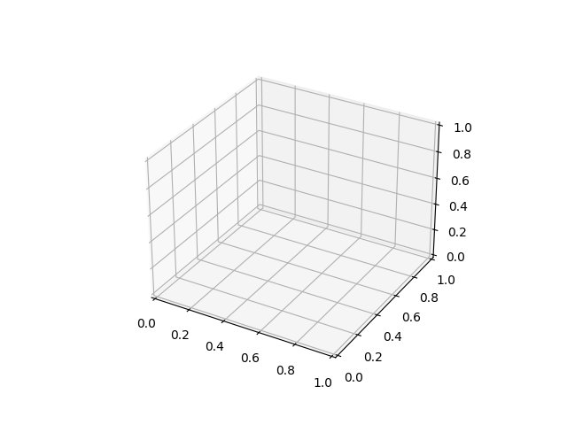
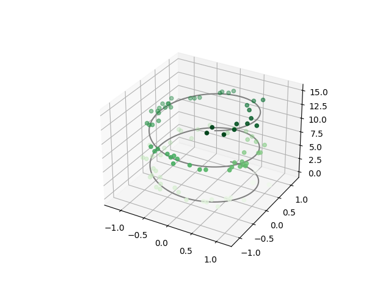
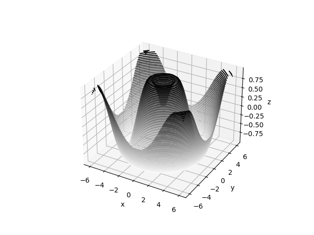
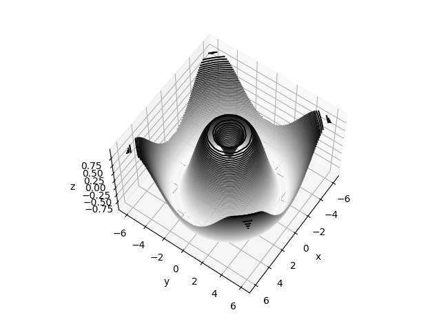
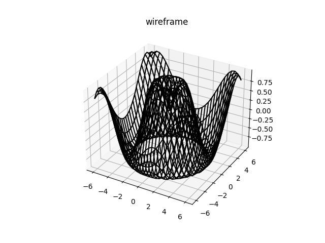
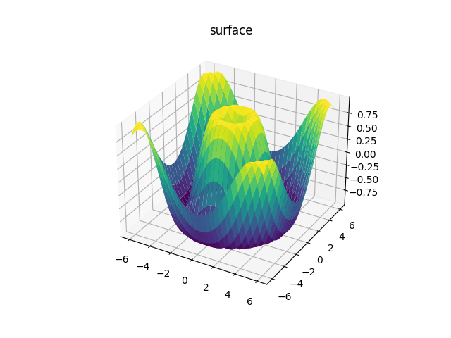
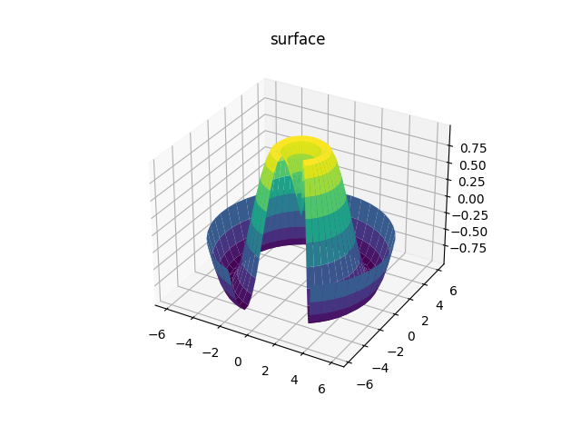
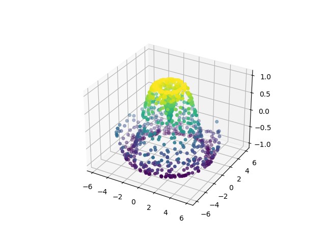
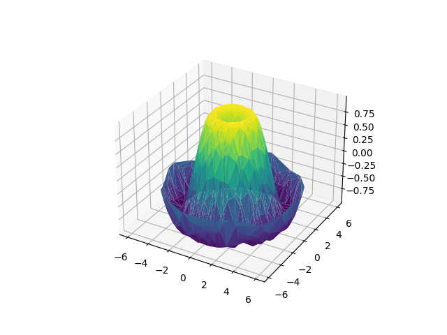
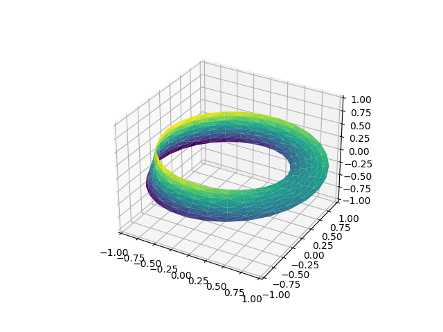

# 三维图形

Matplotlib 可以支持绘制3D的图形，通过关键字参数projection='3d'来创建3D视图, 三维 axes 激活后，我们可以在上面绘制不同的三维图表类型。

```python
import matplotlib.pyplot as plt

fig = plt.figure()
ax = fig.add_subplot(projection='3d')

plt.show()
```



## 三维的点和线

三维图表中最基础的是使用(x, y, z)坐标定义的一根线或散点的集合。前面介绍过普通的二维图表，作为类比，使用ax.plot3D和ax.scatter3D函数可以创建三维折线和散点图。这两个函数的签名与二维的版本基本一致，你可以参考[折线图](./line.md)和[散点图](./scatter.md)来复习一下这部分的内容。下面我们绘制一个三维中的三角螺旋，在线的附近在绘制一些随机的点：

```python
import matplotlib.pyplot as plt
import numpy as np

fig = plt.figure()
ax = fig.add_subplot(projection='3d')

# 三维螺旋线的数据
zline = np.linspace(0, 15, 1000)
xline = np.sin(zline)
yline = np.cos(zline)
ax.plot3D(xline, yline, zline, 'gray')

# 三维散点的数据
zdata = 15 * np.random.random(100)
xdata = np.sin(zdata) + 0.1 * np.random.randn(100)
ydata = np.cos(zdata) + 0.1 * np.random.randn(100)
ax.scatter3D(xdata, ydata, zdata, c=zdata, cmap='Greens')

plt.show()
```


:::note

注意默认情况下，图中的散点会有透明度的区别，用于体现在图中散点的深度。虽然三维效果在静态图像中难以显示，你可以使用交互式的视图来获得更佳的三维直观效果。

:::

## 三维轮廓图

下面我们展示一个三维的正弦函数轮廓图：

```python
import matplotlib.pyplot as plt
import numpy as np

fig = plt.figure()
ax = fig.add_subplot(projection='3d')

def f(x, y):
    return np.sin(np.sqrt(x ** 2 + y ** 2))

x = np.linspace(-6, 6, 30)
y = np.linspace(-6, 6, 30)

X, Y = np.meshgrid(x, y)
Z = f(X, Y)

ax.contour3D(X, Y, Z, 50, cmap='binary')
ax.set_xlabel('x')
ax.set_ylabel('y')
ax.set_zlabel('z')

plt.show()
```



有时候默认的视角角度不是最理想的，在这种情况下我们可以使用view_init函数来设置水平角和方位角。在下面的例子中，我们使用的是 60° 的水平角（即以 60° 俯视 x-y 平面）和 35° 的方位角（即将 z 轴逆时针旋转 35°）：

```python
import matplotlib.pyplot as plt
import numpy as np

fig = plt.figure()
ax = fig.add_subplot(projection='3d')

def f(x, y):
    return np.sin(np.sqrt(x ** 2 + y ** 2))

x = np.linspace(-6, 6, 30)
y = np.linspace(-6, 6, 30)

X, Y = np.meshgrid(x, y)
Z = f(X, Y)

ax.contour3D(X, Y, Z, 50, cmap='binary')
ax.set_xlabel('x')
ax.set_ylabel('y')
ax.set_zlabel('z')

ax.view_init(60, 35)

plt.show()
```


:::note

当使用 Matplotlib 交互式展示是，这样的旋转可以通过鼠标点击和拖拽来实现。

:::

## 框线图和表面图
使用网格数据生成的三维图表还有框线图和表面图。这两种图表将网格数据投射到特定的三维表面，能够使得结果图像非常直观和具有说服力。下面是一个框线图的例子：

```python
import matplotlib.pyplot as plt
import numpy as np

fig = plt.figure()
ax = fig.add_subplot(projection='3d')

def f(x, y):
    return np.sin(np.sqrt(x ** 2 + y ** 2))

x = np.linspace(-6, 6, 30)
y = np.linspace(-6, 6, 30)

X, Y = np.meshgrid(x, y)
Z = f(X, Y)

ax.plot_wireframe(X, Y, Z, color='black')
ax.set_title('wireframe');

plt.show()
```


表面图类似框线图，区别在于每个框线构成的多边形都使用颜色进行了填充。添加色图用于填充多边形能够让图形表面展示出来：

```python
import matplotlib.pyplot as plt
import numpy as np

fig = plt.figure()
ax = fig.add_subplot(projection='3d')

def f(x, y):
    return np.sin(np.sqrt(x ** 2 + y ** 2))

x = np.linspace(-6, 6, 30)
y = np.linspace(-6, 6, 30)

X, Y = np.meshgrid(x, y)
Z = f(X, Y)

ax.plot_surface(X, Y, Z, rstride=1, cstride=1,
                cmap='viridis', edgecolor='none')
ax.set_title('surface');

plt.show()
```


注意虽然每个颜色填充的表面都是二维的，但是表面的边缘不需要是直线构成的。下面的例子使用surface3D绘制了一个部分极坐标网格，能够让我们切入到函数内部观察效果：

```python
import matplotlib.pyplot as plt
import numpy as np

fig = plt.figure()
ax = fig.add_subplot(projection='3d')

def f(x, y):
    return np.sin(np.sqrt(x ** 2 + y ** 2))

r = np.linspace(0, 6, 20)
theta = np.linspace(-0.9 * np.pi, 0.8 * np.pi, 40)
r, theta = np.meshgrid(r, theta)

X = r * np.sin(theta)
Y = r * np.cos(theta)
Z = f(X, Y)

ax.plot_surface(X, Y, Z, rstride=1, cstride=1,
                cmap='viridis', edgecolor='none')
ax.set_title('surface');

plt.show()
```


## 表面三角剖分

在一些应用场合中，上面的这种均匀网格绘制的图表方式太过于局限和不方便。在这些情况下，三角剖分的图表可以派上用场。如果我们并不是使用笛卡尔坐标系或极坐标系的网格来绘制三维图表，而是使用一组随机的点来绘制三维图表呢？

```python
import matplotlib.pyplot as plt
import numpy as np

fig = plt.figure()
ax = fig.add_subplot(projection='3d')

def f(x, y):
    return np.sin(np.sqrt(x ** 2 + y ** 2))

theta = 2 * np.pi * np.random.random(1000)
r = 6 * np.random.random(1000)
x = np.ravel(r * np.sin(theta))
y = np.ravel(r * np.cos(theta))
z = f(x, y)

ax.scatter(x, y, z, c=z, cmap='viridis', linewidth=0.5);

plt.show()
```


上图并未形象的表示出表面情况。这种情况下我们可以使用`ax.plot_trisurf`函数，它能首先根据我们的数据输入找到各点内在的三角函数形式，然后绘制表面（注意的是这里的 x，y，z 是一维的数组）：

```python
import matplotlib.pyplot as plt
import numpy as np

fig = plt.figure()
ax = fig.add_subplot(projection='3d')

def f(x, y):
    return np.sin(np.sqrt(x ** 2 + y ** 2))

theta = 2 * np.pi * np.random.random(1000)
r = 6 * np.random.random(1000)
x = np.ravel(r * np.sin(theta))
y = np.ravel(r * np.cos(theta))
z = f(x, y)

ax.plot_trisurf(x, y, z,
                cmap='viridis', edgecolor='none');

plt.show()
```


上图的结果很显然没有使用网格绘制表面图那么清晰，但是对于我们并不是使用函数构建数据样本（数据样本通常来自真实世界的采样）的情况下，这能提供很大的帮助。例如我们下面会看到，能使用这种方法绘制一条三维的莫比乌斯环。

## 莫比乌斯环案例

是一种只有一个面（表面）和一条边界的曲面，也是一种重要的拓扑学结构。它是由德国数学家、天文学家莫比乌斯和约翰·李斯丁在1858年独立发现的。这个结构可以用一个纸带旋转半圈再把两端粘上之后轻而易举地制作出来。事实上有两种不同的莫比乌斯带镜像，他们相互对称。如果把纸带顺时针旋转再粘贴，就会形成一个右手性的莫比乌斯带，反之亦类似。

更多说明请查看[维基百科--莫比乌斯环](https://en.wikipedia.org/wiki/M%C3%B6bius_strip)

```python
import matplotlib.pyplot as plt
from matplotlib.tri import Triangulation
import numpy as np

theta = np.linspace(0, 2 * np.pi, 30)
w = np.linspace(-0.25, 0.25, 8)
w, theta = np.meshgrid(w, theta)

phi = 0.5 * theta

# r是坐标点距离环形中心的距离值
r = 1 + w * np.cos(phi)
# 利用简单的三角函数知识算得x，y，z坐标值
x = np.ravel(r * np.cos(theta))
y = np.ravel(r * np.sin(theta))
z = np.ravel(w * np.sin(phi))

tri = Triangulation(np.ravel(w), np.ravel(theta))

fig = plt.figure()
ax = fig.add_subplot(projection='3d')

ax.plot_trisurf(x, y, z, triangles=tri.triangles,
                cmap='viridis', linewidths=0.2)

ax.set_xlim(-1, 1)
ax.set_ylim(-1, 1)
ax.set_zlim(-1, 1)

plt.show()
```


## 更多3D绘图

请查看官方文档学习更多的Matplotlib 3D图形绘制：https://matplotlib.org/stable/gallery/mplot3d/index.html