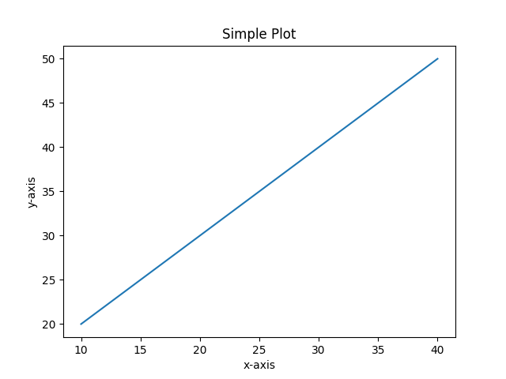
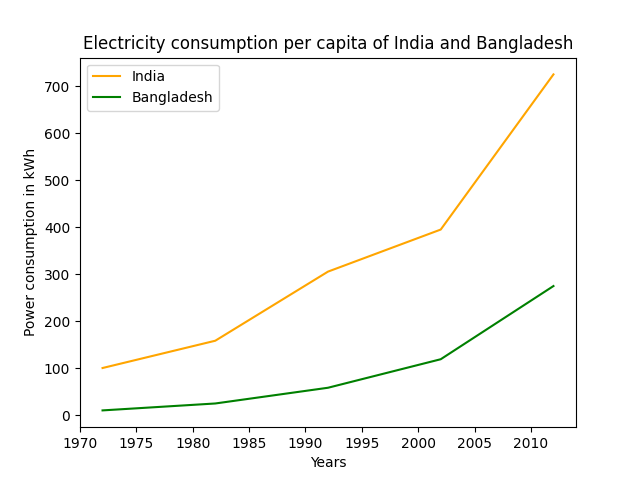

# 一个简单的例子

## 案例

```python
# 导入matplotlib的包
import matplotlib.pyplot as plt

# 初始化数据
x = [10, 20, 30, 40]
y = [20, 30, 40, 50]
  
# 绘制数据
plt.plot(x, y)
  
# 设置图像标题
plt.title("Simple Plot")
  
# 增加X轴,Y轴的标签
plt.ylabel("y-axis")
plt.xlabel("x-axis")

# 显示图片
plt.show()
```

运行代码后的效果如下：



上述代码中，X和Y的元素提供了x轴和y轴的坐标，并根据这些坐标绘制了一条直线。

Pyplot是一个Matplotlib 模块，提供类似 MATLAB 的界面。 Pyplot 提供与图形交互的功能，即创建图形、使用标签装饰绘图以及在图形中创建绘图区域。

语法如下：
```python
matplotlib.pyplot.plot(*args, scalex=True, scaley=True, data=None, **kwargs)
```

其他说明：
- `plot(x,y)` -- 画x和y, 默认是线图
- `plt.title()` -- 用于设置图像的名字
- `plt.xlabel()` -- 用于设置X轴的标签
- `plt.ylabel()` -- 用于设置Y轴的标签
- `plt.legend()` -- 用于显示图例

更多API文档请查看[matplotlib.pyplot.plot](https://matplotlib.org/stable/api/_as_gen/matplotlib.pyplot.plot.html#matplotlib-pyplot-plot)

Matplotlib 中图例`plt.legend()`有很多其他的用法，用于实现各种各样的图例要求，具体请参考官方文档：[Legend Guide](https://matplotlib.org/stable/tutorials/intermediate/legend_guide.html)


:::tip

如果你使用的是IPython Notebook,想在Notebook文档中嵌入Matplotlib画出来的图像，请在Notebook最开始中加入如下代码：

```python
%matplotlib inline
```

:::


## 保存图片

Matplotlib的一个优点是能够将图形保存为各种不同的数据格式。你可以用savefig()命令将图形保存为文件。例如，如果要将图形保存为 PNG格式，则上述案例的代码可以改为：

```python
# 导入matplotlib的包
import matplotlib.pyplot as plt

# 初始化数据
x = [10, 20, 30, 40]
y = [20, 30, 40, 50]
  
# 绘制数据
plt.plot(x, y)
  
# 设置图像标题
plt.title("Simple Plot")
  
# 增加X轴,Y轴的标签
plt.ylabel("y-axis")
plt.xlabel("x-axis")

# 保存图片
# plt.show()
plt.savefig("mygraph.png")
```

## 显示图例

如果是一张图上显示两个曲线，并且显示图例以示区别该怎么办呢？代码如下：

```python  
import matplotlib.pyplot as plt
  
# year contains the x-axis values
# and e-india & e-bangladesh
# are the y-axis values for plotting  
year = [1972, 1982, 1992, 2002, 2012]
e_india = [100.6, 158.61, 305.54, 394.96, 724.79]
e_bangladesh = [10.5, 25.21, 58.65, 119.27, 274.87]
  
# plotting of x-axis(year) and 
# y-axis(power consumption) 
# with different colored labels of two countries 
  
plt.plot(year, e_india, color ='orange', 
         label ='India')
  
plt.plot(year, e_bangladesh, color ='g', 
         label ='Bangladesh')
  
# naming of x-axis and y-axis
plt.xlabel('Years')
plt.ylabel('Power consumption in kWh')
  
# naming the title of the plot
plt.title('Electricity consumption per capita\
 of India and Bangladesh')

# show legend
plt.legend()
# show image
plt.show()
```

结果如下：



## 设置X轴/Y轴的最大/最小值