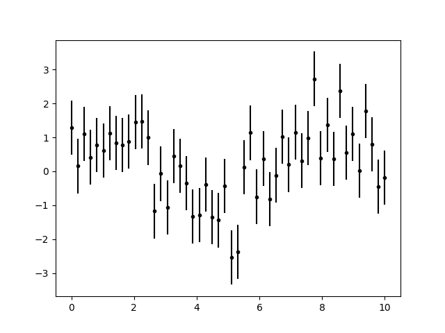
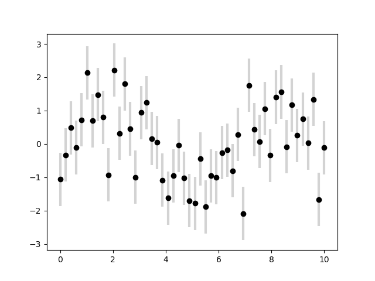
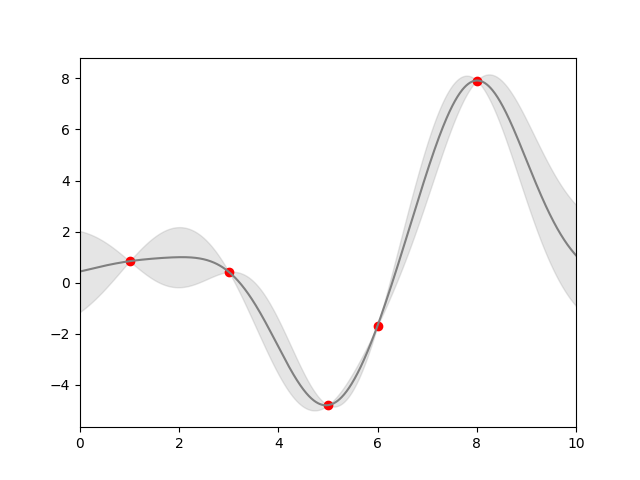

# 误差可视化

对于任何的科学测量来说，精确计算误差与精确报告测量值基本上同等重要，如果不是更加重要的话。例如，设想我正在使用一些天文物理学观测值来估算哈勃常数，即本地观测的宇宙膨胀系数。我从一些文献中知道这个值大概是 71 (km/s)/Mpc，而我测量得到的值是 74 (km/s)/Mpc,。这两个值是否一致？在仅给定这些数据的情况下，这个问题的答案是，无法回答。

如果我们将信息增加一些，给出不确定性：最新的文献表示哈勃常数的值大约是 71 2.5 (km/s)/Mpc，我的测量值是 74 5 (km/s)/Mpc。这两个值是一致的吗？这就是一个可以准确回答的问题了。在数据和结果的可视化中，有效地展示这些误差能使你的图表涵盖和提供更加完整的信息。

## 基础误差条

```python
import matplotlib.pyplot as plt
import numpy as np

x = np.linspace(0, 10, 50)
dy = 0.8
y = np.sin(x) + dy * np.random.randn(50)

plt.errorbar(x, y, yerr=dy, fmt='.k')

plt.show()
```


这里的`fmt`参数是用来控制线条和点风格的代码，与`plt.plot`有着相同的语法。

除了上面的基本参数，`errorbar`函数还有很多参数可以用来精细调节图表输出。使用这些参数你可以很容易的个性化调整误差条的样式。作者发现通常将误差线条颜色调整为浅色会更加清晰，特别是在数据点比较密集的情况下：

```python
import matplotlib.pyplot as plt
import numpy as np

x = np.linspace(0, 10, 50)
dy = 0.8
y = np.sin(x) + dy * np.random.randn(50)

plt.errorbar(x, y, yerr=dy, fmt='o', color='black',
             ecolor='lightgray', elinewidth=3, capsize=0)

plt.show()
```


除了上面介绍的参数，你还可以指定水平方向的误差条（xerr），单边误差条和其他很多的参数。参阅[plt.errorbar](https://matplotlib.org/stable/api/_as_gen/matplotlib.pyplot.errorbar.html#matplotlib.pyplot.errorbar)的帮助文档获得更多信息。


## 连续误差

在某些情况下可能需要对连续值展示误差条。虽然 Matplotlib 没有內建的函数能直接完成这个任务，但是你可以通过简单将`plt.plot`和`plt.fill_between`函数结合起来达到目标。

这里我们会采用简单的_高斯过程回归_方法，Scikit-Learn 提供了 API。这个方法非常适合在非参数化的函数中获得连续误差。我们在这里不会详细介绍高斯过程回归，仅仅聚焦在如何绘制连续误差本身。

```python
import matplotlib.pyplot as plt
import numpy as np
from sklearn.gaussian_process import GaussianProcessRegressor

# 定义模型和一些符合模型的点
model = lambda x: x * np.sin(x)
xdata = np.array([1, 3, 5, 6, 8])
ydata = model(xdata)

# 计算高斯过程回归，使其符合 fit 数据点
gp = GaussianProcessRegressor()
gp.fit(xdata[:, np.newaxis], ydata)

xfit = np.linspace(0, 10, 1000)
yfit, std = gp.predict(xfit[:, np.newaxis], return_std=True)
dyfit = 2 * std  # 两倍sigma ~ 95% 确定区域

# 可视化结果
plt.plot(xdata, ydata, 'or')
plt.plot(xfit, yfit, '-', color='gray')

plt.fill_between(xfit, yfit - dyfit, yfit + dyfit,
                 color='gray', alpha=0.2)
plt.xlim(0, 10);
plt.show()
```


注意上面我们调用`fill_between`函数：我们传递了的参数包括 x 值，y 值的低限，然后是 y 值的高限，结果是图表中介于低限和高限之间的区域会被填充。上图为我们提供了一个非常直观的高斯过程回归展示：在观测点的附近，模型会被限制在一个很小的区域内，反映了这些数据的误差比较小。在远离观测点的区域，模型开始发散，反映了这时的数据误差比较大。如果需要获得`plt.fill_between`（以及类似的`plt.fill`函数）更多参数的信息，请查阅函数的帮助文档或 Matplotlib 在线文档。
