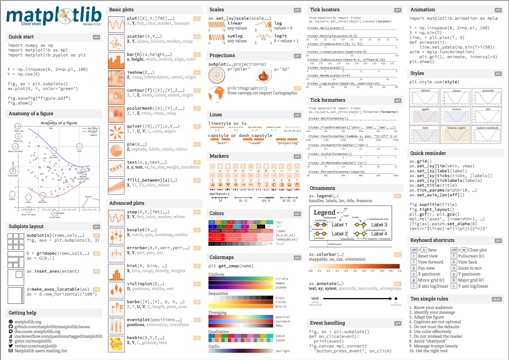
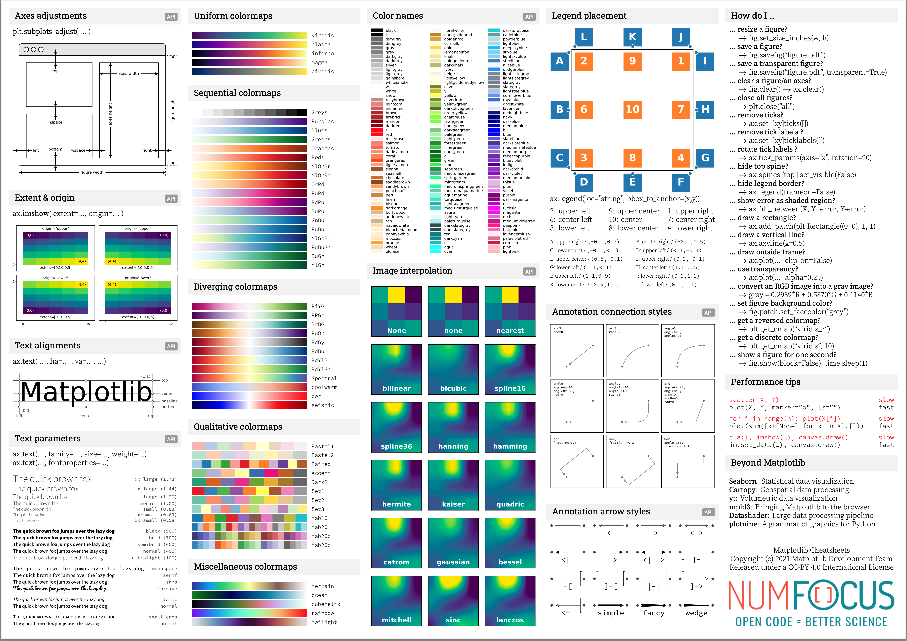

# 简介与安装

Matplotlib是建立在NumPy数组基础上的多平台数据可视化程序库，最初被设计用于完善SciPy的生态环境。Matplotlib最重要的特性之一就是具有良好的操作系统兼容性和图形显示底层接口兼容性(graphics backend)。Matplotlib支持几十种图形显示接口与输出格式，这使得用户无论在哪种操作系统上都可以输出自己想要的图形格式。这种跨平台、面面俱到的特点已经成为Matplotlib最强大的功能之一，Matplotlib也因此吸引了大量用户，进而形成了一个活跃的开发者团队，晋升为Python科学领域不可或缺的强大武器。

## 0、Matplotlib 速查手册




[速查手册下载](./pdf/cheatsheets.pdf)

## 1. 安装
```bash
pip install matplotlib
```

## 2. Matplotlib VS Seaborn

除了Matplotlib以外常用的Python绘图库叫做Seaborn, Seaborn的底层是基于Matplotlib的，他们的差异有点像在点餐时选套餐还是自己点的区别: 

1. Matplotlib是独立点菜，可能费时费心但最后上桌的菜全是特别适合自己的；
2. 而Seaborn是点套餐，特别简单，一切都是配好的，虽然省时省心，但可能套餐里总有些菜是不那么合自己口味的。

具体来说：
- Seaborn是用户把自己常用到的可视化绘图过程进行了函数封装，形成的一个“快捷方式”，他相比Matplotlib的好处是代码更简洁，可以用一行代码实现一个清晰好看的可视化输出。主要的缺点则是定制化能力会比较差，只能实现固化的一些可视化模板类型；
- Matplotlib是可以实现高度定制化绘图的，高度定制化可以让你获得最符合心意的可视化输出结果，但也因此需要设置更多的参数，因而代码更加复杂一些。

本课程教授Seaborn如何使用，如果你想学习Seaborn的用法，请自我学习[Seaborn官方文档](https://seaborn.pydata.org/tutorial.html)