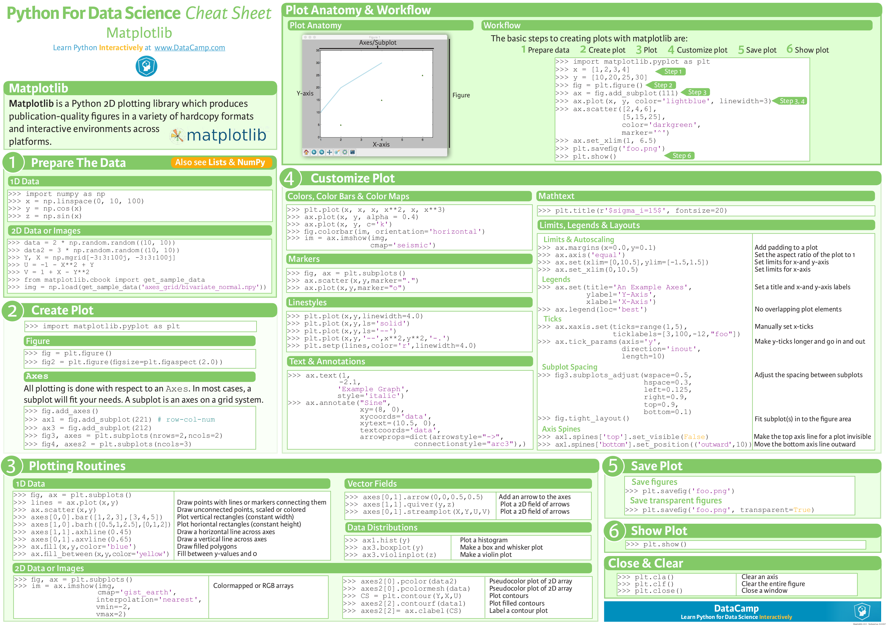

# 简介与安装

Matplotlib是建立在NumPy数组基础上的多平台数据可视化程序库，最初被设计用于完善SciPy的生态环境。Matplotlib最重要的特性之一就是具有良好的操作系统兼容性和图形显示底层接口兼容性(graphics backend)。Matplotlib支持几十种图形显示接口与输出格式，这使得用户无论在哪种操作系统上都可以输出自己想要的图形格式。这种跨平台、面面俱到的特点已经成为Matplotlib最强大的功能之一，Matplotlib也因此吸引了大量用户，进而形成了一个活跃的开发者团队，晋升为Python科学领域不可或缺的强大武器。

## 0、Matplotlib 速查手册


## 1. 安装
```bash
pip install matplotlib
```