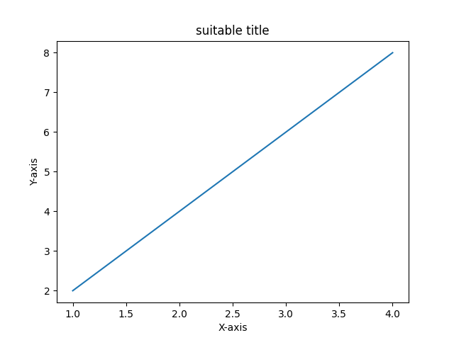
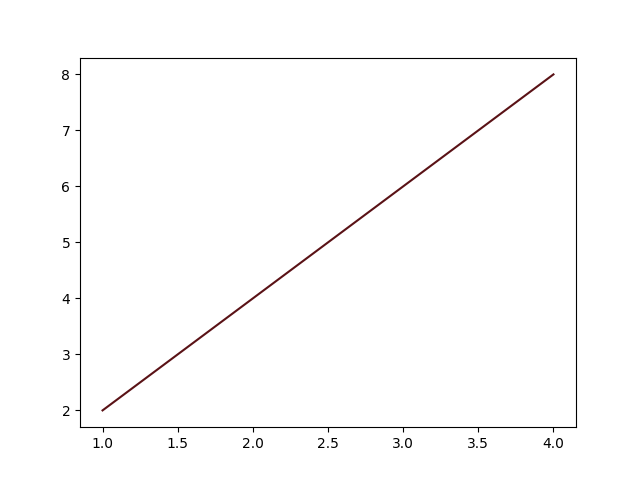
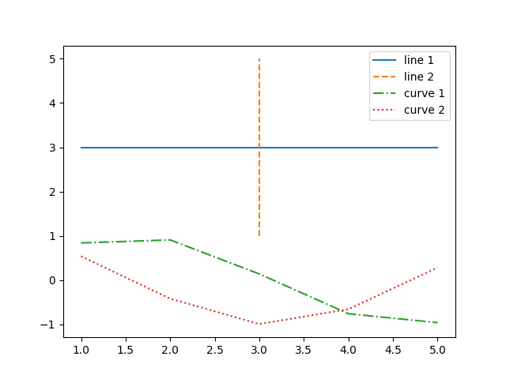
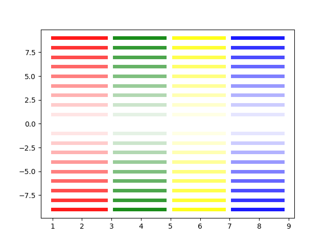
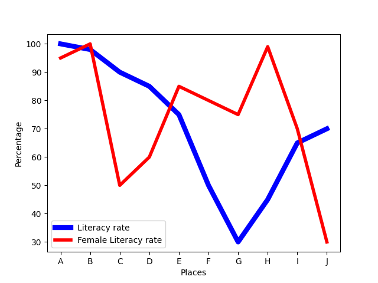
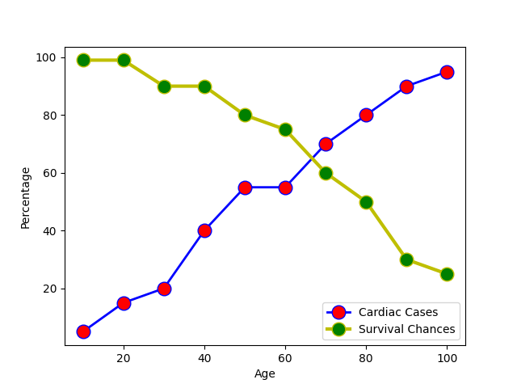
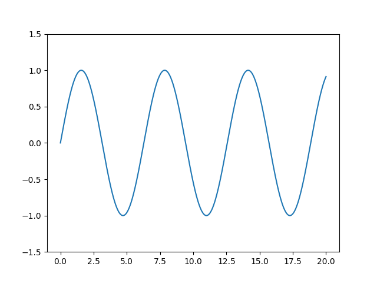

# 折线图

折线图用于表示不同轴上的两个数据 X 和 Y 之间的关系。在这里，我们将看到一些 Python 线图示例：

```python
import matplotlib.pyplot as plt
import numpy as np
  
  
# Define X and Y variable data
x = np.array([1, 2, 3, 4])
y = x*2
  
plt.plot(x, y)
plt.xlabel("X-axis")  # add X-axis label
plt.ylabel("Y-axis")  # add Y-axis label
plt.show()
```


## 线图风格
matplotlib.pyplot 的 matplotlib.pyplot.plot(*args, **kwargs) 方法用于绘制图形并指定图形样式，如颜色或线条样式。

### 风格

风格有如下几种：

| code | 风格 |
|:--------------------|:--------------------|
| `-` | 实线 |
| `--` | 虚线 |
| `-.` | 长短点虚线 |
| `:` | 点线 |

#### 案例:

```python
import matplotlib.pyplot as plt
import numpy as np

x = np.array([1, 2, 3, 4, 5, 6, 7, 8, 9, 10])
y = x*2
  
plt.plot(x, x + 4, linestyle='-')  # 实线
plt.plot(x, x + 5, linestyle='--') # 虚线
plt.plot(x, x + 6, linestyle='-.') # 长短点虚线
plt.plot(x, x + 7, linestyle=':');  # 点线

plt.show()
```


### 颜色
一些基本颜色的单字符速记符号。

| code | 颜色 |
|:--------------------|:--------------------|
| b | 蓝色 |
| g | 绿色 |
| r | 红色 |
| c | 青色 |
| m | 品红 |
| y | 黄色 |
| k | 黑色 |
| w | 白色 |

除此之外你还可以用RGB的值来表示颜色。（[什么是RGB？](https://zh.wikipedia.org/zh-hans/%E4%B8%89%E5%8E%9F%E8%89%B2%E5%85%89%E6%A8%A1%E5%BC%8F), [如何获得各种颜色的RGB值?](https://www.rapidtables.com/web/color/RGB_Color.html)）

#### 案例1:

```python
import matplotlib.pyplot as plt
import numpy as np

x = np.array([1, 2, 3, 4])
y = x*2
  
plt.plot(x, y, color="b")

plt.show()
```


#### 案例2:

```python
import matplotlib.pyplot as plt
import numpy as np

x = np.array([1, 2, 3, 4])
y = x*2
  
plt.plot(x, y, color="#5a1216")

plt.show()
```


## 如何在一张图上画多根线

```python
import matplotlib.pyplot as plt
import numpy as np
  
# create data
x = [1,2,3,4,5]
y = [3,3,3,3,3]
  
# plot lines
plt.plot(x, y, label = "line 1", linestyle="-")
plt.plot(y, x, label = "line 2", linestyle="--")
plt.plot(x, np.sin(x), label = "curve 1", linestyle="-.")
plt.plot(x, np.cos(x), label = "curve 2", linestyle=":")
plt.legend()
plt.show()
```



## 设置线的透明度

```python
import matplotlib.pyplot as plt
import numpy as np
  
# create data
x = [1, 2, 3, 4, 5]
  
# plot
for i in range(10):
    plt.plot([1, 2.8], [i]*2, linewidth=5, color='red', alpha=0.1*i)
    plt.plot([3.1, 4.8], [i]*2, linewidth=5, color='green', alpha=0.1*i)
    plt.plot([5.1, 6.8], [i]*2, linewidth=5, color='yellow', alpha=0.1*i)
    plt.plot([7.1, 8.8], [i]*2, linewidth=5, color='blue', alpha=0.1*i)
      
for i in range(10):
    plt.plot([1, 2.8], [-i]*2, linewidth=5, color='red', alpha=0.1*i)
    plt.plot([3.1, 4.8], [-i]*2, linewidth=5, color='green', alpha=0.1*i)
    plt.plot([5.1, 6.8], [-i]*2, linewidth=5, color='yellow', alpha=0.1*i)
    plt.plot([7.1, 8.8], [-i]*2, linewidth=5, color='blue', alpha=0.1*i)
      
plt.show()
```


## 改变线的线宽

```python

import matplotlib.pyplot as plt
  
places = ["A", "B", "C", "D", "E", "F", "G", "H", "I", "J"]
literacy_rate = [100, 98, 90, 85, 75, 50, 30, 45, 65, 70]
female_literacy = [95, 100, 50, 60, 85, 80, 75, 99, 70, 30]
  
plt.xlabel("Places")
plt.ylabel("Percentage")
  
plt.plot(places, literacy_rate, color='b',
         linewidth=6, label="Literacy rate")
  
plt.plot(places, female_literacy, color='r',
         linewidth=4, label="Female Literacy rate")
  
plt.legend(loc='lower left', ncol=1)
plt.show()
```


## 增加Mark

```python
import matplotlib.pyplot as plt
  
age = [10, 20, 30, 40, 50, 60, 70, 80, 90, 100]
cardiac_cases = [5, 15, 20, 40, 55, 55, 70, 80, 90, 95]
survival_chances = [99, 99, 90, 90, 80, 75, 60, 50, 30, 25]
  
plt.xlabel("Age")
plt.ylabel("Percentage")
  
plt.plot(age, cardiac_cases, color='b', linewidth=2,
         label="Cardiac Cases", marker='o', markerfacecolor='r', markersize=12)
  
plt.plot(age, survival_chances, color='y', linewidth=3,
         label="Survival Chances", marker='o', markerfacecolor='g', markersize=12)
  
plt.legend(loc='lower right', ncol=1)
plt.show()
```


## 调整坐标范围

```python
import matplotlib.pyplot as plt
import numpy as np

x = np.linspace(0, 20, 1000)

plt.plot(x, np.sin(x))

plt.xlim(-1, 21)
plt.ylim(-1.5, 1.5);

plt.show()
```
