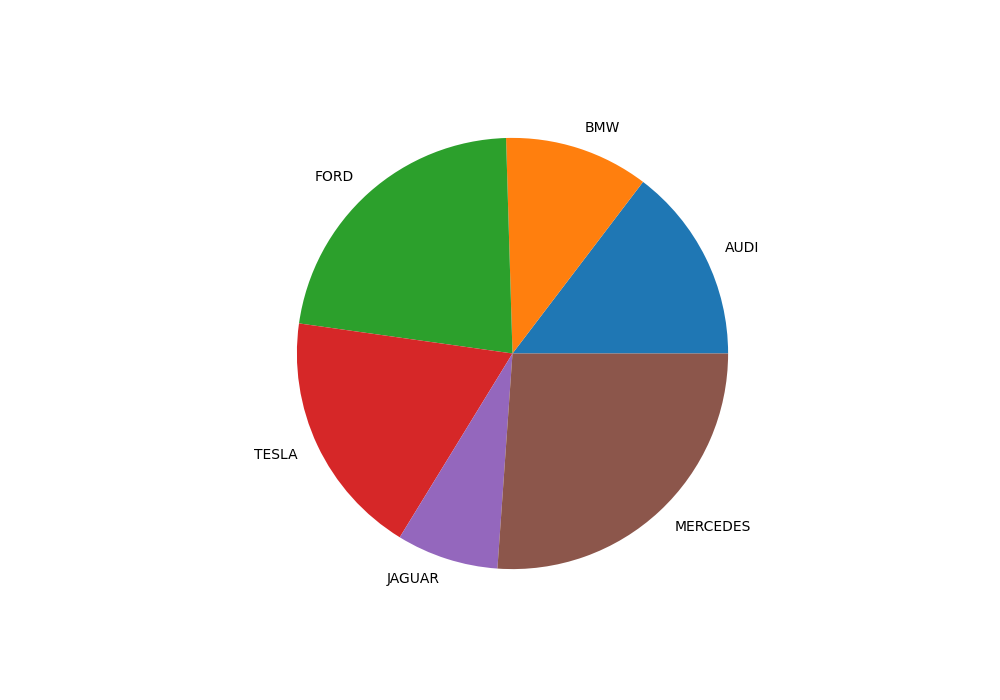
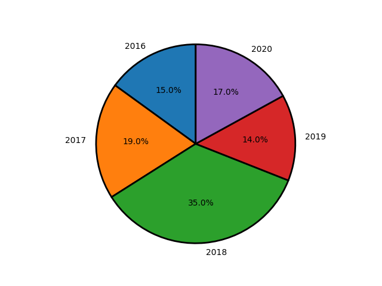
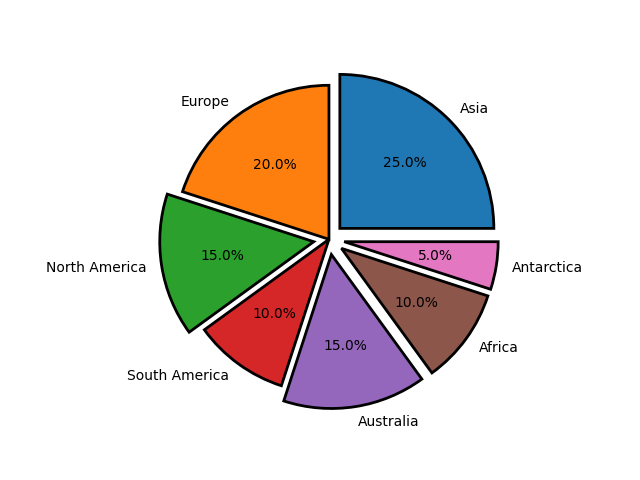
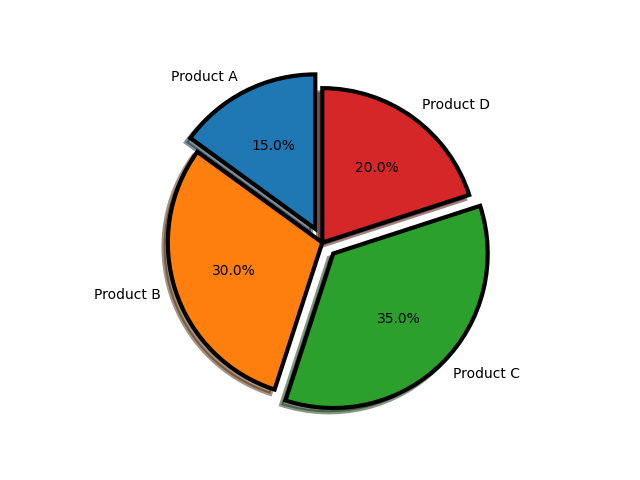
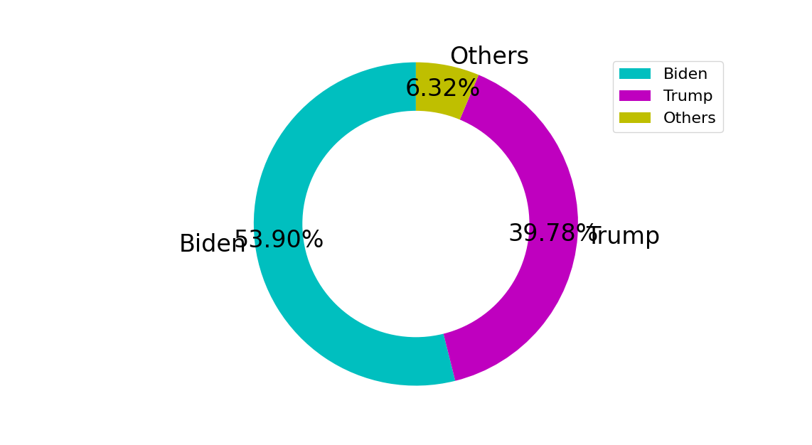

# 饼图

```python
from matplotlib import pyplot as plt
import numpy as np

cars = ['AUDI', 'BMW', 'FORD',
		'TESLA', 'JAGUAR', 'MERCEDES']

data = [23, 17, 35, 29, 12, 41]

fig = plt.figure(figsize =(10, 7))
plt.pie(data, labels = cars)

plt.show()
```


## 饼图之间添加边框

```python
import matplotlib.pyplot as plt
  
years = [2016, 2017, 2018, 2019, 2020]
profit = [15, 19, 35, 14, 17]
  
plt.pie(profit, labels = years, autopct = '%1.1f%%',
        startangle = 90, 
        wedgeprops = {"edgecolor" : "black",
                      'linewidth': 2,
                      'antialiased': True})
  
plt.axis('equal')

plt.show()
```


## 饼图某部分突出显示

```python
import matplotlib.pyplot as plt
  
continents = ['Asia', 'Europe', 'North America',
              'South America','Australia',
              'Africa','Antarctica']
  
area = [25, 20, 15, 10, 15, 10, 5]
explode = (0.1, 0, 0.1, 0, 0.1, 0.1, 0.1) 
  
plt.pie(area, explode = explode, labels = continents,
        autopct = '%1.1f%%',startangle = 0,
        wedgeprops = {"edgecolor" : "black",
                    'linewidth' : 2,
                    'antialiased': True})
  
plt.axis('equal') 
  
plt.show()
```


## 饼图添加阴影

```python
import matplotlib.pyplot as plt
  
product = 'Product A', 'Product B',
            'Product C', 'Product D'
    
stock = [15, 30, 35, 20]
explode = (0.1, 0, 0.1, 0) 
  
plt.pie(stock, explode = explode,
        labels = product, autopct = '%1.1f%%',
        shadow = True, startangle = 90,
        wedgeprops= {"edgecolor":"black",
                     'linewidth': 3,
                     'antialiased': True})

plt.axis('equal')  
  
plt.show()
```


## 绘制环形饼图

```python
import matplotlib.pyplot as plt

election_data = {'Biden': 290, 'Trump': 214, 'Others': 538-290-214}
candidate = [key for key in election_data]
votes = [value for value in election_data.values()]

plt.figure(figsize=(10, 10), dpi=100)
explode = (0, 0, 0)

plt.pie(votes, labels=candidate, explode=explode, autopct="%1.2f%%", colors=['c', 'm', 'y'],
        textprops={'fontsize': 24}, labeldistance=1.05, pctdistance=0.85, startangle=90)
plt.pie([1], radius=0.7, colors='w')

plt.legend(loc='upper right', fontsize=16)
plt.axis('equal')

plt.show()
```
