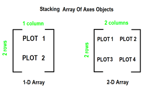
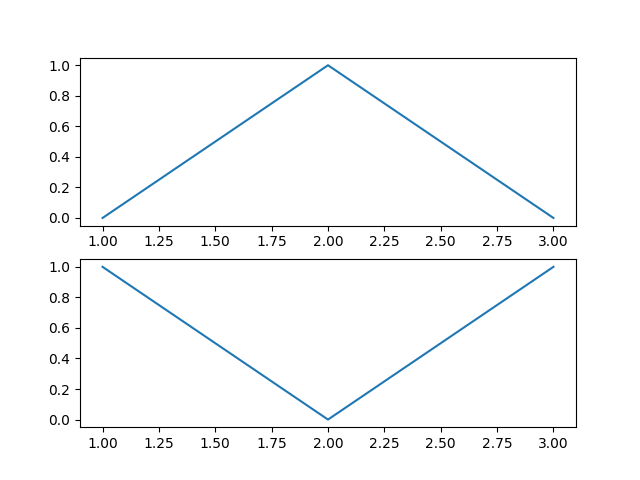
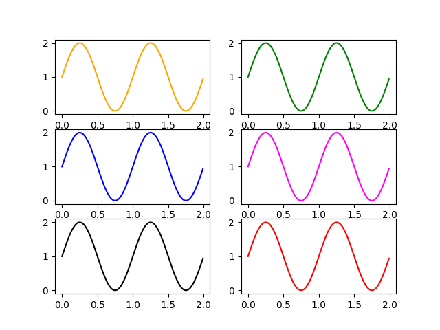
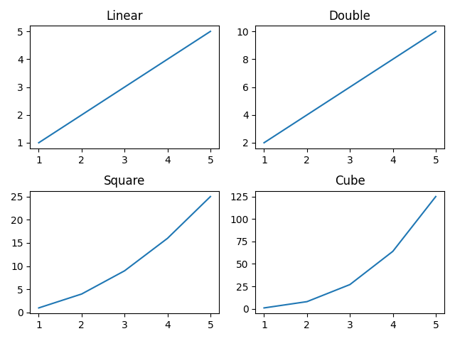
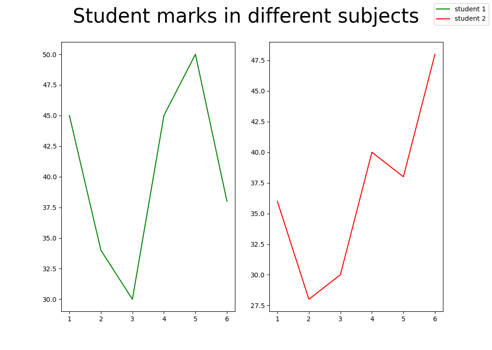
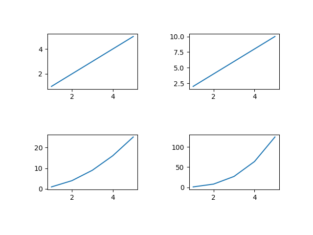
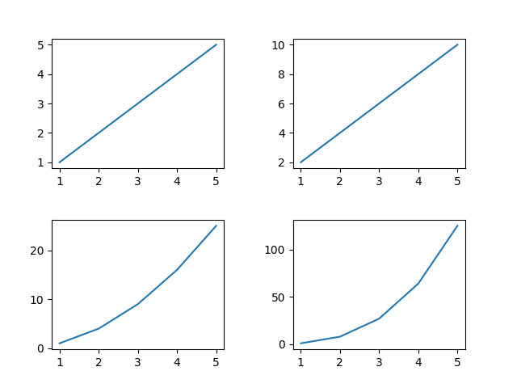

# 多个子图

有时候需要从多个角度对数据进行对比。Matplotlib 为此提出了子图(subplot)的概念:在较大的图形中同时放置一组较小的坐标轴。这些子图可能是画中画(inset)、网格图(grid of plots)，或者是其他更复杂的布局形式。

## 创建子图

要创建多个图，请使用 matplotlib.pyplot.subplots 方法，该方法返回图形以及 Axes 对象或 Axes 对象数组。 subplots() 方法的 nrows、ncols 属性确定子图网格的行数和列数。

默认情况下，它返回带有单个图的图窗。对于每个轴对象，即绘图，我们可以设置标题（通过 set_title() 设置）、x 标签（通过 set_xlabel() 设置）和 y 标签通过 set_ylabel() 设置）。

让我们看看这是如何工作的：

- 当我们通过仅在一个方向上堆叠来调用 subplots() 方法时，它会返回一个轴对象的一维数组，即子图。

- 我们可以像访问数组元素一样使用索引访问这些轴对象。要创建特定的子图，请在轴的相应索引上调用 matplotlib.pyplot.plot() 。参考下图可以更好的理解



### 案例1:

```python
import matplotlib.pyplot as plt
 
# Some data to display
x = [1, 2, 3]
y = [0, 1, 0]
z = [1, 0, 1]
 
# Creating 2 subplots
fig, ax = plt.subplots(2)
 
# Accessing each axes object to plot the data through returned array
ax[0].plot(x, y)
ax[1].plot(x, z)

plt.show()
```




### 案例2:

```python
import matplotlib.pyplot as plt
import numpy as np
 
# Data for plotting
x = np.arange(0.0, 2.0, 0.01)
y = 1 + np.sin(2 * np.pi * x)
 
# Creating 6 subplots and unpacking the output array immediately
fig, ((ax1, ax2), (ax3, ax4), (ax5, ax6)) = plt.subplots(3, 2)
ax1.plot(x, y, color="orange")
ax2.plot(x, y, color="green")
ax3.plot(x, y, color="blue")
ax4.plot(x, y, color="magenta")
ax5.plot(x, y, color="black")
ax6.plot(x, y, color="red")

plt.show()
```




## 如何设置每张子图的图片名字

```python
import numpy as np
import matplotlib.pyplot as plt
 
# create data
x=np.array([1, 2, 3, 4, 5])
 
# making subplots
fig, ax = plt.subplots(2, 2)
 
# set data with subplots and plot
ax[0, 0].plot(x, x)
ax[0, 1].plot(x, x*2)
ax[1, 0].plot(x, x*x)
ax[1, 1].plot(x, x*x*x)
 
# set the title to subplots
ax[0, 0].set_title("Linear")
ax[0, 1].set_title("Double")
ax[1, 0].set_title("Square")
ax[1, 1].set_title("Cube")

plt.show()
```



## 如何设置总图的名字

```python
import matplotlib.pyplot as plt
import numpy as np
 
fig, (ax1, ax2) = plt.subplots(1, 2)
 
x1 = [1, 2, 3, 4, 5, 6]
y1 = [45, 34, 30, 45, 50, 38]
y2 = [36, 28, 30, 40, 38, 48]
 
labels = ["student 1", "student 2"]
 
# Add title to subplot
fig.suptitle(' Student marks in different subjects ', fontsize=5)
 
# Creating the sub-plots.
l1 = ax1.plot(x1, y1, color='g')
l2 = ax2.plot(x1, y2, color='r')
 
fig.legend([l1, l2], labels=labels)
plt.subplots_adjust(right=0.9)
 
plt.show()
```




## 调节子图之间的间距

### 使用`tight_layout()`调节间距

tight_layout() 方法自动保持适当的间距。

```python
import numpy as np
import matplotlib.pyplot as plt

# create data
x=np.array([1, 2, 3, 4, 5])

# making subplots
fig, ax = plt.subplots(2, 2)

# set data with subplots and plot
ax[0, 0].plot(x, x)
ax[0, 1].plot(x, x*2)
ax[1, 0].plot(x, x*x)
ax[1, 1].plot(x, x*x*x)
# using padding
fig.tight_layout(pad=5.0)
plt.show()
```


### 使用`subplots_adjust()`调节间距

我们可以使用 plt.subplots_adjust() 方法来改变 Matplotlib 子图之间的空间。参数 wspace 和 hspace 指定 Matplotlib 子图之间保留的空间。它们分别是轴宽度和高度的分数。参数 left、right、top 和 bottom 参数指定子图位置的四个边。它们是图形宽度和高度的分数。

```python
import numpy as np
import matplotlib.pyplot as plt

# create data
x=np.array([1, 2, 3, 4, 5])

# making subplots
fig, ax = plt.subplots(2, 2)

# set data with subplots and plot
ax[0, 0].plot(x, x)
ax[0, 1].plot(x, x*2)
ax[1, 0].plot(x, x*x)
ax[1, 1].plot(x, x*x*x)
# set the spacing between subplots
plt.subplots_adjust(left=0.1,
                    bottom=0.1,
                    right=0.9,
                    top=0.9,
                    wspace=0.4,
                    hspace=0.4)
plt.show()
```
