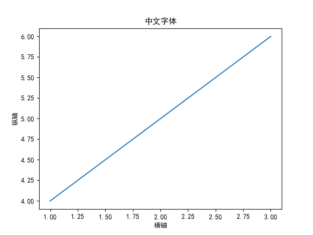
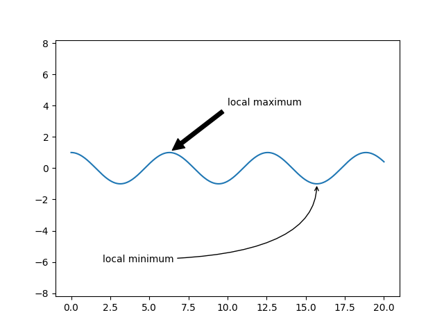
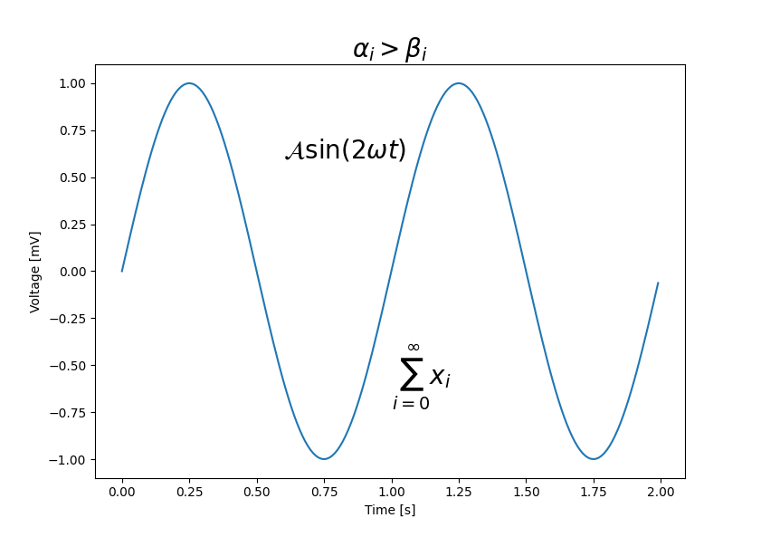

# 文本


## 中文字体

默认在 Matplotlib 图例中使用中文会出现中文乱码的现象, 原因就是 Matplotlib 库中没有中文字体。解决方案如下：

```python
import matplotlib.pyplot as plt
# 中文支持
plt.rcParams['font.sans-serif']=['SimHei'] #用来正常显示中文标签
plt.rcParams['axes.unicode_minus']=False #用来正常显示负号
# 有中文出现的情况，需要u'内容'

plt.plot([1, 2, 3], [4, 5, 6])

plt.xlabel(u"横轴")
plt.ylabel(u"纵轴")
plt.title(u"中文字体")

plt.show()
```


:::caution

一定要在有中文出现的情况，需要写成：u'内容'。案例中使用的是宋体，你可以更换为其他的字体。

:::  

## 箭头和标注

使用`plt.annotate()`函数。这个函数会绘制一些文字以及一个箭头，并且箭头可以非常灵活的进行配置。

```python
from matplotlib import pyplot as plt
import numpy as np 

x = np.linspace(0, 20, 1000)
y = np.cos(x)

fig, ax = plt.subplots()

ax.plot(x, y)
ax.axis('equal')

ax.annotate('local maximum', xy=(6.28, 1), xytext=(10, 4),
            arrowprops=dict(facecolor='black', shrink=0.05))

ax.annotate('local minimum', xy=(5 * np.pi, -1), xytext=(2, -6),
            arrowprops=dict(arrowstyle="->",
                            connectionstyle="angle3,angleA=0,angleB=-90"))

plt.show()
```



## 数学表达式

您可以在任何 Matplotlib 文本字符串中使用 TeX 标记的子集，方法是将其放在一对美元符号 `$`。

```python
import numpy as np
import matplotlib.pyplot as plt

t = np.arange(0.0, 2.0, 0.01)
s = np.sin(2*np.pi*t)

plt.plot(t, s)
plt.title(r'$\alpha_i > \beta_i$', fontsize=20)
plt.text(1, -0.6, r'$\sum_{i=0}^\infty x_i$', fontsize=20)
plt.text(0.6, 0.6, r'$\mathcal{A}\mathrm{sin}(2 \omega t)$',
         fontsize=20)
plt.xlabel('Time [s]')
plt.ylabel('Voltage [mV]')

plt.show()
```


:::caution

请注意，您不需要安装$TeX$，因为 Matplotlib 附带了它自己的$TeX$表达式解析器、布局引擎和字体。由此可见学会 $LaTeX$ 是一件很重要的事情。

:::

