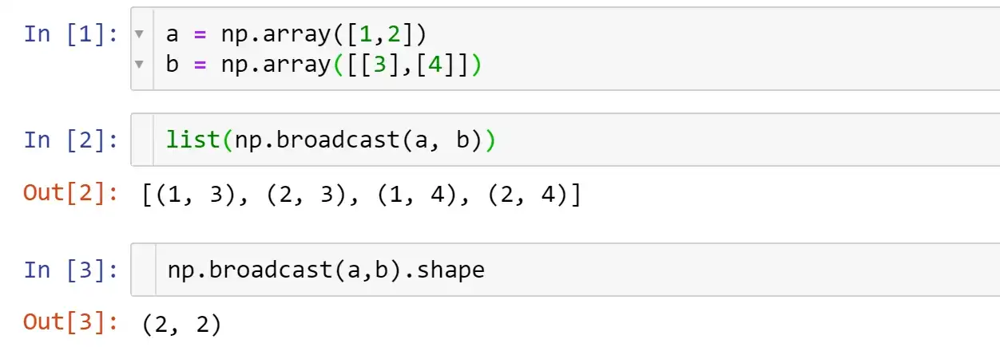

# 5. 广播(Broadcast)

本文参考: 

1. [Broadcasting in NumPy](https://towardsdatascience.com/broadcasting-in-numpy-58856f926d73)


## 1. 什么是广播?
广播可以简单理解为用于不同大 小数组的二进制通用函数(加、减、乘等)的一组规则。

## 2. 广播的规则
在NumPy三维以上中，广播机制很不直观，甚至很难直白的理解，因此使用它需要了解通用形式的广播规则，而NumPy的广播遵循证实遵循着一组严格的规则。
:::caution
- 规则一：如果两个数组的维度数不相同，那么小维度数组的形状将会在最左边补1。
- 规则二：如果两个数组的形状在任何一个维度上都不匹配，那么数组的形状会沿着维度为1的维度扩展以匹配另外一个数组的形状。
- 规则三：如果两个数组的形状在任何一个维度上都不匹配并且没有任何一个维度等于1，那么会引发异常。
来源于 -- [《Python Data Science Handbook》](https://www.oreilly.com/library/view/python-data-science/9781491912126/)
:::  

为了更清楚地理解这些规则，来看几个具体的示例。

1. 示例1
```python showLineNumbers
import numpy as np

M = np.ones((2, 3))
a = np.arange(3)

print(M + a)
print(M.shape)
print(a.shape)
```

M.shape = (2, 3), a.shape = (3,)。

可以看到，根据规则1， 数组a的维度数更小，所以在其左边补1：

M.shape -> (2, 3), a.shape -> (1, 3)

根据规则2， 第一个维度不匹配，因此拓展这个维度以匹配数组：

M.shape -> (2, 3), a.shape -> (2, 3)

2. 示例2

## 3. 实际案例

$$
Y_{linear} = 0.2126 \times R_{linear} + 0.7152 \times G_{linear} + 0.0722 \times B_{linear}
$$

```python showLineNumbers
import numpy as np
from matplotlib.pyplot import imread, imsave

a = imread('python-logo.png')
b = np.sum(a*[0.2126, 0.7152, 0.0722], axis=2)
imsave('logo-gray.png', b, cmap='gray')
```
原始图片地址：http://openastronomy.org/pyastro/logo/

执行灰度操作以后的效果：


有一个np.broadcast的函数，可以返回一个生成器对象。



尽管很少显式地进行广播（因为循环将在Python中执行，这比在C中慢）。通常情况下，它发生在 "幕后"。但广播并不局限于算术运算。